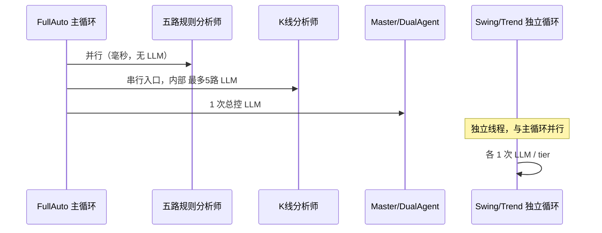

# 分析师并行与 LLM 负载 — 可行设计方案

> **版本**：v1.1  
> **日期**：2026-07-05  
> **约束**：**不减分析深度、不压缩提示词**；减门不加门  
> **说明**：下文「质量档 / 均衡档 / 验收档」是 **运行模式预设**，与 Hermes Prompt A/B 实验 **无关**  
> **关联**：[GAP_CLOSURE_AND_SURPASS_DESIGN_2026-07-05.md](./GAP_CLOSURE_AND_SURPASS_DESIGN_2026-07-05.md) 附录 D

---

## 1. 要解决什么问题

| 矛盾 | 表现 | 错误做法 |
|------|------|----------|
| tick 太慢 | 一轮 AI 5～10 分钟，后端像卡死 | 压缩 prompt、减少 K 线根数、强行跳过 Master |
| 分析太浅 | 决策像随机、理由空洞 | 把 rotate 批次改太小、六路全并行叠线程 |
| 系统扛不住 | LLM 超时、conf=0%、Swing/Trend 不开仓 | 全局并发锁=3（已废弃）或无限并发 |

**目标**：在 **不碰提示词正文** 的前提下，用 **调度分层 + 并发预算** 把 tick 压到可接受范围，同时保持 mid/long 分析质量。

---

## 2. 一轮 tick 里谁在调 LLM（现状）



**真正吃资源的三层**（按耗时排序）：

1. **K 线 LLM** — 每币 1 次，内部 `KLINE_ANALYST_MAX_PARALLEL` 控制同时几币  
2. **Master 总控** — 每 tick 1 次，汇总六路报告  
3. **Swing/Trend 独立 Agent** — 独立调度，不与主循环抢同一把锁，但共享 LLM API

五路规则分析师（仓位/行情/情报/风险/策略）**几乎不调 LLM**，并行它们 **几乎不增加 API 负载**。

---

## 3. 推荐架构：三层并发预算

### 3.1 原则

| 编号 | 原则 | 说明 |
|------|------|------|
| P1 | **规则并行、K 线受控、Master 串行** | `ANALYST_RULES_PARALLEL=true`，K 线单独跑 |
| P2 | **禁止嵌套线程池** | 不要把 K 线和五路规则放在同一层 ThreadPool（会叠出 5+5 峰值） |
| P3 | **LLM 次数用配置管，不用 prompt 裁剪管** | rotate / max_per_cycle 管「做几次深度分析」，不动 prompt 字数 |
| P4 | **单 session 单 tick** | FullAuto 进程锁保证同一 session 不会两轮 AI 叠跑 |
| P5 | **减门不加门** | 缩短 tick 靠调度，不靠新 block 层 |

### 3.2 并发预算表（Paper 质量档默认值）

| 层级 | 配置项 | 推荐值 | 峰值 LLM 并发 | 说明 |
|------|--------|--------|---------------|------|
| 规则五路 | `ANALYST_RULES_PARALLEL` | `true` | 0 | 只省 1～2s 墙钟，不加 API 调用 |
| 规则五路 | `ANALYST_RULES_MAX_PARALLEL` | `5` | 0 | 与 CPU 核数无关，计算极轻 |
| K 线深度 | `KLINE_ANALYST_MODE` | `rotate` | — | 8 币场景下每轮不全做，靠轮询补全 |
| K 线深度 | `KLINE_ROTATE_BATCH_SIZE` | `4` | — | **勿低于 4**，否则用户感知「分析变浅」 |
| K 线深度 | `KLINE_LLM_MAX_PER_CYCLE` | `4` | 4 | 与 batch 对齐；要更深可改 `all`+8 |
| K 线内部 | `KLINE_ANALYST_MAX_PARALLEL` | `5` | 4* | 实际=min(batch, max_per_cycle, parallel) |
| 总控 | `LLM_MAX_CALLS_PER_CYCLE` | `2` | +1 | Master + 可能的 dual 回退 |
| 全局槽 | `LLM_GLOBAL_MAX_CONCURRENT` | `0` | 不限制 | 0=不限制；API 远未到官方上限 |
| 流式上限 | `LLM_STREAM_SAFETY_CAP_SECONDS` | `240` | — | `.env` 已设 240，防挂死但不截断 prompt |
| 独立 mid/long | `TIER_MID/LONG_AI_TICK_SEC` | 45/90 | +1~2 | 与主循环错峰，见 3.3 |

\* 峰值 ≈ 同一 tick 内 K 线并行数，不是 8 币同时 8 路。

### 3.3 时间轴：主循环 vs 独立 Agent（错峰）

```
0s     ── 协调 tick（45s 间隔）
0~3s   ── 五路规则并行
3~180s ── K 线 LLM（4 币 × 并行 4）
180~420s ─ Master LLM
并行   ── ScalpRouter 独立（因子，无 Master）
并行   ── Swing/Trend 独立（mid 45s / long 90s 到期才跑）
```

**关键**：Swing/Trend 已有独立循环，**不要**再在主循环里 duplicate 同一 tier 的 LLM。

---

## 4. 三种运行模式（预设，非 A/B 实验）

### 质量档 — 日常 Paper 默认（**已写入 .env**）

适合：8 币、要 mid/long 有深度理由。

```env
KLINE_ANALYST_MODE=rotate
KLINE_ROTATE_BATCH_SIZE=4
KLINE_LLM_MAX_PER_CYCLE=4
ANALYST_RULES_PARALLEL=true
ANALYST_RULES_MAX_PARALLEL=5
LLM_GLOBAL_MAX_CONCURRENT=0
LLM_STREAM_SAFETY_CAP_SECONDS=240
```

- 每 tick：4 币全新 K 线 LLM + 4 币缓存  
- 2 个 tick 覆盖 8 币  
- tick 耗时：约 3～6 分钟（视模型）

### 均衡档 — 试单后期可选

适合：已跑通 72h，要略提速且不明显降质。**手动改 .env 后重启生效。**

```env
KLINE_ANALYST_MODE=rotate
KLINE_ROTATE_BATCH_SIZE=4
KLINE_LLM_MAX_PER_CYCLE=4
ANALYST_RULES_PARALLEL=true
QAA_DEEP_ANALYSIS_EVERY_N_TICKS=2   # 每 2 协调 tick 才跑完整 Master+K线
TIER_MID_AI_TICK_SEC=60
TIER_LONG_AI_TICK_SEC=120
```

- 快 tick：仅维护/Scalp/缓存编排  
- 深 tick：完整六路 + Master  
- **不动 prompt**，只降低「完整 AI 轮次」频率

### 验收档 — 72h 验收 / Replay 短期使用

适合：72h 验收、Replay 对比、单币调试。**验收完改回质量档。**

```env
KLINE_ANALYST_MODE=all
KLINE_LLM_MAX_PER_CYCLE=0          # 0=不限制
KLINE_ROTATE_BATCH_SIZE=8
ANALYST_RULES_PARALLEL=true
```

- 每 tick 8 币全做 K 线 LLM  
- 耗时最长，质量最高  
- 仅短期开，不作为 7×24 默认

---

## 5. 代码与配置落地状态（v1.1 实装）

| 项 | 位置 | 状态 |
|----|------|------|
| 规则五路并行 + K 线串行 | `trading_analysts.py` | ✅ 已落地 |
| 配置开关 | `settings.py` | ✅ 已落地 |
| **质量档 .env** | `.env` ANALYST_RULES_* / KLINE_* | ✅ **2026-07-05 写入** |
| K 线内部并行 | `KlineAnalyst.analyze` | ✅ 原有 |
| 禁止六路全并行 | 代码约定 | ✅ |
| FullAuto 单 tick 锁 + hang 360s | `full_auto_trading_service.py` | ✅ 原有 |
| 均衡档 / 验收档 | `.env` 手动切换 | ⏸ 按需，非默认 |
| OrchBG 跳过同步编排 | `FULLAUTO_ORCH_SKIP_SYNC_WHEN_CACHE_FRESH` | ✅ 2026-07-05 |

---

## 6. 明确禁止项（踩坑清单）

| 禁止 | 原因 |
|------|------|
| 改短 system prompt / 截断 K 线注入 | 用户已反馈「分析像屎」，质量不可逆 |
| `KLINE_ROTATE_BATCH_SIZE` 默认改 3 | 覆盖变慢，缓存币占比上升 |
| 六路分析师 + K 线同层 ThreadPool | 嵌套并发，峰值 LLM 叠加 |
| `LLM_GLOBAL_MAX_CONCURRENT=3` | Swing/Trend 抢不到槽 → conf=0% |
| 用 SignalCompressor 替代 Master 输入 | 仅 QAA v3 调试链，不能进生产主路径 |
| 把「运行模式档」和 Hermes A/B 混为一谈 | 前者是 `.env` 预设，后者是 Prompt 实验（Paper 已关） |

---

## 7. 验收 KPI

| 指标 | 目标（质量档） | 怎么查 |
|------|---------------|--------|
| tick 墙钟 | P50 < 360s，P99 不永久 hang | `logs/backend.log` `[FullAuto] 交易循环完成 … 耗时=` |
| 规则并行生效 | log 出现 `rules_parallel×5` | `[Analysts] stage=rules_parallel` |
| K 线覆盖 | 8 币 ≤ 2 tick 全轮换一遍 | log `[KlineAnalyst] rotate 拆分` |
| Master 理由长度 | thesis/reasoning 非空且 >100 字 | DecisionSnapshot / UI |
| mid 开仓 | 72h ≥ 3 笔 | Paper 验收 |
| long 开仓 | 72h ≥ 1 笔 | Paper 验收 |

---

## 8. 实施记录

| 步骤 | 动作 | 状态 |
|------|------|------|
| 1 | 质量档参数写入 `.env` | ✅ 2026-07-05 |
| 2 | `trading_analysts.py` 规则并行 | ✅ |
| 3 | 重启后端使 `.env` 生效 | ✅ |
| 4 | 观察 log 中 `rules_parallel×5` | ✅ 已出现 |
| 5 | OrchBG 缓存跳过同步编排 | ✅ 2026-07-05 |
| 6 | tick 仍 >360s 再切均衡档 | 按需（当前 ~437–489s） |
| 7 | 72h Paper + Replay 30d | 待跑 |

---

## 9. 后续可选优化（不动 prompt）

| 优化 | 收益 | 风险 | 优先级 |
|------|------|------|--------|
| OrchBG 缓存复用（`FULLAUTO_RUN_TRADING_ORCHESTRATOR=false`） | −10～15s | 编排略滞后 | P2 |
| Master 输入去重 | −5s + 减 token | 中 | P2 |
| 均衡档深/浅 tick 交替 | −40% LLM 轮次 | mid 频率降 | P1 按需 |
| K 线 flash / Master pro 分级 | −30% 耗时 | 需人工对比质量 | P3 |

---

## 10. 一句话总结

> **规则分析师并行（零 LLM 成本）；K 线用 rotate 管深度次数；Master 串行等六路齐全；质量档/均衡档/验收档是 `.env` 预设，不是 Hermes A/B。**

---

## 附录：质量档 `.env` 速查（当前生效）

```env
ANALYST_RULES_PARALLEL=true
ANALYST_RULES_MAX_PARALLEL=5
KLINE_ANALYST_MODE=rotate
KLINE_ROTATE_BATCH_SIZE=4
KLINE_LLM_MAX_PER_CYCLE=4
KLINE_ANALYST_MAX_PARALLEL=5
LLM_GLOBAL_MAX_CONCURRENT=0
LLM_STREAM_SAFETY_CAP_SECONDS=240
```
