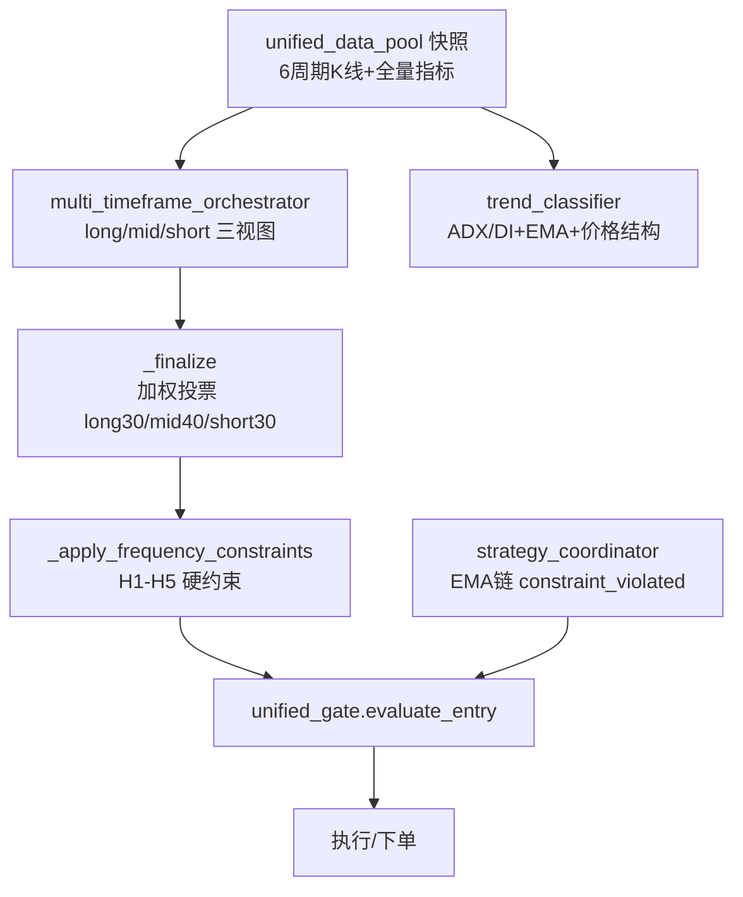
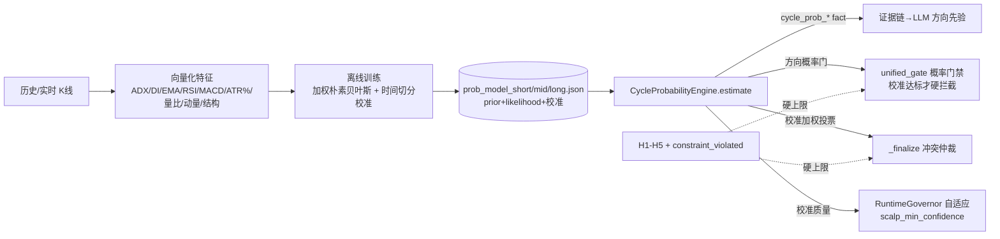

# 周期方向识别研究报告（Cycle Direction Research）

> 日期：2026-07-06　范围：Hyper-Alpha-Arena「三周期 Agent」的周期方向（周期趋势方向）识别
> 性质：实证驱动（真实历史 K 线）+ 可落地实现（已随本报告一并交付代码）

---

## 0. 摘要（给非技术读者）

我们要解决的问题很朴素：**在不同的时间尺度上（几分钟、几小时、几天），价格接下来更可能"涨、跌、还是横着震荡"？** 这个"周期方向"判断，是三周期 Agent 决定要不要开仓、开多还是开空的地基。

本次研究做了三件事：

1. **用项目自己的真实历史 K 线，量化了每个技术参数在不同周期下到底有没有用**（参数敏感度矩阵）。最重要的发现是：**短周期（1 分钟、15 分钟）里，追涨杀跌是错的——数据显示短周期是"均值回归"（涨多了会回、跌多了会弹）；越到长周期（4 小时、日线）才越像"趋势跟随"。** 而波动率（ATR%）是所有周期里最稳定有用的信号，传统的 ADX、量比反而几乎没用。
2. **落地了一个"周期方向概率引擎"**：它从历史里学到"在某种技术状态下，未来涨/跌/震荡各占多少概率"，并且**自己会评估自己准不准**（校准质量）。诚实地说，加密市场方向极难预测，当前模型只有微弱优势（准确率约 40% vs 随机 33%），所以引擎默认"谦虚"——校准不达标时只观察不拦截。
3. **把这个概率接进了三个地方**：喂给 AI 当"方向先验"（压制 AI 主观幻觉）、接进开仓门禁（方向明显相反时拦截/缩仓）、接进多周期冲突仲裁（周期打架时多一票有数据支撑的裁判）。全部默认安全、可一键回滚。

---

## 1. 现有三周期 Agent 能力梳理

### 1.1 三档定义（唯一权威来源）

来自 [backend/config/tier_timeframe_map.py](backend/config/tier_timeframe_map.py)：

| tier | 主周期 | 确认周期 | 主决策模块 | 是否调 LLM 开仓 |
|------|--------|----------|-----------|----------------|
| **short**（scalp/intraday） | 15m | 5m / 1m | [scalp_factor_router.py](backend/services/scalp_factor_router.py) | 否（因子规则为主，延迟 <100ms） |
| **mid**（swing） | 1h | 4h / 15m | [swing_agent.py](backend/services/swing_agent.py) | 是（快 LLM） |
| **long**（trend_follow/position） | 4h | 1d / 1w | [trend_agent.py](backend/services/trend_agent.py) | 是（深 LLM） |

### 1.2 方向判定链路



- **编排器加权共识**：三视图 `bias × confidence × 权重`，long 权重在长线趋势明确时 ×1.5（趋势保护）。
- **H1-H5 频率硬约束**（[multi_timeframe_orchestrator.py](backend/services/multi_timeframe_orchestrator.py)）：短线追涨杀跌、跨周期冲突≥2 条时降级 wait/冻结。
- **协调器 EMA 链**：15m↔1h↔4h 不得反向，否则 `constraint_violated` → 在 [unified_gate.py](backend/services/decision_core/unified_gate.py) 硬 block。

### 1.3 关键缺口（本次研究要补的）

1. **没有结构化、可校准的"周期方向概率"**：现有方向判定是规则打分 + LLM 主观推理，没有"未来涨/跌/震荡各多少概率"，也从不知道"这个周期的方向历史上到底能不能预测准"。
2. **参数敏感度从未用真实数据量化**：门禁阈值（ADX≥15/25/40、RSI 55/45 等）多为经验值，未经本项目数据检验。
3. **多周期冲突仲裁靠简单 2/3 多数**：缺少"哪个周期此刻更可信"的加权依据。

---

## 2. K 线参数敏感度矩阵（实证）

### 2.1 方法

脚本 [scripts/analyze_cycle_direction_sensitivity.py](scripts/analyze_cycle_direction_sensitivity.py)：

- 数据源：`alpha_market.crypto_klines`（取每 symbol×period 历史最深交易所），Top-20 币种。
- 标签："周期方向" = 未来 N 根 K 线收益的三态（涨/跌/震荡），震荡阈值 = 该周期 |收益| 中位数的一半（自适应）。
- 指标：每个参数计算 **IC**（Spearman 秩相关，预测幅度+方向）、**dir_lift**（按信号方向切多空的命中率相对 50% 的提升，预测方向）、**MI**（分桶与三态标签的互信息，捕捉非线性）。
- 综合敏感度得分 = |IC| + 2×|dir_lift| + MI。

样本量：1m≈8.5万、5m≈1.9万、15m≈3.7万、1h≈3.4万、4h≈0.98万、1d≈1.5万。方向基础分布均接近 涨 35% / 跌 35% / 震荡 29%。

### 2.2 敏感度矩阵（综合得分，越大越敏感）

| 参数＼周期 | 1m | 5m | **15m(short)** | **1h(mid)** | **4h(long)** | 1d |
|-----------|-----|-----|------|------|------|-----|
| adx | 0.003 | 0.028 | 0.004 | 0.015 | 0.033 | 0.010 |
| di_diff | 0.161 | 0.049 | **0.114** | 0.029 | 0.034 | 0.014 |
| ema_align | 0.171 | 0.076 | 0.085 | 0.010 | **0.076** | 0.044 |
| rsi | **0.196** | 0.041 | **0.122** | 0.049 | 0.059 | 0.007 |
| macd_hist | 0.159 | **0.093** | 0.061 | 0.032 | 0.047 | 0.064 |
| **atr_pct** | 0.086 | 0.081 | 0.082 | **0.102** | 0.076 | **0.117** |
| vol_ratio | 0.001 | 0.036 | 0.008 | 0.004 | 0.042 | 0.005 |
| mom | 0.125 | 0.031 | 0.100 | 0.059 | 0.021 | 0.046 |
| hh_hl | 0.192 | 0.024 | 0.085 | 0.015 | 0.049 | 0.018 |

（完整 IC/lift/MI 明细见 `data/cycle_sensitivity/matrix_*.json`）

### 2.3 核心发现（这是本报告最重要的部分）

**发现 1：短周期是"均值回归"，长周期才是"趋势跟随"——方向会翻转。**

看 dir_lift（>0 表示"顺着信号做"能赢、<0 表示"反着信号做"才对）：

| 周期 | 代表信号 | 命中率 | dir_lift | 含义 |
|------|---------|--------|----------|------|
| 1m | rsi | 41.6% | **−0.084** | 强烈均值回归：RSI 高反而要防跌 |
| 15m | rsi | 46.9% | **−0.031** | 均值回归 |
| 1h | rsi | 48.7% | −0.013 | 弱均值回归 |
| 5m | macd_hist | 51.3% | **+0.013** | 开始转向趋势 |
| 4h | macd_hist | 50.5% | +0.005 | 弱趋势跟随 |
| 1d | ema_align | 50.8% | **+0.008** | 趋势跟随 |

> 结论：**短周期 Agent 若用"RSI 高就追多、EMA 多头排列就追多"这类顺势规则，方向大概率是反的。** 这解释了历史上短线"近 20 笔赢 6 输 14"的现象。长周期反过来，顺势才对。

**发现 2：波动率（atr_pct）是最稳定、跨周期通用的信号。** 它在 1h（0.102）和 1d（0.117）都是最强，且互信息（MI）在所有周期都最高——但它预测的是"会不会大动/是不是震荡"，不直接给方向。这意味着 **波动率应作为"周期状态门"（是否值得交易、仓位大小），而非方向信号**。

**发现 3：传统强度指标 ADX、量比 vol_ratio 对方向几乎无预测力**（全周期得分 <0.04）。ADX 只是"有没有趋势"的强度度量，本身不含方向——这与它在代码里被当作"门禁强度阈值"而非"方向信号"的用法一致，验证了现有设计的合理性，但也提示：**不应把 ADX 高低直接当作看多看空的理由**。

**发现 4：不同周期的"最敏感参数"确实不同**，支持"分周期差异化思考"：

- **short(15m)**：rsi(0.122) > di_diff(0.114) > mom(0.100) —— 动量/相对强弱类（但要反向用）
- **mid(1h)**：atr_pct(0.102) > mom(0.059) > rsi(0.049) —— 波动率主导
- **long(4h)**：ema_align(0.076) ≈ atr_pct(0.076) > rsi(0.059) —— 均线结构主导

> 局限：5m/1m 历史仅约 1 周，样本虽多但时间跨度短，跨越的行情形态有限，**超短周期结论置信度低**，需持续采集后复算。

---

## 3. 门禁参数设计建议（按 tier 差异化）

结合实证与现有门禁（[unified_gate.py](backend/services/decision_core/unified_gate.py)、[strategy_coordinator.py](backend/services/strategy_coordinator.py)），给出分周期"门禁参数"建议。核心思想：**短周期靠波动率+反转确认，长周期靠均线结构+趋势共振**。

### 3.1 short（15m，5m/1m 确认）

| 门禁维度 | 现状 | 建议 | 依据 |
|---------|------|------|------|
| 方向信号取向 | 部分顺势 | **反转优先**：RSI 超买/超卖作为"反向"提示而非追随；顺势信号需额外确认 | 发现 1（短周期均值回归） |
| 波动率门 | 有 regime 分级 | **保留并强化**：atr_pct 作为"是否值得开短线"的主闸（低波动时降频） | 发现 2 |
| ADX 用法 | 强度阈值 | **不作方向依据**，仅用于过滤"完全无趋势"时降仓 | 发现 3 |
| 概率门 | 无 | 新增 `cycle_prob` 门（见 §5），校准达标才硬拦截 | 本次落地 |

### 3.2 mid（1h，4h/15m 校验）

| 门禁维度 | 现状 | 建议 | 依据 |
|---------|------|------|------|
| 主判据 | 4h 趋势 + RSI/MACD | **波动率 + 动量并重**：atr_pct 定"该不该重仓"，mom 定方向倾向 | 发现 4（mid） |
| EMA 服从链 | 1h 须服从 4h（constraint_violated） | 保留（硬约束） | 现有设计合理 |
| 概率门 | 无 | 新增，Paper 软缩仓 / Live 硬拦截 | 本次落地 |

### 3.3 long（4h，1d/1w 确认）

| 门禁维度 | 现状 | 建议 | 依据 |
|---------|------|------|------|
| 主判据 | 1d ADX + EMA + 宏观 | **均线结构(ema_align)为核心方向信号 + atr_pct 定风险** | 发现 4（long） |
| 趋势跟随 | 已顺势 | 保持顺势（长周期 lift>0） | 发现 1 |
| 周开仓上限 | 2 笔/周 | 保留 | 现有设计 |
| 概率门 | 无 | 新增 | 本次落地 |

### 3.4 通用建议

- **把"门禁阈值"从经验值逐步迁移到数据校准值**：例如短线的 RSI 门槛方向应随敏感度矩阵定期复算而调整。
- **波动率分层是所有周期共用的第一道门**（决定"该不该交易、交易多大"），方向信号是第二道门。

---

## 4. 幻觉抑制手段

现有四层防幻觉（证据清单 → cited_fact_ids → Fact Guard → 规则 post-process）保持不变。本次**新增一层"数据锚定的方向先验"**：

| 手段 | 位置 | 作用 |
|------|------|------|
| 证据清单 + cited_fact_ids | [agent_evidence_builder.py](backend/services/agent_evidence_builder.py) | 只能引用列出的 fact，禁止编造数字 |
| Fact Guard（shadow/enforce） | [agent_fact_guard.py](backend/services/agent_fact_guard.py) | RSI/共振/宏观矛盾硬校验 |
| **cycle_prob_* 方向先验（新增）** | agent_evidence_builder | 给 LLM 一个**基于历史条件频率的方向锚点**，要推翻它必须给出可引用的反向证据 |
| **校准质量透明化（新增）** | cycle_prob_calibration_* fact | 明确告诉 LLM"这个先验历史上准不准"，校准差时不因先验重仓 |

新增 fact（swing→mid 周期、trend→long 周期）：

```
- cycle_prob_dir_mid   [cycle_prob_engine]: down(涨37%/跌41%/震荡22%)
- cycle_prob_conf_mid  [cycle_prob_engine]: 0.109
- cycle_prob_calibration_mid [cycle_prob_engine]: 0.061   ← 校准质量，低=别太信
- cycle_prob_top_driver [cycle_prob_engine]: atr_pct,adx,di_diff
```

prompt 中新增使用说明（[agent_evidence_builder.py](backend/services/agent_evidence_builder.py) `format_evidence_for_prompt`）：把 `cycle_prob_dir_*` 作为默认方向倾向；校准质量接近 0 时不因先验重仓；最终方向无论顺逆都必须引用对应 fact。

> **抗幻觉的关键设计**：先验本身是"谦虚的"——由于加密方向难预测，`cycle_prob_calibration` 常低于 0.15，此时它只提供"参考倾向"而不构成"必须服从"，避免了用一个弱模型去制造新的过度自信。

---

## 5. 多周期协同架构草图（本次落地）



### 5.1 概率引擎（[backend/services/cycle_direction_probability.py](backend/services/cycle_direction_probability.py)）

- **算法**：加权朴素贝叶斯（特征离散分桶 → P(桶|方向) → log-odds 聚合，权重=特征互信息）。选它而非黑盒 ML 的理由：**可解释**（能拆到每个特征贡献）、**便宜**（查表，可每 tick 调用）、**可校准**、**数据自证方向**（自动学到短周期均值回归的符号，无需人工写死）。
- **训练**：每 tier 用 16 币历史，时间序列 70/30 切分，产出 Brier / reliability(ECE) / 三态准确率 / 校准质量。
- **当前校准结果（诚实披露）**：

| tier | Brier（<0.667 好） | ECE（越小越准） | 三态准确率（>0.33） | 校准质量 |
|------|------|------|------|------|
| short | 0.6486 | 0.043 | 41.9% | 0.053 |
| mid | 0.6462 | 0.025 | 39.0% | 0.061 |
| long | 0.6450 | 0.037 | 40.3% | 0.063 |

> 解读：**校准良好（ECE 0.03 级，说明"说 40% 就真约 40%"），但边际优势微弱**（准确率仅略高于随机、Brier 仅略优于基线）。这是加密方向预测的客观难度，不是 bug。正因如此，所有下游消费都**校准感知**：质量低时退化为观察/参考，质量随数据积累变好后才逐步硬化。

### 5.2 三处接入

1. **证据链/Prompt**（§4）：降幻觉的方向先验。
2. **门禁**（[unified_gate.py](backend/services/decision_core/unified_gate.py) 步骤 3.5）：`CYCLE_PROB_GATE_ENABLED`（默认关）。开仓方向与引擎"明显反向"（反向概率−意图概率 ≥ margin）且**校准质量 ≥ `CYCLE_PROB_GATE_MIN_CALIBRATION`(默认 0.15)** 时：Live 直接 block，Paper 软缩仓 ×0.5；校准不足则仅记日志。异常 fail-open（增益型信号，缺失不构成裸奔）。
3. **仲裁**（两处，见 §6）：
   - [multi_timeframe_orchestrator.py](backend/services/multi_timeframe_orchestrator.py) `_cycle_prob_arbitration`：三视图冲突时的校准加权投票。
   - [strategy_coordinator.py](backend/services/strategy_coordinator.py) `_cycle_prob_tier_lean` + `conflicting` 分支：多频率冲突时，若可信校准的概率引擎在本 tier 也无方向 → 再加深缩仓。

---

## 6. 讨论纪要

### 6.1 议题一：不同周期模型冲突时的仲裁机制

**现状**：编排器 `_finalize` 用简单加权投票 + 2/3 多数；冲突≥2 条走 H1-H5 降级 wait；协调器 `strategy_coordinator` 在 `multi_freq_alignment == "conflicting"` 时统一缩仓 ×0.65。

**本次方案（已落地，软层，两处）**：

**(a) 编排器 `_finalize`** 的 `direction_conflict` 分支加入**校准加权的概率仲裁分量**：

```
prob_score = Σ_tier (P涨−P跌)_tier × 校准质量_tier × tier权重 / Σ(校准×权重)
agreement  = prob_score × 多数方向符号
```

- `agreement ≤ −0.15`（概率强烈反对多数方向）→ 强制 wait；
- `−0.15 < agreement < −0.03` → 额外缩仓 ×0.6；
- `agreement > 0.03`（概率支持）→ 允许小幅放宽（≤1.0，不越界）；
- **仅当至少一个 tier 校准达标（active）才生效**，否则只记录。

**(b) 协调器 `calculate_dynamic_risk_params`** 的 `conflicting` 分支：多频率原始方向已冲突时，用 `_cycle_prob_tier_lean(market_env, tier)` 取本 tier 的原始方向净分（P涨−P跌）。若该 tier 校准达标（active）且概率引擎**同样看不出方向**（|lean| < 0.02），说明确实无方向可交易 → 在既有 ×0.65 基础上**再加深缩仓 ×0.9**；有明确倾向或校准不足则维持既有行为（不因弱信号放松风险）。

**关键取舍与共识**：
1. **概率仲裁是"硬约束之下的软层"**——H1-H5 与 `constraint_violated` 仍是不可逾越的上限（`_apply_frequency_constraints` 在 `_finalize` 之后执行）。概率只能"在允许范围内微调仓位/加一票 wait"，不能反向解锁被硬约束禁止的交易。
2. **当前校准弱 → 仲裁几乎无影响**（prob_score 被 0.05 级校准压得极小），这是**刻意的安全设计**：先把管道接好，随数据积累、校准变好后自动增强话语权，而不是一上来就让弱模型主导仲裁。
3. **备选方案对比**：
   - *方案 A（采纳）*：校准加权概率投票，软层微调。优点：安全、可解释、自适应；缺点：弱模型期见效慢。
   - *方案 B（否决）*：概率直接覆盖多数方向。否决理由：当前校准太弱，等于让噪声主导，风险高。
   - *方案 C（备选）*：按 tier 校准质量动态调整 long/mid/short 投票权重。可作为下一步——当各 tier 校准出现明显分化时，给"更可预测的周期"更大投票权。

### 6.2 议题二：Agent 自适应参数调整的可行性

**现状**：`RuntimeGovernor` 已有成熟的多源意图仲裁（manual>opencode>decision_feedback>evolution_gc>maturity），写 `runtime_tuning.json`，60s 生效。

**本次方案（已落地）**：把概率引擎的**校准质量**作为一个**新的低优先级 source（`cycle_prob_calibration`，未注册→自动落到最低优先级 30）**，调整 `scalp_min_confidence`：

- short 校准质量 < 0.10（方向几乎不可预测）→ 上调短线置信门槛（+5），减少"看不清方向时"的短线裸奔；
- ≥ 0.25（有一定 edge）→ 小幅放宽（−2）；
- 中间区间不干预。

**可行性结论**：
1. **可行且低风险**：复用现成 Governor 通道，最低优先级意味着**永远不会覆盖人工/进化/反馈的决定**（实测：即使提交，赢家仍是 manual）。
2. **自适应闭环**：训练（`train_and_save_all`）后自动 `sync_calibration_to_governor()`，形成"数据变多→重训→校准变化→门槛自适应"的闭环。
3. **边界与风险**：
   - 只动 `scalp_min_confidence` 这一个受管 key（短线最需要"看不清就别做"），不碰止损/仓位硬顶；
   - 有 TTL（3 天）自动过期，不会永久锁定；
   - 未来可扩展到 `min_risk_reward` 等，但需先积累更多校准样本，避免弱信号频繁扰动门槛。

### 6.3 待办与后续

- [ ] 持续采集 5m/1m 数据，样本跨度够后复算敏感度矩阵与超短周期模型。
- [ ] 校准质量若稳定升到 >0.15，评估开启 `CYCLE_PROB_GATE_ENABLED`（先 Paper 后 Live）。
- [ ] 将概率表重训挂到 `evolution_scheduler`（每 3 天），与 NSGA-II 进化同频。
- [ ] 探索议题 6.1 方案 C（按 tier 校准分化动态调投票权）。
- [ ] 引入 K 线之外的辅助信号（订单流 CVD、资金费率、新闻情绪、链上）作为概率引擎的额外特征——现有 `unified_data_pool` 已采集，可平滑扩展 `FEATURES`。

---

## 7. 交付物清单

| 类型 | 文件 | 说明 |
|------|------|------|
| 实证脚本 | [scripts/analyze_cycle_direction_sensitivity.py](scripts/analyze_cycle_direction_sensitivity.py) | 参数敏感度矩阵（只读） |
| 概率引擎 | [backend/services/cycle_direction_probability.py](backend/services/cycle_direction_probability.py) | 训练+推理+校准+governor 同步 |
| 证据链 | [backend/services/agent_evidence_builder.py](backend/services/agent_evidence_builder.py) | 注入 cycle_prob_* fact + 先验话术 |
| 门禁 | [backend/services/decision_core/unified_gate.py](backend/services/decision_core/unified_gate.py) | 步骤 3.5 概率门禁 |
| 配置 | [backend/config/settings.py](backend/config/settings.py) | `CYCLE_PROB_GATE_*`（默认关，可回滚） |
| 仲裁（编排器） | [backend/services/multi_timeframe_orchestrator.py](backend/services/multi_timeframe_orchestrator.py) | `_cycle_prob_arbitration`（三视图冲突投票） |
| 仲裁（协调器） | [backend/services/strategy_coordinator.py](backend/services/strategy_coordinator.py) | `_cycle_prob_tier_lean` + `conflicting` 分支加深缩仓 |
| 验收 | [scripts/verify_cycle_probability.py](scripts/verify_cycle_probability.py) | 26 项验收（全 PASS） |
| 单测 | [tests/backend/unit/test_cycle_direction_probability.py](tests/backend/unit/test_cycle_direction_probability.py) | 14 项（全 PASS） |
| 数据产物 | `data/cycle_sensitivity/matrix_*.json`、`data/cycle_prob/prob_model_*.json` | 敏感度矩阵、概率模型 |

### 复现命令

```bash
# 1. 实证敏感度矩阵
backend\.venv\Scripts\python.exe scripts\analyze_cycle_direction_sensitivity.py --top-symbols 20
# 2. 训练三周期概率模型
backend\.venv\Scripts\python.exe -m backend.services.cycle_direction_probability
# 3. 验收
backend\.venv\Scripts\python.exe scripts\verify_cycle_probability.py
# 4. 单测
backend\.venv\Scripts\python.exe -m pytest tests/backend/unit/test_cycle_direction_probability.py -q
```

### 回滚

- 门禁：`.env` 设 `CYCLE_PROB_GATE_ENABLED=false`（默认即为关）。
- 证据/仲裁：概率引擎缺模型时自动 `available=False`，全部退化为原行为，无需回滚。
