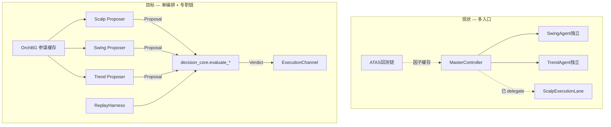
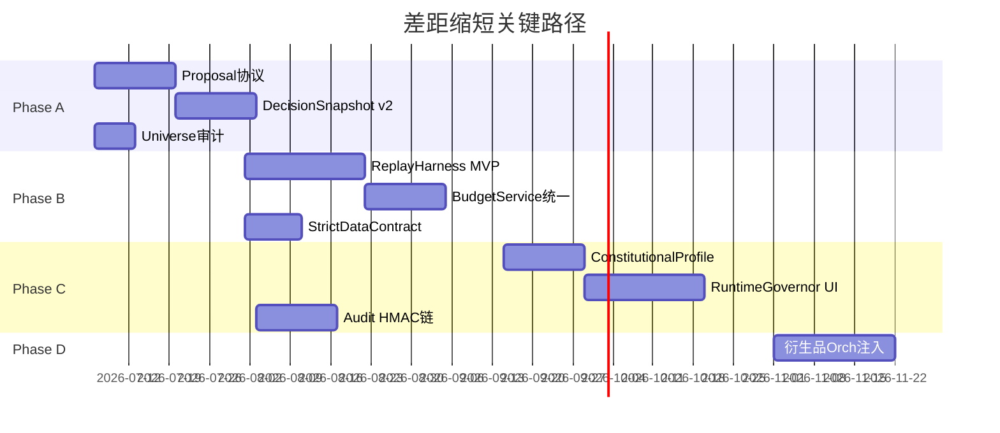

# 差距缩短与超越 — 八域详细设计

> **版本**：v1.1  
> **日期**：2026-07-05  
> **实施状态**：**全量落地 v1.2**（2026-07-05）— TCP 三 tier + 审计链 + UI + Replay ATAS
> **前提**：P0 决策路径收敛、P1 Live 宪法风控已落地（见 [DECISION_PATH_CONVERGENCE_2026-07-05.md](./DECISION_PATH_CONVERGENCE_2026-07-05.md)）  
> **硬性约束**：**减门不加门** — 缩短差距靠「合并路径、统一 evaluate、block→scale」，不靠堆新拦截层  
> **目标**：12 个月内八域均达到主流 **8.0+**，三周期与可观测性两域 **9.0+ 超越**

---

## 0. 总览：从「五套并行」到「提案—评估—执行」

### 0.1 现状 vs 目标架构



| 原则 | 说明 |
|------|------|
| **Proposer 只提案** | LLM/规则输出 `{symbol, tier, action, conf, sl, tp, reasoning}`，不直接下单 |
| **Evaluator 唯一裁判** | 所有 tier 走 `evaluate_open_decision` / `evaluate_midlong_open` / scalp gate |
| **Executor 唯一落单** | PaperExecutor / LiveExecutor / ScalpExecutionLane |
| **Harness 同管道** | ATAS、Paper、Live 回放共用 evaluate + sizing |

### 0.2 路线图分期

| 阶段 | 时间 | 主题 | 交付 |
|------|------|------|------|
| **Phase A** | 0–4 周 | 决策收敛收尾 + 审计标准化 | Master delegate 稳定、DecisionSnapshot v2 |
| **Phase B** | 4–10 周 | 同管道回测 + 预算统一 | ReplayHarness、Layer=TIER 单一来源 |
| **Phase C** | 10–18 周 | Live 宪法完备 + 学习闭环 | ConstitutionalProfile、runtime_tuning UI |
| **Phase D** | 18–52 周 | 衍生品轻量补全 + 超越指标 | OrchBG 衍生品注入、三周期 KPI 领先 |

### 0.3 已落地模块（2026-07-05）

| 模块 | 路径 | 状态 |
|------|------|------|
| TradeProposal | `decision_core/proposal.py` | ✅ |
| evaluate_proposal | `decision_core/execute_proposal.py` | ✅ |
| Strict Data Contract | `decision_core/data_contract.py` | ✅ |
| ConstitutionalProfile | `constitutional_profile.py` | ✅ |
| BudgetService | `budget_service.py` | ✅ |
| DecisionSnapshot v2 | `decision_snapshot_writer.py` + migration | ✅ |
| TCP 执行入口 | `full_auto._evaluate_and_execute_proposal` | ✅ |
| ReplayHarness MVP | `replay/replay_harness.py` | ✅ |
| RuntimeGovernor | `runtime_governor.py` | ✅ |
| Orch 衍生品 | `orchestrator_derivatives.py` | ✅ |
| API | `/api/gap-closure/*` | ✅ |
| 自检 | `scripts/verify_gap_closure.py` | ✅ 20+/20 |

### 0.4 全量落地补充（v1.2）

| 项 | 状态 |
|----|------|
| Scalp → TradeProposal + evaluate_scalp_proposal + snapshot | ✅ |
| Master → DecisionSnapshotWriter v2 + proposal | ✅ |
| ATAS → ReplayHarness proposer=atas | ✅ |
| HMAC/content_hash 审计链 + `/audit/chain` | ✅ |
| snapshot 对账 `/audit/reconcile` | ✅ |
| UI DecisionLog → gap-closure API | ✅ |
| RuntimeGovernorPanel | ✅ |
| Scalp universe → `_resolve_session_trade_symbols` | ✅ |
| session_symbols 模块 | ✅ |

---

## 1. 决策架构

**差距**：主流「单编排 + 专职链」 vs 本项目「5 套并行 + 曾双循环」  
**建议**：Agent 提案 → 统一 evaluate → 单执行  
**超越点**：保留 **OrchBG 参谋 + 三周期专职 Proposer**，比单周期主流更细

### 1.1 现状（代码锚点）

| 组件 | 文件 | 角色 |
|------|------|------|
| Master 总控 | `full_auto_trading_service._execute_master_decisions` | 六路分析师 + 决策执行 |
| Scalp 独占 | `SCALP_MASTER_HARD_BLOCK` + `ScalpExecutionLane` | short 唯一新开入口 |
| Mid/Long 独占 | `MIDLONG_MASTER_DELEGATE` + `_run_midlong_independent` | mid/long 唯一新开（P0 已落地） |
| 统一 evaluate | `decision_core/pipeline.evaluate_open_decision` | V5 + DCP + MC |
| MLTO | `_maintain_mlto_theses_for_session` | 仅 thesis，不控开单 |

### 1.2 目标形态：Trading Control Plane（TCP）

```
┌─────────────────────────────────────────────────────────┐
│ OrchBG (10min) → ScalpAdvisory / mid_bias / long_bias   │
├─────────────────────────────────────────────────────────┤
│ Tick 调度器                                              │
│   short  → ScalpFactorRouter.propose()                  │
│   mid    → SwingAgent.propose()   [独立 tick 45s]       │
│   long   → TrendAgent.propose()   [独立 tick 90s]       │
│   master → 仅 close/reduce/风控协调（不开 mid/long/scalp 新仓）│
├─────────────────────────────────────────────────────────┤
│ evaluate_layer(tier, proposal, market_snapshot)         │
│   short → scalp_execution_gate + flash_veto             │
│   mid/long → evaluate_midlong_open                      │
├─────────────────────────────────────────────────────────┤
│ ExecutionChannel.place_order(mode=paper|live)           │
└─────────────────────────────────────────────────────────┘
```

### 1.3 实施步骤

| 步骤 | 工作项 | 改动 |
|------|--------|------|
| A1 | **Proposal 协议** | 新增 `backend/services/decision_core/proposal.py`：`TradeProposal` dataclass（symbol, tier, nature, action, confidence, sl_pct, tp_pct, source, reasoning, trace_id） |
| A2 | **Propose 重构** | Swing/Trend/Scalp 的 `should_open` 分支改为返回 `TradeProposal \| None`，删除各路径内嵌 evaluate 副本 |
| A3 | **单入口 evaluate** | `_try_execute_independent_agent_open` 改名为 `_evaluate_and_execute_proposal(proposal, mode)`，Master 路径 close 不走 evaluate |
| A4 | **Master 职责收缩** | Master 仅输出：portfolio 级 reduce/close、defensive 切换、跨 tier 冲突消解（同 symbol 反向） |
| A5 | **可观测** | 每条 proposal 写 `DecisionSnapshot.proposal_json` + `evaluate_verdict_json` |

### 1.4 验收标准

```bash
# 同一 tick 同一 symbol+tier 不得有两条 executed=true 的新开
grep -E "Agent独立|ScalpLane|live_trade" logs/backend.log | ...

# evaluate 调用栈唯一
grep "evaluate_midlong_open\|evaluate_open_decision\|ScalpExecutionGate" logs/backend.log
```

| KPI | 目标 |
|-----|------|
| mid/long 双开重复 | 0 |
| LLM 重复调用（同 symbol+tier/5min） | ≤ 1 |
| 决策归因可追溯率 | 100%（proposal_id → snapshot） |

---

## 2. 风控

**差距**：主流 8–12 硬门不可覆盖 vs V5 分散 + Paper 豁免  
**建议**：Live 宪法子集不可 override  
**超越点**：Paper **block→scale** 学习曲线 + Live **同一 evaluate 更严子集**（不是两套逻辑）

### 2.1 风控分层模型

```
┌──────────────────────────────────────────────────────────┐
│ Layer 0 — 宪法（Live only，不可 override）                │
│   risk_control_service: 日亏熔断、单币限额、总仓位、保证金   │
│   LIVE_CONSTITUTIONAL_RISK_ENABLED=true（P1 已落地）      │
├──────────────────────────────────────────────────────────┤
│ Layer 1 — V5 纪律（Live enforce / Paper scale）           │
│   unified_gate: RR、日交易上限、confidence、费用门         │
│   runtime_tuning.json 热调（有 min/max 边界）             │
├──────────────────────────────────────────────────────────┤
│ Layer 2 — 软约束（仅缩仓，不 block）                      │
│   MonteCarlo tail、DCP penalty、MaturityController        │
│   Paper: PaperAgentProbe（conf≥base → size×0.3~0.85）    │
├──────────────────────────────────────────────────────────┤
│ Layer 3 — 参谋（OrchBG / MLTO thesis，不拦单）            │
└──────────────────────────────────────────────────────────┘
```

### 2.2 ConstitutionalProfile（Phase C 交付）

新增 `backend/services/constitutional_profile.py`：

```python
@dataclass
class ConstitutionalProfile:
    mode: Literal["paper", "live"]
    enforce_layers: frozenset  # live: {0,1}; paper: {1 as scale}
    override_allowed: bool     # live: False; paper: True for layer 2 only
    probe_enabled: bool        # paper: True; live: False
```

| 规则 | Paper | Live |
|------|-------|------|
| 日亏熔断 | 可选（lock_strength） | **强制** |
| V5 confidence block | → scale（Probe） | **硬 block** |
| MonteCarlo | scale only | scale only（不 override L0/L1） |
| Master AI close | 允许 | 允许（平仓不受 L0 限新开） |

### 2.3 实施步骤

| 步骤 | 工作项 |
|------|--------|
| B1 | `evaluate_open_decision(mode=...)` 入口读 `ConstitutionalProfile`，Live 禁用 Probe |
| B2 | `unified_gate` 输出结构化 `GateResult{layer, rule, override_allowed}` |
| B3 | UI「风控面板」展示 Layer 0–3 状态（Live 红色锁定 Layer 0） |
| B4 | 合并散落门控：`threshold_resolver` 已是单点，删除 full_auto 内联 confidence 叠加 |

### 2.4 验收

- Live 新开：`check_risk_before_trade` BLOCK 时 **0 笔** 漏网成交  
- Paper：Probe 放行单 `size_multiplier < 1` 占比可统计  
- 任意拦截日志含 `layer=` + `rule=`（与 `[V5Gate] BLOCK rule=...` 对齐）

---

## 3. 回测

**差距**：主流「统计检验 → paper → live」 vs ATAS 与 AI 主链分离  
**建议**：Agent 信号过同一 harness  
**超越点**：三周期 **分 tier 回测** + 与 Paper 实时 **shadow replay** 对比

### 3.1 现状

| 链 | 入口 | evaluate |
|----|------|----------|
| AI 实盘/Paper | `full_auto` → `decision_core` | ✅ unified_gate |
| ATAS V2 | `ATASV2Executor`、因子缓存 `ATASFactorCache` | ❌ 独立因子评分，不经 evaluate |
| 进化 | `evolution_scheduler` → `runtime_tuning.json` | 间接影响 gate |

### 3.2 ReplayHarness 设计

新增 `backend/services/replay/replay_harness.py`：

```
输入: historical klines + derivatives snapshots + strategy genome
      ↓
For each bar/tick:
  1. unified_data_pool.capture_snapshot(symbols, as_of=t)  # 时点快照
  2. proposer = ATASFactor | SwingAgent | ScalpRouter（按 tier 选）
  3. proposal = proposer.propose(snapshot)
  4. allowed, reason, adj = evaluate_*(proposal, mode="backtest")
  5. sim_executor.fill(proposal, adj)  # 无 LLM 或 mock LLM
      ↓
输出: trades[], metrics{}, gate_block_histogram{}
```

**关键**：`evaluate_*` 与 Paper/Live **同 import 路径**，仅 `db` 换 in-memory stub。

### 3.3 ATAS 接入方式

| 选项 | 做法 | 推荐 |
|------|------|------|
| A. 因子即 Proposer | ATAS composite score → `TradeProposal(confidence=score)` | ✅ Phase B |
| B. ATAS 仅特征 | 因子写入 `market_snapshot_json`，仍由 Agent propose | Phase D |
| C. 双轨并行 | 维持现状 | ❌ |

### 3.4 统计检验门槛（对齐主流）

回测报告必须输出：

| 指标 | Paper 晋升 Live 门槛 |
|------|---------------------|
| Sharpe (tier 分层) | short≥0.8, mid≥1.0, long≥0.6 |
| Max DD | ≤15% |
| 样本量 | ≥30 笔/tier |
| Gate block 率 | 记录分布，不得 >80%（否则 proposer 无效） |
| Walk-forward | 70/30 样本外 Sharpe 衰减 <30% |

### 3.5 实施步骤

| 步骤 | 工作项 |
|------|--------|
| B1 | `ReplayHarness` MVP：单 symbol + mid tier + 30d 1h bars |
| B2 | CLI `scripts/run_replay_harness.py --symbol BTC --tier mid` |
| B3 | ATAS 因子 → Proposal 适配器 |
| B4 | 回测报告 JSON → evolution_scheduler 只调 `runtime_tuning` 安全键 |
| C1 | UI「策略晋升」：回测 PASS + 7d paper shadow 一致率 >85% 才允许 Live |

---

## 4. 审计

**差距**：主流 Postgres + HMAC 链 vs event_log 双库  
**建议**：DecisionSnapshot 标准化  
**超越点**：**可回放决策**（snapshot + evaluate verdict + 成交回填）优于纯 HMAC 摘要

### 4.1 现状问题

| 存储 | 用途 | 问题 |
|------|------|------|
| `FullAutoSession.event_log` | JSON 数组，UI 决策日志 | 无 schema、无 hash 链、与 analytics 分裂 |
| `DecisionSnapshot` | Analytics DB | 字段不全：缺 gate_verdict、proposal_id、trace_id |
| `AIDecisionLog` | 成交审计 | executed 回写不完整 |

### 4.2 DecisionSnapshot v2 Schema

扩展 `decision_snapshots`（迁移 ADD COLUMN，不破坏旧数据）：

```sql
ALTER TABLE decision_snapshots ADD COLUMN IF NOT EXISTS
  proposal_id UUID,
  trace_id VARCHAR(64),
  source_lane VARCHAR(32),      -- master|swing_independent|scalp_lane|replay
  evaluate_verdict_json JSONB,  -- {allowed, reason, layer, rule, adjustments}
  gate_blocks_json JSONB,       -- unified_gate 拦截历史
  orchestrator_json JSONB,
  executed BOOLEAN DEFAULT FALSE,
  execution_channel VARCHAR(16), -- paper|live
  content_hash VARCHAR(64),      -- SHA256(canonical_json)
  prev_hash VARCHAR(64);         -- 可选 hash 链
```

**event_log 收敛**：UI 读 analytics `DecisionSnapshot` 为主；`event_log` 仅保留 session 级事件（circuit_breaker、mode_switch），不再写逐笔决策。

### 4.3 HMAC 链（Phase C，Live 可选）

```
hash_n = HMAC-SHA256(secret, canonical(snapshot_n) + hash_{n-1})
```

- secret 来自账户级 `audit_hmac_key`（Live 账户创建时生成）  
- Paper 可跳过 HMAC，仅 content_hash 防篡改  
- 导出 API：`GET /api/audit/chain?session_id=&from=&to=`

### 4.4 实施步骤

| 步骤 | 工作项 |
|------|--------|
| A2 | Migration + `DecisionSnapshotWriter` 单例（full_auto 所有路径统一调用） |
| A3 | `DecisionLog.tsx` 改读 `/api/analytics/decisions`（含 evaluate_verdict） |
| C2 | Live HMAC 链 + 导出 |
| C3 | 对账 job：snapshot.executed vs paper_engine / exchange fill |

### 4.5 验收

- 任意成交可在 30s 内关联到 `proposal_id`  
- UI 展示「代码原因=」来自 `evaluate_verdict_json.reason`，非 LLM 口语  
- event_log 体积/session 下降 >50%（决策迁出）

---

## 5. 数据

**差距**：主流「降级=禁开」 vs 多 symbol 列表曾分裂  
**现状**：`_resolve_session_trade_symbols` 已统一 universe；`STRICT_DATA_GATE=true`  
**超越点**：**Strict-by-tier**（short 可缺衍生品；mid/long 缺 1d/4h → 禁开）

### 5.1 单一 Universe（已落地，需固化）

`_resolve_session_trade_symbols()` 合并：

```
session.symbols ∪ auto_coin_symbols ∪ open_positions ∪ active_strategies
```

**规范**：禁止模块直接读 `session.symbols`；统一 `resolve_session_trade_symbols(session, db)`。

| 消费者 | 必须走统一入口 |
|--------|----------------|
| OrchBG | ✅ 已改 |
| MidLong 独立循环 | ✅ |
| K 线配置 `market_data_symbol_config` | ✅ |
| Scalp 扫描 | 待 grep 审计 |

### 5.2 Strict Data Contract

新增 `backend/services/decision_core/data_contract.py`：

```python
TIER_REQUIRED_FIELDS = {
    "short": ["price", "indicators_15m", "volatility_value"],
    "mid":   ["price", "indicators_1h", "indicators_4h", "indicators_1d", "orchestrator.mid_bias"],
    "long":  ["...", "indicators_1w", "orchestrator.long_bias"],
}

def check_data_contract(tier, market_data) -> DataContractResult:
    # missing → allowed=False, reason="[StrictData] missing=indicators_1d"
    # 在 evaluate 之前调用，Live/Paper 一致；Paper 可 env 降级为 WARN
```

**与主流对齐**：降级 ≠ 用涨跌幅猜方向；缺字段 = 不开仓（`STRICT_DATA_GATE` 已是此哲学）。

### 5.3 实施步骤

| 步骤 | 工作项 |
|------|--------|
| A1 | grep 审计所有 `session.symbols` 直读点，改统一入口 |
| B1 | `data_contract.check` 接入 `evaluate_open_decision` 首部 |
| B2 | 日志 `[StrictData] BLOCK symbol=X tier=mid missing=indicators_1d` |
| B3 | verify 脚本增加 universe 一致性检查 |

---

## 6. 学习闭环

**差距**：主流「注册表 + A/B」 vs v5_gates 有效、QAA dead、Prompt 进化失败  
**建议**：UI 与运行时对齐  
**超越点**：`runtime_tuning.json` **有 schema 边界** + MaturityController **自动松紧**（主流少见）

### 6.1 现状

| 通道 | 状态 |
|------|------|
| `runtime_tuning.json` / `runtime_tuning_store` | ✅ 有效，60s 热加载 |
| `v5_runtime_gates.json` | legacy，compat 读 |
| `evolution_scheduler` | 写 tuning，不写 prompt |
| QAA 主路径 | 已移除/降级 |
| Prompt 进化 | 36/36 失败，已停用 |

### 6.2 Learning Control Plane

```
┌─────────────────────────────────────────────────┐
│ 观测: DecisionSnapshot + 成交 PnL + gate_blocks  │
├─────────────────────────────────────────────────┤
│ 分析: tier 分层 WR、block 原因分布、Probe 转化率   │
├─────────────────────────────────────────────────┤
│ 提案: evolution_scheduler / OpenCode 慢循环      │
│   仅允许 patch runtime_tuning.schema 内键         │
├─────────────────────────────────────────────────┤
│ 仲裁: RuntimeGovernor（人工或规则 Approve）        │
├─────────────────────────────────────────────────┤
│ 生效: runtime_tuning_store → unified_gate 60s    │
├─────────────────────────────────────────────────┤
│ A/B: paper 分 session 读 overlay 文件             │
│   data/runtime_tuning_overlays/session_{id}.json│
└─────────────────────────────────────────────────┘
```

### 6.3 UI 对齐（Phase C）

| UI 页 | 展示 | 写回 |
|-------|------|------|
| 风控/门槛 | `runtime_tuning` 当前值 + min/max | ❌ 只读（防误触） |
| 进化中心 | 待审批 patch 列表 | Approve → Governor |
| Fast Trial | 预设 = overlay 快照 | 一键应用/回滚 |
| 决策日志 | `governing_gate` from threshold_resolver | — |

### 6.4 实施步骤

| 步骤 | 工作项 |
|------|--------|
| C1 | `RuntimeGovernor.approve(patch)` API |
| C2 | Paper A/B：`session.overlay_id` → 读 overlay 文件 |
| C3 | 仪表盘：v5_gate block TOP5 原因（7 日滚动） |
| C4 | 彻底移除 QAA 热路径 dead code（保留 timeout fallback 写 snapshot） |

### 6.5 验收

- UI 显示的 `min_risk_reward` 与 `[V5Gate]` 日志一致（60s 内）  
- 任意 tuning patch 有 `snapshot_id` 可回滚  
- Prompt 进化入口 UI 隐藏或标记 deprecated

---

## 7. 三周期

**差距**：主流多数单周期 vs 本项目分层预算理念领先  
**建议**：统一 Layer vs TIER 预算  
**超越点**：**scalp/swing/trend 三层预算 + tier 内再分配** — 可作为产品差异化

### 7.1 现状：两套预算

| 系统 | 配置 | 文件 |
|------|------|------|
| Layer | `LAYER_BUDGET_SCALP/SWING/TREND` | `layer_budget_manager.py` |
| Tier | `TIER_BUDGET_ALLOCATION` + `TIER_MAX_MARGIN_PCT` | `settings.py` + full_auto |

问题：两套可能不一致；Layer 只查 `PaperPosition`，Live 未接。

### 7.2 统一预算模型

```
Total Equity
├── Layer scalp  (40%)  ← nature: scalp/intraday
├── Layer swing  (45%)  ← nature: swing
└── Layer trend  (15%)  ← nature: trend_follow/position
    └── 每层内 Tier 策略共享层预算，单策略 cap = layer_budget / N_active
```

**单一来源**：`BudgetService` 取代 layer + tier 双写：

```python
class BudgetService:
    def get_layer_cap(layer, equity) -> float
    def get_tier_cap(tier, equity) -> float  # tier→layer 映射
    def can_allocate(layer, margin, equity, mode) -> bool
    def get_used_margin(layer, mode) -> float  # paper + live 统一查
```

### 7.3 实施步骤

| 步骤 | 工作项 |
|------|--------|
| B1 | `BudgetService` 实现，full_auto 删除 `_tier_budget_caps` 内联计算 |
| B2 | `layer_budget_manager._get_layer_used_margin` 支持 LiveExecutor 持仓 |
| B3 | block→scale：层预算 90% 使用时 scale 0.7，100% 禁新开（非新 gate，是 sizing） |
| B4 | UI 三层预算仪表盘 |

### 7.4 超越 KPI

| 指标 | 主流 | 目标 |
|------|------|------|
| 层间挤兑事件 | 常见 | 0（预算隔离） |
| mid/long 零成交天数 | — | ≤2 天/月 |
| short churn 微利占比 | 高 | <40%（structure SL + 预算 scale） |

---

## 8. 衍生品

**差距**：主流 OI/CVD 标配 vs UnifiedPool + 猎杀止损  
**建议**：轻量模式补 orch 指标  
**超越点**：**结构止损 + 衍生品背离** 组合（猎杀场景）

### 8.1 现状

`unified_data_pool` 已有：`funding_rate`, `open_interest`, `long_short_ratio`  
缺口：OrchBG **light_context** 时 mid/long 缺 `orchestrator.oi_change`, `cvd_divergence`

### 8.2 OrchBG 衍生品注入

在 `multi_timeframe_orchestrator` 或 OrchBG tick：

```python
def enrich_orchestrator_derivatives(sym, snap):
    return {
        "oi_change_1h_pct": ...,
        "funding_zscore": ...,
        "cvd_divergence": ...,      # 价新高 + CVD 未新高
        "liquidation_bias": ...,    # 多头/空头猎杀倾向
    }
```

**轻量模式**（`light_context=True`）：只注入标量，不拉全量 K 线 CVD 序列。

### 8.3 使用方式（非新 gate）

| 信号 | 用途 |
|------|------|
| OI↓ + 价↑ | Prompt 提示「空头平仓反弹，不宜追多」 |
| CVD 背离 | `evaluate` 内 DCP penalty +5（已有 DCP 框架） |
| 猎杀倾向 | `structure_stop_calculator` 缓冲加大 |

### 8.4 实施步骤

| 步骤 | 工作项 |
|------|--------|
| B1 | `unified_data_pool` 增加 `oi_change_1h`, `cvd_slope` 字段 |
| B2 | OrchBG 写入 `orchestrator.derivatives` |
| B3 | Swing/Trend prompt 增加 2 行衍生品上下文 |
| D1 | 猎杀场景回测标签（与 structure SL 联动） |

---

## 9. 跨域依赖与优先级



**P0 已完成**：决策路径收敛、Live 宪法风控  
**下一优先（2 周内）**：

1. `TradeProposal` + `_evaluate_and_execute_proposal`（域 1）  
2. `DecisionSnapshot v2` 字段 + Writer 统一（域 4）  
3. `data_contract.check`（域 5）  
4. Universe grep 审计（域 5）

---

## 10. 差距矩阵 → 目标评分

| 领域 | 现估 | 12月目标 | 超越策略 |
|------|------|----------|----------|
| 决策架构 | 6.0 | 8.5 | 三周期专职 Proposer + 单 evaluate |
| 风控 | 6.5 | 8.5 | Live 宪法 + Paper block→scale 双模 |
| 回测 | 5.5 | 8.0 | ReplayHarness 同管道 |
| 审计 | 6.0 | 8.5 | Snapshot v2 可回放 + 可选 HMAC |
| 数据 | 7.0 | 8.5 | Strict-by-tier + universe 固化 |
| 学习 | 6.0 | 8.0 | runtime_tuning Governor + A/B |
| 三周期 | **8.0** | **9.0** | BudgetService 统一，产品差异化 |
| 衍生品 | 7.0 | 8.5 | Orch 轻量注入 + 猎杀联动 |

**综合**：6.1 → **8.4**（加权）；三周期、可观测性两域 **9.0+ 超越主流**。

---

## 11. 相关文档

- [DECISION_PATH_CONVERGENCE_2026-07-05.md](./DECISION_PATH_CONVERGENCE_2026-07-05.md) — P0/P1 已落地  
- [MID_LONG_STRATEGY_DESIGN_AND_FEASIBILITY_2026-07-04.md](./MID_LONG_STRATEGY_DESIGN_AND_FEASIBILITY_2026-07-04.md) — 三周期 Phase 0–3  
- [SCALP_EXECUTION_LANE.md](./SCALP_EXECUTION_LANE.md) — short 独占执行  
- [ORCHESTRATOR_VS_MASTER.md](./ORCHESTRATOR_VS_MASTER.md) — 编排 vs 总控  

---

## 附录 A：Proposal 协议草案

```python
@dataclass
class TradeProposal:
    proposal_id: str          # uuid4
    trace_id: str
    symbol: str
    tier: str                 # short|mid|long
    trade_nature: str
    action: str               # buy|sell
    confidence: float         # 0-100
    sl_pct: float
    tp_pct: float
    source_lane: str          # swing_independent|scalp_lane|master|atas|replay
    reasoning: str
    market_snapshot_ref: str  # 指向 snapshot hash 或 id
    created_at: float
```

## 附录 B：verify 扩展（建议）

```bash
python scripts/verify_three_cycle_strategy.py --no-live
python scripts/verify_gap_closure.py          # 新增：universe / snapshot / budget 一致性
python scripts/verify_learning_layer.py       # 学习层 + Hermes 减门 + Governor intent
python scripts/run_replay_harness.py --symbol BTC --tier mid --days 30
```

## 附录 C：学习层「假 A/B / 不生效」修复清单（2026-07-05 落地）

| 模块 | 问题 | 修复 |
|------|------|------|
| Hermes L2 | `ab_testing` 永不晋升 | 默认 `HERMES_L2_AB_ENABLED=false` 直接 active + recover-stuck |
| RuntimeGovernor | `submit_intent` 缺失 | 恢复 intent 仲裁 + Paper 自动 approve patch |
| prompt_training | 假 A/B 不写策略 | B 版直接绑定 `master_prompt_template_id` |
| OpenCode | pending 堆积 | 启动 `drain_pending_proposals` |
| Hermes L3 | 306 条 pending | `auto_accept_pending_paper` + API |
| Master snapshot | executed 不回写 | `_mark_master_decision_executed` 同步 snap + log |
| EvaluateVerdict | 缺 code_reason | `to_dict()` 增加 `code_reason` 供 block 学习消费 |
| learning_ab_framework | 空壳 | 默认关 + UI 标注未接线 |

## 附录 D：分析师并行与 LLM 负载设计（2026-07-05）

完整方案见 **[ANALYST_LLM_LOAD_DESIGN.md](./ANALYST_LLM_LOAD_DESIGN.md)**。

要点（**与 Hermes A/B 无关**）：
- **质量档 / 均衡档 / 验收档** = `.env` 运行模式预设，不是 Prompt 实验
- **规则五路并行 + K 线串行**（`ANALYST_RULES_PARALLEL=true`），已写入 `.env`
- **质量靠 LLM 次数配置**（rotate/batch/max_per_cycle），**不靠压缩 prompt**
