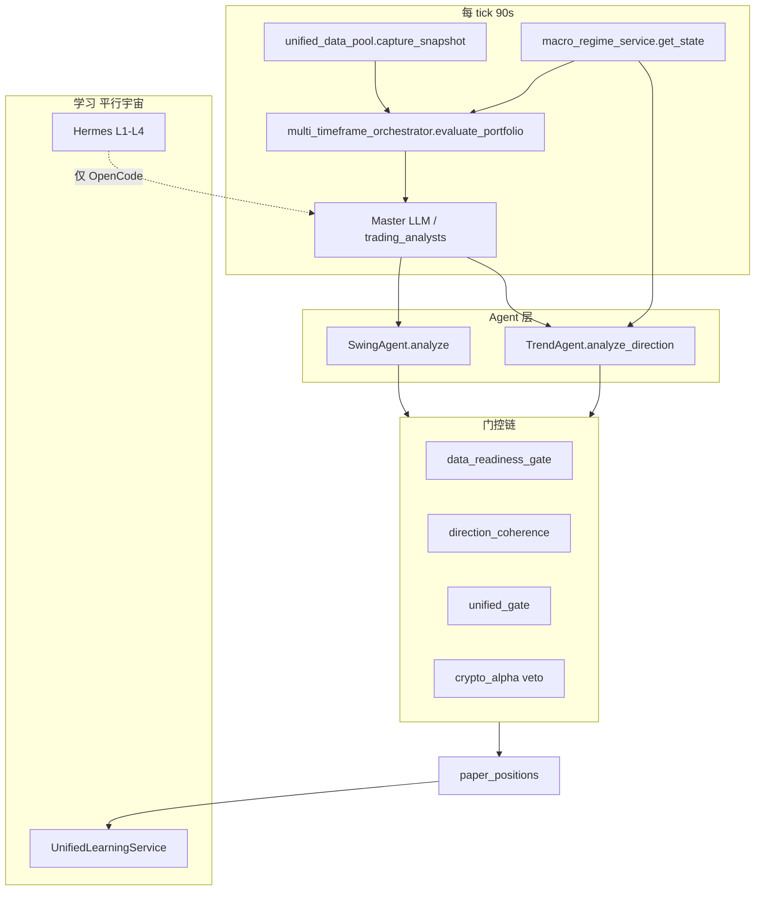
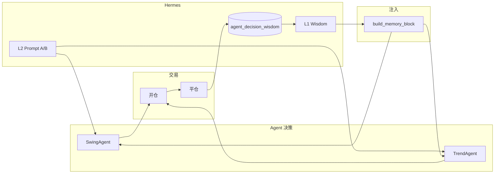

# 中线 / 长线 Agent 全面升级设计

> **版本**：v1.0  
> **日期**：2026-06-27  
> **状态**：待实施  
> **范围**：SwingAgent（中期 1h/4h）、TrendAgent（长期 4h/1d）  
> **关联文档**：[AGENT_ARCHITECTURE_REDESIGN.md](./AGENT_ARCHITECTURE_REDESIGN.md)（部分 superseded）、[macro_regime_service](../backend/services/macro_regime_service.py)（P1 已完成）、Hermes 自进化方案（`.qoder/plans/hermes_自进化系统方案.md`）

---

## 第 0 章：执行摘要

### 0.1 一句话现状

系统已有较完整的 **深度上下文**（K 线、衍生品、宏观、记忆），但 SwingAgent / TrendAgent 在 **证据校验、记忆分库、Hermes 自进化、盈利归因** 四条线上存在明显断层，导致 LLM 仍可能「拍脑门」、学习无法正向升级。

### 0.2 实测盈利（paper_positions 全历史，2026-06-27 查询）

| 对应 Agent | trade_nature | tier | 笔数 | 累计 PnL | 单笔均值 |
|------------|--------------|------|------|----------|----------|
| **TrendAgent** | trend_follow | long | 37 | **+61,233** | ~+1,655 |
| **SwingAgent** | swing | mid | 77 | **+17,442** | ~+226 |
| 误标 | swing | long | 4 | +1,045 | — |
| 对照：短线 | intraday | short | 20 | **-25,324** | — |

**结论**：中长期 Agent 是当前纸面盈利的核心来源；短线 intraday 在拖后腿。升级应聚焦 **让 mid/long 更稳、更可审计、可自进化**，而非重复造轮子。

### 0.3 核心矛盾

| 维度 | 现状 | 目标 |
|------|------|------|
| 智能 | LLM 自由推理，prompt 要求「不要编造」但无代码校验 | 事实层 + 规则层 + 推理层分离 |
| 记忆 | 全 nature 混合战绩注入 | swing / trend 分库 |
| 进化 | Hermes 只优化 OpenCode 提案 prompt | Agent 交易结果 → Hermes → Agent prompt A/B |
| 归因 | 仅有 by_nature 聚合 | Agent 决策 ID → 单笔 PnL |

### 0.4 三阶段路线

```
Phase 0（1 天）  → P0 快修：bug 修复 + Swing 单调用
Phase 1（3–5 天）→ 证据化基础：nature 记忆、scenario 落库、Hermes 只读注入
Phase 2（1–2 周）→ 自进化闭环：Fact Guard、agent_decision_wisdom、Prompt Registry + L2 A/B
```

---

## 第 1 章：架构现状与数据流

### 1.1 三层 Agent 定位

| 层级 | Agent | 文件 | 周期 | trade_nature |
|------|-------|------|------|--------------|
| 短线 | ScalpRouter | `scalp_factor_router.py` | 5m/15m | scalp, intraday |
| **中线** | **SwingAgent** | `swing_agent.py` | 1h/4h | swing |
| **长线** | **TrendAgent** | `trend_agent.py` | 4h/1d | trend_follow, position |

设计原则（见 `AGENT_ARCHITECTURE_REDESIGN.md`）：各层独立信号源、prompt、资金预算；层间不互相阻塞。

### 1.2 每 tick 数据流



### 1.3 SwingAgent 调用链（当前）

1. **Fix18 总控独立调度**（`full_auto_trading_service.py` ~5712–5745）：编排器 `mid:create` 时直接 `swing_agent.analyze()`，append 决策。
2. **Execute 阶段覆写**（~7213–7238）：对 `trade_nature=swing` 再次 `analyze()`，覆写 action/confidence/TP/SL。
3. **问题**：同一 tick **两次 LLM**；Fix18 路径 `portfolio=None`，数据较薄。

### 1.4 TrendAgent 调用链（当前）

1. **Fix18**（~5756–5786）：`long:create` → `analyze_direction()`。
2. **Execute**（~7240–7258）：trend nature → 再次 `analyze_direction()`。
3. **持仓维护**（~11934+）：`_run_trend_review()` 每 90min、每 tick 最多 2 笔 → `review_position()`。

### 1.5 已完成的宏观心智（2026-06-27）

以下项 **已在代码中落地**，本文档不再重复设计：

| 能力 | 文件 |
|------|------|
| 持久化 macro_regime_states | `strategic_analyst/db_models.py` |
| 4h 更新 + 迟滞平滑 | `macro_regime_service.py`, `startup.py` |
| MTO long_view 锚定 + FGI 限制 | `multi_timeframe_orchestrator.py` |
| DCP 宏观硬门 trend 禁多 | `decision_core/direction_coherence.py` |
| derive_trend_side() | `trend_agent.py`, `full_auto_trading_service.py` |
| strategic_context 接线 LongTermPlanner | `unified_data_pool.py` |

### 1.6 关键文件索引

| 模块 | 路径 |
|------|------|
| SwingAgent | `backend/services/swing_agent.py` |
| TrendAgent | `backend/services/trend_agent.py` |
| 深度上下文 | `backend/services/agent_deep_context.py` |
| 交易记忆 | `backend/services/trade_memory_context.py` |
| 编排器 | `backend/services/multi_timeframe_orchestrator.py` |
| 宏观心智 | `backend/services/macro_regime_service.py` |
| 执行总控 | `backend/services/full_auto_trading_service.py` |
| 方向门控 | `backend/services/decision_core/direction_coherence.py` |
| 平仓学习 | `backend/services/unified_learning_service.py` |
| Hermes 智慧 | `backend/services/hermes_proposal_wisdom_engine.py` |
| Hermes DB | `backend/services/hermes_db.py` |
| Prompt 注册 | `backend/services/prompt_registry.py` |
| 盈利归因 | `backend/services/trade_performance_analyzer.py` |
| 净绩效 API | `backend/api/analytics_routes.py` |

---

## 第 2 章：问题诊断（已验证）

每项均经代码审查 + 可行性验证（2026-06-27）。

### 2.1 P0 — 必须立即修复

#### P0-1：`_mkt_info` NameError 导致 funding 丢失

| 项 | 内容 |
|----|------|
| **现象** | Agent 预加载 1h/4h/1d 指标时，`funding_rate` 从未写入 `indicators_*` |
| **根因** | `full_auto_trading_service.py:7078` 使用 `_mkt_info`，该变量仅在 ~2361 因子管道作用域内定义 |
| **影响** | Swing/Trend prompt 缺 funding，衍生品证据链断裂；异常被外层 try 吞掉 |
| **可行性** | ✅ 已验证 |
| **改法** | 7078 行改为 `_ms_sym.get("funding_rate")`（7012 行已定义 `_ms_sym`） |
| **验收** | 日志无 NameError；`market_summary[sym].indicators_1h.funding_rate` 有值 |

#### P0-2：`exit_state_json` 覆盖丢失 trend_adjustment

| 项 | 内容 |
|----|------|
| **现象** | TrendAgent 复查写入的 `trend_adjustment` / `last_trend_review_ts` 丢失 |
| **根因** | `position_exit_orchestrator.py:~80` 整表覆盖为 `{"nature_staged_tp": ...}` |
| **影响** | trailing 收紧、复查节流失效 |
| **可行性** | ✅ 已验证 |
| **改法** | 先 `json.loads` 现有 state，merge 后 `json.dumps`（参照 `_run_trend_review` ~12030） |
| **验收** | staged TP 更新后 `trend_adjustment` 仍存在 |

#### P0-3：`long_conf` / `mid_conf` 与 `*_confidence` 不一致

| 项 | 内容 |
|----|------|
| **现象** | LLM 故障时 TrendAgent/SwingAgent fallback 置信度恒为 0 |
| **根因** | 写入用 `long_confidence`（3045、2123 行）；读取用 `long_conf`（`trend_agent.py:261`）、`mid_conf`（`swing_agent.py:177`） |
| **影响** | fallback 几乎永不开仓，长线在 LLM 故障时停摆 |
| **可行性** | ✅ 已验证 |
| **改法** | 读取侧双字段兼容：`get("long_confidence") or get("long_conf")`；7095–7103 补全 confidence 写入 |
| **验收** | 模拟 LLM 失败，fallback score ≥ 50 且 direction 来自 long_bias |

### 2.2 P1 — 智能与成本

#### P1-1：SwingAgent / TrendAgent 双次 LLM 调用

| 项 | 内容 |
|----|------|
| **现象** | Fix18 + execute 各调一次 analyze |
| **根因** | Fix18 在 enrichment 之前执行 |
| **影响** | 双倍 token/延迟；两次结论可能不一致 |
| **可行性** | ✅ 已验证 |
| **改法** | Fix18 只 append **调度桩**（`action=hold`, `_orch_scheduled=True`），execute enriched 后单次 LLM |
| **验收** | 每 symbol 每 tick swing/trend LLM 调用 ≤ 1 |

#### P1-2：记忆不分 trade_nature

| 项 | 内容 |
|----|------|
| **现象** | `trade_memory_context.py` 最近 15 笔全 nature 混合 |
| **根因** | `_fetch_recent_closed_trades` 无 nature 过滤；`StrategyTrade` 无独立列 |
| **影响** | scalp 亏损误导 swing；trend 看不到 trend 专属教训 |
| **可行性** | ✅ `decision_context.nature` 已落库（`unified_learning_service.py`） |
| **改法** | `build_recent_trades_section(db, nature="swing")` 内存过滤；中期加列 `trade_nature` |
| **验收** | Swing prompt 仅含 `[swing]` 标签战绩 |

#### P1-3：TrendAgent scenario B/C 丢弃

| 项 | 内容 |
|----|------|
| **现象** | Prompt 要求 scenario A/B/C，代码只把 A + lifecycle 拼进 reasoning |
| **根因** | `trend_agent.py:_normalize_direction` 无落库 |
| **影响** | 无法复盘预测准确率，无法自进化 |
| **可行性** | ✅ 新表或 JSON 扩展 |
| **改法** | 见第 6 章 `trend_prediction_records` |
| **验收** | 开仓后 DB 有 scenario 三字段 |

#### P1-4：review_position 上下文弱于开仓

| 项 | 内容 |
|----|------|
| **现象** | 复查只用 `compact_report_text`，无 deep context / macro block |
| **根因** | `review_position` 未调用 `build_trend_deep_context` |
| **影响** | 复查与开仓逻辑脱节 |
| **可行性** | ✅ 复用现有 builder |
| **改法** | review prompt 注入与 `_build_direction_prompt` 同级 macro + deep 块（可精简 token） |
| **验收** | review 日志 reasoning 含 `[生命周期]` 与 macro 阶段 |

#### P1-5：Swing fallback 绕过 _normalize

| 项 | 内容 |
|----|------|
| **现象** | fallback 设 `should_open=True`，跳过清算簇拦截与 confidence≥55 |
| **根因** | `_fallback` 直接返回 `SwingDecision`，不经过 `_normalize` |
| **可行性** | ✅ 需同步 confidence≥55 |
| **改法** | fallback 构造 dict 后走 `_normalize()` |
| **验收** | 反向 high 清算簇时 fallback 也 hold |

### 2.3 P2 — 架构与进化

| # | 问题 | 可行性 | 说明 |
|---|------|--------|------|
| P2-1 | Hermes 与 Agent 断层 | ✅ | 见第 5 章 |
| P2-2 | 无 Fact Guard | ✅ | 复用 `master_close_guard` 模式 |
| P2-3 | Agent 无 AIDecisionLog | ✅ | Master 路径有，Agent 独立路径无 |
| P2-4 | evaluate_pyramid 死代码 | ⚠️ 待决策 | 接入或删除 |
| P2-5 | Scalp 误用 trend review | ✅ | 改用 Scalp 专用 review |
| P2-6 | 无 per-agent Dashboard | ✅ | 扩展 net-performance API |

### 2.4 可行性验证总表

| 升级项 | 结论 | 依据 |
|--------|------|------|
| P0 三 bug | **全部可行**，低风险 | 1–3 行局部改动 |
| Swing 单调用 | **可行** | Fix18 改桩 |
| 记忆 nature 过滤 | **可行** | decision_context.nature |
| Evidence + Fact Guard | **可行** | EvidenceScoreConfig + master_close_guard |
| Hermes P0 注入 | **可行**，0.5–1 人日 | build_wisdom_context 已有 focus 参数 |
| Hermes P1 闭环 | **可行**，5–8 人日 | LearningBackend 扩展点 L241 |
| scenario 落库 | **可行** | 新表 |
| per-agent Dashboard | **可行** | 基于 net-performance |

**不可行 / 不建议**：

- 强行复用 `proposal_wisdom_records` 存 Agent 决策 → 污染 param 模式库，须新表 `agent_decision_wisdom`
- 不改 Prompt Registry 就期望 Hermes L2 优化 Agent → L2 只管理 registry task

---

## 第 3 章：盈利能力评估

### 3.1 数据来源与口径

| 数据源 | 粒度 | 用途 |
|--------|------|------|
| `paper_positions.trade_nature` | 子仓位 | **主归因**（有索引） |
| `paper_orders.trade_nature` | 订单 | 净扣费归因（`decision_feedback_service`） |
| `strategy_trades.decision_context.nature` | JSON | 学习/复盘（无 SQL 索引） |
| `AIDecisionLog` | 决策日志 | Master 路径；Agent 路径不完整 |

### 3.2 实测 PnL（2026-06-27，paper_positions closed）

```
trend_follow  tier=long   n=37   pnl=+61233.53   （TrendAgent 核心）
swing         tier=mid    n=77   pnl=+17441.56   （SwingAgent 核心）
swing         tier=long   n=4    pnl=+1045.29    （tier/nature 映射需规范）
intraday      tier=short  n=20   pnl=-25324.17   （对照：短线拖后腿）
```

**解读**：

1. **TrendAgent 单笔贡献最大**，符合「让利润奔跑」设计。
2. **SwingAgent 笔数多、总贡献稳定**，适合作为频率与胜率优化对象。
3. **系统整体盈利高度依赖 mid/long**；intraday 需单独治理（非本文档主范围）。

### 3.3 现有查询方式

**API**（已实现）：

```http
GET /api/analytics/net-performance?days=30
```

响应 `by_nature` 含：笔数、净 PnL、胜率、profit factor。

**Python**：

```python
from backend.services.trade_performance_analyzer import analyze_closed_trades
rpt = analyze_closed_trades(db=db, since_days=30)
# rpt.by_nature → key in ("swing", "trend_follow", "position", ...)
```

**SQL**（paper 层，推荐）：

```sql
SELECT trade_nature, timeframe_tier,
       COUNT(*) AS n,
       SUM(COALESCE(partial_realized_pnl,0) + COALESCE(unrealized_pnl,0)) AS pnl
FROM paper_positions
WHERE status = 'closed'
  AND trade_nature IN ('swing', 'trend_follow', 'position')
GROUP BY trade_nature, timeframe_tier;
```

### 3.4 归因缺口

| 缺口 | 影响 |
|------|------|
| 无 Agent 决策 ID → PnL | 无法评估「这次 LLM 判断好不好」 |
| strategy_learning 不按 nature | 晋升/降级与 swing/trend 表现无关 |
| trade_memory_miner 无 nature | 挖不到「震荡市 swing 追多必败」类模式 |
| net-performance 无 agent_source | 无法区分 Master vs Agent 独立决策 |

### 3.5 升级后归因设计

#### 3.5.1 数据模型扩展

**方案 A（推荐）**：扩展 `AIDecisionLog` / `decision_snapshot` JSON：

```json
{
  "agent_source": "swing_agent | trend_agent | master",
  "trade_nature": "swing",
  "tier": "mid",
  "evidence_checklist": [...],
  "cited_facts": ["rsi_1h", "mid_bias", ...],
  "llm_raw": { ... }
}
```

**方案 B**：新建 `agent_decision_logs` 表（Analytics DB），FK 关联 `paper_positions.id`。

#### 3.5.2 新 API

```http
GET /api/analytics/by-agent?days=30&nature=swing|trend_follow
```

响应示例：

```json
{
  "swing": {
    "trades": 77,
    "win_rate": 0.52,
    "net_pnl": 17441.56,
    "profit_factor": 1.8,
    "avg_hold_hours": 4.2,
    "avg_rr_achieved": 1.6
  },
  "trend_follow": {
    "trades": 37,
    "win_rate": 0.48,
    "net_pnl": 61233.53,
    "profit_factor": 2.4,
    "avg_hold_hours": 36,
    "scenario_hit_rate": 0.55
  }
}
```

#### 3.5.3 前端

在 Analytics 页增加 **Mid Agent / Long Agent** 卡片，复用 `NetPerformancePanel` 数据结构，增加：

- 平均持仓时长
- RR 达成率（实际 TP/SL vs 计划）
- scenario 命中率（Phase 2 后）

---

## 第 4 章：证据链架构（防拍脑门）

### 4.1 设计原则

> **LLM 只能做「在有证据清单上的推理」，不能自己编数字。**

现有 prompt 已写「不要编造数据」，但无代码层校验。本方案复用已有模式，不从零发明：

| 现有模块 | 可复用能力 |
|----------|------------|
| `ai_prompt_layers.EvidenceScoreConfig` | 证据打分 + breakdown + veto |
| `master_close_guard` | 硬事实门控 + off/shadow/enforce |
| `data_readiness_gate` | 缺数据禁止开仓 |
| `decision_consistency_gate` | flip-flop 检测 |
| `reversal_signal_pack.evidence` | 结构化 evidence 列表 |
| `macro_regime_service.evidence` | 宏观判定依据 JSON |

### 4.2 四层模型

```
┌─────────────────────────────────────────────────────────┐
│ L0 事实层（代码采集，带 timestamp）                        │
│ unified_data_pool snapshot → AgentEvidenceFact[]         │
└────────────────────────┬────────────────────────────────┘
                         ▼
┌─────────────────────────────────────────────────────────┐
│ L1 证据清单（新建 agent_evidence_builder.py）             │
│ 每项: {id, source, value, ts, tier, available}           │
└────────────────────────┬────────────────────────────────┘
                         ▼
┌─────────────────────────────────────────────────────────┐
│ L2 推理层（LLM）                                         │
│ 输出: action + confidence + cited_fact_ids[] + reasoning │
└────────────────────────┬────────────────────────────────┘
                         ▼
┌─────────────────────────────────────────────────────────┐
│ L3 Fact Guard（新建 agent_fact_guard.py）                 │
│ verify_cited_facts() → allow / penalty / veto            │
│ 模式: off | shadow | enforce（同 master_close_guard）      │
└────────────────────────┬────────────────────────────────┘
                         ▼
┌─────────────────────────────────────────────────────────┐
│ L4 现有门控链（顺序不变）                                 │
│ data_readiness → fact_guard → DCP → V5 → crypto_alpha    │
└─────────────────────────────────────────────────────────┘
```

### 4.3 SwingAgent 最低证据清单（12 项）

| id | 来源 | 说明 |
|----|------|------|
| `rsi_1h` | indicators_1h | RSI(14) |
| `rsi_4h` | indicators_4h | RSI(14) |
| `ema_trend_1h` | indicators_1h | EMA9 vs EMA21 |
| `vol_ratio_1h` | indicators_1h | 量比 |
| `mid_bias` | orchestrator | bullish/bearish/neutral |
| `mid_confidence` | orchestrator | 0–1 |
| `funding_rate` | market_summary | 永续 funding |
| `oi_delta_1h` | market_flow_indicators | OI 变化 |
| `liquidation_magnet` | crypto_alpha | 方向 + severity |
| `macro_cycle_phase` | macro_regime | accumulation/markup/... |
| `regime` | market_summary | trending/ranging/... |
| `swing_memory` | trade_memory | 最近 10 笔 swing nature |

### 4.4 TrendAgent 最低证据清单（15 项）

Swing 12 项 +：

| id | 来源 | 说明 |
|----|------|------|
| `trend_1d` | trend_classifier | direction + ADX |
| `lifecycle_stage` | deep context | 启动/加速/衰竭 |
| `price_vs_90d_range` | build_trend_deep_context | 高位/中位/低位 |
| `macro_direction_constraint` | macro_regime | long_only / no_trend_long / ... |
| `scenario_a_trigger` | LLM 输出 | 主场景触发条件（落库） |

### 4.5 Fact Guard 规则示例

| 规则 ID | 条件 | 动作 |
|---------|------|------|
| `FG_RSI_OVERSOLD` | reasoning 含「超卖/RSI低」且 rsi_1h ≥ 35 | confidence ×0.5 或 hold |
| `FG_RSI_OVERBOUGHT` | reasoning 含「超买」且 rsi_1h ≤ 65 | 同上 |
| `FG_MULTI_TF_ALIGN` | reasoning 含「共振」且 1h/4h bias 不同向 | veto |
| `FG_MACRO_DECLINE_LONG` | action=buy + macro decline conf≥0.6 | veto（与 DCP 双保险） |
| `FG_MISSING_DATA` | cited_fact_ids 引用不可用 fact | hold |

**上线策略**：默认 `shadow`（只打日志），7 天 shadow 误杀率 <5% 后切 `enforce`。

### 4.6 新建模块接口草案

**`backend/services/agent_evidence_builder.py`**：

```python
@dataclass
class AgentEvidenceFact:
    id: str
    source: str
    value: Any
    available: bool
    timestamp: Optional[float] = None

def build_swing_evidence(symbol: str, market_envs: dict, db=None) -> List[AgentEvidenceFact]: ...
def build_trend_evidence(symbol: str, market_envs: dict, db=None) -> List[AgentEvidenceFact]: ...
def format_evidence_for_prompt(facts: List[AgentEvidenceFact]) -> str: ...
```

**`backend/services/agent_fact_guard.py`**：

```python
@dataclass
class FactGuardResult:
    allow: bool
    violations: List[str]
    penalty: int = 0
    mode: str = "shadow"

def verify_agent_decision(
    *,
    action: str,
    confidence: float,
    reasoning: str,
    cited_fact_ids: List[str],
    facts: List[AgentEvidenceFact],
    agent_type: str,  # swing | trend
) -> FactGuardResult: ...
```

### 4.7 持久化

写入 `AIDecisionLog.decision_snapshot`（Analytics DB）：

```json
{
  "evidence_checklist": [{"id":"rsi_1h","value":32.1,"available":true}],
  "cited_facts": ["rsi_1h","mid_bias","funding_rate"],
  "fact_guard": {"allow":true,"violations":[],"mode":"shadow"}
}
```

---

## 第 5 章：Hermes 正向升级闭环

### 5.1 现状：两条平行宇宙

| 系统 | 优化对象 | 反馈来源 | Agent 关系 |
|------|----------|----------|------------|
| **Hermes L1–L4** | OpenCode 分析 prompt、参数提案 | `paper_validated` 提案 | 无直接集成 |
| **UnifiedLearning** | StrategyMemory、prompt 进化 | paper 平仓 TradeOutcome | 间接（Fix21 教训） |

Hermes 核心闭环（已实现）：

```
OpenCode 提案验证 → L1 wisdom → context pack 注入 → L2 prompt A/B → 更好提案
```

Agent 路径 **不在此环内**。

### 5.2 目标闭环



### 5.3 Phase P0：只读注入（0.5–1 人日）

**目标**：不改 Hermes 采集，先把已有参数智慧喂给 Agent。

**改法** — `agent_deep_context.py`：

```python
def build_memory_block(db, symbol: str, account_id: int = None, *, agent_focus: str = None) -> str:
    ...
    try:
        from backend.services.hermes_proposal_wisdom_engine import proposal_wisdom
        hermes = proposal_wisdom.build_wisdom_context(
            focus=agent_focus,           # None | "swing" | "trend"
            market_condition=_infer_regime(symbol, db),
            limit=8,
        )
        if hermes:
            parts.append(f"### Hermes 历史调参智慧\n{hermes}")
    except Exception:
        pass
    return "\n".join(parts)
```

调用方：

- `build_full_deep_context(..., agent_focus="swing")`
- `build_trend_deep_context(..., agent_focus="trend")`

**风险**：冷启动时 Hermes 块为空（graceful skip）；token +500~800，需 limit=8。

**验收**：Swing/Trend prompt 可见 `### Hermes 历史调参智慧` 块（有数据时）。

### 5.4 Phase P1a：Agent 决策采集（2–3 人日）

#### 5.4.1 新表 DDL（hermes_evolution.db）

```sql
CREATE TABLE IF NOT EXISTS agent_decision_wisdom (
    id              INTEGER PRIMARY KEY AUTOINCREMENT,
    agent_type      TEXT NOT NULL,          -- swing | trend
    trade_id        INTEGER,                -- strategy_trades.id 或 paper_positions.id
    symbol          TEXT NOT NULL,
    side            TEXT,
    regime          TEXT,
    close_reason    TEXT,
    decision_action TEXT,
    confidence      REAL,
    pnl             REAL,
    pnl_pct         REAL,
    outcome         TEXT NOT NULL,          -- win | loss | breakeven
    pattern_key     TEXT,                   -- 如 ranging_long_chase
    context_snapshot TEXT,                  -- JSON: evidence + scenario
    created_at      TEXT NOT NULL
);
CREATE INDEX IF NOT EXISTS ix_agent_wisdom_type ON agent_decision_wisdom(agent_type, created_at);
```

**不复用** `proposal_wisdom_records`：该表语义是 param_key/direction，Agent 决策是 action/regime/pattern，混用会污染 L1 参数模式库。

#### 5.4.2 LearningBackend 扩展

新建 `backend/services/learning/backends/hermes_agent_wisdom_backend.py`：

```python
class HermesAgentWisdomBackend(LearningBackend):
    name = "hermes_agent_wisdom"
    priority = 150

    def should_trigger(self, db, outcome) -> bool:
        nature = (outcome.trade_nature or "").lower()
        return nature in ("swing", "trend_follow", "position")

    def handle_outcome(self, db, outcome) -> None:
        from backend.services.hermes_agent_wisdom_engine import agent_wisdom
        agent_wisdom.extract_wisdom_from_outcome(outcome)
```

注册：`backend/services/learning/backend_loader.py` 的 `_backend_classes()`。

挂钩点：`unified_learning_service.process_outcome()` L241 `_backend_registry.handle_all(db, outcome)`。

#### 5.4.3 上游字段补齐

`paper_trading_engine` 平仓 `TradeOutcome.metadata` 需透传：

- `agent_source`: swing_agent | trend_agent
- `decision_log_id`: AIDecisionLog.id（若存在）

开仓时在 `full_auto_trading_service` Agent 路径写入 `pos.metadata`。

### 5.5 Phase P1b：Prompt 外迁 + L2 A/B（3–5 人日）

#### 5.5.1 manifest.yaml 新增 task

```yaml
  - id: task_swing_agent
    path: tasks/task_swing_agent.md
    extends: [persona_alpha_assistant, protocol_evidence_first]
    variables:
      - { name: deep_context, type: string, required: false }
      - { name: compact_report, type: string, required: true }
      - { name: evidence_block, type: string, required: false }
    output_schema: swing_decision_json

  - id: task_trend_agent_direction
    path: tasks/task_trend_agent_direction.md
    extends: [persona_alpha_assistant, protocol_evidence_first]
    variables:
      - { name: macro_block, type: string, required: false }
      - { name: deep_context, type: string, required: false }
      - { name: side_hint, type: string, required: true }
    output_schema: trend_direction_json
```

#### 5.5.2 swing_agent / trend_agent 改造

```python
from backend.services.prompt_registry import get_prompt_registry

def _build_prompt(...):
    registry = get_prompt_registry()
    return registry.render_task("task_swing_agent", {
        "deep_context": _deep_ctx,
        "compact_report": context,
        "evidence_block": evidence_text,
    })
```

#### 5.5.3 Hermes L2 注册

`hermes_prompt_optimizer_engine.py`：

```python
OPTIMIZABLE_TASKS = [
    "task_trading_runtime_analysis",
    "task_proposal_review",
    "task_swing_agent",              # 新增
    "task_trend_agent_direction",    # 新增
]
```

#### 5.5.4 A/B 指标（与 OpenCode 不同）

| Agent | 主指标 | 辅指标 |
|-------|--------|--------|
| Swing | 7 日 mid nature 胜率 | RR 达成率、平均持仓 2–8h 占比 |
| Trend | 7 日 trend_follow PF | scenario 命中率、平均持仓 >12h 盈利占比 |

### 5.6 Phase P2：与 OpenCode 参数智慧汇合

扩展 `_proposal_focus()`：patch key 含 `swing_`/`mid_tier`/`trend_`/`long_tier` 时 focus 设为 swing/trend，使 OpenCode 调参经验也可被 Agent focus 过滤读到。

### 5.7 Hermes 集成可行性结论

| 阶段 | 工作量 | 风险 |
|------|--------|------|
| P0 只读注入 | 0.5–1 人日 | 低（冷启动空块） |
| P1a 采集 | 2–3 人日 | 中（双库写入、metadata 透传） |
| P1b Prompt A/B | 3–5 人日 | 中高（prompt 外迁 + 回归测试） |
| P2 汇合 | 1–2 人日 | 低 |

---

## 第 6 章：TrendAgent 预测复核闭环

### 6.1 问题

Prompt 强制输出 1–2 周 scenario A/B/C，代码仅保留 A 文本片段，**无结构化存储、无复查对照、无准确率统计**。

### 6.2 新表（Analytics DB 或 Core DB）

```sql
CREATE TABLE trend_prediction_records (
    id              SERIAL PRIMARY KEY,
    symbol          VARCHAR(16) NOT NULL,
    paper_position_id INTEGER,
    opened_at       TIMESTAMP NOT NULL,
    lifecycle       VARCHAR(32),
    scenario_a      TEXT,
    scenario_b      TEXT,
    scenario_c      TEXT,
    phase_at_entry  VARCHAR(32),       -- macro cycle_phase
    macro_regime    VARCHAR(32),
    entry_price     FLOAT,
    review_snapshots JSONB DEFAULT '[]',  -- [{ts, price, note}]
    outcome         VARCHAR(16),       -- hit | partial | miss | pending
    outcome_note    TEXT,
    closed_at       TIMESTAMP,
    created_at      TIMESTAMP DEFAULT NOW()
);
```

### 6.3 流程

```
analyze_direction 成功
  → INSERT trend_prediction_records（scenario_a/b/c, phase, entry_price）
  ↓
每 90min review_position
  → APPEND review_snapshots {ts, price, deviation_from_scenario_a}
  ↓
平仓
  → _score_prediction_accuracy(record, final_price, close_reason)
  → UPDATE outcome = hit|partial|miss
  → extract_wisdom_from_outcome → agent_decision_wisdom
  ↓
累计 scenario 命中率 → 动态调整 TREND_MIN_SCORE_TO_OPEN（可选）
```

### 6.4 命中率算法（草案）

| outcome | 条件 |
|---------|------|
| hit | 主场景方向正确且幅度 ≥ 预期 50% |
| partial | 方向对但幅度不足，或触发了 scenario_b |
| miss | 方向错误或触发 scenario_c 尾部风险 |

### 6.5 验收

- 每笔 trend_follow 开仓有 prediction record
- 90min 复查后 review_snapshots 非空
- 30 天可查询 scenario 命中率 API

---

## 第 7 章：SwingAgent 专项升级

### 7.1 Fix18 改调度桩

**现状**（~5720–5740）：`swing_agent.analyze()` + `should_open` 过滤。

**目标**：

```python
if not _has_swing:
    decisions.append({
        "symbol": _r_sym,
        "action": "hold",
        "trade_nature": "swing",
        "timeframe_tier": "mid",
        "reasoning": "[总控独立调度→SwingAgent待分析]",
        "_orch_scheduled": True,
    })
```

Execute 阶段（~7213）保持不变：enriched 后单次 LLM。

TrendAgent Fix18（~5754–5785）同理改为桩 + `trade_nature=trend_follow`。

### 7.2 fallback 走 _normalize

见 P1-5；依赖 P0-3 `mid_confidence` 修复。

### 7.3 RR 门槛与 prompt 对齐

| 模式 | 代码门槛 | Prompt 文案 |
|------|----------|---------------|
| paper | rr ≥ 1.8 | 「盈亏比 ≥ 2:1」可保留为理想目标 |
| live | rr ≥ 2.0 | 与 prompt 一致 |

实现：`swing_agent._normalize` 读取 `PAPER_TRADING_MODE` 或 settings。

### 7.4 未来：Swing 持仓复查（可选）

当前无 `_run_swing_review`；若添加，须与开仓同级 `build_full_deep_context`，**禁止**复用 TrendAgent 的 4h/1d review prompt。

---

## 第 8 章：分阶段实施路线图

| 阶段 | 周期 | 内容 | 关键文件 | 验收 |
|------|------|------|----------|------|
| **Phase 0** | 1 天 | P0-1/2/3 bug 修复 | full_auto, position_exit_orchestrator, trend_agent, swing_agent | 单测通过；日志无 NameError |
| **Phase 0b** | 0.5 天 | Swing/Trend Fix18 改桩 | full_auto_trading_service | LLM 调用次数减半 |
| **Phase 1a** | 2 天 | nature 记忆、review deep context、fallback normalize | trade_memory_context, trend_agent, swing_agent | prompt 含分 nature 记忆 |
| **Phase 1b** | 1 天 | Hermes P0 注入 | agent_deep_context | prompt 含 Hermes 块 |
| **Phase 1c** | 2 天 | trend_prediction_records 落库 | 新 migration + trend_agent | 开仓有 scenario 记录 |
| **Phase 2a** | 3 天 | agent_evidence_builder + fact_guard (shadow) | 新模块 ×2 | 审计日志 cited_facts |
| **Phase 2b** | 3 天 | agent_decision_wisdom + LearningBackend | hermes_db, learning/backends | 平仓后 Hermes 有 swing/trend 记录 |
| **Phase 3** | 5 天 | Prompt Registry 外迁 + L2 A/B | manifest.yaml, swing/trend_agent, hermes L2 | Hermes 面板可见 A/B |
| **Phase 4** | 3 天 | /api/analytics/by-agent + 前端 | analytics_routes, NetPerformancePanel | Dashboard mid/long 卡片 |

**总工期估算**：约 15–20 人日（可并行 Phase 2a/2b 与 Phase 1c）。

### 8.1 依赖关系

```
Phase 0 → Phase 0b → Phase 1a
Phase 1b（可与 1a 并行）
Phase 1c（依赖 Phase 0）
Phase 2a（依赖 Phase 1a 部分）
Phase 2b（依赖 Phase 1c 可选）
Phase 3（依赖 Phase 2b 有数据更佳）
Phase 4（依赖 Phase 2b）
```

---

## 第 9 章：风险与边界

| 风险 | 缓解 |
|------|------|
| Fact Guard 误杀有效交易 | 先 shadow 7 天，统计误杀率 |
| Hermes 冷启动无 wisdom | 空块 skip，不报错 |
| Token 膨胀 | evidence limit=12、Hermes limit=8、deep context 截断 |
| 双次改单次后行为变化 | A/B 对比 7 日 mid/long PnL |
| macro_regime 与 Fact Guard 重复 | macro 管慢变量底线，Fact Guard 管 LLM 胡言 |
| intraday/scalp | 不在本方案主范围，但 PnL 数据显示需单独治理 |

**边界声明**：

- 不替代 TrendAgent LLM 全部判断，只加证据底线与进化闭环
- 不重构 ScalpRouter
- 不强制删除 evaluate_pyramid（待 Phase 3 决策）

---

## 第 10 章：验收标准总表

| 类别 | 指标 | 目标 |
|------|------|------|
| **功能** | P0 bug | 0 已知 P0  open |
| **功能** | scenario 落库率 | trend 开仓 100% 有 record |
| **功能** | nature 记忆 | swing prompt 0 条 scalp 战绩 |
| **性能** | swing/trend LLM 调用 | 每 symbol 每 tick ≤1 |
| **性能** | prompt token | 较现网 +15% 以内（证据+Hermes 后） |
| **盈利** | 30 日 swing PF | ≥1.5（基线据 net-performance） |
| **盈利** | 30 日 trend_follow PF | ≥2.0 |
| **审计** | Agent 决策有 evidence | 100% shadow 模式有 cited_facts |
| **进化** | Hermes agent_decision_wisdom | 7 日内 ≥20 条 swing/trend 记录 |
| **进化** | L2 A/B | task_swing 至少 1 次完整 A/B 周期 |

---

## 附录 A：关键代码位置速查

| 主题 | 文件:行号（约） |
|------|----------------|
| Swing analyze | swing_agent.py:55–70 |
| Swing _normalize / fallback | swing_agent.py:145–187 |
| Trend analyze_direction | trend_agent.py:74–79 |
| Trend fallback long_conf bug | trend_agent.py:261 |
| Fix18 Swing 双调 | full_auto_trading_service.py:5712–5745 |
| Execute Swing 覆写 | full_auto_trading_service.py:7213–7238 |
| _mkt_info bug | full_auto_trading_service.py:7078 |
| orchestrator long_confidence 写入 | full_auto_trading_service.py:3045 |
| exit_state 覆盖 | position_exit_orchestrator.py:~80 |
| trend review | full_auto_trading_service.py:11934+ |
| trade memory fetch | trade_memory_context.py:38–76 |
| Hermes build_wisdom_context | hermes_proposal_wisdom_engine.py:191+ |
| UnifiedLearning 挂钩 | unified_learning_service.py:241 |
| net-performance API | analytics_routes.py |
| macro_regime（已完成） | macro_regime_service.py |
| DCP 宏观硬门（已完成） | direction_coherence.py |

---

## 附录 B：与 macro_regime P1 的衔接

| macro_regime 能力 | 本方案如何复用 |
|-------------------|----------------|
| cycle_phase / direction_constraint | Trend evidence 清单项 `macro_*` |
| blocks_trend_long() | 与 DCP + Fact Guard FG_MACRO 三重保险 |
| prompt_block() | 已注入 TrendAgent 开仓 prompt |
| inject_orchestrator_fields | orchestrator payload 已含 macro_* 字段 |

**分工**：

- **macro_regime**：慢变量（跨天/周），管「大周期能不能做 trend 多」
- **证据链 + Fact Guard**：快变量（每 tick），管「这次 LLM 说的有没有据可查」
- **Hermes**：跨周/月，管「历史 swing/trend 决策哪种 pattern 更赚钱」

---

## 附录 C：Open Questions

| # | 问题 | 建议 |
|---|------|------|
| 1 | `evaluate_pyramid()` 接入还是删除？ | Phase 3 前评审；若 trend 金字塔已有 `trend_pyramid_gate`，可删 Agent 内重复 |
| 2 | Fact Guard enforce 阈值？ | shadow 7 天后按误杀率定 |
| 3 | trend_prediction 用独立表还是 JSONB 扩展 decision_snapshot？ | 独立表便于 SQL 统计；JSONB 改动小 |
| 4 | swing tier=long 误标 4 笔如何治理？ | `NATURE_TO_TIER` 强制校验 + 开仓时 assert |
| 5 | Hermes A/B 用 paper 还是 live？ | 先 paper，live 需更严 gate |

---

## 修订历史

| 版本 | 日期 | 说明 |
|------|------|------|
| v1.0 | 2026-06-27 | 初版：问题诊断、盈利评估、证据链、Hermes 闭环、路线图 |
