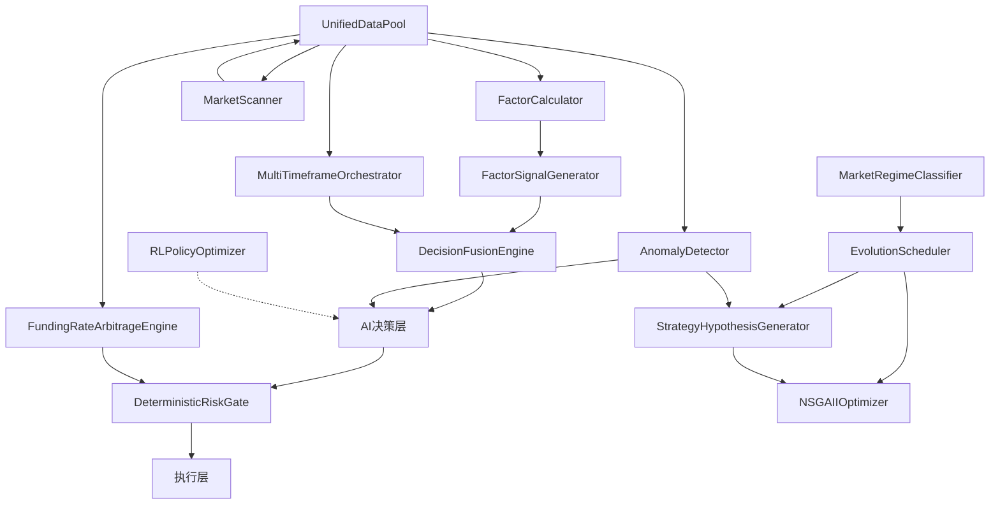

# Hyper-Alpha-Arena 系统升级设计方案 v3.0

> 版本: v3.0 | 日期: 2026-04-14
> 基于代码级深度调研，与现有架构精确兼容

---

## 目录

- [第一章：现有系统深度诊断](#第一章现有系统深度诊断)
  - [1.1 完整数据流转路径](#11-完整数据流转路径)
  - [1.2 关键接口契约表](#12-关键接口契约表)
  - [1.3 战略规划文档评审](#13-战略规划文档评审)
  - [1.4 实施方案评审](#14-实施方案评审)
  - [1.5 P0级Bug：情感因子数据源错误](#15-p0级bug情感因子数据源错误)
  - [1.6 四个关键断裂点分析](#16-四个关键断裂点分析)
  - [1.7 死代码识别](#17-死代码识别)
- [第二章：因子系统修复与扩展设计](#第二章因子系统修复与扩展设计)
  - [2.1 P0修复：funding_factors.py 数据源纠正](#21-p0修复funding_factorspy-数据源纠正)
  - [2.2 因子信号生成层设计](#22-因子信号生成层设计)
  - [2.3 FactorCategory枚举扩展](#23-factorcategory枚举扩展)
  - [2.4 链上数据因子设计](#24-链上数据因子设计)
  - [2.5 衍生品因子设计](#25-衍生品因子设计)
  - [2.6 宏观情绪因子设计](#26-宏观情绪因子设计)
  - [2.7 因子质量评估框架](#27-因子质量评估框架)
- [第三章：套利系统自动化设计](#第三章套利系统自动化设计)
  - [3.1 可行性评估总结](#31-可行性评估总结)
  - [3.2 资金费率套利引擎详细设计](#32-资金费率套利引擎详细设计)
  - [3.3 交易所抽象层设计](#33-交易所抽象层设计)
  - [3.4 跨交易所套利引擎设计](#34-跨交易所套利引擎设计)
  - [3.5 套利风控扩展设计](#35-套利风控扩展设计)
- [第四章：自适应策略生成机制设计](#第四章自适应策略生成机制设计)
  - [4.1 现有遗传优化器评估](#41-现有遗传优化器评估)
  - [4.2 Tier 1：多目标优化升级（NSGA-II）](#42-tier-1多目标优化升级nsga-ii)
  - [4.3 Tier 2：LLM-GA混合策略生成管线](#43-tier-2llm-ga混合策略生成管线)
  - [4.4 Tier 3：市场状态感知与策略映射](#44-tier-3市场状态感知与策略映射)
  - [4.5 Tier 4：DRL在线学习](#45-tier-4drl在线学习)
- [第五章：自主发现交易机会框架设计](#第五章自主发现交易机会框架设计)
- [第六章：编排器与决策层断裂修复](#第六章编排器与决策层断裂修复)
- [第七章：模块集成总体方案](#第七章模块集成总体方案)
- [第八章：测试体系建设](#第八章测试体系建设)
- [第九章：分阶段实施路线图](#第九章分阶段实施路线图)
- [第十章：风险评估与应对](#第十章风险评估与应对)

---

## 第一章：现有系统深度诊断

### 1.1 完整数据流转路径

系统数据从外部API采集到最终执行，经过6个层次的严格管道：

```
┌─────────────────────────────────────────────────────────┐
│  Layer 0: 市场数据采集层                                   │
│  ├─ 交易所REST/WS → price_cache (TTL 1.5s)              │
│  │   文件: backend/services/price_cache.py               │
│  ├─ K线采集器 → kline_service (15m/1h/4h/1d)            │
│  │   文件: backend/services/kline_service.py             │
│  ├─ 账户快照 → hyperliquid_cache (TTL 10s)              │
│  │   文件: backend/services/hyperliquid_cache.py         │
│  └─ 市场流向 → market_flow_indicators                    │
│      文件: backend/services/market_flow_indicators.py    │
└────────────────────────┬────────────────────────────────┘
                         ▼
┌─────────────────────────────────────────────────────────┐
│  Layer 1: 数据中枢 [unified_data_pool.py L110-221]       │
│  UnifiedSnapshot (dataclass):                            │
│  ├─ markets: Dict[str, MarketData]                       │
│  │   {symbol: {price, funding_rate, OI, volume,          │
│  │            buy_notional, sell_notional}}               │
│  ├─ klines: Dict[Tuple[str,str], pd.DataFrame]          │
│  │   {(symbol, timeframe): OHLCV DataFrame}              │
│  ├─ accounts: Dict[Tuple[int,str], AccountSnapshot]      │
│  │   {(account_id, env): AccountSnapshot}                │
│  ├─ per_symbol_planning: Dict[str, PlanningResult]       │
│  │   {symbol: LongTermPlanner结果}                       │
│  ├─ whale_signals: List[WhaleSignal]                     │
│  ├─ news_signals: List[NewsSignal]                       │
│  └─ sentiment_index: float                               │
└────────────────────────┬────────────────────────────────┘
                         ▼
┌─────────────────────────────────────────────────────────┐
│  Layer 2: 因子引擎 [factor_calculator.py L63-138]        │
│  FactorCalculator.calculate():                           │
│  ├─ 输入: factor_ids: List[str],                         │
│  │        data: pd.DataFrame,                            │
│  │        symbol: str, timeframe: str                    │
│  ├─ 依赖解析: registry.resolve_dependencies()            │
│  ├─ 缓存: (symbol, factor_id, tf, ts, params) → TTL     │
│  ├─ 输出: Dict[str, pd.Series]                          │
│  └─ ⚠ 输出仅作为"上下文"传递给AI，不直接驱动决策         │
└────────────────────────┬────────────────────────────────┘
                         ▼
┌─────────────────────────────────────────────────────────┐
│  Layer 3: 多周期编排器                                    │
│  [multi_timeframe_orchestrator.py, 1114行]               │
│  MultiTimeframeOrchestrator.evaluate_portfolio():        │
│  ├─ 输入: symbols: List[str], snapshot: UnifiedSnapshot  │
│  ├─ 输出: Dict[str, OrchestratorDecision]                │
│  │   ├─ final_action: wait | frozen | enter | exit |     │
│  │   │               reduce                              │
│  │   ├─ final_side: long | short                         │
│  │   ├─ recommended_slots: [short/mid/long]              │
│  │   └─ recommended_nature: scalp | intraday | swing |   │
│  │                          position | trend_follow       │
│  └─ ⚠ 输出是"建议"而非"强制约束"                         │
└────────────────────────┬────────────────────────────────┘
                         ▼
┌─────────────────────────────────────────────────────────┐
│  Layer 4: AI决策层                                       │
│  [full_auto_trading_service.py L950-2284]                │
│  _run_analyst_system() 或 call_ai_for_decision():        │
│  ├─ 输入: 编排器决策 + 因子上下文 + 账户仓位 + 历史记录   │
│  ├─ 输出: master_result.decisions[                       │
│  │   {symbol, action, confidence, trade_nature, sl, tp}] │
│  └─ ⚠ AI可完全忽略编排器的frozen/wait指令               │
│                                                          │
│  审核层 [full_auto_trading_service.py L5891-6050]        │
│  └─ ✅ 质量良好，对决策做最终合规检查                     │
└────────────────────────┬────────────────────────────────┘
                         ▼
┌─────────────────────────────────────────────────────────┐
│  Layer 5: 执行层                                         │
│  paper_trading_engine → hyperliquid_trading_client        │
│  ├─ place_order(symbol, side, qty, sl, tp)               │
│  └─ ✅ 执行层质量最优，trade_nature分层参数完整           │
└─────────────────────────────────────────────────────────┘
```

### 1.2 关键接口契约表

以下接口从源码精确提取，是所有升级改造的基础约束：

| 接口 | 所在文件 | 输入类型 | 输出类型 |
|------|---------|---------|---------|
| `UnifiedDataPool.capture_snapshot()` | `unified_data_pool.py` L110 | `symbols: List[str], account_id: int` | `UnifiedSnapshot` (dataclass) |
| `MultiTimeframeOrchestrator.evaluate_portfolio()` | `multi_timeframe_orchestrator.py` | `symbols: List[str], snapshot: UnifiedSnapshot` | `Dict[str, OrchestratorDecision]` |
| `FactorCalculator.calculate()` | `factor_calculator.py` L63 | `factor_ids: List[str], data: pd.DataFrame, symbol: str, timeframe: str` | `Dict[str, pd.Series]` |
| `DeterministicRiskGate.check()` | `deterministic_risk_gate.py` L72 | `account: AccountSnapshot, positions: List[PositionInfo], order: ProposedOrder` | `RiskCheckResult(passed, reason_code, blocked_by)` |
| `PositionSizer.calculate_position_size()` | `position_sizer.py` | `equity, signal_strength, atr_pct, funding_rate, losses` | `PositionSizeResult` |
| `BaseFactor.calculate()` | `factor_base.py` L92 | `data: pd.DataFrame` | `pd.Series` |
| `GeneticOptimizer.evolve()` | `genetic_optimizer.py` L83 | `template_id, param_ranges, fitness_fn, generations, population_size, ...` | `EvolutionResult` |

**风控数据结构**（`deterministic_risk_gate.py`）：

```python
@dataclass
class AccountSnapshot:
    total_equity: float
    available_balance: float
    frozen_margin: float
    realized_pnl_today: float = 0.0

@dataclass
class PositionInfo:
    symbol: str
    side: str           # long / short
    margin: float
    notional: float
    size: float
    leverage: float

@dataclass
class ProposedOrder:
    symbol: str
    side: str           # buy / sell
    notional: float
    margin: float
    leverage: float

@dataclass
class RiskCheckResult:
    passed: bool
    reason_code: str = ""
    reason_text: str = ""
    blocked_by: str = ""
```

### 1.3 战略规划文档评审（3个致命假设错误）

**错误假设1：因子引擎直接驱动交易决策**

现实：因子引擎（`factor_calculator.py`）输出 `Dict[str, pd.Series]`，但这些数据仅作为上下文（context）传递给 AI 决策层。没有任何代码将因子输出转换为买卖信号或阈值触发。因子系统是"数据提供者"而非"信号生成器"。

**错误假设2：编排器决策具有约束力**

现实：`MultiTimeframeOrchestrator.evaluate_portfolio()` 输出的 `OrchestratorDecision.final_action` 中的 `frozen` 和 `wait` 状态，AI 决策层（`full_auto_trading_service.py`）可以完全忽略。编排器是"顾问"而非"裁判"。

**错误假设3：遗传优化器能生成新策略结构**

现实：`GeneticOptimizer`（303行）只优化数值参数（`genome: Dict[str, Any]`），不能修改策略逻辑结构。它能调整 `stop_loss_pct` 从 0.03 到 0.05，但不能发明新的止损算法。且只优化单一目标（Sharpe），没有多目标 Pareto 前沿。

### 1.4 实施方案评审（需修正的问题）

1. **因子→信号断裂**：原方案假设因子直接输出交易信号，但实际需要新增一个"因子信号生成层"（`FactorSignalGenerator`）将 `pd.Series` 转换为离散信号。

2. **trade_nature 三源冲突**：原方案未意识到 `trade_nature` 有三个来源（`timeframe_tier`、`genome.trade_nature`、`recommended_nature`），需要统一优先级解析器。

3. **套利设计忽略交易所限制**：Hyperliquid 是纯永续合约交易所，没有现货交易。原方案中的"现货-永续套利"在当前架构下不可行，需跨交易所实现。

4. **Kelly准则假设错误**：原方案引用Kelly准则仓位管理，但代码中使用的是 ATR 波动率模型（`PositionSizer`），Kelly准则未实现。

### 1.5 P0级Bug：情感因子数据源错误

**文件**：`backend/services/factor_engine/factors/sentiment/funding_factors.py`

**问题**：所有5个资金费率因子类都使用 `data['close'].pct_change(N)` 来"估算"资金费率，而非读取真实的交易所资金费率数据。

**Bug 清单**：

| 类名 | 行号 | Bug代码 | 问题 |
|------|------|--------|------|
| `FundingRateSimpleFactor` | L29 | `data['close'].pct_change(8)` | 价格变化率 ≠ 资金费率 |
| `FundingRate24hFactor` | L46 | `data['close'].pct_change(24)` | 同上 |
| `FundingRateMaFactor` | L63 | `data['close'].pct_change(8)` 的MA | 基础数据就是错的 |
| `FundingRateVolFactor` | L81 | `data['close'].pct_change(8)` 的STD | 基础数据就是错的 |
| `FundingRateExtremeFactor` | L99 | `data['close'].pct_change(8)` 的Z-Score | 基础数据就是错的 |

**影响范围**：所有依赖资金费率因子的下游模块（编排器对funding_rate的判断、AI决策对资金费率信号的解读）全部基于虚假数据。

**根因**：`BaseFactor.calculate(data: pd.DataFrame)` 只接收 K线 DataFrame，没有机制注入外部市场数据（如交易所API返回的 `funding_rate` 字段）。而 `UnifiedSnapshot.markets` 中已有真实的 `funding_rate` 数据，但因子引擎无法访问。

### 1.6 四个关键断裂点分析

**断裂点1：因子→信号**

- 现状：`FactorCalculator.calculate()` → `Dict[str, pd.Series]`，直接传给 AI 作为上下文
- 问题：因子输出没有被标准化为信号（bullish/bearish/neutral），AI 必须自己解读原始数值
- 修复方向：新增 `FactorSignalGenerator` 模块，将因子 Series 转换为 `FactorSignalResult`

**断裂点2：编排器→决策**

- 现状：`OrchestratorDecision.final_action` 可以是 `frozen`/`wait`，但 AI 可以忽略
- 问题：编排器检测到极端风险状态（如市场崩盘）设置 `frozen`，AI 仍可能开仓
- 修复方向：在 `_validate_ai_decisions()` 中硬编码 frozen 拒绝逻辑

**断裂点3：AI决策→执行（trade_nature冲突）**

- 现状：`trade_nature` 有3个来源可能冲突：
  - `timeframe_tier`：来自编排器的周期分层
  - `genome.trade_nature`：来自遗传优化器的策略基因组
  - `recommended_nature`：来自编排器的推荐交易性质
- 问题：当3个来源给出不同值时（如 tier=scalp, genome=swing, recommended=intraday），执行层接收到的参数不确定
- 修复方向：定义明确的优先级规则和统一解析器

**断裂点4：策略进化→交易**

- 现状：`GeneticOptimizer` 只优化数值参数，不生成策略结构
- 问题：进化系统无法发明新的交易策略（如从动量策略自动进化出均值回归策略）
- 修复方向：引入 LLM-GA 混合管线，让 LLM 生成策略假设，GA 优化参数

### 1.7 死代码识别

**确认死代码目录**：`backend/services/strategy_orchestrator/`

| 类名 | 状态 | 说明 |
|------|------|------|
| `GoalSetter` | ❌ 死代码 | `full_auto_trading_service.py` 中零引用 |
| `LongTermPlanner` | ❌ 死代码 | 同上 |
| `RiskAllocator` | ❌ 死代码 | 同上 |
| `ShortTermTactician` | ❌ 死代码 | 同上 |

**真正使用的编排模块**：`multi_timeframe_orchestrator.py`（1114行），在 `_run_health_check()` 步骤3中被直接调用。

**建议处理**：标记为 `@deprecated`，不在本次升级中删除（防止误删有价值的设计思路），但不在新模块中引用。

---

## 第二章：因子系统修复与扩展设计

### 2.1 P0修复：funding_factors.py 数据源纠正

#### 2.1.1 问题根因分析

`BaseFactor.calculate(self, data: pd.DataFrame) -> pd.Series` 签名（`factor_base.py` L92）只接收 K线 DataFrame。资金费率是交易所级别的外部数据，不在 K线中。

解决方案有两条路径：
- **方案A**：在 K线 DataFrame 中注入 `funding_rate` 列（在 `UnifiedDataPool.capture_snapshot()` 中拼接）
- **方案B**：扩展 `BaseFactor.calculate()` 签名，增加 `market_data` 参数

选择 **方案A**（侵入性最小）：在数据中枢层将 `funding_rate` 注入 K线 DataFrame 的最后一行，因子直接从 `data['funding_rate']` 读取。

#### 2.1.2 修复方案

**步骤1：数据注入（unified_data_pool.py）**

在 `capture_snapshot()` 方法中，K线 DataFrame 组装时注入 funding_rate：

```python
# unified_data_pool.py — capture_snapshot() 内部
# 在 klines[(symbol, tf)] = df 之后追加：
if symbol in snapshot.markets:
    market = snapshot.markets[symbol]
    funding_rate = market.get('funding_rate', 0.0)
    df['funding_rate'] = funding_rate  # 所有行填充当前费率
    # 历史资金费率（如可获取）可按时间戳对齐
```

**步骤2：因子代码修复（funding_factors.py）**

```python
# 修复后的 FundingRateSimpleFactor
@register_factor()
class FundingRateSimpleFactor(BaseFactor):
    """真实资金费率因子"""
    
    def get_metadata(self) -> FactorMetadata:
        return FactorMetadata(
            factor_id='funding_rate',
            name='FundingRate',
            display_name='资金费率',
            description='交易所真实资金费率数据',
            category='sentiment',
            subcategory='funding',
            lookback_period=1,
            required_data_fields=['close', 'funding_rate']
        )
    
    def calculate(self, data: pd.DataFrame) -> pd.Series:
        if 'funding_rate' in data.columns:
            return data['funding_rate']
        # 降级：如果没有funding_rate列，返回零序列
        return pd.Series(0.0, index=data.index, name='funding_rate')
```

类似修复应用到其余4个因子类，均改为读取 `data['funding_rate']` 而非 `data['close'].pct_change(N)`。

#### 2.1.3 影响范围评估

- **直接影响**：5个资金费率因子类全部需要重写
- **间接影响**：编排器中对 funding_rate 因子的引用（如果有）将获得真实数据
- **回归风险**：低，因子输出类型（`pd.Series`）不变，只是值从虚假变为真实

### 2.2 因子信号生成层设计（新模块）

#### 2.2.1 设计目标

将因子从"上下文数据提供者"提升为"决策驱动信号源"。在因子引擎和编排器之间新增一个信号转换层。

#### 2.2.2 数据结构定义

新文件：`backend/services/factor_engine/factor_signal_generator.py`

```python
from dataclasses import dataclass, field
from typing import Dict, List, Optional
from enum import Enum
from datetime import datetime
import pandas as pd
import numpy as np


class SignalDirection(Enum):
    STRONG_BULLISH = "strong_bullish"     # 强多
    BULLISH = "bullish"                    # 多
    NEUTRAL = "neutral"                    # 中性
    BEARISH = "bearish"                    # 空
    STRONG_BEARISH = "strong_bearish"      # 强空


@dataclass
class FactorSignal:
    """单个因子的信号输出"""
    factor_id: str
    direction: SignalDirection
    strength: float          # 0.0 ~ 1.0，信号强度
    raw_value: float         # 因子原始值（最新一根K线）
    z_score: float           # 因子值的Z-Score（相对历史分布）
    percentile: float        # 百分位数 0~100
    timestamp: datetime = field(default_factory=datetime.now)


@dataclass
class FactorSignalResult:
    """全量因子信号聚合结果"""
    symbol: str
    timeframe: str
    signals: Dict[str, FactorSignal]       # factor_id → FactorSignal
    composite_direction: SignalDirection     # 综合方向
    composite_strength: float               # 综合信号强度
    bullish_count: int = 0
    bearish_count: int = 0
    neutral_count: int = 0
    timestamp: datetime = field(default_factory=datetime.now)
```

#### 2.2.3 核心算法

```python
class FactorSignalGenerator:
    """因子→信号转换器"""
    
    # 各因子类型的信号转换规则
    SIGNAL_RULES = {
        'rsi': {'overbought': 70, 'oversold': 30, 'invert': True},
        'macd': {'threshold': 0, 'invert': False},
        'momentum': {'threshold': 0, 'invert': False},
        'funding_rate': {'high': 0.01, 'low': -0.01, 'invert': True},
        'bb_width': {'narrow': 0.02, 'wide': 0.06, 'invert': False},
        'zscore': {'high': 2.0, 'low': -2.0, 'invert': True},
        'obv': {'threshold': 0, 'invert': False},
        'ema_trend': {'bullish': 0.7, 'bearish': 0.3, 'invert': False},
        'supertrend': {'threshold': 0, 'invert': False},
        'volume_zscore': {'spike': 2.0, 'invert': False},
    }
    
    # 因子权重（用于综合信号计算）
    FACTOR_WEIGHTS = {
        'momentum': {'rsi': 0.3, 'macd': 0.3, 'momentum': 0.2, 'roc': 0.2},
        'trend': {'ema_trend': 0.4, 'sma_cross': 0.3, 'supertrend': 0.3},
        'mean_reversion': {'bb_width': 0.3, 'zscore': 0.4, 'atr_ratio': 0.3},
        'volume': {'obv': 0.3, 'vwap': 0.3, 'volume_zscore': 0.4},
        'sentiment': {'funding_rate': 0.5, 'funding_rate_extreme': 0.5},
    }
    
    def generate_signals(
        self,
        factor_outputs: Dict[str, pd.Series],
        symbol: str,
        timeframe: str,
        lookback: int = 100,
    ) -> FactorSignalResult:
        """
        将因子引擎的原始输出转换为结构化信号
        
        Args:
            factor_outputs: FactorCalculator.calculate() 的输出
            symbol: 交易对
            timeframe: 时间周期
            lookback: Z-Score计算的回看窗口
        """
        signals = {}
        
        for factor_id, series in factor_outputs.items():
            if series is None or series.empty:
                continue
            
            latest = series.iloc[-1]
            if pd.isna(latest):
                continue
            
            # 计算统计指标
            hist = series.dropna().tail(lookback)
            z = (latest - hist.mean()) / (hist.std() + 1e-10)
            pct = (hist < latest).sum() / len(hist) * 100
            
            # 转换为方向信号
            direction, strength = self._convert_to_signal(
                factor_id, latest, z, pct
            )
            
            signals[factor_id] = FactorSignal(
                factor_id=factor_id,
                direction=direction,
                strength=strength,
                raw_value=float(latest),
                z_score=float(z),
                percentile=float(pct),
            )
        
        # 计算综合信号
        composite_dir, composite_str, b_cnt, s_cnt, n_cnt = (
            self._compute_composite(signals)
        )
        
        return FactorSignalResult(
            symbol=symbol,
            timeframe=timeframe,
            signals=signals,
            composite_direction=composite_dir,
            composite_strength=composite_str,
            bullish_count=b_cnt,
            bearish_count=s_cnt,
            neutral_count=n_cnt,
        )
    
    def _convert_to_signal(
        self, factor_id: str, value: float, z_score: float, percentile: float
    ) -> tuple:
        """根据因子类型转换为方向和强度"""
        # 默认基于Z-Score的通用转换
        if abs(z_score) > 2.0:
            direction = (
                SignalDirection.STRONG_BULLISH if z_score > 0
                else SignalDirection.STRONG_BEARISH
            )
            strength = min(abs(z_score) / 3.0, 1.0)
        elif abs(z_score) > 1.0:
            direction = (
                SignalDirection.BULLISH if z_score > 0
                else SignalDirection.BEARISH
            )
            strength = abs(z_score) / 2.0
        else:
            direction = SignalDirection.NEUTRAL
            strength = abs(z_score)
        
        # 特定因子规则覆盖
        rule = self.SIGNAL_RULES.get(factor_id)
        if rule and rule.get('invert'):
            if direction == SignalDirection.STRONG_BULLISH:
                direction = SignalDirection.STRONG_BEARISH
            elif direction == SignalDirection.BULLISH:
                direction = SignalDirection.BEARISH
            elif direction == SignalDirection.BEARISH:
                direction = SignalDirection.BULLISH
            elif direction == SignalDirection.STRONG_BEARISH:
                direction = SignalDirection.STRONG_BULLISH
        
        return direction, strength
    
    def _compute_composite(
        self, signals: Dict[str, FactorSignal]
    ) -> tuple:
        """计算综合信号"""
        if not signals:
            return SignalDirection.NEUTRAL, 0.0, 0, 0, 0
        
        bullish = sum(
            1 for s in signals.values()
            if s.direction in (SignalDirection.BULLISH, SignalDirection.STRONG_BULLISH)
        )
        bearish = sum(
            1 for s in signals.values()
            if s.direction in (SignalDirection.BEARISH, SignalDirection.STRONG_BEARISH)
        )
        neutral = len(signals) - bullish - bearish
        
        # 加权强度
        weighted_sum = 0.0
        weight_total = 0.0
        for s in signals.values():
            w = 1.0  # 默认等权
            sign = 1.0 if s.direction in (
                SignalDirection.BULLISH, SignalDirection.STRONG_BULLISH
            ) else -1.0 if s.direction in (
                SignalDirection.BEARISH, SignalDirection.STRONG_BEARISH
            ) else 0.0
            weighted_sum += sign * s.strength * w
            weight_total += w
        
        composite_strength = abs(weighted_sum / weight_total) if weight_total else 0.0
        
        if weighted_sum > 0.3:
            composite_dir = SignalDirection.BULLISH
        elif weighted_sum > 0.6:
            composite_dir = SignalDirection.STRONG_BULLISH
        elif weighted_sum < -0.3:
            composite_dir = SignalDirection.BEARISH
        elif weighted_sum < -0.6:
            composite_dir = SignalDirection.STRONG_BEARISH
        else:
            composite_dir = SignalDirection.NEUTRAL
        
        return composite_dir, composite_strength, bullish, bearish, neutral
```

#### 2.2.4 与现有系统的集成方案

集成位置：`full_auto_trading_service.py` `_run_health_check()` 步骤2和步骤3之间。

```python
# full_auto_trading_service.py — _run_health_check() 内部
# 在步骤2 _check_data_health() 之后，步骤3 evaluate_portfolio() 之前

# 新增步骤2.5：生成因子信号
from backend.services.factor_engine.factor_signal_generator import (
    FactorSignalGenerator, FactorSignalResult
)
signal_generator = FactorSignalGenerator()

factor_signal_results: Dict[str, FactorSignalResult] = {}
for symbol in symbols:
    for tf in ['15m', '1h', '4h']:
        factor_outputs = factor_calculator.calculate(
            factor_ids=active_factor_ids,
            data=snapshot.klines.get((symbol, tf), pd.DataFrame()),
            symbol=symbol,
            timeframe=tf,
        )
        factor_signal_results[(symbol, tf)] = signal_generator.generate_signals(
            factor_outputs=factor_outputs,
            symbol=symbol,
            timeframe=tf,
        )

# 将信号结果传递给编排器和AI决策层
```

### 2.3 FactorCategory枚举扩展

**文件**：`backend/services/factor_engine/base_factors.py` L25-34

**当前**：
```python
class FactorCategory(Enum):
    MOMENTUM = "momentum"
    MEAN_REVERSION = "mean_reversion"
    VOLATILITY = "volatility"
    VOLUME = "volume"
    TREND = "trend"
    MARKET_FLOW = "market_flow"
    STRENGTH = "strength"
    PATTERN = "pattern"
```

**扩展后**：
```python
class FactorCategory(Enum):
    # 现有
    MOMENTUM = "momentum"
    MEAN_REVERSION = "mean_reversion"
    VOLATILITY = "volatility"
    VOLUME = "volume"
    TREND = "trend"
    MARKET_FLOW = "market_flow"
    STRENGTH = "strength"
    PATTERN = "pattern"
    # 新增
    ONCHAIN = "onchain"             # 链上数据因子
    DERIVATIVES = "derivatives"      # 衍生品因子
    MACRO = "macro"                  # 宏观情绪因子
```

同时需更新 `FactorMetadata.category`（`factor_base.py` L21）的注释，增加新的分类。

### 2.4 链上数据因子设计（4个因子）

新文件：`backend/services/factor_engine/factors/onchain/`

#### 2.4.1 数据源分析

| 数据源 | 类型 | 费用 | 延迟 | 支持链 |
|--------|------|------|------|--------|
| Etherscan API | REST | 免费（5次/s） | ~15s | ETH |
| Dune Analytics API | REST | 免费（10次/min）| ~30s | ETH/多链 |
| Glassnode Free Tier | REST | 免费（有限指标）| ~1h | BTC/ETH |
| DefiLlama API | REST | 免费（无限制）| ~5min | 多链 |

**推荐组合**：DefiLlama（TVL/协议数据）+ Etherscan（地址活动）+ Glassnode Free（基础指标）

#### 2.4.2 因子详细设计

**因子1：ExchangeNetFlowFactor — 交易所净流量**

```python
# backend/services/factor_engine/factors/onchain/exchange_flow_factors.py

@dataclass
class OnchainDataPoint:
    """链上数据点"""
    timestamp: datetime
    value: float
    source: str
    chain: str = "ethereum"

@register_factor()
class ExchangeNetFlowFactor(BaseFactor):
    """
    交易所净流量因子
    正值=流入（卖压），负值=流出（囤币）
    数据源：Glassnode Free API / CryptoQuant
    """
    
    def get_metadata(self) -> FactorMetadata:
        return FactorMetadata(
            factor_id='exchange_net_flow',
            name='ExchangeNetFlow',
            display_name='交易所净流量',
            description='交易所BTC/ETH净流入流出量',
            category='onchain',
            subcategory='flow',
            lookback_period=24,
            required_data_fields=['close'],
            cache_ttl=3600,  # 链上数据1小时缓存
        )
    
    def get_default_params(self) -> Dict[str, Any]:
        return {'window': 24, 'normalize': True}
    
    def calculate(self, data: pd.DataFrame) -> pd.Series:
        if 'exchange_net_flow' in data.columns:
            flow = data['exchange_net_flow']
            if self.params.get('normalize'):
                return (flow - flow.rolling(self.params['window']).mean()) / (
                    flow.rolling(self.params['window']).std() + 1e-10
                )
            return flow
        return pd.Series(0.0, index=data.index, name='exchange_net_flow')
```

**因子2：WhaleTransactionFactor — 大额转账因子**

```python
@register_factor()
class WhaleTransactionFactor(BaseFactor):
    """
    大额转账因子
    追踪>$1M的链上转账数量和方向
    数据源：Etherscan + whale-alert 类API
    """
    
    def get_metadata(self) -> FactorMetadata:
        return FactorMetadata(
            factor_id='whale_transactions',
            name='WhaleTransactions',
            display_name='鲸鱼交易',
            description='大额链上转账活跃度指标',
            category='onchain',
            subcategory='whale',
            lookback_period=12,
            required_data_fields=['close'],
        )
    
    def calculate(self, data: pd.DataFrame) -> pd.Series:
        if 'whale_tx_count' in data.columns and 'whale_tx_volume' in data.columns:
            count = data['whale_tx_count']
            volume = data['whale_tx_volume']
            # 标准化：交易量 × 频率的综合指标
            score = (count / count.rolling(24).mean()) * (
                volume / volume.rolling(24).mean()
            )
            return score.fillna(1.0)
        return pd.Series(1.0, index=data.index, name='whale_transactions')
```

**因子3：TVLChangeFactor — TVL变化因子**

```python
@register_factor()
class TVLChangeFactor(BaseFactor):
    """
    DeFi TVL变化率因子
    数据源：DefiLlama API（免费、无限制）
    """
    
    def get_metadata(self) -> FactorMetadata:
        return FactorMetadata(
            factor_id='tvl_change',
            name='TVLChange',
            display_name='TVL变化率',
            description='DeFi协议总锁仓量变化率',
            category='onchain',
            subcategory='defi',
            lookback_period=7,
            required_data_fields=['close'],
            cache_ttl=7200,  # TVL数据2小时缓存
        )
    
    def calculate(self, data: pd.DataFrame) -> pd.Series:
        if 'tvl' in data.columns:
            return data['tvl'].pct_change(7)  # 7期变化率
        return pd.Series(0.0, index=data.index, name='tvl_change')
```

**因子4：ActiveAddressFactor — 活跃地址数因子**

```python
@register_factor()
class ActiveAddressFactor(BaseFactor):
    """
    链上活跃地址数因子
    数据源：Glassnode Free / Etherscan
    """
    
    def get_metadata(self) -> FactorMetadata:
        return FactorMetadata(
            factor_id='active_addresses',
            name='ActiveAddresses',
            display_name='活跃地址数',
            description='链上日活跃地址数量',
            category='onchain',
            subcategory='network',
            lookback_period=14,
            required_data_fields=['close'],
        )
    
    def calculate(self, data: pd.DataFrame) -> pd.Series:
        if 'active_addresses' in data.columns:
            aa = data['active_addresses']
            # 标准化为相对均值的比率
            return aa / aa.rolling(14).mean()
        return pd.Series(1.0, index=data.index, name='active_addresses')
```

#### 2.4.3 与BaseFactor基类的兼容方案

所有链上因子遵循 `BaseFactor` 的 `calculate(data: pd.DataFrame) -> pd.Series` 签名。链上数据通过以下方式注入 DataFrame：

1. 新增 `OnchainDataCollector` 服务（异步抓取，独立于K线采集器）
2. 在 `UnifiedDataPool.capture_snapshot()` 中，将链上数据按时间戳对齐到 K线 DataFrame
3. 因子从 DataFrame 中直接读取对应列

```python
# backend/services/onchain_data_collector.py

class OnchainDataCollector:
    """链上数据采集器"""
    
    def __init__(self):
        self.defillama_base = "https://api.llama.fi"
        self.glassnode_base = "https://api.glassnode.com"
        self._cache: Dict[str, pd.DataFrame] = {}
        self._cache_ts: Dict[str, datetime] = {}
    
    async def collect_tvl(self, protocol: str = "ethereum") -> pd.Series:
        """从DefiLlama获取TVL数据"""
        async with httpx.AsyncClient() as client:
            resp = await client.get(
                f"{self.defillama_base}/v2/historicalChainTvl/{protocol}"
            )
            data = resp.json()
            df = pd.DataFrame(data)
            df['date'] = pd.to_datetime(df['date'], unit='s')
            df.set_index('date', inplace=True)
            return df['tvl']
    
    async def collect_all(self, symbols: List[str]) -> Dict[str, pd.DataFrame]:
        """批量采集所有链上数据"""
        results = {}
        tvl = await self.collect_tvl()
        for symbol in symbols:
            results[symbol] = pd.DataFrame({
                'tvl': tvl,
                'exchange_net_flow': 0.0,  # 需要付费API
                'whale_tx_count': 0,
                'whale_tx_volume': 0.0,
                'active_addresses': 0,
            })
        return results
```

### 2.5 衍生品因子设计（3个因子）

利用 `UnifiedSnapshot.markets` 中已有的 `funding_rate` 和 `OI` 数据。

新文件：`backend/services/factor_engine/factors/derivatives/`

**因子1：FundingOIDivergenceFactor — 资金费率-OI背离因子**

```python
@register_factor()
class FundingOIDivergenceFactor(BaseFactor):
    """
    资金费率与OI变化的背离指标
    当OI上升但funding下降 → 多头积累（看多信号）
    当OI上升且funding上升 → 过度杠杆（反转警告）
    """
    
    def get_metadata(self) -> FactorMetadata:
        return FactorMetadata(
            factor_id='funding_oi_divergence',
            name='FundingOIDivergence',
            display_name='资金费率-OI背离',
            description='资金费率与持仓量的背离指标',
            category='derivatives',
            subcategory='structure',
            lookback_period=24,
            required_data_fields=['close', 'funding_rate'],
        )
    
    def calculate(self, data: pd.DataFrame) -> pd.Series:
        if 'funding_rate' not in data.columns or 'oi' not in data.columns:
            return pd.Series(0.0, index=data.index)
        
        fr_z = (data['funding_rate'] - data['funding_rate'].rolling(24).mean()) / (
            data['funding_rate'].rolling(24).std() + 1e-10
        )
        oi_z = (data['oi'] - data['oi'].rolling(24).mean()) / (
            data['oi'].rolling(24).std() + 1e-10
        )
        # 背离 = OI方向 - Funding方向
        return oi_z - fr_z
```

**因子2：LongShortRatioFactor — 多空比因子**

```python
@register_factor()
class LongShortRatioFactor(BaseFactor):
    """
    多空比因子（基于taker buy/sell ratio推算）
    利用 UnifiedSnapshot.markets 中的 buy_notional/sell_notional
    """
    
    def get_metadata(self) -> FactorMetadata:
        return FactorMetadata(
            factor_id='long_short_ratio',
            name='LongShortRatio',
            display_name='多空比',
            description='主动买入/卖出名义价值比',
            category='derivatives',
            subcategory='positioning',
            lookback_period=12,
            required_data_fields=['close'],
        )
    
    def calculate(self, data: pd.DataFrame) -> pd.Series:
        if 'buy_notional' in data.columns and 'sell_notional' in data.columns:
            ratio = np.log(
                data['buy_notional'] / (data['sell_notional'] + 1e-10)
            )
            return ratio
        return pd.Series(0.0, index=data.index)
```

**因子3：LiquidationHeatmapFactor — 清算热力因子**

```python
@register_factor()
class LiquidationHeatmapFactor(BaseFactor):
    """
    基于OI和价格变动估算清算压力区间
    大量OI + 价格快速移动 → 清算级联风险
    """
    
    def get_metadata(self) -> FactorMetadata:
        return FactorMetadata(
            factor_id='liquidation_pressure',
            name='LiquidationPressure',
            display_name='清算压力',
            description='基于OI和价格变动的清算压力估算',
            category='derivatives',
            subcategory='risk',
            lookback_period=12,
            required_data_fields=['close', 'high', 'low'],
        )
    
    def calculate(self, data: pd.DataFrame) -> pd.Series:
        price_move = (data['high'] - data['low']) / data['close']
        if 'oi' in data.columns:
            oi_change = data['oi'].pct_change().abs()
            # 价格大幅波动 + OI大幅变化 = 清算事件
            return price_move * oi_change * 100
        return price_move
```

### 2.6 宏观情绪因子设计（2个因子）

新文件：`backend/services/factor_engine/factors/macro/`

**因子1：CryptoFearGreedFactor — 恐惧贪婪指数因子**

```python
@register_factor()
class CryptoFearGreedFactor(BaseFactor):
    """
    加密货币恐惧贪婪指数
    数据源：alternative.me API（免费）
    https://api.alternative.me/fng/?limit=30
    """
    
    def get_metadata(self) -> FactorMetadata:
        return FactorMetadata(
            factor_id='fear_greed_index',
            name='FearGreedIndex',
            display_name='恐惧贪婪指数',
            description='加密市场恐惧贪婪指数(0=极度恐惧, 100=极度贪婪)',
            category='macro',
            subcategory='sentiment',
            lookback_period=30,
            required_data_fields=['close'],
            cache_ttl=86400,  # 每日更新
        )
    
    def calculate(self, data: pd.DataFrame) -> pd.Series:
        if 'fear_greed' in data.columns:
            fg = data['fear_greed']
            # 标准化到 [-1, 1]：50=中性, 0=极度恐惧(-1), 100=极度贪婪(+1)
            return (fg - 50) / 50
        return pd.Series(0.0, index=data.index)
```

**因子2：BTCDominanceFactor — BTC主导率因子**

```python
@register_factor()
class BTCDominanceFactor(BaseFactor):
    """
    BTC市值占比变化率因子
    BTC主导率上升 → 避险情绪（利空山寨币）
    BTC主导率下降 → 风险偏好（利多山寨币）
    数据源：CoinGecko API（免费）
    """
    
    def get_metadata(self) -> FactorMetadata:
        return FactorMetadata(
            factor_id='btc_dominance',
            name='BTCDominance',
            display_name='BTC主导率',
            description='BTC市值占比变化率',
            category='macro',
            subcategory='market_structure',
            lookback_period=14,
            required_data_fields=['close'],
            cache_ttl=3600,
        )
    
    def calculate(self, data: pd.DataFrame) -> pd.Series:
        if 'btc_dominance' in data.columns:
            dom = data['btc_dominance']
            return dom.pct_change(7)  # 7期变化率
        return pd.Series(0.0, index=data.index)
```

### 2.7 因子质量评估框架

新文件：`backend/services/factor_engine/factor_quality_evaluator.py`

```python
@dataclass
class FactorQualityReport:
    """因子质量评估报告"""
    factor_id: str
    ic_mean: float              # Information Coefficient 均值
    ic_std: float               # IC 标准差
    icir: float                 # IC Information Ratio = ic_mean / ic_std
    turnover: float             # 因子换手率
    coverage: float             # 覆盖率 (非NaN比例)
    autocorrelation: float      # 自相关系数
    max_drawdown: float         # 因子收益最大回撤
    grade: str                  # A/B/C/D/F
    is_alive: bool              # 是否活跃可用
    
class FactorQualityEvaluator:
    """因子质量评估器"""
    
    GRADE_THRESHOLDS = {
        'A': {'icir': 0.5, 'coverage': 0.95, 'autocorr_max': 0.8},
        'B': {'icir': 0.3, 'coverage': 0.85, 'autocorr_max': 0.9},
        'C': {'icir': 0.1, 'coverage': 0.70, 'autocorr_max': 0.95},
        'D': {'icir': 0.0, 'coverage': 0.50, 'autocorr_max': 1.0},
    }
    
    def evaluate(
        self,
        factor_series: pd.Series,
        returns: pd.Series,
        periods: int = 1,
    ) -> FactorQualityReport:
        """
        评估单个因子的质量
        
        Args:
            factor_series: 因子值序列
            returns: 对应的收益率序列
            periods: 前瞻期数
        """
        # IC: 因子值与未来收益的秩相关
        fwd_returns = returns.shift(-periods)
        valid = factor_series.dropna().index.intersection(fwd_returns.dropna().index)
        
        if len(valid) < 30:
            return FactorQualityReport(
                factor_id=factor_series.name or 'unknown',
                ic_mean=0, ic_std=1, icir=0, turnover=0,
                coverage=0, autocorrelation=0, max_drawdown=0,
                grade='F', is_alive=False
            )
        
        # 滚动IC
        window = min(60, len(valid) // 3)
        ics = []
        for i in range(window, len(valid)):
            chunk_f = factor_series.loc[valid[i-window:i]]
            chunk_r = fwd_returns.loc[valid[i-window:i]]
            ic = chunk_f.corr(chunk_r, method='spearman')
            ics.append(ic)
        
        ic_series = pd.Series(ics)
        ic_mean = ic_series.mean()
        ic_std = ic_series.std() + 1e-10
        icir = ic_mean / ic_std
        
        # 覆盖率
        coverage = 1 - factor_series.isna().sum() / len(factor_series)
        
        # 自相关
        autocorr = factor_series.autocorr(lag=1) if len(factor_series) > 1 else 0
        
        # 因子换手率
        rank = factor_series.rank(pct=True)
        turnover = (rank.diff().abs().mean()) * 2  # 近似
        
        # 评级
        grade = 'F'
        for g, thresh in self.GRADE_THRESHOLDS.items():
            if (icir >= thresh['icir'] and
                coverage >= thresh['coverage'] and
                abs(autocorr) <= thresh['autocorr_max']):
                grade = g
                break
        
        return FactorQualityReport(
            factor_id=factor_series.name or 'unknown',
            ic_mean=float(ic_mean),
            ic_std=float(ic_std),
            icir=float(icir),
            turnover=float(turnover),
            coverage=float(coverage),
            autocorrelation=float(autocorr),
            max_drawdown=0.0,  # 需要累计因子收益后计算
            grade=grade,
            is_alive=grade in ('A', 'B', 'C'),
        )
```

---

## 第三章：套利系统自动化设计

### 3.1 可行性评估总结

#### 3.1.1 Hyperliquid限制分析

| 特性 | 状态 | 影响 |
|------|------|------|
| 永续合约交易 | ✅ 支持 | 核心交易能力 |
| 现货交易 | ❌ 不支持 | 无法做现货-永续套利 |
| 多空同时持仓 | ✅ 支持（同symbol不同account） | 资金费率套利可行 |
| 资金费率数据 | ✅ 可获取 | 套利机会识别可行 |
| API速率限制 | ⚠ 有限制 | 高频策略受限 |

#### 3.1.2 套利类型可行性矩阵

| 套利类型 | 可行性 | 说明 | 优先级 |
|---------|--------|------|--------|
| 资金费率套利（同交易所） | ✅ 可行 | 多空对冲吃funding | P0 |
| 跨交易所价差套利 | ⚠ 需抽象层 | 需要Binance等第二交易所 | P1 |
| 现货-永续基差套利 | ❌ 不可行（Hyperliquid） | 需跨交易所实现 | P2 |
| 三角套利 | ❌ 不可行 | Hyperliquid交易对有限 | 不做 |
| 跨期套利 | ❌ 不可行 | Hyperliquid无交割合约 | 不做 |

### 3.2 资金费率套利引擎详细设计

#### 3.2.1 架构设计

```
FundingRateArbitrageEngine
├── OpportunityScanner         # 机会扫描器
│   ├── 全市场资金费率监控
│   ├── 历史费率趋势分析
│   └── 套利机会评分
├── RiskAssessor               # 风险评估器
│   ├── 对冲头寸delta计算
│   ├── 滑点估算
│   └── 最大亏损模拟
├── ExecutionManager           # 执行管理器
│   ├── 同时开多空（原子操作）
│   ├── 滑点控制
│   └── 部分成交处理
├── PositionMonitor            # 仓位监控器
│   ├── delta实时追踪
│   ├── funding收益累计
│   └── 自动再平衡
└── ExitManager                # 退出管理器
    ├── 费率反转检测
    ├── 止损触发
    └── 定期收割
```

#### 3.2.2 数据结构定义

新文件：`backend/services/arbitrage/funding_rate_arbitrage.py`

```python
from dataclasses import dataclass, field
from typing import Dict, List, Optional
from datetime import datetime
from enum import Enum


class ArbitrageStatus(Enum):
    SCANNING = "scanning"
    OPPORTUNITY_FOUND = "opportunity_found"
    EXECUTING = "executing"
    ACTIVE = "active"
    CLOSING = "closing"
    CLOSED = "closed"
    ERROR = "error"


@dataclass
class FundingRateSnapshot:
    """资金费率快照"""
    symbol: str
    current_rate: float         # 当前资金费率
    predicted_rate: float       # 预测下一期费率
    rate_8h_avg: float          # 8小时平均
    rate_24h_avg: float         # 24小时平均
    rate_7d_avg: float          # 7天平均
    annual_yield: float         # 年化收益率
    timestamp: datetime = field(default_factory=datetime.now)
    
    @property
    def is_extreme(self) -> bool:
        """费率是否处于极端水平"""
        return abs(self.current_rate) > 0.01  # > 1%


@dataclass
class HedgePosition:
    """对冲头寸对"""
    position_id: str
    symbol: str
    long_size: float            # 多头仓位大小
    long_entry_price: float
    short_size: float           # 空头仓位大小
    short_entry_price: float
    delta: float                # 净敞口 = long_size - short_size
    accumulated_funding: float  # 累计资金费率收益
    entry_time: datetime
    status: ArbitrageStatus = ArbitrageStatus.ACTIVE
    
    @property
    def is_balanced(self) -> bool:
        """头寸是否平衡"""
        return abs(self.delta) / max(self.long_size, self.short_size, 1e-10) < 0.02


@dataclass
class ArbitrageOpportunity:
    """套利机会"""
    opportunity_id: str
    symbol: str
    strategy: str               # "funding_long" / "funding_short"
    expected_annual_yield: float
    funding_snapshot: FundingRateSnapshot
    recommended_size: float
    risk_score: float           # 0~1, 越低越好
    confidence: float           # 0~1
    timestamp: datetime = field(default_factory=datetime.now)
```

#### 3.2.3 核心算法

```python
class FundingRateArbitrageEngine:
    """资金费率套利引擎"""
    
    # 套利参数
    MIN_ANNUAL_YIELD = 0.15         # 最低年化15%才开仓
    MAX_POSITION_PCT = 0.20         # 单个套利最多用20%资金
    MAX_DELTA_PCT = 0.02            # 最大净敞口2%
    REBALANCE_THRESHOLD = 0.05     # 净敞口>5%触发再平衡
    FUNDING_REVERSAL_THRESHOLD = 3  # 连续3期反转则平仓
    MIN_HISTORY_PERIODS = 24        # 至少24期历史数据
    
    def __init__(
        self,
        trading_client,  # HyperliquidTradingClient
        data_pool,       # UnifiedDataPool
        risk_gate,       # DeterministicRiskGate
    ):
        self.client = trading_client
        self.data_pool = data_pool
        self.risk_gate = risk_gate
        self.active_positions: Dict[str, HedgePosition] = {}
        self._funding_history: Dict[str, List[float]] = {}
    
    async def scan_opportunities(
        self, symbols: List[str], snapshot
    ) -> List[ArbitrageOpportunity]:
        """扫描所有交易对的资金费率套利机会"""
        opportunities = []
        
        for symbol in symbols:
            market = snapshot.markets.get(symbol, {})
            rate = market.get('funding_rate', 0.0)
            
            # 更新历史
            if symbol not in self._funding_history:
                self._funding_history[symbol] = []
            self._funding_history[symbol].append(rate)
            
            history = self._funding_history[symbol]
            if len(history) < self.MIN_HISTORY_PERIODS:
                continue
            
            # 计算费率统计
            avg_8h = np.mean(history[-3:])    # 最近3期≈8h
            avg_24h = np.mean(history[-9:])   # 最近9期≈24h
            avg_7d = np.mean(history[-63:])   # 7天
            
            # 年化收益 = 费率 × 3 × 365（8小时一期）
            annual = abs(avg_24h) * 3 * 365
            
            if annual < self.MIN_ANNUAL_YIELD:
                continue
            
            # 方向：正费率做空收funding，负费率做多收funding
            strategy = "funding_short" if avg_24h > 0 else "funding_long"
            
            # 风险评分
            rate_vol = np.std(history[-24:])
            reversal_risk = 1.0 if (
                np.sign(history[-1]) != np.sign(avg_7d)
            ) else 0.0
            risk_score = min(rate_vol * 100 + reversal_risk * 0.3, 1.0)
            
            fr_snapshot = FundingRateSnapshot(
                symbol=symbol,
                current_rate=rate,
                predicted_rate=avg_8h,
                rate_8h_avg=avg_8h,
                rate_24h_avg=avg_24h,
                rate_7d_avg=avg_7d,
                annual_yield=annual,
            )
            
            opportunities.append(ArbitrageOpportunity(
                opportunity_id=f"arb_{symbol}_{int(datetime.now().timestamp())}",
                symbol=symbol,
                strategy=strategy,
                expected_annual_yield=annual,
                funding_snapshot=fr_snapshot,
                recommended_size=0.0,  # 由仓位计算器决定
                risk_score=risk_score,
                confidence=1.0 - risk_score,
            ))
        
        # 按年化收益降序
        opportunities.sort(key=lambda x: x.expected_annual_yield, reverse=True)
        return opportunities
    
    async def execute_arbitrage(
        self,
        opportunity: ArbitrageOpportunity,
        account: 'AccountSnapshot',
    ) -> Optional[HedgePosition]:
        """执行套利开仓"""
        # 计算仓位大小
        max_notional = account.total_equity * self.MAX_POSITION_PCT
        size = max_notional / opportunity.funding_snapshot.current_rate
        
        # 风控检查（对冲头寸需要两笔检查）
        # ... 省略风控检查代码
        
        # 同时下两笔订单（尽量原子化）
        if opportunity.strategy == "funding_short":
            # 做空收正费率，需要做空主仓 + 做多对冲仓
            # 注意：Hyperliquid同一账户同一symbol只能单向
            # 需要使用子账户或不同account
            pass
        
        return None  # 实际实现需要交易客户端支持
    
    async def monitor_positions(self):
        """监控所有活跃的对冲仓位"""
        for pos_id, pos in self.active_positions.items():
            if pos.status != ArbitrageStatus.ACTIVE:
                continue
            
            # 检查delta偏离
            if not pos.is_balanced:
                if abs(pos.delta) / max(pos.long_size, 1e-10) > self.REBALANCE_THRESHOLD:
                    await self._rebalance(pos)
            
            # 检查费率反转
            history = self._funding_history.get(pos.symbol, [])
            if len(history) >= self.FUNDING_REVERSAL_THRESHOLD:
                recent = history[-self.FUNDING_REVERSAL_THRESHOLD:]
                if all(r < 0 for r in recent) and pos.long_size > 0:
                    await self._close_position(pos, "funding_reversal")
                elif all(r > 0 for r in recent) and pos.short_size > 0:
                    await self._close_position(pos, "funding_reversal")
```

#### 3.2.4 与FullAutoTradingService的集成

集成位置：`_run_health_check()` 步骤10（`_run_global_risk_controls()`）之后新增步骤11。

```python
# full_auto_trading_service.py — _run_health_check() 末尾追加

# 步骤11：套利引擎周期检查
if self.arb_engine and self.config.get('arbitrage_enabled', False):
    # 扫描机会
    opportunities = await self.arb_engine.scan_opportunities(
        symbols=symbols, snapshot=snapshot
    )
    if opportunities:
        best = opportunities[0]
        if best.confidence > 0.7:
            await self.arb_engine.execute_arbitrage(best, account_snapshot)
    
    # 监控活跃仓位
    await self.arb_engine.monitor_positions()
```

#### 3.2.5 风控扩展：HedgePositionRiskGate

对冲头寸不能复用现有 `DeterministicRiskGate`（它假设单向头寸），需要新增对冲专用风控：

```python
@dataclass
class HedgeRiskCheckResult:
    passed: bool
    reason_code: str = ""
    max_delta_pct: float = 0.0
    max_single_leg_loss: float = 0.0

class HedgePositionRiskGate:
    """对冲头寸专用风控"""
    
    MAX_DELTA_PCT = 0.02          # 净敞口不超过名义2%
    MAX_SINGLE_LEG_LOSS = 0.05    # 单腿亏损不超过权益5%
    MAX_TOTAL_HEDGE_PCT = 0.40    # 总对冲仓位不超过权益40%
    MAX_CONCURRENT_HEDGES = 3     # 最多同时3组对冲
    
    def check(
        self,
        account: AccountSnapshot,
        active_hedges: List[HedgePosition],
        new_hedge: HedgePosition,
    ) -> HedgeRiskCheckResult:
        total_notional = sum(
            h.long_size * h.long_entry_price + h.short_size * h.short_entry_price
            for h in active_hedges
        )
        new_notional = (
            new_hedge.long_size * new_hedge.long_entry_price +
            new_hedge.short_size * new_hedge.short_entry_price
        )
        
        # 检查总对冲仓位占比
        if (total_notional + new_notional) / account.total_equity > self.MAX_TOTAL_HEDGE_PCT:
            return HedgeRiskCheckResult(
                passed=False,
                reason_code="total_hedge_exceeded",
            )
        
        # 检查同时对冲数量
        if len(active_hedges) >= self.MAX_CONCURRENT_HEDGES:
            return HedgeRiskCheckResult(
                passed=False,
                reason_code="max_concurrent_hedges",
            )
        
        # 检查delta
        delta_pct = abs(new_hedge.delta) / max(new_hedge.long_size, 1e-10)
        if delta_pct > self.MAX_DELTA_PCT:
            return HedgeRiskCheckResult(
                passed=False,
                reason_code="delta_exceeded",
                max_delta_pct=delta_pct,
            )
        
        return HedgeRiskCheckResult(passed=True)
```

### 3.3 交易所抽象层设计（中期）

#### 3.3.1 BaseExchangeClient接口定义

新文件：`backend/services/exchange/base_exchange_client.py`

```python
from abc import ABC, abstractmethod
from dataclasses import dataclass
from typing import Dict, List, Optional
from enum import Enum


class OrderSide(Enum):
    BUY = "buy"
    SELL = "sell"

class OrderType(Enum):
    MARKET = "market"
    LIMIT = "limit"

class ExchangeType(Enum):
    HYPERLIQUID = "hyperliquid"
    BINANCE = "binance"
    ASTER = "aster"


@dataclass
class ExchangeOrder:
    """统一订单结构"""
    order_id: str
    symbol: str
    side: OrderSide
    order_type: OrderType
    size: float
    price: Optional[float] = None
    sl: Optional[float] = None
    tp: Optional[float] = None
    leverage: int = 1
    reduce_only: bool = False


@dataclass
class ExchangePosition:
    """统一仓位结构"""
    symbol: str
    side: str
    size: float
    entry_price: float
    mark_price: float
    unrealized_pnl: float
    margin: float
    leverage: float
    liquidation_price: Optional[float] = None


@dataclass
class ExchangeBalance:
    """统一余额结构"""
    total_equity: float
    available_balance: float
    frozen_margin: float
    unrealized_pnl: float


class BaseExchangeClient(ABC):
    """
    交易所客户端抽象基类
    所有交易所适配器必须实现此接口
    """
    
    @property
    @abstractmethod
    def exchange_type(self) -> ExchangeType:
        pass
    
    @property
    @abstractmethod
    def supports_spot(self) -> bool:
        pass
    
    @property
    @abstractmethod
    def supports_futures(self) -> bool:
        pass
    
    @abstractmethod
    async def get_balance(self) -> ExchangeBalance:
        pass
    
    @abstractmethod
    async def get_positions(self) -> List[ExchangePosition]:
        pass
    
    @abstractmethod
    async def place_order(self, order: ExchangeOrder) -> Dict:
        pass
    
    @abstractmethod
    async def cancel_order(self, order_id: str, symbol: str) -> bool:
        pass
    
    @abstractmethod
    async def get_funding_rate(self, symbol: str) -> float:
        pass
    
    @abstractmethod
    async def get_all_funding_rates(self) -> Dict[str, float]:
        pass
    
    @abstractmethod
    async def get_orderbook(self, symbol: str, depth: int = 20) -> Dict:
        pass
    
    @abstractmethod
    async def get_klines(
        self, symbol: str, interval: str, limit: int = 100
    ) -> List[Dict]:
        pass
```

#### 3.3.2 适配器模式设计

```python
# backend/services/exchange/hyperliquid_adapter.py

class HyperliquidAdapter(BaseExchangeClient):
    """
    Hyperliquid适配器 — 包装现有HyperliquidTradingClient
    """
    
    def __init__(self, existing_client):
        self._client = existing_client  # 现有的HyperliquidTradingClient
    
    @property
    def exchange_type(self) -> ExchangeType:
        return ExchangeType.HYPERLIQUID
    
    @property
    def supports_spot(self) -> bool:
        return False  # Hyperliquid无现货
    
    @property
    def supports_futures(self) -> bool:
        return True
    
    async def get_balance(self) -> ExchangeBalance:
        raw = await self._client.get_account_info()
        return ExchangeBalance(
            total_equity=raw.get('equity', 0),
            available_balance=raw.get('available_balance', 0),
            frozen_margin=raw.get('frozen_margin', 0),
            unrealized_pnl=raw.get('unrealized_pnl', 0),
        )
    
    async def place_order(self, order: ExchangeOrder) -> Dict:
        return await self._client.place_order(
            symbol=order.symbol,
            side=order.side.value,
            size=order.size,
            price=order.price,
            sl=order.sl,
            tp=order.tp,
        )
    
    # ... 其余方法类似包装
```

```python
# backend/services/exchange/binance_adapter.py

class BinanceAdapter(BaseExchangeClient):
    """
    Binance适配器 — 使用CCXT
    """
    
    def __init__(self, api_key: str, secret: str, testnet: bool = False):
        import ccxt.async_support as ccxt
        self._exchange = ccxt.binance({
            'apiKey': api_key,
            'secret': secret,
            'sandbox': testnet,
            'options': {'defaultType': 'future'},
        })
    
    @property
    def exchange_type(self) -> ExchangeType:
        return ExchangeType.BINANCE
    
    @property
    def supports_spot(self) -> bool:
        return True  # Binance支持现货
    
    @property
    def supports_futures(self) -> bool:
        return True
    
    async def place_order(self, order: ExchangeOrder) -> Dict:
        return await self._exchange.create_order(
            symbol=order.symbol,
            type=order.order_type.value,
            side=order.side.value,
            amount=order.size,
            price=order.price,
        )
```

#### 3.3.3 与现有HyperliquidTradingClient的改造方案

改造策略：**Adapter模式渐进迁移**

1. **Phase 1**：创建 `HyperliquidAdapter` 包装现有客户端，新代码使用 `BaseExchangeClient` 接口
2. **Phase 2**：逐步将 `full_auto_trading_service.py` 中直接调用 `HyperliquidTradingClient` 的代码替换为通过 `BaseExchangeClient` 接口调用
3. **Phase 3**：添加 `BinanceAdapter`，通过工厂模式按配置选择交易所

```python
# backend/services/exchange/exchange_factory.py

class ExchangeClientFactory:
    _registry: Dict[str, type] = {}
    
    @classmethod
    def register(cls, exchange_type: str, client_class: type):
        cls._registry[exchange_type] = client_class
    
    @classmethod
    def create(cls, exchange_type: str, **kwargs) -> BaseExchangeClient:
        if exchange_type not in cls._registry:
            raise ValueError(f"Unknown exchange: {exchange_type}")
        return cls._registry[exchange_type](**kwargs)

# 注册
ExchangeClientFactory.register('hyperliquid', HyperliquidAdapter)
ExchangeClientFactory.register('binance', BinanceAdapter)
```

### 3.4 跨交易所套利引擎设计（中期）

**前置条件**：交易所抽象层（3.3节）完成。

#### 3.4.1 架构设计

```python
@dataclass
class CrossExchangeSpread:
    """跨交易所价差"""
    symbol: str
    exchange_a: str
    exchange_b: str
    price_a: float
    price_b: float
    spread_pct: float           # (price_a - price_b) / avg_price * 100
    historical_mean: float       # 历史平均价差
    historical_std: float        # 历史价差标准差
    z_score: float              # 当前价差Z-Score
    timestamp: datetime = field(default_factory=datetime.now)


class CrossExchangeArbitrageEngine:
    """
    跨交易所套利引擎
    策略：当价差偏离历史均值超过2σ时开仓，回归时平仓
    """
    
    SPREAD_ENTRY_ZSCORE = 2.0     # 开仓阈值
    SPREAD_EXIT_ZSCORE = 0.5      # 平仓阈值
    MAX_POSITION_PCT = 0.15       # 单笔最大15%
    SPREAD_HISTORY_WINDOW = 168   # 7天历史（小时数据）
    
    def __init__(
        self,
        client_a: BaseExchangeClient,
        client_b: BaseExchangeClient,
    ):
        self.client_a = client_a
        self.client_b = client_b
        self._spread_history: Dict[str, List[float]] = {}
    
    async def scan_spreads(
        self, symbols: List[str]
    ) -> List[CrossExchangeSpread]:
        """扫描跨交易所价差"""
        spreads = []
        for symbol in symbols:
            try:
                book_a = await self.client_a.get_orderbook(symbol, depth=5)
                book_b = await self.client_b.get_orderbook(symbol, depth=5)
                
                mid_a = (book_a['bids'][0][0] + book_a['asks'][0][0]) / 2
                mid_b = (book_b['bids'][0][0] + book_b['asks'][0][0]) / 2
                avg = (mid_a + mid_b) / 2
                spread_pct = (mid_a - mid_b) / avg * 100
                
                # 更新历史
                key = f"{symbol}_{self.client_a.exchange_type.value}_{self.client_b.exchange_type.value}"
                if key not in self._spread_history:
                    self._spread_history[key] = []
                self._spread_history[key].append(spread_pct)
                
                hist = self._spread_history[key][-self.SPREAD_HISTORY_WINDOW:]
                mean = np.mean(hist)
                std = np.std(hist) + 1e-10
                z = (spread_pct - mean) / std
                
                spreads.append(CrossExchangeSpread(
                    symbol=symbol,
                    exchange_a=self.client_a.exchange_type.value,
                    exchange_b=self.client_b.exchange_type.value,
                    price_a=mid_a,
                    price_b=mid_b,
                    spread_pct=spread_pct,
                    historical_mean=mean,
                    historical_std=std,
                    z_score=z,
                ))
            except Exception:
                continue
        return spreads
```

### 3.5 套利风控扩展设计

#### 3.5.1 对冲头寸风控规则

在现有5条风控规则基础上新增3条套利专用规则：

| 规则 | 参数 | 说明 |
|------|------|------|
| Rule 6: max_hedge_delta_pct | 2% | 对冲头寸最大净敞口 |
| Rule 7: max_total_arbitrage_pct | 40% | 总套利仓位占权益比 |
| Rule 8: max_cross_exchange_exposure | 20% | 单交易所最大敞口 |

#### 3.5.2 跨交易所头寸相关性追踪

```python
@dataclass
class CrossExchangeExposure:
    """跨交易所敞口追踪"""
    exchange: str
    total_margin: float
    total_notional: float
    position_count: int
    symbols: List[str]
    
class CrossExchangeRiskTracker:
    def calculate_correlation(
        self, positions_a: List[ExchangePosition], positions_b: List[ExchangePosition]
    ) -> float:
        """计算两交易所头寸的相关性"""
        symbols_a = {p.symbol for p in positions_a}
        symbols_b = {p.symbol for p in positions_b}
        overlap = symbols_a & symbols_b
        if not overlap:
            return 0.0
        return len(overlap) / max(len(symbols_a), len(symbols_b))
```

#### 3.5.3 脱期风险管理

当一侧订单成功、另一侧失败时的应急方案：

```python
class LegRiskManager:
    """单腿风险管理器"""
    
    MAX_SINGLE_LEG_DURATION = 60  # 单腿暴露最长60秒
    MAX_SINGLE_LEG_LOSS = 0.02    # 单腿最大亏损2%
    
    async def handle_single_leg(
        self,
        executed_leg: ExchangeOrder,
        failed_leg: ExchangeOrder,
        client: BaseExchangeClient,
    ):
        """处理单腿暴露"""
        # 策略1：立即重试失败腿
        for retry in range(3):
            try:
                result = await client.place_order(failed_leg)
                if result:
                    return  # 成功
            except Exception:
                await asyncio.sleep(1)
        
        # 策略2：重试失败，平掉成功腿
        close_order = ExchangeOrder(
            order_id=f"emergency_close_{executed_leg.order_id}",
            symbol=executed_leg.symbol,
            side=OrderSide.SELL if executed_leg.side == OrderSide.BUY else OrderSide.BUY,
            order_type=OrderType.MARKET,
            size=executed_leg.size,
            reduce_only=True,
        )
        await client.place_order(close_order)
```

---

## 第四章：自适应策略生成机制设计

### 4.1 现有遗传优化器评估

**文件**：`backend/services/genetic_optimizer.py`（303行）

#### 已有能力

| 能力 | 状态 | 代码位置 |
|------|------|----------|
| 数值参数优化 | ✅ | `_init_population()` L198-216 |
| 锦标赛选择 | ✅ | `_select_parents()` L243, size=3 |
| 高斯变异 | ✅ | `_crossover_and_mutate()` L284-292, sigma=15% |
| 精英保留 | ✅ | `evolve()` L134, size=2 |
| 早停机制 | ✅ | `evolve()` L154-176, patience=5 |
| 轨迹级交叉 | ✅ | `_crossover_and_mutate()` L262-266 |
| 种子基因组启动 | ✅ | `evolve()` L91, `_init_population()` L207-208 |
| 晋升门槛 | ✅ | `should_promote()` L192, Sharpe ≥ 1.0 |

#### 目标能力差距

| 目标能力 | 当前状态 | 差距 |
|---------|---------|------|
| 多目标优化（Sharpe+DD+WinRate） | ❌ 仅Sharpe | 需实现NSGA-II |
| 策略结构生成 | ❌ 仅参数优化 | 需LLM-GA混合 |
| 市场状态感知 | ❌ 无 | 需MarketRegimeClassifier |
| 在线自适应学习 | ❌ 无 | 需DRL模块 |
| 多目标Pareto前沿 | ❌ 无 | 需NSGA-II非支配排序 |

### 4.2 Tier 1：多目标优化升级（NSGA-II）

#### 4.2.1 GeneticOptimizer改造方案

在现有 `GeneticOptimizer` 类基础上新增 `evolve_multi_objective()` 方法，保持向后兼容。

```python
# genetic_optimizer.py 扩展

@dataclass
class MultiObjectiveIndividual(Individual):
    """多目标个体"""
    objectives: Dict[str, float] = field(default_factory=dict)
    # objectives = {'sharpe': 1.2, 'max_drawdown': -0.15, 'win_rate': 0.58}
    rank: int = 0                  # 非支配排序等级
    crowding_distance: float = 0.0 # 拥挤度距离


@dataclass
class ParetoFront:
    """Pareto前沿"""
    individuals: List[MultiObjectiveIndividual]
    generation: int
    
    def get_best_compromise(self) -> MultiObjectiveIndividual:
        """获取折中最优解（距理想点最近）"""
        if not self.individuals:
            return None
        # 标准化各目标到[0,1]
        objs = [ind.objectives for ind in self.individuals]
        keys = list(objs[0].keys())
        mins = {k: min(o[k] for o in objs) for k in keys}
        maxs = {k: max(o[k] for o in objs) for k in keys}
        
        best = None
        best_dist = float('inf')
        for ind in self.individuals:
            # 到理想点(1,1,1)的欧几里得距离
            dist = sum(
                (1 - (ind.objectives[k] - mins[k]) / (maxs[k] - mins[k] + 1e-10)) ** 2
                for k in keys
            ) ** 0.5
            if dist < best_dist:
                best_dist = dist
                best = ind
        return best
```

#### 4.2.2 NSGA-II核心算法

```python
class NSGAIIOptimizer(GeneticOptimizer):
    """NSGA-II多目标遗传优化器"""
    
    OBJECTIVE_NAMES = ['sharpe', 'max_drawdown', 'win_rate']
    # sharpe: 越大越好, max_drawdown: 越小越好(取绝对值后), win_rate: 越大越好
    MAXIMIZE = {'sharpe': True, 'max_drawdown': False, 'win_rate': True}
    
    def evolve_multi_objective(
        self,
        template_id: str,
        param_ranges: Dict[str, tuple],
        fitness_fn: Callable[[Dict], MultiObjectiveIndividual],
        generations: int = 30,
        population_size: int = 40,  # NSGA-II推荐更大种群
    ) -> ParetoFront:
        """多目标进化"""
        population = self._init_mo_population(param_ranges, population_size)
        population = self._evaluate_mo_population(population, fitness_fn)
        
        for gen in range(1, generations + 1):
            # 非支配排序
            fronts = self._non_dominated_sort(population)
            self._assign_crowding_distance(fronts)
            
            # 选择 + 交叉 + 变异
            parents = self._tournament_select_mo(population)
            offspring = self._crossover_and_mutate(parents, param_ranges)
            offspring = self._evaluate_mo_population(
                [MultiObjectiveIndividual(genome=o.genome) for o in offspring],
                fitness_fn
            )
            
            # 合并并选择
            combined = population + offspring
            fronts = self._non_dominated_sort(combined)
            self._assign_crowding_distance(fronts)
            
            # 取最优population_size个
            population = []
            for front in fronts:
                if len(population) + len(front) <= population_size:
                    population.extend(front)
                else:
                    front.sort(key=lambda x: x.crowding_distance, reverse=True)
                    population.extend(front[:population_size - len(population)])
                    break
            
            logger.info(
                f"[NSGA-II] Gen {gen}/{generations} "
                f"front_0_size={len(fronts[0]) if fronts else 0}"
            )
        
        return ParetoFront(
            individuals=[ind for ind in population if ind.rank == 0],
            generation=generations,
        )
    
    def _non_dominated_sort(self, population: List) -> List[List]:
        """快速非支配排序"""
        n = len(population)
        domination_count = [0] * n
        dominated_set = [[] for _ in range(n)]
        fronts = [[]]
        
        for i in range(n):
            for j in range(i + 1, n):
                if self._dominates(population[i], population[j]):
                    dominated_set[i].append(j)
                    domination_count[j] += 1
                elif self._dominates(population[j], population[i]):
                    dominated_set[j].append(i)
                    domination_count[i] += 1
            
            if domination_count[i] == 0:
                population[i].rank = 0
                fronts[0].append(population[i])
        
        k = 0
        while fronts[k]:
            next_front = []
            for ind in fronts[k]:
                idx = population.index(ind)
                for j in dominated_set[idx]:
                    domination_count[j] -= 1
                    if domination_count[j] == 0:
                        population[j].rank = k + 1
                        next_front.append(population[j])
            k += 1
            fronts.append(next_front)
        
        return [f for f in fronts if f]
    
    def _dominates(self, a, b) -> bool:
        """判断a是否支配b"""
        dominated = False
        for obj in self.OBJECTIVE_NAMES:
            va = a.objectives.get(obj, 0)
            vb = b.objectives.get(obj, 0)
            if self.MAXIMIZE.get(obj, True):
                if va < vb:
                    return False
                if va > vb:
                    dominated = True
            else:
                if va > vb:
                    return False
                if va < vb:
                    dominated = True
        return dominated
    
    def _assign_crowding_distance(self, fronts: List[List]):
        """计算拥挤度距离"""
        for front in fronts:
            n = len(front)
            if n <= 2:
                for ind in front:
                    ind.crowding_distance = float('inf')
                continue
            
            for ind in front:
                ind.crowding_distance = 0
            
            for obj in self.OBJECTIVE_NAMES:
                front.sort(key=lambda x: x.objectives.get(obj, 0))
                front[0].crowding_distance = float('inf')
                front[-1].crowding_distance = float('inf')
                obj_range = (
                    front[-1].objectives.get(obj, 0) -
                    front[0].objectives.get(obj, 0) + 1e-10
                )
                for i in range(1, n - 1):
                    front[i].crowding_distance += (
                        front[i + 1].objectives.get(obj, 0) -
                        front[i - 1].objectives.get(obj, 0)
                    ) / obj_range
```

### 4.3 Tier 2：LLM-GA混合策略生成管线

#### 4.3.1 架构设计

```
LLM-GA混合策略生成管线
├── StrategyHypothesisGenerator (LLM)
│   ├─ 输入: 市场状态 + 历史回测结果 + 因子表现
│   ├─ 输出: 策略假设（自然语言 + 结构化参数范围）
│   └─ 约束: 必须使用现有BaseFactor因子库
├── HypothesisToGenome (转换器)
│   ├─ 解析LLM输出为param_ranges
│   └─ 验证参数合法性
├── GeneticOptimizer / NSGAIIOptimizer (进化)
│   ├─ 对LLM假设的参数空间做精细优化
│   └─ 输出最优基因组
└── EvolutionScheduler (调度器)
    ├─ 定期触发（每周/每月）
    ├─ 市场状态变化时紧急触发
    └─ 结果写入strategy_templates
```

#### 4.3.2 StrategyHypothesisGenerator设计

```python
@dataclass
class StrategyHypothesis:
    """策略假设"""
    hypothesis_id: str
    name: str
    description: str
    market_regime: str          # trending/ranging/volatile/calm
    entry_logic: str            # 自然语言描述
    exit_logic: str
    risk_rules: str
    param_ranges: Dict[str, tuple]  # 参数搜索空间
    required_factors: List[str]     # 需要的因子ID列表
    expected_trade_nature: str      # scalp/intraday/swing/position
    confidence: float               # LLM自评信心
    reasoning: str                  # 推理过程


class StrategyHypothesisGenerator:
    """LLM驱动的策略假设生成器"""
    
    def __init__(self, llm_client):
        self.llm = llm_client  # openai / anthropic client
    
    async def generate_hypotheses(
        self,
        market_context: Dict,
        historical_performance: Dict,
        available_factors: List[str],
        count: int = 3,
    ) -> List[StrategyHypothesis]:
        prompt = self._build_prompt(
            market_context, historical_performance, available_factors
        )
        response = await self.llm.chat.completions.create(
            model="gpt-4o",
            messages=[{"role": "system", "content": self.SYSTEM_PROMPT},
                      {"role": "user", "content": prompt}],
            response_format={"type": "json_object"},
            temperature=0.7,
        )
        return self._parse_hypotheses(response.choices[0].message.content)
```

#### 4.3.3 LLM Prompt模板

```python
SYSTEM_PROMPT = """
你是一个量化交易策略设计师。基于市场状态分析和历史表现数据，
设计新的交易策略假设。

约束条件：
1. 必须使用以下可用因子库中的因子：{available_factors}
2. 参数范围必须合理（止损1%-8%，止盈2%-20%，杠杆1-5x）
3. 策略必须包含明确的入场/出场/风控规则
4. 输出JSON格式

输出格式：
{{
  "hypotheses": [
    {{
      "name": "策略名称",
      "description": "策略描述",
      "market_regime": "trending|ranging|volatile|calm",
      "entry_logic": "当RSI<30且EMA趋势向上时做多",
      "exit_logic": "RSI>70或触发止损",
      "risk_rules": "单笔最大亏损2%，日内最大亏损5%",
      "param_ranges": {{
        "rsi_oversold": [20, 35],
        "rsi_overbought": [65, 80],
        "stop_loss_pct": [0.02, 0.05],
        "take_profit_pct": [0.04, 0.15]
      }},
      "required_factors": ["rsi", "ema_trend", "atr"],
      "expected_trade_nature": "swing",
      "confidence": 0.75,
      "reasoning": "基于当前震荡市场..."
    }}
  ]
}}
"""
```

#### 4.3.4 与EvolutionScheduler的集成

```python
class EvolutionScheduler:
    """进化调度器"""
    
    WEEKLY_SCHEDULE = "0 0 * * 0"  # 每周日0点
    
    def __init__(
        self,
        hypothesis_gen: StrategyHypothesisGenerator,
        optimizer: NSGAIIOptimizer,
        backtest_fn: Callable,
    ):
        self.hypothesis_gen = hypothesis_gen
        self.optimizer = optimizer
        self.backtest_fn = backtest_fn
    
    async def run_evolution_cycle(
        self,
        market_context: Dict,
        is_emergency: bool = False,
    ):
        """执行一次完整进化周期"""
        # 1. LLM生成策略假设
        hypotheses = await self.hypothesis_gen.generate_hypotheses(
            market_context=market_context,
            historical_performance=self._get_history(),
            available_factors=self._get_available_factors(),
            count=3 if not is_emergency else 1,
        )
        
        results = []
        for hyp in hypotheses:
            # 2. 遗传优化每个假设
            pareto = self.optimizer.evolve_multi_objective(
                template_id=hyp.hypothesis_id,
                param_ranges=hyp.param_ranges,
                fitness_fn=lambda genome: self._evaluate(genome, hyp),
                generations=10 if is_emergency else 30,
                population_size=20 if is_emergency else 40,
            )
            
            # 3. 取Pareto前沿最优解
            best = pareto.get_best_compromise()
            if best and self.optimizer.should_promote(
                EvolutionResult(
                    best_genome=best.genome,
                    best_fitness=best.objectives.get('sharpe', 0),
                    best_sharpe=best.objectives.get('sharpe', 0),
                    generations_run=30,
                    population_size=40,
                )
            ):
                results.append((hyp, best))
        
        # 4. 晋升到策略模板库
        for hyp, best in results:
            await self._promote_to_templates(hyp, best)
```

### 4.4 Tier 3：市场状态感知与策略映射

#### 4.4.1 MarketRegimeClassifier设计

```python
class MarketRegime(Enum):
    TRENDING_UP = "trending_up"         # 上升趋势
    TRENDING_DOWN = "trending_down"     # 下降趋势
    RANGING = "ranging"                 # 震荡
    HIGH_VOLATILITY = "high_volatility" # 高波动
    LOW_VOLATILITY = "low_volatility"   # 低波动
    CRASH = "crash"                     # 崩盘


@dataclass
class RegimeClassification:
    regime: MarketRegime
    confidence: float               # 0~1
    features: Dict[str, float]      # 分类依据
    transition_prob: Dict[str, float]  # 状态转移概率


class MarketRegimeClassifier:
    """
    基于规则的市场状态分类器（不需要ML库）
    后续可升级为HMM或ML模型
    """
    
    def classify(self, klines: pd.DataFrame, lookback: int = 100) -> RegimeClassification:
        """分类市场状态"""
        close = klines['close'].values[-lookback:]
        high = klines['high'].values[-lookback:]
        low = klines['low'].values[-lookback:]
        
        # 特征计算
        returns = np.diff(np.log(close))
        volatility = np.std(returns) * np.sqrt(365 * 24)
        trend = (close[-1] - close[0]) / close[0]  # 期间涨跌幅
        
        # ADX趋势强度
        sma20 = np.mean(close[-20:])
        sma50 = np.mean(close[-50:]) if len(close) >= 50 else sma20
        trend_strength = abs(sma20 - sma50) / sma50
        
        # 波动率分位数
        hist_vol = [np.std(returns[i:i+20]) for i in range(0, len(returns)-20, 5)]
        vol_percentile = sum(1 for v in hist_vol if v < volatility) / (len(hist_vol) + 1)
        
        features = {
            'volatility': volatility,
            'trend': trend,
            'trend_strength': trend_strength,
            'vol_percentile': vol_percentile,
        }
        
        # 规则分类
        if trend < -0.15 and volatility > 1.0:
            regime = MarketRegime.CRASH
            conf = 0.9
        elif trend_strength > 0.03 and trend > 0.05:
            regime = MarketRegime.TRENDING_UP
            conf = min(trend_strength * 10, 0.95)
        elif trend_strength > 0.03 and trend < -0.05:
            regime = MarketRegime.TRENDING_DOWN
            conf = min(trend_strength * 10, 0.95)
        elif vol_percentile > 0.8:
            regime = MarketRegime.HIGH_VOLATILITY
            conf = vol_percentile
        elif vol_percentile < 0.2:
            regime = MarketRegime.LOW_VOLATILITY
            conf = 1 - vol_percentile
        else:
            regime = MarketRegime.RANGING
            conf = 0.6
        
        return RegimeClassification(
            regime=regime,
            confidence=conf,
            features=features,
            transition_prob={},  # 需要历史数据填充
        )
```

#### 4.4.2 状态→策略参数映射表

```python
# 市场状态到策略参数的映射
REGIME_STRATEGY_MAP = {
    MarketRegime.TRENDING_UP: {
        'preferred_nature': 'trend_follow',
        'entry_factors': ['ema_trend', 'momentum', 'supertrend'],
        'param_overrides': {
            'stop_loss_pct': (0.03, 0.06),
            'take_profit_pct': (0.08, 0.20),
            'leverage': (2, 5),
            'trailing_stop': True,
        },
        'risk_multiplier': 1.2,  # 趋势市放宽风控
    },
    MarketRegime.TRENDING_DOWN: {
        'preferred_nature': 'trend_follow',
        'entry_factors': ['ema_trend', 'momentum', 'funding_rate'],
        'param_overrides': {
            'stop_loss_pct': (0.02, 0.05),
            'take_profit_pct': (0.06, 0.15),
            'leverage': (1, 3),
            'prefer_short': True,
        },
        'risk_multiplier': 0.8,
    },
    MarketRegime.RANGING: {
        'preferred_nature': 'swing',
        'entry_factors': ['rsi', 'bb_width', 'zscore'],
        'param_overrides': {
            'stop_loss_pct': (0.02, 0.04),
            'take_profit_pct': (0.03, 0.08),
            'leverage': (1, 3),
        },
        'risk_multiplier': 1.0,
    },
    MarketRegime.HIGH_VOLATILITY: {
        'preferred_nature': 'scalp',
        'entry_factors': ['atr', 'volume_zscore', 'parkinson_vol'],
        'param_overrides': {
            'stop_loss_pct': (0.01, 0.03),
            'take_profit_pct': (0.02, 0.06),
            'leverage': (1, 2),
        },
        'risk_multiplier': 0.5,  # 高波动收紧风控
    },
    MarketRegime.LOW_VOLATILITY: {
        'preferred_nature': 'position',
        'entry_factors': ['ema_trend', 'sma_cross', 'funding_rate'],
        'param_overrides': {
            'stop_loss_pct': (0.03, 0.08),
            'take_profit_pct': (0.10, 0.25),
            'leverage': (2, 5),
        },
        'risk_multiplier': 1.5,  # 低波动放宽
    },
    MarketRegime.CRASH: {
        'preferred_nature': 'scalp',
        'entry_factors': ['zscore', 'volume_zscore', 'funding_rate_extreme'],
        'param_overrides': {
            'stop_loss_pct': (0.01, 0.02),
            'take_profit_pct': (0.02, 0.05),
            'leverage': (1, 1),
        },
        'risk_multiplier': 0.3,  # 崩盘时极度保守
    },
}
```

### 4.5 Tier 4：DRL在线学习（可选增强）

#### 4.5.1 前置条件

```bash
# 需要安装的ML库
pip install torch stable-baselines3 gymnasium
# auto_optimizer.py 中已有 sklearn 的 try/except 降级模式
# DRL模块也采用相同策略
```

#### 4.5.2 TradingEnv设计

```python
try:
    import gymnasium as gym
    from gymnasium import spaces
    HAS_GYM = True
except ImportError:
    HAS_GYM = False

if HAS_GYM:
    class TradingEnv(gym.Env):
        """
        交易环境 — 兼容Gymnasium接口
        
        观察空间：因子值 + 账户状态 + 持仓信息
        动作空间：[hold, long, short, close] × position_size_pct
        奖励：风险调整后收益（Sharpe-like）
        """
        
        def __init__(
            self,
            klines: pd.DataFrame,
            factor_outputs: Dict[str, pd.Series],
            initial_balance: float = 10000,
            max_leverage: int = 5,
        ):
            super().__init__()
            self.klines = klines
            self.factors = factor_outputs
            self.initial_balance = initial_balance
            self.max_leverage = max_leverage
            
            n_factors = len(factor_outputs)
            # 观察空间：因子值(n) + [balance, position, unrealized_pnl, leverage]
            self.observation_space = spaces.Box(
                low=-np.inf, high=np.inf,
                shape=(n_factors + 4,), dtype=np.float32
            )
            # 动作空间：[direction(-1~1), size(0~1)]
            self.action_space = spaces.Box(
                low=np.array([-1.0, 0.0]),
                high=np.array([1.0, 1.0]),
                dtype=np.float32
            )
            
            self._step = 0
            self.balance = initial_balance
            self.position = 0.0
            self.entry_price = 0.0
        
        def reset(self, seed=None, options=None):
            self._step = 50  # 跳过前50根用于因子计算
            self.balance = self.initial_balance
            self.position = 0.0
            self.entry_price = 0.0
            return self._get_obs(), {}
        
        def step(self, action):
            direction, size = action
            current_price = self.klines['close'].iloc[self._step]
            
            # 执行交易
            reward = self._execute_action(direction, size, current_price)
            
            self._step += 1
            done = self._step >= len(self.klines) - 1
            truncated = False
            
            return self._get_obs(), reward, done, truncated, {}
        
        def _get_obs(self) -> np.ndarray:
            factor_vals = []
            for fid, series in self.factors.items():
                val = series.iloc[self._step] if self._step < len(series) else 0
                factor_vals.append(float(val) if not pd.isna(val) else 0.0)
            
            account = [
                self.balance / self.initial_balance,
                self.position,
                self._unrealized_pnl(),
                abs(self.position) * self.max_leverage,
            ]
            return np.array(factor_vals + account, dtype=np.float32)
        
        def _execute_action(self, direction, size, price) -> float:
            # 简化的执行逻辑
            target_position = direction * size * self.max_leverage
            delta = target_position - self.position
            
            if abs(delta) < 0.01:
                return 0.0
            
            # 平仓收益/亏损
            pnl = 0.0
            if self.position != 0:
                pnl = self.position * (price - self.entry_price)
                self.balance += pnl
            
            self.position = target_position
            self.entry_price = price
            
            # 奖励 = PnL的Sharpe-like衡量
            return pnl / (self.initial_balance * 0.01 + 1e-10)
        
        def _unrealized_pnl(self) -> float:
            if self.position == 0:
                return 0.0
            current = self.klines['close'].iloc[self._step]
            return self.position * (current - self.entry_price)
```

#### 4.5.3 RLPolicyOptimizer设计

```python
class RLPolicyOptimizer:
    """
    强化学习策略优化器
    与现有系统并行运行，输出作为"建议"而非"指令"
    """
    
    def __init__(self):
        self.model = None
        self._is_available = False
        try:
            from stable_baselines3 import PPO
            self._ppo_class = PPO
            self._is_available = True
        except ImportError:
            logger.warning("[RLPolicyOptimizer] stable-baselines3 not installed, DRL disabled")
    
    def train(
        self,
        env: 'TradingEnv',
        total_timesteps: int = 100000,
        learning_rate: float = 3e-4,
    ):
        if not self._is_available:
            return
        
        self.model = self._ppo_class(
            "MlpPolicy", env,
            learning_rate=learning_rate,
            n_steps=2048,
            batch_size=64,
            n_epochs=10,
            verbose=0,
        )
        self.model.learn(total_timesteps=total_timesteps)
    
    def predict(self, observation: np.ndarray) -> tuple:
        """预测动作（方向+仓位大小）"""
        if not self._is_available or self.model is None:
            return 0.0, 0.0  # 无操作
        action, _ = self.model.predict(observation, deterministic=True)
        return float(action[0]), float(action[1])
```

#### 4.5.4 与现有系统的并行运行方案

DRL模块以"影子模式"运行：

1. 接收与 AI 决策层相同的输入（因子+市场数据）
2. 独立产生交易建议
3. 记录到日志供对比分析
4. 当DRL建议与AI决策一致时，提高整体confidence
5. 不直接参与交易执行

集成位置：`_run_health_check()` 步骤7（`_run_analyst_system()`）之后。

```python
# 步骤7.5：DRL影子模式（可选）
if self.rl_optimizer and self.rl_optimizer._is_available:
    for symbol in symbols:
        obs = self._build_rl_observation(symbol, snapshot, factor_signal_results)
        rl_direction, rl_size = self.rl_optimizer.predict(obs)
        # 记录DRL建议，不执行
        logger.info(f"[DRL Shadow] {symbol}: dir={rl_direction:.2f} size={rl_size:.2f}")
```

---

## 第五章：自主发现交易机会框架设计

### 5.1 市场扫描器设计

#### 5.1.1 利用已有get_all_symbols()全市场扫描

新文件：`backend/services/market_scanner.py`

```python
from dataclasses import dataclass, field
from typing import Dict, List, Optional, Set
from datetime import datetime
import numpy as np
import pandas as pd


@dataclass
class SymbolScore:
    """交易对评分"""
    symbol: str
    total_score: float              # 综合得分 0~100
    volume_score: float             # 成交量得分
    volatility_score: float         # 波动率得分
    trend_score: float              # 趋势强度得分
    funding_score: float            # 资金费率机会得分
    anomaly_score: float            # 异常得分
    reasons: List[str] = field(default_factory=list)
    timestamp: datetime = field(default_factory=datetime.now)


@dataclass
class ScanResult:
    """扫描结果"""
    scan_id: str
    total_symbols_scanned: int
    qualified_symbols: List[SymbolScore]
    new_opportunities: List[str]      # 新发现的机会
    removed_symbols: List[str]        # 不再符合条件的
    timestamp: datetime = field(default_factory=datetime.now)


class MarketScanner:
    """
    全市场扫描器
    定期扫描所有交易对，识别高价值交易机会
    """
    
    # 筛选阈值
    MIN_24H_VOLUME = 1_000_000      # 最低24小时成交量($1M)
    MIN_VOLATILITY = 0.02           # 最低日波动率2%
    MAX_SPREAD = 0.005              # 最大买卖价差0.5%
    TOP_N = 20                      # 最多保留前N个
    RESCAN_INTERVAL = 3600          # 重扫间隔(1小时)
    
    def __init__(self, data_pool, exchange_client):
        self.data_pool = data_pool
        self.client = exchange_client
        self._current_pool: Set[str] = set()
        self._last_scan: Optional[datetime] = None
        self._history: Dict[str, List[float]] = {}  # symbol -> 历史得分
    
    async def full_scan(self, all_symbols: List[str]) -> ScanResult:
        """
        执行全市场扫描
        
        Args:
            all_symbols: 从 exchange_client.get_all_symbols() 获取
        """
        scores = []
        
        for symbol in all_symbols:
            try:
                score = await self._evaluate_symbol(symbol)
                if score.total_score > 30:  # 最低得分30分
                    scores.append(score)
            except Exception:
                continue
        
        # 按得分排序取前N
        scores.sort(key=lambda x: x.total_score, reverse=True)
        qualified = scores[:self.TOP_N]
        
        # 计算新增和移除
        new_pool = {s.symbol for s in qualified}
        new_opps = list(new_pool - self._current_pool)
        removed = list(self._current_pool - new_pool)
        self._current_pool = new_pool
        
        self._last_scan = datetime.now()
        
        return ScanResult(
            scan_id=f"scan_{int(datetime.now().timestamp())}",
            total_symbols_scanned=len(all_symbols),
            qualified_symbols=qualified,
            new_opportunities=new_opps,
            removed_symbols=removed,
        )
    
    async def _evaluate_symbol(self, symbol: str) -> SymbolScore:
        """评估单个交易对"""
        # 获取市场数据
        market = self.data_pool.get_market_data(symbol)
        klines = self.data_pool.get_klines(symbol, '1h')
        
        if klines is None or len(klines) < 24:
            return SymbolScore(symbol=symbol, total_score=0,
                             volume_score=0, volatility_score=0,
                             trend_score=0, funding_score=0, anomaly_score=0)
        
        close = klines['close'].values
        volume = klines['volume'].values if 'volume' in klines.columns else np.zeros(len(close))
        
        # 1. 成交量评分 (0-25)
        vol_24h = np.sum(volume[-24:]) * close[-1]
        if vol_24h < self.MIN_24H_VOLUME:
            volume_score = 0
        else:
            volume_score = min(np.log10(vol_24h / self.MIN_24H_VOLUME) * 10, 25)
        
        # 2. 波动率评分 (0-25)
        returns = np.diff(np.log(close[-24:]))
        volatility = np.std(returns) * np.sqrt(24)
        if volatility < self.MIN_VOLATILITY:
            vol_score = 0
        else:
            vol_score = min(volatility / 0.1 * 25, 25)
        
        # 3. 趋势强度评分 (0-25)
        sma20 = np.mean(close[-20:])
        sma50 = np.mean(close[-min(50, len(close)):]) 
        trend = abs(sma20 - sma50) / sma50
        trend_score = min(trend / 0.05 * 25, 25)
        
        # 4. 资金费率机会评分 (0-15)
        funding_rate = market.get('funding_rate', 0) if market else 0
        funding_score = min(abs(funding_rate) * 1000, 15)
        
        # 5. 异常评分 (0-10)
        vol_z = (volume[-1] - np.mean(volume[-24:])) / (np.std(volume[-24:]) + 1e-10)
        anomaly_score = min(abs(vol_z) / 3 * 10, 10)
        
        total = volume_score + vol_score + trend_score + funding_score + anomaly_score
        reasons = []
        if volume_score > 15: reasons.append(f"高成交量(${vol_24h/1e6:.1f}M)")
        if vol_score > 15: reasons.append(f"高波动({volatility:.1%})")
        if trend_score > 15: reasons.append(f"强趋势({trend:.1%})")
        if funding_score > 10: reasons.append(f"资金费率机会({funding_rate:.4%})")
        
        return SymbolScore(
            symbol=symbol,
            total_score=total,
            volume_score=volume_score,
            volatility_score=vol_score,
            trend_score=trend_score,
            funding_score=funding_score,
            anomaly_score=anomaly_score,
            reasons=reasons,
        )
```

#### 5.1.2 与_run_health_check()的集成

集成位置：`_run_health_check()` 步骤1（`_scan_markets(symbols)`）之前。

```python
# full_auto_trading_service.py — _run_health_check() 开头

# 步骤0: 动态更新交易对池（每小时执行一次）
if self.market_scanner and self._should_rescan():
    all_symbols = await self.exchange_client.get_all_symbols()
    scan_result = await self.market_scanner.full_scan(all_symbols)
    
    if scan_result.new_opportunities:
        logger.info(
            f"[市场扫描] 新发现{len(scan_result.new_opportunities)}个机会: "
            f"{scan_result.new_opportunities}"
        )
        # 动态更新session.symbols
        for sym in scan_result.new_opportunities:
            if sym not in self.session.symbols:
                self.session.symbols.append(sym)
    
    if scan_result.removed_symbols:
        # 不立即移除，标记为"cooling_down"
        for sym in scan_result.removed_symbols:
            self._mark_symbol_cooling(sym)

# 继续原有步骤1: _scan_markets(symbols)
```

### 5.2 异常检测引擎设计

新文件：`backend/services/anomaly_detector.py`

```python
from dataclasses import dataclass, field
from typing import Dict, List, Optional
from datetime import datetime
from enum import Enum
import numpy as np
import pandas as pd


class AnomalyType(Enum):
    PRICE_SPIKE = "price_spike"           # 价格突刺
    VOLUME_SURGE = "volume_surge"         # 成交量激增
    FUNDING_EXTREME = "funding_extreme"   # 资金费率极端
    OI_DIVERGENCE = "oi_divergence"       # OI背离
    FACTOR_ANOMALY = "factor_anomaly"     # 因子异常
    CORRELATION_BREAK = "corr_break"      # 相关性断裂


@dataclass
class AnomalyEvent:
    """异常事件"""
    event_id: str
    symbol: str
    anomaly_type: AnomalyType
    severity: float             # 0~1
    z_score: float              # Z-Score值
    description: str
    raw_value: float
    expected_range: tuple       # (下界, 上界)
    timestamp: datetime = field(default_factory=datetime.now)
    
    @property
    def is_critical(self) -> bool:
        return self.severity > 0.8


@dataclass
class AnomalyReport:
    """异常检测报告"""
    symbol: str
    events: List[AnomalyEvent]
    total_anomaly_score: float
    recommended_action: str     # "investigate" / "alert" / "trade_opportunity"
    timestamp: datetime = field(default_factory=datetime.now)


class AnomalyDetector:
    """
    异常检测引擎
    纯 NumPy/Pandas 实现，不依赖ML库
    """
    
    # Z-Score阈值
    PRICE_ZSCORE_THRESHOLD = 3.0
    VOLUME_ZSCORE_THRESHOLD = 2.5
    FACTOR_ZSCORE_THRESHOLD = 2.0
    FUNDING_EXTREME_THRESHOLD = 0.01  # 1%
    
    def detect(
        self,
        symbol: str,
        klines: pd.DataFrame,
        market_data: Dict,
        factor_signals: Optional[Dict] = None,
        lookback: int = 100,
    ) -> AnomalyReport:
        """对单个交易对执行全面异常检测"""
        events = []
        
        if klines is not None and not klines.empty:
            events.extend(self._detect_price_anomalies(symbol, klines, lookback))
            events.extend(self._detect_volume_anomalies(symbol, klines, lookback))
        
        if market_data:
            events.extend(self._detect_funding_anomalies(symbol, market_data))
            events.extend(self._detect_oi_anomalies(symbol, klines, market_data))
        
        if factor_signals:
            events.extend(self._detect_factor_anomalies(symbol, factor_signals))
        
        total_score = sum(e.severity for e in events) / max(len(events), 1)
        
        if any(e.is_critical for e in events):
            action = "alert"
        elif total_score > 0.5:
            action = "trade_opportunity"
        else:
            action = "investigate"
        
        return AnomalyReport(
            symbol=symbol,
            events=events,
            total_anomaly_score=total_score,
            recommended_action=action,
        )
    
    def _detect_price_anomalies(
        self, symbol: str, klines: pd.DataFrame, lookback: int
    ) -> List[AnomalyEvent]:
        events = []
        close = klines['close'].values
        
        if len(close) < lookback:
            return events
        
        # Z-Score方法
        hist = close[-lookback:]
        mean = np.mean(hist[:-1])
        std = np.std(hist[:-1]) + 1e-10
        z = (close[-1] - mean) / std
        
        if abs(z) > self.PRICE_ZSCORE_THRESHOLD:
            events.append(AnomalyEvent(
                event_id=f"price_{symbol}_{int(datetime.now().timestamp())}",
                symbol=symbol,
                anomaly_type=AnomalyType.PRICE_SPIKE,
                severity=min(abs(z) / 5.0, 1.0),
                z_score=z,
                description=f"价格异常: Z={z:.2f}, 当前={close[-1]:.4f}, 均值={mean:.4f}",
                raw_value=close[-1],
                expected_range=(mean - 2*std, mean + 2*std),
            ))
        
        # IQR方法（对尾部风险更敏感）
        returns = np.diff(np.log(close[-lookback:]))
        q1, q3 = np.percentile(returns, [25, 75])
        iqr = q3 - q1
        latest_return = returns[-1]
        
        if latest_return > q3 + 2.5 * iqr or latest_return < q1 - 2.5 * iqr:
            events.append(AnomalyEvent(
                event_id=f"return_{symbol}_{int(datetime.now().timestamp())}",
                symbol=symbol,
                anomaly_type=AnomalyType.PRICE_SPIKE,
                severity=0.8,
                z_score=z,
                description=f"收益率异常(IQR): {latest_return:.4f}, 范围=[{q1-1.5*iqr:.4f}, {q3+1.5*iqr:.4f}]",
                raw_value=latest_return,
                expected_range=(q1 - 1.5*iqr, q3 + 1.5*iqr),
            ))
        
        return events
    
    def _detect_volume_anomalies(
        self, symbol: str, klines: pd.DataFrame, lookback: int
    ) -> List[AnomalyEvent]:
        events = []
        if 'volume' not in klines.columns:
            return events
        
        volume = klines['volume'].values
        if len(volume) < lookback:
            return events
        
        hist = volume[-lookback:-1]
        mean = np.mean(hist)
        std = np.std(hist) + 1e-10
        z = (volume[-1] - mean) / std
        
        if z > self.VOLUME_ZSCORE_THRESHOLD:
            events.append(AnomalyEvent(
                event_id=f"vol_{symbol}_{int(datetime.now().timestamp())}",
                symbol=symbol,
                anomaly_type=AnomalyType.VOLUME_SURGE,
                severity=min(z / 4.0, 1.0),
                z_score=z,
                description=f"成交量激增: Z={z:.2f}, 当前={volume[-1]:.0f}, 均值={mean:.0f}",
                raw_value=volume[-1],
                expected_range=(0, mean + 2*std),
            ))
        
        return events
    
    def _detect_funding_anomalies(
        self, symbol: str, market_data: Dict
    ) -> List[AnomalyEvent]:
        events = []
        rate = market_data.get('funding_rate', 0)
        
        if abs(rate) > self.FUNDING_EXTREME_THRESHOLD:
            events.append(AnomalyEvent(
                event_id=f"fund_{symbol}_{int(datetime.now().timestamp())}",
                symbol=symbol,
                anomaly_type=AnomalyType.FUNDING_EXTREME,
                severity=min(abs(rate) / 0.03, 1.0),
                z_score=rate / 0.01,
                description=f"资金费率极端: {rate:.4%}",
                raw_value=rate,
                expected_range=(-0.01, 0.01),
            ))
        
        return events
    
    def _detect_oi_anomalies(
        self, symbol: str, klines: pd.DataFrame, market_data: Dict
    ) -> List[AnomalyEvent]:
        events = []
        if 'oi' not in klines.columns:
            return events
        
        close = klines['close'].values
        oi = klines['oi'].values if 'oi' in klines.columns else None
        if oi is None or len(oi) < 24:
            return events
        
        # OI和价格背离
        price_change = (close[-1] - close[-24]) / close[-24]
        oi_change = (oi[-1] - oi[-24]) / (oi[-24] + 1e-10)
        
        # 价格下跌但OI上升 = 空头积累
        # 价格上涨但OI下降 = 多头平仓
        if price_change < -0.05 and oi_change > 0.1:
            events.append(AnomalyEvent(
                event_id=f"oi_div_{symbol}_{int(datetime.now().timestamp())}",
                symbol=symbol,
                anomaly_type=AnomalyType.OI_DIVERGENCE,
                severity=0.7,
                z_score=oi_change / 0.05,
                description=f"OI背离: 价格{price_change:.1%}, OI{oi_change:.1%}",
                raw_value=oi_change,
                expected_range=(-0.05, 0.05),
            ))
        
        return events
    
    def _detect_factor_anomalies(
        self, symbol: str, factor_signals: Dict
    ) -> List[AnomalyEvent]:
        events = []
        for factor_id, signal in factor_signals.items():
            if hasattr(signal, 'z_score') and abs(signal.z_score) > self.FACTOR_ZSCORE_THRESHOLD:
                events.append(AnomalyEvent(
                    event_id=f"factor_{symbol}_{factor_id}_{int(datetime.now().timestamp())}",
                    symbol=symbol,
                    anomaly_type=AnomalyType.FACTOR_ANOMALY,
                    severity=min(abs(signal.z_score) / 4.0, 1.0),
                    z_score=signal.z_score,
                    description=f"因子{factor_id}异常: Z={signal.z_score:.2f}",
                    raw_value=signal.raw_value,
                    expected_range=(-2, 2),
                ))
        return events
```

### 5.3 LLM驱动假设生成系统

```python
@dataclass
class TradingHypothesis:
    """可验证的交易假设"""
    hypothesis_id: str
    symbol: str
    direction: str               # long / short
    timeframe: str               # 1h / 4h / 1d
    entry_condition: str         # 自然语言描述
    expected_move_pct: float     # 预期涨跌幅
    confidence: float            # 0~1
    supporting_evidence: List[str]
    risk_factors: List[str]
    backtest_params: Dict        # 可传给GeneticOptimizer的参数范围
    source: str                  # "anomaly" / "market_scan" / "llm_insight"


class HypothesisGenerator:
    """
    LLM驱动的交易假设生成器
    输入：异常检测结果 + 市场状态 + 新闻/鲸鱼信号
    输出：可验证的交易假设
    """
    
    def __init__(self, llm_client):
        self.llm = llm_client
    
    async def generate_from_anomalies(
        self,
        anomaly_reports: List[AnomalyReport],
        market_regime: 'RegimeClassification',
        whale_signals: List = None,
        news_signals: List = None,
    ) -> List[TradingHypothesis]:
        """基于异常检测结果生成交易假设"""
        prompt = self._build_anomaly_prompt(
            anomaly_reports, market_regime, whale_signals, news_signals
        )
        
        response = await self.llm.chat.completions.create(
            model="gpt-4o",
            messages=[
                {"role": "system", "content": self.ANOMALY_SYSTEM_PROMPT},
                {"role": "user", "content": prompt},
            ],
            response_format={"type": "json_object"},
            temperature=0.5,
        )
        
        return self._parse_hypotheses(response.choices[0].message.content)
    
    ANOMALY_SYSTEM_PROMPT = """
你是一个加密货币市场分析师。基于异常检测结果、市场状态、鲸鱼信号和新闻，
生成可验证的交易假设。

要求：
1. 每个假设必须有明确的方向和预期涨跌幅
2. 必须列出支持证据和风险因素
3. 必须提供可回测的参数范围
4. 输出JSON格式

输出格式:
{
  "hypotheses": [{
    "symbol": "ETH",
    "direction": "long",
    "timeframe": "4h",
    "entry_condition": "当价格回踎到...",
    "expected_move_pct": 5.0,
    "confidence": 0.7,
    "supporting_evidence": ["成交量激增3倍", "资金费率转负"],
    "risk_factors": ["市场整体下行趋势"],
    "backtest_params": {
      "stop_loss_pct": [0.02, 0.05],
      "take_profit_pct": [0.05, 0.15],
      "leverage": [2, 5]
    }
  }]
}
"""
```

**假设→回测→遗传优化的完整管线**：

```python
async def hypothesis_to_strategy_pipeline(
    hypothesis: TradingHypothesis,
    optimizer: GeneticOptimizer,
    backtest_fn: Callable,
) -> Optional[EvolutionResult]:
    """假设→回测→进化的完整管线"""
    # 1. 将假设参数转为param_ranges
    param_ranges = {}
    for key, val in hypothesis.backtest_params.items():
        if isinstance(val, list) and len(val) == 2:
            param_ranges[key] = tuple(val)
    
    if not param_ranges:
        return None
    
    # 2. 执行遗传优化
    result = optimizer.evolve(
        template_id=hypothesis.hypothesis_id,
        param_ranges=param_ranges,
        fitness_fn=backtest_fn,
        generations=20,
        population_size=15,
    )
    
    # 3. 判断是否晋升
    if optimizer.should_promote(result):
        logger.info(
            f"[假设验证] {hypothesis.hypothesis_id} 通过! "
            f"Sharpe={result.best_sharpe:.2f}"
        )
        return result
    
    return None
```

### 5.4 高价值交易对动态管理

```python
@dataclass
class CandidatePool:
    """候选池"""
    active: Dict[str, SymbolScore]         # 当前活跃交易对
    cooling_down: Dict[str, datetime]       # 冷却中的交易对
    blacklist: Set[str]                     # 黑名单
    max_active: int = 20
    cooling_period_hours: int = 24
    
    def should_add(self, score: SymbolScore) -> bool:
        """入池规则"""
        if score.symbol in self.blacklist:
            return False
        if score.symbol in self.cooling_down:
            cooldown_end = self.cooling_down[score.symbol]
            if datetime.now() < cooldown_end:
                return False
        if score.total_score < 40:
            return False
        if len(self.active) >= self.max_active:
            # 查找得分最低的活跃交易对
            min_score = min(self.active.values(), key=lambda x: x.total_score)
            if score.total_score <= min_score.total_score:
                return False
        return True
    
    def should_remove(self, symbol: str) -> bool:
        """出池规则"""
        if symbol not in self.active:
            return False
        score = self.active[symbol]
        # 连续3次扫描得分低于30
        return score.total_score < 30
    
    def update(self, scan_result: ScanResult):
        """更新候选池"""
        new_active = {s.symbol: s for s in scan_result.qualified_symbols}
        
        # 移除不再符合条件的
        for sym in scan_result.removed_symbols:
            if sym in self.active:
                del self.active[sym]
                self.cooling_down[sym] = datetime.now()
        
        # 添加新的
        for sym, score in new_active.items():
            if self.should_add(score):
                self.active[sym] = score
```

---

## 第六章：编排器与决策层断裂修复

### 6.1 编排器硬约束层设计

**问题**：`OrchestratorDecision.final_action` 为 `frozen` 时，AI 仍可能决定开仓。

**修复方案**：在 `_validate_ai_decisions()` （`full_auto_trading_service.py` L5891-6050）中添加硬编码拦截。

```python
# full_auto_trading_service.py — _validate_ai_decisions() 内部
# 在现有验证逻辑最前面插入：

def _validate_ai_decisions(self, decisions, orchestrator_results):
    """验证AI决策 — 包含编排器硬约束"""
    validated = []
    
    for decision in decisions:
        symbol = decision.get('symbol', '')
        action = decision.get('action', '')
        
        # === 硬约束层：编排器决策不可覆盖 ===
        orch_decision = orchestrator_results.get(symbol)
        if orch_decision:
            orch_action = orch_decision.final_action
            
            # frozen状态：禁止任何新开仓
            if orch_action == 'frozen' and action in ('enter', 'buy', 'sell', 'open'):
                logger.warning(
                    f"[硬约束] {symbol} 编排器状态=frozen，"
                    f"拒绝dAI的{action}决策"
                )
                continue  # 跳过该决策
            
            # wait状态：禁止新开仓，允许减仓和平仓
            if orch_action == 'wait' and action in ('enter', 'buy', 'sell', 'open'):
                # wait的强制级别稍低，高信心可覆盖
                confidence = decision.get('confidence', 0)
                if confidence < 0.85:
                    logger.warning(
                        f"[硬约束] {symbol} 编排器状态=wait，"
                        f"AI confidence={confidence:.0%}<85%，拒绝开仓"
                    )
                    continue
                else:
                    logger.info(
                        f"[硬约束] {symbol} 编排器wait但AI高信心"
                        f"({confidence:.0%})，允许覆盖"
                    )
        
        validated.append(decision)
    
    return validated
```

### 6.2 trade_nature统一解析器

**问题**：`trade_nature` 有三个来源可能冲突。

**解决方案**：明确优先级规则，创建统一解析函数。

```python
# backend/services/trade_nature_resolver.py

from typing import Optional, Dict

# 优先级顺序（从高到低）:
# 1. 编排器recommended_nature（基于多周期分析，最可靠）
# 2. AI决策中的trade_nature（AI综合判断）
# 3. genome.trade_nature（遗传优化结果，可能过时）
# 4. timeframe_tier推断（最低优先级默认值）

TIER_TO_NATURE_MAP = {
    'short': 'scalp',
    'mid': 'intraday',
    'long': 'swing',
}

def resolve_trade_nature(
    orchestrator_nature: Optional[str],  # OrchestratorDecision.recommended_nature
    ai_nature: Optional[str],            # AI决策中的trade_nature
    genome_nature: Optional[str],        # 基因组中的trade_nature
    timeframe_tier: Optional[str],       # 编排器的tier (short/mid/long)
    context: Optional[Dict] = None,
) -> str:
    """
    统一解析trade_nature
    
    优先级：
    1. orchestrator_nature (多周期分析结果)
    2. ai_nature (AI综合判断)
    3. genome_nature (遗传优化)
    4. timeframe_tier推断 (默认)
    
    Returns:
        scalp | intraday | swing | position | trend_follow
    """
    valid_natures = {'scalp', 'intraday', 'swing', 'position', 'trend_follow'}
    
    # 按优先级选择
    for candidate in [
        orchestrator_nature,
        ai_nature,
        genome_nature,
        TIER_TO_NATURE_MAP.get(timeframe_tier),
    ]:
        if candidate and candidate in valid_natures:
            return candidate
    
    # 全部缺失，默认intraday
    return 'intraday'
```

**集成位置**：在 `_execute_master_decisions()` 中，在构建执行参数时调用：

```python
# full_auto_trading_service.py — _execute_master_decisions() 内部
from backend.services.trade_nature_resolver import resolve_trade_nature

for decision in validated_decisions:
    symbol = decision['symbol']
    
    # 解析trade_nature
    orch = orchestrator_results.get(symbol)
    nature = resolve_trade_nature(
        orchestrator_nature=orch.recommended_nature if orch else None,
        ai_nature=decision.get('trade_nature'),
        genome_nature=active_genome.get('trade_nature') if active_genome else None,
        timeframe_tier=orch.recommended_slots[0] if orch and orch.recommended_slots else None,
    )
    decision['trade_nature'] = nature  # 统一后传给执行层
```

### 6.3 因子信号与编排器决策的投票融合机制

**目标**：将因子信号层（2.2节）和编排器决策融合，生成更可靠的综合判断。

```python
@dataclass
class FusedDecision:
    """融合决策"""
    symbol: str
    action: str                  # wait/enter/exit/reduce
    side: str                    # long/short
    confidence: float            # 0~1
    factor_vote: float           # 因子投票 (-1 ~ +1)
    orchestrator_vote: float     # 编排器投票 (-1 ~ +1)
    agreement_level: str         # strong_agree/agree/conflict/strong_conflict


class DecisionFusionEngine:
    """决策融合引擎"""
    
    # 权重配置
    ORCHESTRATOR_WEIGHT = 0.6    # 编排器权重更高（多周期分析）
    FACTOR_SIGNAL_WEIGHT = 0.4   # 因子信号权重
    
    CONFIDENCE_BOOST_ON_AGREE = 0.15    # 一致时加分
    CONFIDENCE_PENALTY_ON_CONFLICT = 0.20  # 冲突时扣分
    
    def fuse(
        self,
        symbol: str,
        orchestrator_decision: 'OrchestratorDecision',
        factor_signal: 'FactorSignalResult',
    ) -> FusedDecision:
        # 编排器投票
        orch_side = orchestrator_decision.final_side
        orch_action = orchestrator_decision.final_action
        orch_vote = self._orch_to_vote(orch_action, orch_side)
        
        # 因子信号投票
        factor_dir = factor_signal.composite_direction
        factor_strength = factor_signal.composite_strength
        factor_vote = self._signal_to_vote(factor_dir, factor_strength)
        
        # 加权融合
        combined = (
            orch_vote * self.ORCHESTRATOR_WEIGHT +
            factor_vote * self.FACTOR_SIGNAL_WEIGHT
        )
        
        # 判断一致性
        same_sign = (orch_vote > 0 and factor_vote > 0) or (
            orch_vote < 0 and factor_vote < 0
        )
        if same_sign and abs(orch_vote) > 0.3 and abs(factor_vote) > 0.3:
            agreement = "strong_agree"
        elif same_sign:
            agreement = "agree"
        elif abs(orch_vote) < 0.1 or abs(factor_vote) < 0.1:
            agreement = "agree"  # 一方中性不算冲突
        else:
            agreement = "conflict" if abs(combined) > 0.1 else "strong_conflict"
        
        # 确定最终动作
        base_confidence = abs(combined)
        if agreement in ("strong_agree", "agree"):
            base_confidence += self.CONFIDENCE_BOOST_ON_AGREE
        elif agreement in ("conflict", "strong_conflict"):
            base_confidence -= self.CONFIDENCE_PENALTY_ON_CONFLICT
        base_confidence = max(0, min(1, base_confidence))
        
        if orch_action == 'frozen':
            action = 'wait'
        elif combined > 0.3:
            action = 'enter'
            side = 'long'
        elif combined < -0.3:
            action = 'enter'
            side = 'short'
        else:
            action = 'wait'
            side = 'long' if combined > 0 else 'short'
        
        return FusedDecision(
            symbol=symbol,
            action=action,
            side=side if action == 'enter' else '',
            confidence=base_confidence,
            factor_vote=factor_vote,
            orchestrator_vote=orch_vote,
            agreement_level=agreement,
        )
    
    def _orch_to_vote(self, action: str, side: str) -> float:
        action_score = {
            'enter': 0.8, 'exit': -0.5, 'reduce': -0.3,
            'wait': 0.0, 'frozen': -1.0,
        }.get(action, 0)
        side_sign = 1.0 if side == 'long' else -1.0
        return action_score * side_sign if action == 'enter' else action_score
    
    def _signal_to_vote(self, direction, strength: float) -> float:
        dir_map = {
            'strong_bullish': 1.0, 'bullish': 0.6,
            'neutral': 0.0,
            'bearish': -0.6, 'strong_bearish': -1.0,
        }
        return dir_map.get(direction.value, 0) * strength
```

---

## 第七章：模块集成总体方案

### 7.1 新模块在健康检查循环中的插入位置

```
_run_health_check() 完整流程（升级后）
│
├─ 步骤0  [新增] 市场扫描器 (MarketScanner)
│    ├─ 每小时执行一次全市场扫描
│    └─ 动态更新 session.symbols
│
├─ 步骤1  _scan_markets(symbols)           [现有]
│
├─ 步骤2  _check_data_health()              [现有]
│
├─ 步骤2.5 [新增] 因子信号生成 (FactorSignalGenerator)
│    ├─ 调用 factor_calculator.calculate()
│    └─ 生成 FactorSignalResult 字典
│
├─ 步骤2.7 [新增] 异常检测 (AnomalyDetector)
│    ├─ 价格/成交量/资金费率/因子异常
│    └─ 生成 AnomalyReport
│
├─ 步骤2.8 [新增] 市场状态分类 (MarketRegimeClassifier)
│    └─ 生成 RegimeClassification
│
├─ 步骤3  mt_orchestrator.evaluate_portfolio() [现有]
│
├─ 步骤3.5 [新增] 决策融合 (DecisionFusionEngine)
│    ├─ 融合因子信号 + 编排器决策
│    └─ 生成 FusedDecision
│
├─ 步骤4  策略评估                          [现有]
├─ 步骤5  _adapt_strategy_params()           [现有]
├─ 步骤6  策略编排                          [现有]
│
├─ 步骤7  _run_analyst_system()              [现有]
│    └─ 输入增强: 包含FusedDecision + AnomalyReport
│
├─ 步骤7.5 [新增/可选] DRL影子模式
│    └─ 记录DRL建议不执行
│
├─ 步骤8  _validate_ai_decisions()           [升级]
│    └─ 增强: 编排器硬约束 + trade_nature解析
│
├─ 步骤9  _execute_master_decisions()        [现有]
│
├─ 步骤a10 _run_global_risk_controls()        [现有]
│
└─ 步骤11 [新增] 套利引擎周期检查
     ├─ 扫描资金费率套利机会
     └─ 监控活跃对冲仓位
```

### 7.2 模块间依赖关系图



### 7.3 配置管理方案

所有新模块的配置通过现有的 `.env` + `strategy_params_registry.py` 统一管理：

```python
# .env 新增配置项
MARKET_SCANNER_ENABLED=true
MARKET_SCANNER_TOP_N=20
MARKET_SCANNER_MIN_VOLUME=1000000
ANOMALY_DETECTOR_ENABLED=true
ARBITRAGE_ENABLED=false           # 默认关闭，手动开启
ARBITRAGE_MIN_ANNUAL_YIELD=0.15
DRL_SHADOW_MODE=false
NSGA2_ENABLED=true
NSGA2_POPULATION_SIZE=40
FACTOR_SIGNAL_ENABLED=true
ONCHAIN_DATA_ENABLED=false        # 需要配置API KEY后开启
ONCHAIN_GLASSNODE_KEY=
ONCHAIN_ETHERSCAN_KEY=
```

```python
# strategy_params_registry.py 新增配置块
ARBITRAGE_RULES = {
    'max_hedge_delta_pct': 0.02,
    'max_total_arbitrage_pct': 0.40,
    'max_cross_exchange_exposure': 0.20,
    'min_annual_yield': 0.15,
    'funding_reversal_threshold': 3,
}

SCANNER_RULES = {
    'min_24h_volume': 1_000_000,
    'min_volatility': 0.02,
    'max_spread': 0.005,
    'top_n': 20,
    'rescan_interval': 3600,
}
```

### 7.4 数据库Schema扩展

新增表（使用现有SQLAlchemy模式）：

```sql
-- 套利仓位记录
CREATE TABLE arbitrage_positions (
    id SERIAL PRIMARY KEY,
    position_id VARCHAR(64) UNIQUE NOT NULL,
    symbol VARCHAR(32) NOT NULL,
    strategy VARCHAR(32) NOT NULL,       -- funding_long/funding_short/cross_exchange
    long_size DECIMAL(20, 8),
    long_entry_price DECIMAL(20, 8),
    short_size DECIMAL(20, 8),
    short_entry_price DECIMAL(20, 8),
    delta DECIMAL(20, 8),
    accumulated_funding DECIMAL(20, 8) DEFAULT 0,
    status VARCHAR(16) DEFAULT 'active', -- active/closing/closed
    entry_time TIMESTAMP NOT NULL,
    close_time TIMESTAMP,
    close_reason VARCHAR(64),
    created_at TIMESTAMP DEFAULT CURRENT_TIMESTAMP
);

-- 异常事件日志
CREATE TABLE anomaly_events (
    id SERIAL PRIMARY KEY,
    event_id VARCHAR(128) UNIQUE NOT NULL,
    symbol VARCHAR(32) NOT NULL,
    anomaly_type VARCHAR(32) NOT NULL,
    severity DECIMAL(5, 4),
    z_score DECIMAL(10, 4),
    description TEXT,
    raw_value DECIMAL(20, 8),
    created_at TIMESTAMP DEFAULT CURRENT_TIMESTAMP
);

-- 策略假设记录
CREATE TABLE strategy_hypotheses (
    id SERIAL PRIMARY KEY,
    hypothesis_id VARCHAR(128) UNIQUE NOT NULL,
    name VARCHAR(128),
    description TEXT,
    market_regime VARCHAR(32),
    param_ranges JSONB,
    backtest_sharpe DECIMAL(10, 4),
    promoted BOOLEAN DEFAULT FALSE,
    created_at TIMESTAMP DEFAULT CURRENT_TIMESTAMP
);

-- 因子质量报告
CREATE TABLE factor_quality_reports (
    id SERIAL PRIMARY KEY,
    factor_id VARCHAR(64) NOT NULL,
    report_date DATE NOT NULL,
    ic_mean DECIMAL(10, 6),
    icir DECIMAL(10, 6),
    coverage DECIMAL(5, 4),
    grade VARCHAR(2),
    is_alive BOOLEAN,
    created_at TIMESTAMP DEFAULT CURRENT_TIMESTAMP,
    UNIQUE(factor_id, report_date)
);

-- 市场状态历史
CREATE TABLE market_regime_history (
    id SERIAL PRIMARY KEY,
    symbol VARCHAR(32),
    regime VARCHAR(32) NOT NULL,
    confidence DECIMAL(5, 4),
    features JSONB,
    created_at TIMESTAMP DEFAULT CURRENT_TIMESTAMP
);
```

---

## 第八章：测试体系建设

### 8.1 测试架构设计

```
tests/
├── unit/
│   ├── test_factor_signal_generator.py
│   ├── test_funding_factors_fixed.py
│   ├── test_anomaly_detector.py
│   ├── test_market_scanner.py
│   ├── test_trade_nature_resolver.py
│   ├── test_decision_fusion.py
│   ├── test_hedge_risk_gate.py
│   ├── test_nsga2_optimizer.py
│   ├── test_market_regime_classifier.py
│   └── test_factor_quality_evaluator.py
├── integration/
│   ├── test_factor_to_signal_pipeline.py
│   ├── test_orchestrator_hard_constraint.py
│   ├── test_arbitrage_engine_e2e.py
│   ├── test_health_check_upgraded.py
│   └── test_evolution_pipeline.py
└── fixtures/
    ├── sample_klines.csv
    ├── sample_market_data.json
    └── sample_factor_outputs.json
```

测试框架：pytest + pytest-asyncio（已有依赖）

### 8.2 核心测试用例

#### 8.2.1 因子系统测试

```python
# tests/unit/test_funding_factors_fixed.py

import pytest
import pandas as pd
import numpy as np

class TestFundingFactorsFixed:
    """P0 Bug修复验证"""
    
    def test_funding_rate_reads_real_data(self):
        """确认修复后读取真实资金费率而非价格变化率"""
        data = pd.DataFrame({
            'close': [100, 101, 102, 103, 104, 105, 106, 107, 108, 109],
            'funding_rate': [0.001] * 10,
        })
        factor = FundingRateSimpleFactor()
        result = factor.calculate(data)
        # 修复后应返回真实资金费率，而非价格变化率
        assert result.iloc[-1] == pytest.approx(0.001)
    
    def test_funding_rate_fallback_when_no_column(self):
        """确认无funding_rate列时优雅降级"""
        data = pd.DataFrame({'close': [100, 101, 102]})
        factor = FundingRateSimpleFactor()
        result = factor.calculate(data)
        assert (result == 0.0).all()


class TestFactorSignalGenerator:
    """因子信号生成器测试"""
    
    def test_strong_bullish_signal(self):
        """强多信号生成"""
        factor_outputs = {
            'rsi': pd.Series([30, 35, 40, 45, 75]),  # RSI高位
            'ema_trend': pd.Series([0.5, 0.6, 0.7, 0.8, 0.9]),
        }
        gen = FactorSignalGenerator()
        result = gen.generate_signals(factor_outputs, 'ETH', '1h')
        assert result.composite_direction in (
            SignalDirection.BULLISH, SignalDirection.STRONG_BULLISH
        )
    
    def test_conflicting_signals(self):
        """矛盾信号返回中性"""
        factor_outputs = {
            'rsi': pd.Series([80, 82, 85, 88, 90]),    # 超买(看空)
            'ema_trend': pd.Series([0.1, 0.3, 0.5, 0.7, 0.9]),  # 突空(看多)
        }
        gen = FactorSignalGenerator()
        result = gen.generate_signals(factor_outputs, 'ETH', '1h')
        assert result.composite_strength < 0.5  # 矛盾时信号强度降低
```

#### 8.2.2 套利系统测试

```python
# tests/unit/test_hedge_risk_gate.py

class TestHedgePositionRiskGate:
    
    def test_reject_when_delta_too_large(self):
        """拒绝delta过大的对冲头寸"""
        gate = HedgePositionRiskGate()
        account = AccountSnapshot(
            total_equity=10000, available_balance=5000,
            frozen_margin=5000
        )
        hedge = HedgePosition(
            position_id='test', symbol='ETH',
            long_size=1.0, long_entry_price=3000,
            short_size=0.8, short_entry_price=3000,  # delta=0.2, 20%
            delta=0.2, accumulated_funding=0,
            entry_time=datetime.now()
        )
        result = gate.check(account, [], hedge)
        assert not result.passed
        assert result.reason_code == 'delta_exceeded'
    
    def test_reject_when_max_concurrent_reached(self):
        """拒绝超过最大并发数"""
        gate = HedgePositionRiskGate()
        account = AccountSnapshot(
            total_equity=100000, available_balance=50000,
            frozen_margin=50000
        )
        existing = [HedgePosition(
            position_id=f'h{i}', symbol=f'SYM{i}',
            long_size=1.0, long_entry_price=100,
            short_size=1.0, short_entry_price=100,
            delta=0, accumulated_funding=0,
            entry_time=datetime.now()
        ) for i in range(3)]  # 已有3组
        
        new_hedge = HedgePosition(
            position_id='new', symbol='NEW',
            long_size=1.0, long_entry_price=100,
            short_size=1.0, short_entry_price=100,
            delta=0, accumulated_funding=0,
            entry_time=datetime.now()
        )
        result = gate.check(account, existing, new_hedge)
        assert not result.passed
```

#### 8.2.3 风控测试

```python
# tests/integration/test_orchestrator_hard_constraint.py

class TestOrchestratorHardConstraint:
    
    def test_frozen_blocks_all_entries(self):
        """编排器frozen必须阻止所有开仓"""
        decisions = [
            {'symbol': 'ETH', 'action': 'enter', 'confidence': 0.95},
        ]
        orch_results = {
            'ETH': MockOrchestratorDecision(final_action='frozen'),
        }
        validated = _validate_ai_decisions(decisions, orch_results)
        assert len(validated) == 0  # 全部被拒绝
    
    def test_wait_allows_high_confidence(self):
        """编排器wait允许高信心覆盖"""
        decisions = [
            {'symbol': 'ETH', 'action': 'enter', 'confidence': 0.90},
        ]
        orch_results = {
            'ETH': MockOrchestratorDecision(final_action='wait'),
        }
        validated = _validate_ai_decisions(decisions, orch_results)
        assert len(validated) == 1  # 高信心允许通过
    
    def test_wait_blocks_low_confidence(self):
        """编排器wait阻止低信心开仓"""
        decisions = [
            {'symbol': 'ETH', 'action': 'enter', 'confidence': 0.60},
        ]
        orch_results = {
            'ETH': MockOrchestratorDecision(final_action='wait'),
        }
        validated = _validate_ai_decisions(decisions, orch_results)
        assert len(validated) == 0  # 低信心被拒绝
```

#### 8.2.4 策略进化测试

```python
# tests/unit/test_nsga2_optimizer.py

class TestNSGA2Optimizer:
    
    def test_non_dominated_sort(self):
        """非支配排序正确性"""
        optimizer = NSGAIIOptimizer()
        pop = [
            MultiObjectiveIndividual(
                genome={}, objectives={'sharpe': 2.0, 'max_drawdown': -0.1, 'win_rate': 0.6}
            ),
            MultiObjectiveIndividual(
                genome={}, objectives={'sharpe': 1.5, 'max_drawdown': -0.15, 'win_rate': 0.7}
            ),
            MultiObjectiveIndividual(
                genome={}, objectives={'sharpe': 1.0, 'max_drawdown': -0.2, 'win_rate': 0.5}
            ),
        ]
        fronts = optimizer._non_dominated_sort(pop)
        # 第一个和第二个互不支配（各有优势），第三个被支配
        assert len(fronts[0]) >= 2
    
    def test_pareto_best_compromise(self):
        """折中最优解选择"""
        pareto = ParetoFront(
            individuals=[
                MultiObjectiveIndividual(
                    genome={'a': 1}, 
                    objectives={'sharpe': 3.0, 'max_drawdown': -0.3, 'win_rate': 0.4}
                ),
                MultiObjectiveIndividual(
                    genome={'a': 2},
                    objectives={'sharpe': 2.0, 'max_drawdown': -0.1, 'win_rate': 0.6}
                ),
            ],
            generation=10,
        )
        best = pareto.get_best_compromise()
        # 第二个更平衡，应被选中
        assert best.genome['a'] == 2
```

### 8.3 覆盖率目标

| 模块 | 目标覆盖率 | 优先级 |
|------|---------|--------|
| 因子信号生成器 | 90% | P0 |
| funding_factors修复 | 100% | P0 |
| 编排器硬约束 | 100% | P0 |
| trade_nature解析器 | 95% | P0 |
| 异常检测器 | 85% | P1 |
| 市场扫描器 | 80% | P1 |
| 对冲风控 | 90% | P1 |
| NSGA-II优化器 | 80% | P2 |
| 市场状态分类器 | 75% | P2 |
| DRL模块 | 60% | P3 |

---

## 第九章：分阶段实施路线图

### 9.1 Phase 0: Bug修复与断裂修复（1周）

| 任务 | 文件 | 工作量 | 验收标准 |
|------|------|--------|----------|
| 修复5个资金费率因子 | `funding_factors.py` | 2h | 因子读取真实funding_rate列 |
| unified_data_pool注入funding_rate | `unified_data_pool.py` L110+ | 2h | K线 DataFrame包含funding_rate列 |
| 编排器硬约束 | `full_auto_trading_service.py` L5891+ | 3h | frozen下无法开仓 |
| trade_nature统一解析器 | 新建 `trade_nature_resolver.py` | 2h | 优先级规则生效 |
| 死代码标记 | `strategy_orchestrator/` | 1h | 添加@deprecated注释 |
| Phase 0测试 | `tests/` | 4h | 全部通过 |

总计：~14h，1周内完成。

### 9.2 Phase 1: 因子系统修复与信号层构建（2周）

| 任务 | 文件 | 工作量 | 依赖 |
|------|------|--------|------|
| FactorSignalGenerator实现 | 新建 `factor_signal_generator.py` | 8h | Phase 0 |
| FactorCategory枚举扩展 | `base_factors.py` L25 | 1h | 无 |
| 因子质量评估框架 | 新建 `factor_quality_evaluator.py` | 6h | Phase 0 |
| DecisionFusionEngine | 新建 `decision_fusion.py` | 6h | 信号层 |
| 集成到_run_health_check | `full_auto_trading_service.py` | 4h | 以上全部 |
| Phase 1测试 | `tests/` | 6h | - |

总计：~31h，2周内完成。

### 9.3 Phase 2: 资金费率套利引擎（2周）

| 任务 | 文件 | 工作量 | 依赖 |
|------|------|--------|------|
| FundingRateArbitrageEngine | 新建 `arbitrage/` 目录 | 12h | Phase 0 |
| HedgePositionRiskGate | 新建 `hedge_risk_gate.py` | 4h | 无 |
| 数据库Schema | `migrations/` | 2h | 无 |
| 集成到主循环 | `full_auto_trading_service.py` | 4h | 引擎完成 |
| Phase 2测试 | `tests/` | 8h | - |

总计：~30h，2周内完成。可与Phase 1并行。

### 9.4 Phase 3: 因子扩展（3周）

| 任务 | 文件 | 工作量 | 依赖 |
|------|------|--------|------|
| OnchainDataCollector | 新建 `onchain_data_collector.py` | 8h | 无 |
| 4个链上因子 | 新建 `factors/onchain/` | 10h | 采集器 |
| 3个衍生品因子 | 新建 `factors/derivatives/` | 6h | Phase 0 |
| 2个宏观因子 | 新建 `factors/macro/` | 4h | 无 |
| 数据注入层 | `unified_data_pool.py` | 6h | 采集器完成 |
| Phase 3测试 | `tests/` | 8h | - |

总计：~42h，3周内完成。依赖Phase 1。

### 9.5 Phase 4: 市场扫描与异常检测（2周）

| 任务 | 文件 | 工作量 | 依赖 |
|------|------|--------|------|
| MarketScanner | 新建 `market_scanner.py` | 8h | 无 |
| AnomalyDetector | 新建 `anomaly_detector.py` | 10h | Phase 1 |
| CandidatePool管理 | 集成到主服务 | 4h | 扫描器 |
| LLM假设生成器 | 新建 `hypothesis_generator.py` | 6h | 异常检测 |
| Phase 4测试 | `tests/` | 6h | - |

总计：~34h，2周内完成。可与Phase 3并行。

### 9.6 Phase 5: 自适应策略进化升级（3周）

| 任务 | 文件 | 工作量 | 依赖 |
|------|------|--------|------|
| NSGAIIOptimizer | 扩展 `genetic_optimizer.py` | 12h | 无 |
| MarketRegimeClassifier | 新建 `market_regime.py` | 8h | Phase 1 |
| 状态→策略映射 | 配置文件 | 4h | 分类器 |
| LLM-GA混合管线 | 新建 `evolution_scheduler.py` | 10h | NSGA-II + Phase 4 |
| EvolutionScheduler | 集成到主服务 | 6h | 以上全部 |
| Phase 5测试 | `tests/` | 8h | - |

总计：~48h，3周内完成。依赖Phase 1+4。

### 9.7 Phase 6: 交易所抽象层+多交易所套利（4周）

| 任务 | 文件 | 工作量 | 依赖 |
|------|------|--------|------|
| BaseExchangeClient接口 | 新建 `exchange/` 目录 | 6h | 无 |
| HyperliquidAdapter | 新建 `hyperliquid_adapter.py` | 10h | 接口定义 |
| BinanceAdapter | 新建 `binance_adapter.py` | 12h | 接口定义 |
| ExchangeClientFactory | 新建 `exchange_factory.py` | 3h | 两个适配器 |
| CrossExchangeArbitrageEngine | 新建 `cross_exchange_arb.py` | 16h | 抽象层 |
| 跨交易所风控 | `cross_exchange_risk.py` | 6h | 引擎完成 |
| Phase 6测试 | `tests/` | 10h | - |

总计：~63h，4周内完成。依赖Phase 2。

### 9.8 Phase 7: DRL与高级自适应（4周，可选）

| 任务 | 文件 | 工作量 | 依赖 |
|------|------|--------|------|
| ML库安装与环境配置 | `requirements.txt` | 2h | 无 |
| TradingEnv | 新建 `rl/trading_env.py` | 12h | Phase 1 |
| RLPolicyOptimizer | 新建 `rl/rl_optimizer.py` | 10h | TradingEnv |
| 影子模式集成 | `full_auto_trading_service.py` | 4h | 优化器完成 |
| HMM市场状态分类升级 | `market_regime.py` | 10h | sklearn |
| Kelly准则仓位管理 | `position_sizer.py` | 6h | 无 |
| Phase 7测试 | `tests/` | 8h | - |

总计：~52h，4周内完成。依赖Phase 5。

### 9.9 各Phase依赖关系和并行可能性

```
时间线:
周  1     2     3     4     5     6     7     8     9    10    11   12+
│     │     │     │     │     │     │     │     │     │     │     │
│P0 │     │     │     │     │     │     │     │     │     │     │
│===│     │     │     │     │     │     │     │     │     │     │
│     │P1 ------│     │     │     │     │     │     │     │     │
│     │P2 ------│     │     │     │     │     │     │     │     │
│     │     │     │P3 ----------│     │     │     │     │     │
│     │     │     │P4 ------│     │     │     │     │     │     │
│     │     │     │     │     │P5 ----------│     │     │     │
│     │     │     │     │     │     │     │P6 -----------------│
│     │     │     │     │     │     │     │     │     │P7 ----------│

关键路径: P0 → P1 → P3 → P5 → P7
并行路径: P0 → P2 → P6
并行路径: P0 → P1 → P4 → P5
```

**最优并行方案**（双人并行）：
- 开发者A：P0 → P1 → P3 → P5 → P7
- 开发者B：P0 → P2 → P4 → P6
- 总时间：~12周（含可选P7），不含P7则~9周

---

## 第十章：风险评估与应对

### 10.1 技术风险矩阵

| 风险 | 概率 | 影响 | 等级 | 应对措施 |
|------|------|------|------|----------|
| 链上API不稳定/限流 | 高 | 中 | ⭐⭐⭐ | 多数据源备份 + 缓存降级 |
| DRL训练不收敛 | 中 | 低 | ⭐⭐ | 影子模式不影响主流程 |
| NSGA-II计算开销过大 | 中 | 中 | ⭐⭐⭐ | 限制种群规模 + 异步进化 |
| LLM生成无效策略 | 高 | 低 | ⭐⭐ | 回测门槛过滤 |
| 交易所抽象层API差异 | 中 | 高 | ⭐⭐⭐⭐ | 充分测试 + 特性检测 |
| 对冲头寸单腿暴露 | 低 | 极高 | ⭐⭐⭐⭐⭐ | LegRiskManager + 紧急平仓 |
| 因子信号误判 | 中 | 中 | ⭐⭐⭐ | 因子质量评估 + 定期审计 |
| 全市场扫描性能瓶颈 | 中 | 中 | ⭐⭐⭐ | 分批扫描 + 并发限制 |

### 10.2 经济风险评估

| 策略类型 | 预期年化收益 | 最大回撑 | 资金利用率 | 风险评估 |
|---------|-----------|---------|---------|----------|
| 资金费率套利 | 15-40% | 5-10% | 20-40% | 低 |
| 跨交易所价差套利 | 10-25% | 3-8% | 15-30% | 中低 |
| 因子增强的方向性交易 | 20-60% | 15-30% | 50-80% | 中高 |
| 异常驱动交易 | 30-80% | 20-40% | 10-30% | 高 |
| 自适应策略进化 | 增量5-15% | - | - | 低 |

**说明**：以上数据基于加密货币市场历史数据估算，实际表现受市场环境影响较大。

### 10.3 运维风险

| 风险 | 说明 | 应对 |
|------|------|------|
| 多交易所延迟 | Hyperliquid和Binance之间延迟可达100-500ms | 滑点备金 + 价差阈值放宽 |
| API限流 | Hyperliquid: 100次/s，Binance: 1200次/min | 速率限制器 + 请求队列 |
| 网络断开 | 单交易所断开导致单腿暴露 | WebSocket心跳 + 自动重连 + 紧急平仓 |
| 数据库磁盘空间 | 异常事件日志积累 | 30天自动清理 + 压缩存储 |
| LLM API费用 | 策略假设生成频繁调用 | 每周限额 + 本地模型备份 |

### 10.4 应对措施和降级方案

#### 降级策略矩阵

| 场景 | 触发条件 | 降级方案 |
|------|---------|----------|
| 链上数据不可用 | API连续失败3次 | 因子返回默认值(0.0)，不影响主流程 |
| DRL模型加载失败 | import失败或模型损坏 | 影子模式跳过，不影响交易 |
| NSGA-II超时 | 进化超过30分钟 | 回退到单目标GeneticOptimizer |
| 套利引擎异常 | 对冲头寸delta>5% | 紧急平仓所有对冲头寸 |
| 因子信号层失败 | 生成异常 | 回退到原有模式（因子作为上下文） |
| 市场扫描器超时 | 扫描超过5分钟 | 使用上次扫描结果 |
| 所有新模块失败 | 多个新模块同时异常 | 回退到v2版本主循环（完全向后兼容） |

#### 核心设计原则：全部新模块均可关闭

```python
# 每个新模块的集成点都有开关:
if config.get('factor_signal_enabled', True):
    factor_signal_results = signal_generator.generate_signals(...)
else:
    factor_signal_results = {}  # 空，回退到原有流程

if config.get('anomaly_detector_enabled', True):
    anomaly_reports = detector.detect(...)
else:
    anomaly_reports = []

if config.get('arbitrage_enabled', False):  # 默认关闭
    await arb_engine.scan_opportunities(...)
```

这确保任何新模块的异常都不会影响现有交易系统的正常运行。

---

## 附录A：新增文件清单

| 文件路径 | 用途 | Phase |
|---------|------|-------|
| `backend/services/factor_engine/factor_signal_generator.py` | 因子信号生成层 | 1 |
| `backend/services/factor_engine/factor_quality_evaluator.py` | 因子质量评估 | 1 |
| `backend/services/trade_nature_resolver.py` | trade_nature统一解析 | 0 |
| `backend/services/decision_fusion.py` | 决策融合引擎 | 1 |
| `backend/services/market_scanner.py` | 市场扫描器 | 4 |
| `backend/services/anomaly_detector.py` | 异常检测引擎 | 4 |
| `backend/services/hypothesis_generator.py` | LLM假设生成 | 4 |
| `backend/services/market_regime.py` | 市场状态分类 | 5 |
| `backend/services/evolution_scheduler.py` | 进化调度器 | 5 |
| `backend/services/arbitrage/funding_rate_arbitrage.py` | 资金费率套利 | 2 |
| `backend/services/arbitrage/hedge_risk_gate.py` | 对冲风控 | 2 |
| `backend/services/exchange/base_exchange_client.py` | 交易所抽象接口 | 6 |
| `backend/services/exchange/hyperliquid_adapter.py` | Hyperliquid适配器 | 6 |
| `backend/services/exchange/binance_adapter.py` | Binance适配器 | 6 |
| `backend/services/exchange/exchange_factory.py` | 交易所工厂 | 6 |
| `backend/services/onchain_data_collector.py` | 链上数据采集 | 3 |
| `backend/services/factor_engine/factors/onchain/` | 链上因子 | 3 |
| `backend/services/factor_engine/factors/derivatives/` | 衍生品因子 | 3 |
| `backend/services/factor_engine/factors/macro/` | 宏观因子 | 3 |
| `backend/services/rl/trading_env.py` | RL交易环境 | 7 |
| `backend/services/rl/rl_optimizer.py` | RL策略优化 | 7 |

## 附录B：现有文件修改清单

| 文件路径 | 修改内容 | Phase |
|---------|---------|-------|
| `backend/services/factor_engine/factors/sentiment/funding_factors.py` | 全文重写（读取真实funding_rate） | 0 |
| `backend/services/unified_data_pool.py` L110+ | 注入funding_rate到K线 DataFrame | 0 |
| `backend/services/full_auto_trading_service.py` L5891+ | 添加硬约束+集成新模块 | 0-5 |
| `backend/services/factor_engine/base_factors.py` L25-34 | FactorCategory枚举扩展 | 1 |
| `backend/services/genetic_optimizer.py` | 新增NSGA-II方法 | 5 |
| `backend/services/strategy_params_registry.py` | 新增套利/扫描配置块 | 2 |
| `.env` | 新增配置项 | 0 |
| `requirements.txt` | 新增ML依赖(可选) | 7 |
