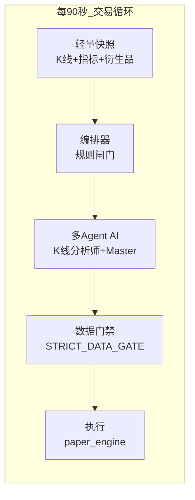

# 全自动交易流程（AI-First）

> 目标：把 **多 Agent LLM（大脑）** 放在每 90 秒必达的热路径上；把策略维护、V3、模板匹配等 **辅助** 降频到维护循环，避免「健康检查 5–8 分钟 → AI 永远排不到队 → 一天 0 笔」。

---

## 一、为什么旧版「健康检查」这么长？

旧版 `_run_health_check` 是一个 **大包**：维护 + 数据 + 编排 + **三套 tier 各跑一遍完整分析师** + 模板 + V3 + 风控，全部串在一趟里。

| 阶段 | 作用 | 对「是否下单」 |
|------|------|----------------|
| 市场快照（12 币 × 新闻/鲸鱼/情报/长线规划） | 喂 AI / UI | 重要但可 **分级** |
| 多周期编排器 `mt_orchestrator` | 规则约束方向、置信度 | **辅助闸门**，非 LLM |
| short/mid/long **各跑** `run_full_analysis` | 每 tier：K 线 LLM × N + Master | **决定性**（旧版重复 3 次） |
| V3 因子管道、策略模板匹配 | 策略库进化 | **辅助**，可降频 |
| 策略创建/淘汰、子仓对账 | housekeeping | **辅助** |
| Master → `_execute_master_decisions` → paper | **真正成交** | **决定性** |

12 个交易币、三 tier 全开时，仅 LLM 就可能 **36+ 次 K 线分析 + 3 次 Master**，再加重快照，整体 **3–8 分钟**；线程 `join(480s)` 超时后 **末尾 AI 被掐断**，表现为长时间 0 交易。

---

## 二、交易本质（决定性路径）



1. **数据**：`unified_data_pool.capture_snapshot(light_mode=True)` — 有价格、多周期 K 线、指标、资金费率/OI；跳过新闻/鲸鱼/长线规划/情报大 prompt。
2. **编排器（辅）**：`multi_timeframe_orchestrator.evaluate_portfolio` — 无 LLM，给出 `allowed_direction`、推荐 `trade_nature`，Master 必须尊重（`FULLAUTO_ORCHESTRATOR_GATE`）。
3. **AI 大脑（中枢）**：默认 `FULLAUTO_AI_UNIFIED_ANALYSIS=true` → `_run_analyst_system_unified` **一轮** Master 统筹 short/mid/long，而不是三 tier 各跑全套。
4. **门禁**：`data_readiness_gate` — 无真实指标/价格时 **禁止** 规则伪造开仓；LLM 失败 → hold-only。
5. **执行**：`_execute_master_decisions` → `_execute_paper_trade`（**scalp/intraday 新开** 由 `ScalpExecutionLane` 独立负责，Master hard block；见 [`SCALP_EXECUTION_LANE.md`](SCALP_EXECUTION_LANE.md)）。

**Scalp 独立环**（默认 45s，`SCALP_FACTOR_INDEPENDENT_SCHEDULER=true`）：

```
ScalpFactorRouter → ScalpExecutionGate → [FlashVeto 35–44] → paper_engine
                         ↑ 只读 ScalpAdvisoryCache ← OrchBG（start_session 接线）
```


**用户选的 `session.symbols` 才是分析对象**；K 线 LLM 对用户币种 **全量**（`KLINE_ANALYST_MODE=all`），受 `KLINE_LLM_MAX_PER_CYCLE` / `LLM_MAX_CALLS_PER_CYCLE` 预算保护。

---

## 三、辅助做什么？为何以前很复杂？

| 模块 | 用途 | 新调度 |
|------|------|--------|
| V3 因子、策略模板 | 发现/匹配新策略基因 | 仅 **维护循环** |
| 策略自动创建/淘汰 | 策略库生命周期 | 维护循环 |
| 完整快照（新闻/鲸鱼/情报） | 深度研究、UI 概览 | 维护循环或按需 |
| 子仓对账、策略健康修复 | 一致性 | 维护循环 |
| 快评 short/mid 暂停 | 震荡市降噪 | 仍可在 legacy 快评路径 |

辅助 **不直接下单**；不应占用每 90s 必须与 AI 抢时间。

---

## 四、新调度：`FULLAUTO_FLOW_MODE=ai_first`（默认）

```
每 90s tick（running/defensive）:
  └─ _run_trading_cycle()     # 轻快照 → 编排器 → 统一 AI → 执行

每 N tick（默认 N=6，约 9 分钟）:
  └─ _run_maintenance_cycle() # _run_health_check(maintenance_only=True)
                              # 无 AI 下单，只做策略/V3/模板/风控
```

环境变量（`backend/config/settings.py`）：

| 变量 | 默认 | 含义 |
|------|------|------|
| `FULLAUTO_FLOW_MODE` | `ai_first` | `legacy` 恢复旧「每 3 tick 大包健康检查」 |
| `FULLAUTO_MAINTENANCE_EVERY_N_TICKS` | `6` | 维护循环频率 |
| `FULLAUTO_AI_UNIFIED_ANALYSIS` | `true` | 单通道 Master，关闭则三 tier 并行 LLM |
| `STRICT_DATA_GATE` | 见 settings | 无数据禁止开仓 |
| `TRADING_DATA_MODE` | `standard` | 有价格+1h/4h K 线即可交易 |

---

## 五、多 Agent 角色（围绕 AI）

| Agent | 角色 | 输入 |
|-------|------|------|
| KlineAnalyst（按币） | 读 K 线 + 订单流/CVD | 用户 `symbols`、真实 K 线 |
| News / Whale（维护或轻量） | 宏观情绪 | 维护周期完整快照 |
| MasterController | **合成决策** short/mid/long | 各分析师输出 + 编排器 + 持仓 |
| 编排器 | **硬/软闸门** | 指标、多周期结构（非 LLM） |

**Master 是中枢**；编排器与数据门禁是护栏，不是第二套「假大脑」。

---

## 六、与旧行为对比

| 项目 | 旧 legacy | ai_first |
|------|-----------|----------|
| 每 90s 能否跑到 AI | 仅 tick%3 完整 HC，且常超时 | **每 tick 必跑** |
| LLM 次数/周期 | 最多 3× 全套 | **1×** 统一分析 |
| 快照重量 | 每轮全量 | 交易 **light**；维护全量 |
| 市场概览「缓存未就绪」 | HC 开头写空缓存 | 交易结束才写 `last_market_summary` |

---

## 七、运维验证清单

1. 日志出现：`tick#N 🧠交易循环`、`交易循环完成 … 耗时=XXs`。
2. 约每 9 分钟：`🔧维护循环`、`维护巡检开始`（且无重复「步骤5 分析师」）。
3. `ai_decision` / `master_decision` 事件与 paper 成交在 **90s 量级** 内可关联。
4. UI 市场概览：有价格行，而非长期 `市场扫描缓存未就绪`。

回退 legacy：`FULLAUTO_FLOW_MODE=legacy`。

---

## 八、相关代码入口

- 调度：`full_auto_trading_service._run_unified_loop`
- 交易热路径：`_run_trading_cycle` → `_run_analyst_system` → `_run_analyst_system_unified`
- 维护：`_run_maintenance_cycle` → `_run_health_check(maintenance_only=True)`
- 数据：`unified_data_pool.capture_snapshot(light_mode=…)`
- 门禁：`services/data_readiness_gate.py`
