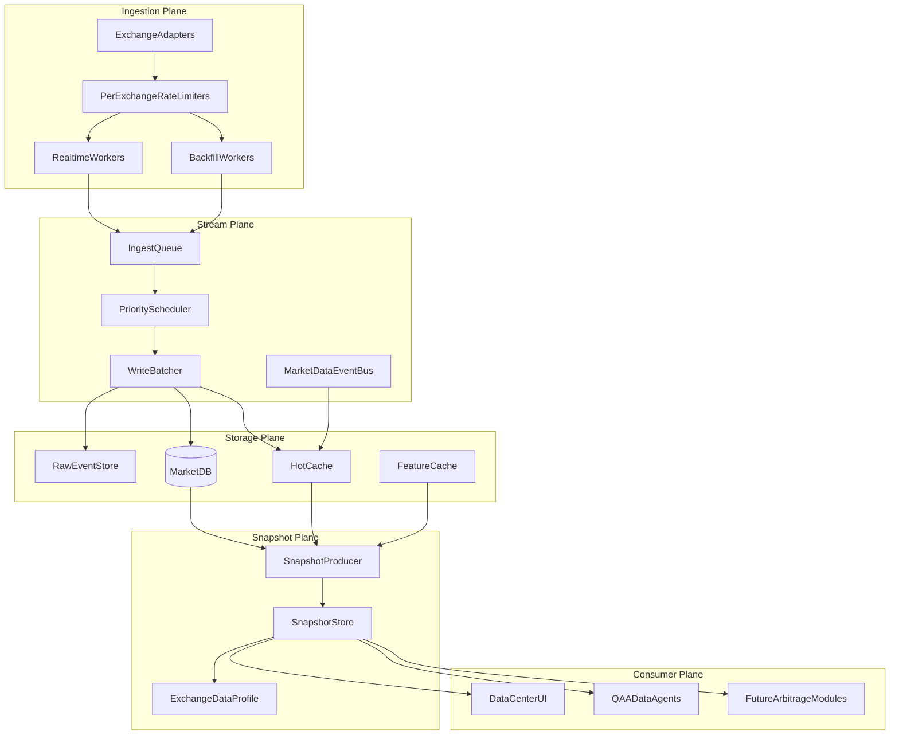

# 多交易所高吞吐数据底座设计文档

## 1. 背景与目标

当前系统已经具备 K线采集、历史同步、统一数据池、数据中心页面和 QAA/FullAuto 消费链路，但整体仍偏单交易所、单进程、低并发、重快照模型。后续如果要支持多个交易所、多个账户、几十到上百个交易对，以及跨交易所套利所需的数据，必须先把数据底座做稳。

本阶段目标不是做交易策略，也不是限制交易执行，而是先把各交易所数据建立起来：

- 多交易所：Aster、Hyperliquid、Binance、OKX 等都作为一等数据源。
- 多数据类型：K线、ticker、盘口、成交、资金费率、未平仓量、账户快照、活动/积分数据。
- 高吞吐：实时数据优先，历史补数不得拖慢实时数据。
- 标准化：用统一结构表达不同交易所的 symbol、合约、精度、报价币和周期。
- 可观测：能看到每个交易所、每条队列、每种数据的延迟、错误率、覆盖率和积压。
- 可接入 QAA：QAA 后续只消费标准化快照，不直接拉交易所 API。

## 2. 当前系统现状

### 2.1 现有关键模块

- `backend/services/kline_history_sync.py`  
  当前数据中心历史同步核心。问题是按 `symbol × period` 串行补数，吞吐不足。

- `backend/services/kline_realtime_collector.py`  
  当前分钟级实时 K线采集。问题是并发较低，且 REST 轮询会随交易对数量线性增长。

- `backend/services/kline_data_service.py`  
  K线统一服务层，负责读写 `crypto_klines`。已有交易所字段，但读写路径仍偏单交易所。

- `backend/services/unified_data_pool.py`  
  当前统一数据池，`UnifiedSnapshot` 是好的数据契约，但 `capture_snapshot()` 太重，不适合在策略 tick 内同步执行。

- `backend/services/exchange_config.py`  
  当前全局单交易所配置，未来需要改成按账户、交易所、交易对、市场类型路由。

- `frontend/app/components/data-center/DataCenterView.tsx`  
  当前数据中心 UI。需要升级成多交易所数据总控台。

### 2.2 当前主要瓶颈

- 历史同步串行，多个交易对和周期时补数很慢。
- 数据库写入按行执行，批量写入能力不足。
- 实时采集并发低，交易对一多会挤压分钟级采集窗口。
- 缓存和快照 key 还没有完整使用 `exchange` 维度。
- `capture_snapshot()` 混合了行情、K线、指标、新闻、鲸鱼、策略分析等重任务。
- QAA 部分路径仍会绕过统一数据池直接读 DB。
- 缺少队列、背压、重放、数据质量评分和压测指标。

### 2.3 当前数据链路

#### 历史 K线同步链路

```text
DataCenterView
  -> POST /api/klines/history-sync/start
  -> kline_history_sync.start_sync()
  -> 生成 symbol × period 子任务
  -> _run_sync() 串行执行
  -> _fetch_klines_from_exchange()
  -> _insert_klines_batch()
  -> crypto_klines
```

现状问题：

- `_run_sync()` 逐个子任务执行，没有 worker 池。
- `_insert_klines_batch()` 名义上是 batch，实际仍然逐条 `execute`。
- `get_active_exchange()` 让同步过程绑定全局交易所。
- 当前进度结构只能表达一个全局同步任务，不适合多交易所并行补数。

#### 实时 K线采集链路

```text
backend startup
  -> kline_realtime_collector.start()
  -> 每分钟 _collect_current_minute()
  -> symbols × periods_now
  -> asyncio.Semaphore(3)
  -> kline_service.collect_current_kline()
  -> crypto_klines
  -> kline_cache.invalidate_cascade()
  -> klines_ws_publisher.broadcast_after_collection()
```

现状问题：

- 并发上限固定为 `3`，交易对数量增大后会排队。
- 采集粒度主要围绕 K线，ticker、盘口、成交流、资金费率等还没有进入统一高吞吐链路。
- 缓存失效 key 仍偏 `symbol + period`，多交易所后会冲突。

#### 统一数据池链路

```text
FullAuto / QAA / AI
  -> UnifiedDataPool.capture_snapshot()
  -> _capture_market_data()
  -> _capture_klines()
  -> _capture_indicators()
  -> _capture_strategy_analysis()
  -> news / whale / derivatives / intelligence
  -> _current_snapshot
```

现状问题：

- 一个 `capture_snapshot()` 承担太多职责。
- K线、指标、新闻、鲸鱼、策略分析混在同步调用里。
- QAA tick 如果同步依赖它，容易被外部 I/O 或 DB 查询拖慢。
- 当前 snapshot key 主要围绕 symbol，不足以表达多交易所、多账户、多市场类型。

#### 前端数据中心链路

```text
DataCenterView
  -> /api/klines/history-sync/progress
  -> /api/klines/history-sync/data-summary
  -> /api/klines/history-sync/check-symbol
```

现状问题：

- 主要展示历史 K线同步，不是完整数据底座控制台。
- 缺少交易所维度的队列、吞吐、延迟、错误率、缓存命中率。
- 缺少盘口、成交流、资金费率、账户和活动数据状态。

### 2.4 现有系统不能破坏的接口

迁移期间必须保持以下接口稳定：

- `/api/market/kline-with-indicators/{symbol}`
- `/api/klines/health/{symbol}`
- `/api/klines/history-sync/progress`
- `/api/klines/history-sync/data-summary`
- `kline_data_service.get_klines_from_db()`
- `UnifiedDataPool.get_snapshot()`
- `FullAutoTradingService._last_unified_snapshot`

新架构必须先旁路写入和并行展示，不能直接替换这些入口。

## 3. 目标架构



核心思想：

- 采集层只负责高吞吐获取数据。
- 写入层只负责可靠落库和缓存更新。
- 快照层只负责把数据拼成统一视图。
- QAA、数据中心、未来套利模块只读快照，不直接调交易所。

### 3.1 模块职责

| 模块 | 职责 | 不负责 |
| --- | --- | --- |
| `ExchangeAdapter` | 封装交易所 API、WebSocket、限频、symbol 元数据 | 不写 DB，不做策略判断 |
| `PerExchangeRateLimiter` | 按交易所、接口类型控制请求速率 | 不决定业务优先级 |
| `RealtimeWorker` | 拉取 P0 实时数据 | 不做历史补数 |
| `BackfillWorker` | 拉取 P1/P2 缺口和历史数据 | 不影响 P0 实时数据 |
| `IngestQueue` | 接收标准化采集任务 | 不直接写 DB |
| `PriorityScheduler` | 按 P0/P1/P2、exchange、data_type 调度任务 | 不拉交易所 API |
| `WriteBatcher` | 批量 upsert、raw event、缓存失效 | 不做指标计算 |
| `MarketDB` | 可靠存储标准化数据 | 不承载热路径查询压力 |
| `HotCache` | 承载最近数据的低延迟读取 | 不作为唯一事实来源 |
| `SnapshotProducer` | 后台构建标准化快照 | 不调用重型 LLM 或策略决策 |
| `SnapshotStore` | 提供最近有效快照 | 不主动采集数据 |
| `ExchangeDataProfile` | 计算数据延迟、覆盖率、错误率 | 不阻止交易，只提供状态 |
| `DataCenterUI` | 展示数据底座运行状态 | 不直接操作底层 DB |
| `QAADataAgents` | 从 SnapshotStore 读取数据 | 不直接调交易所 API |

### 3.2 端到端数据流

#### 实时行情流

```text
Exchange WebSocket / REST
  -> ExchangeAdapter
  -> PerExchangeRateLimiter
  -> RealtimeWorker
  -> IngestQueue(P0)
  -> PriorityScheduler
  -> WriteBatcher
  -> HotCache + MarketDB + RawEventStore
  -> SnapshotProducer
  -> SnapshotStore
  -> DataCenter / QAADataAgents
```

#### 历史补数流

```text
DataCenter / GapDetector
  -> BackfillTask
  -> BackfillWorker
  -> IngestQueue(P1/P2)
  -> PriorityScheduler
  -> WriteBatcher
  -> RawEventStore + MarketDB
  -> DataQualityRecompute
  -> ExchangeDataProfile
```

#### 账户与活动数据流

```text
AccountWorker / ActivityWorker
  -> ExchangeAdapter
  -> IngestQueue(P0/P1)
  -> WriteBatcher
  -> account_snapshots / exchange_activity_snapshots
  -> SnapshotProducer
  -> AccountSnapshot / ActivitySnapshot
```

### 3.3 关键边界

- 交易所 SDK 只允许出现在 Adapter 内部。
- 采集 worker 不能直接写业务表，必须通过队列和 WriteBatcher。
- QAA 不能直接调用 Adapter。
- 数据中心不能绕过 API 直接读 DB。
- SnapshotProducer 只能读缓存和存储，不承担补数。
- 历史补数失败不能阻塞实时行情。

## 4. 核心数据维度

所有数据必须围绕以下维度组织：

```text
exchange
account_id
market_type
symbol
exchange_symbol
timeframe
data_type
timestamp
```

说明：

- `exchange`：交易所，例如 `aster`、`hyperliquid`、`binance`、`okx`。
- `account_id`：账户维度。公开行情可为空，账户数据必须有。
- `market_type`：`spot`、`perp`、`futures`、`options`。
- `symbol`：内部统一 symbol，例如 `BTC`。
- `exchange_symbol`：交易所原始 symbol，例如不同交易所可能是 `BTCUSDT`、`BTC/USDC:USDC`。
- `timeframe`：K线周期，例如 `1m`、`5m`、`30m`、`1h`。
- `data_type`：`ticker`、`orderbook`、`trade`、`kline`、`funding`、`open_interest`、`account`、`activity`。
- `timestamp`：交易所事件时间或 K线时间。

## 5. SymbolRegistry 设计

现有系统大量地方只用 `symbol`，未来跨交易所会出错。必须引入 `SymbolRegistry`。

### 5.1 职责

- 维护内部 symbol 和交易所 symbol 的映射。
- 维护交易所支持的市场类型。
- 维护价格精度、数量精度、最小下单量、合约面值。
- 维护可比较资产组，用于后续跨交易所价差和资金费率比较。

### 5.2 草案结构

```text
symbol_registry
- id
- exchange
- market_type
- base_symbol
- quote_asset
- exchange_symbol
- contract_size
- price_tick
- qty_step
- min_notional
- active
- updated_at
```

### 5.3 与现有系统结合

第一阶段不要删除现有 symbol 逻辑。做兼容层：

- 原有 `BTC` 继续可用。
- 新增 `resolve_symbol(exchange, symbol, market_type)`。
- 如果没有注册映射，先走现有逻辑作为 fallback。
- 数据中心显示缺失映射，提示补齐。

## 6. ExchangeAdapter 设计

每个交易所都实现统一 Adapter，不再让业务代码直接调用交易所 SDK。

### 6.1 标准接口

```text
fetch_ohlcv(symbol, timeframe, since, limit)
watch_ohlcv(symbols, timeframes)
fetch_ticker(symbol)
watch_ticker(symbols)
fetch_orderbook(symbol, depth)
watch_orderbook(symbols, depth)
fetch_trades(symbol, since, limit)
watch_trades(symbols)
fetch_funding_rate(symbol)
fetch_open_interest(symbol)
fetch_account_snapshot(account_id)
fetch_activity_snapshot(account_id)
```

### 6.2 Adapter 元数据

每个 Adapter 必须提供：

- REST 限频。
- WebSocket 限频。
- 单次历史 K线最大数量。
- 是否支持 WebSocket K线。
- 是否支持盘口流。
- 是否支持成交流。
- 是否支持资金费率和未平仓量。
- 是否支持活动/积分数据。

### 6.3 与现有系统结合

现有 Hyperliquid 逻辑先包装成 `HyperliquidAdapter`：

- 不先删除 `hyperliquid_market_data.py`。
- Adapter 内部复用现有 client。
- `kline_data_service.py` 逐步从 `ExchangeDataSourceFactory` 迁移到 AdapterRegistry。
- 迁移期保留旧接口，避免 K线页面和 FullAuto 断掉。

## 7. 采集层设计

### 7.1 数据优先级

```text
P0 实时核心数据
- ticker
- orderbook top depth
- trades
- current kline
- funding latest

P1 近端补偿数据
- 近 1-24 小时缺口
- WebSocket 断线后的补偿
- 当前交易对新增周期补齐

P2 历史补数数据
- 30-365 天历史 K线
- 低频周期
- 非核心交易对
```

规则：

- P0 永远优先。
- P2 不允许拖慢 P0。
- 当交易所限频或 DB 慢写入时，先暂停 P2。
- orderbook 可降采样，K线不能丢。

### 7.2 Worker 分层

- `RealtimeWorker`：负责 P0 数据。
- `NearGapWorker`：负责 P1 缺口补偿。
- `BackfillWorker`：负责 P2 历史补数。
- `AccountWorker`：负责账户、余额、持仓、订单快照。
- `ActivityWorker`：负责积分、活动、交易量任务。

### 7.3 与现有系统结合

现有 `kline_realtime_collector.py` 不直接废弃。迁移方式：

1. 保留当前 collector，作为 Hyperliquid K线 fallback。
2. 新建高吞吐采集模块，但先只写旁路数据。
3. 对比新旧采集的 K线时间戳、价格、数量。
4. 数据一致后，K线页面和数据中心切换到新读路径。
5. 最后再降低旧 collector 权重。

## 8. 队列与背压设计

### 8.1 队列分桶

队列按交易所和数据类型拆分：

```text
queue:aster:ticker
queue:aster:kline
queue:aster:orderbook
queue:hyperliquid:kline
queue:binance:trades
queue:okx:funding
```

每条队列需要记录：

- 积压长度。
- 最老任务等待时间。
- 近 1 分钟成功数。
- 近 1 分钟失败数。
- 平均处理耗时。
- p95 处理耗时。

### 8.2 幂等任务 key

```text
exchange + market_type + symbol + timeframe + data_type + timestamp
```

相同 key 不重复入队或重复写入。

### 8.3 背压动作

当系统压力升高：

- 暂停 P2 历史补数。
- 降低非核心交易对采集频率。
- orderbook 从全量深度降为 top depth。
- trades 从原始成交降为分钟聚合。
- SnapshotProducer 降低非核心 symbol 刷新频率。

## 9. 写入层设计

### 9.1 写入原则

- 所有写入必须幂等。
- 所有批次必须可重试。
- 先保存 raw event，再写 normalized table。
- 写入失败不能影响实时采集，只进入重试队列。

### 9.2 标准表草案

#### raw_market_events

用于重放和审计。

```text
id
exchange
market_type
symbol
exchange_symbol
data_type
event_time
payload_json
ingested_at
event_hash
status
```

#### normalized_klines

可以先沿用现有 `crypto_klines`，后续再升级：

当前已有字段：

```text
exchange
symbol
market
period
timestamp
environment
open_price
high_price
low_price
close_price
volume
```

建议新增或映射：

```text
market_type
exchange_symbol
quote_asset
source
ingested_at
updated_at
```

#### normalized_tickers

```text
exchange
market_type
symbol
exchange_symbol
price
bid
ask
volume_24h
event_time
ingested_at
```

#### normalized_orderbook_snapshots

```text
exchange
market_type
symbol
exchange_symbol
depth
bids_json
asks_json
spread
mid_price
event_time
ingested_at
```

#### normalized_trades_agg

```text
exchange
market_type
symbol
exchange_symbol
bucket_time
buy_volume
sell_volume
trade_count
vwap
```

#### normalized_funding_open_interest

```text
exchange
market_type
symbol
exchange_symbol
funding_rate
next_funding_time
open_interest
event_time
ingested_at
```

#### account_snapshots

```text
exchange
account_id
equity
available_balance
positions_json
orders_json
fee_tier
event_time
ingested_at
```

#### exchange_activity_snapshots

```text
exchange
account_id
campaign_id
points
volume
rank
rules_json
event_time
ingested_at
```

### 9.3 与现有系统结合

不建议第一步就迁移所有表。执行顺序：

1. 继续写 `crypto_klines`，但补齐 exchange 维度使用。
2. 新增 raw event 表，先只记录高吞吐采集数据。
3. 新增 ticker/orderbook/trade/funding/account/activity 标准表。
4. 数据中心优先读取标准表。
5. QAA 仍读旧 `UnifiedDataPool`，等 SnapshotStore 稳定后再切。

## 10. 缓存设计

### 10.1 缓存 key

所有缓存 key 必须带 exchange：

```text
market:{exchange}:{market_type}:{symbol}:ticker
kline:{exchange}:{market_type}:{symbol}:{timeframe}
orderbook:{exchange}:{market_type}:{symbol}:{depth}
funding:{exchange}:{market_type}:{symbol}
account:{exchange}:{account_id}
activity:{exchange}:{account_id}
```

### 10.2 缓存层级

- L1：进程内缓存，极短 TTL。
- L2：Redis 或可替代热缓存，用于多进程共享。
- L3：MarketDB，作为可靠存储。

当前可以先不用 Redis，但设计上要预留。

## 11. Snapshot 设计

### 11.1 分级快照

#### MarketHotSnapshot

秒级刷新：

```text
exchange
symbol
price
bid
ask
spread
volume_24h
orderbook_summary
last_trade
as_of
```

#### KlineSnapshot

分钟级刷新：

```text
exchange
symbol
timeframe
bars
indicators
coverage
freshness
as_of
```

#### AccountSnapshot

按账户刷新：

```text
exchange
account_id
equity
balances
positions
orders
fee_tier
as_of
```

#### ExchangeDataProfile

数据画像：

```text
exchange
api_latency_p95
ws_connected
rate_limit_remaining
kline_coverage
orderbook_freshness
trades_freshness
funding_freshness
account_freshness
error_rate
as_of
```

#### CrossExchangeDataView

后续套利使用：

```text
base_symbol
market_type
exchanges
prices
spreads
depths
funding_rates
data_freshness
as_of
```

### 11.2 与现有 UnifiedDataPool 结合

现有 `UnifiedDataPool` 不应立刻删除。迁移方式：

1. 新增 `SnapshotProducer` 和 `SnapshotStore`。
2. `UnifiedDataPool.get_snapshot()` 优先读 `SnapshotStore`，读不到再走旧 `_current_snapshot`。
3. `capture_snapshot()` 保留，但逐渐降级为兼容入口。
4. QAA v3 的 `data_source` Agent 改为读 `SnapshotStore`。
5. FullAuto 原有 `_last_unified_snapshot` 继续保留一段时间，防止回滚困难。

## 12. QAA 结合方式

当前阶段只定义数据消费边界，不做交易裁决。

### 12.1 QAA 数据 Agent

- `exchange_data`：读取行情、盘口、K线、资金费率、OI。
- `account_data`：读取账户快照、余额、持仓、订单。
- `activity_data`：读取积分、活动、交易量任务。
- `spread_data`：读取跨交易所标准化价差、深度和资金费率差。

### 12.2 QAA 不再直接拉交易所 API

原则：

- Agent 不直接调用 Adapter。
- Agent 不直接访问交易所 SDK。
- Agent 不执行历史补数。
- Agent 只读 SnapshotStore 或 DataHub。

这样 QAA 卡住时不会拖慢采集层；采集层拥堵时也不会直接阻塞 QAA。

### 12.3 QAA v3 适配步骤

QAA v3 应按以下顺序适配，避免直接改动交易主循环：

#### 第一步：新增 SnapshotReader 适配器

新增只读接口：

```text
SnapshotReader.get_market_hot(exchange, symbols)
SnapshotReader.get_klines(exchange, symbols, timeframes)
SnapshotReader.get_account(exchange, account_id)
SnapshotReader.get_data_profile(exchange)
SnapshotReader.get_cross_exchange_view(symbols)
```

该接口内部优先读 `SnapshotStore`，失败时 fallback 到现有 `UnifiedDataPool.get_snapshot()` 或 DB 读路径。

#### 第二步：改造 `data_source` Agent

QAA v3 的 `data_source` Agent 不再触发采集，不再调用交易所 API：

```text
QAA data_source
  -> SnapshotReader
  -> SnapshotStore
  -> fallback UnifiedDataPool / DB
```

返回结构必须包含：

```text
snapshot_id
as_of
exchange
symbols
market_hot
klines
data_profile
completeness
```

#### 第三步：改造 `factor_engine`

当前部分因子可能绕过统一池直读 DB。迁移后：

- 优先读 `KlineSnapshot.indicators`。
- 缺指标时只读标准化 K线计算。
- 不允许因子计算触发历史补数。
- 输出必须带 `source_snapshot_id`。

#### 第四步：改造 `master_controller` 输入

`master_controller` 不直接处理底层表和交易所字段，只消费压缩后的视图：

```text
SymbolMarketView
- exchange
- symbol
- price
- spread
- liquidity_summary
- kline_summary
- funding_summary
- data_quality
- as_of
```

这样未来接入跨交易所套利时，只需要新增 `CrossExchangeDataView`，不用改 Master 的底层数据访问。

#### 第五步：记录数据版本

所有 QAA 输出和 AI 决策日志应记录：

```text
snapshot_id
snapshot_as_of
data_profile_version
exchange_set
symbol_set
```

这样之后排查“AI 为什么这么判断”时，可以回放当时的数据版本。

### 12.4 QAA 回滚策略

QAA 数据读取必须支持三级 fallback：

```text
SnapshotStore
  -> UnifiedDataPool._current_snapshot
  -> legacy DB/API read path
```

如果 `SnapshotStore` 缺失或过旧：

- QAA 不阻塞采集层。
- data_source 返回 `degraded` 数据质量。
- 决策日志记录 fallback 来源。
- 系统可以继续使用旧路径，避免迁移期间策略中断。

## 13. 数据中心 UI 设计

数据中心应从“历史同步页面”升级为“多交易所数据控制台”。

### 13.1 首页视图

显示：

- 每个交易所当前状态。
- ticker 延迟。
- K线覆盖率。
- 盘口延迟。
- 成交流延迟。
- 资金费率更新时间。
- 账户数据更新时间。
- 队列积压。
- DB 写入耗时。
- Snapshot 年龄。

### 13.2 交易所详情

显示：

- API 成功率。
- REST p95 延迟。
- WebSocket 连接状态。
- 限频余量。
- 每类数据的最新时间。
- 每个 symbol 的覆盖率。
- 错误日志摘要。

### 13.3 队列详情

显示：

- P0/P1/P2 队列长度。
- 最老任务等待时间。
- 最近失败任务。
- 当前背压动作。

### 13.4 数据质量详情

显示：

- freshness。
- coverage。
- gap_count。
- outlier_count。
- source_reliability。
- normalization_status。

## 14. 可观测指标

必须采集这些指标：

```text
ingest_api_requests_total
ingest_api_errors_total
ingest_api_latency_p95
ingest_queue_depth
ingest_queue_oldest_age_seconds
db_write_rows_per_second
db_write_batch_latency_p95
snapshot_build_latency_p95
snapshot_age_seconds
cache_hit_rate
kline_coverage_percent
orderbook_freshness_seconds
trades_freshness_seconds
funding_freshness_seconds
account_freshness_seconds
```

第一阶段可以先写入日志和数据中心页面，不要求马上接 Prometheus。

## 15. 与现有系统结合不出错的迁移策略

### 15.1 总体原则

- 不一次性替换现有链路。
- 新链路先旁路采集，和旧链路对比。
- 每个阶段都保留回滚点。
- UI 先展示新数据，不立即让交易逻辑依赖新数据。
- QAA 最后切换到新 SnapshotStore。

### 15.2 兼容层

保留这些旧入口：

- `kline_data_service.get_klines_from_db()`
- `/api/market/kline-with-indicators`
- `/api/klines/health/{symbol}`
- `UnifiedDataPool.get_snapshot()`
- `FullAutoTradingService._last_unified_snapshot`

新增适配层：

```text
LegacyKlineReader -> NewMarketDataStore
UnifiedDataPool.get_snapshot -> SnapshotStore fallback
DataCenterView -> 新旧数据并行显示
```

### 15.3 特性开关

建议设计这些开关：

```text
MARKET_DATA_V2_ENABLED=false
MARKET_DATA_V2_WRITE_SHADOW=true
MARKET_DATA_V2_READ_PRIMARY=false
SNAPSHOT_STORE_ENABLED=false
QAA_READ_SNAPSHOT_STORE=false
DATA_CENTER_V2_ENABLED=false
```

默认：

- 可以写新链路。
- 不默认读新链路。
- 确认一致后逐步切读。

### 15.4 灰度步骤

#### Step 1：旁路写入

新采集器写 raw event 和新标准表，旧系统继续运行。

验收：

- 不影响 K线页面。
- 不影响 FullAuto。
- 新旧 K线同一时间戳 OHLCV 一致率大于 99.9%。

#### Step 2：数据中心读取新链路

数据中心新增 V2 标签页读取新标准表。

验收：

- 能看到 exchange 维度。
- 能看到队列和写入吞吐。
- 能看到数据质量评分。

#### Step 3：K线页面可选读取新链路

K线页面增加只读开关，允许从新链路读取。

验收：

- 图表正常。
- 指标正常。
- 健康状态正常。

#### Step 4：SnapshotStore 后台运行

SnapshotProducer 生成快照，但 QAA 暂不依赖。

验收：

- 快照年龄小于目标。
- 构建失败可恢复。
- 快照数据可追踪到原始数据。

#### Step 5：QAA 只读切换

QAA `data_source` Agent 改为优先读 SnapshotStore，失败回退旧 UnifiedDataPool。

验收：

- QAA tick 不因快照构建而卡住。
- 旧路径可随时回退。
- 决策日志能显示数据版本。

## 16. 实施阶段

### Phase 0：设计文档

输出本文档，并评审数据模型、队列、快照和迁移策略。

### Phase 0.5：现有基线测量

先测当前系统：

- 实时采集每分钟任务数。
- 实时采集成功率。
- 单批历史同步耗时。
- DB 写入 TPS。
- K线接口读取耗时。
- 数据中心接口耗时。
- UnifiedDataPool 快照构建耗时。

基线工具：

```bash
backend/.venv/bin/python backend/scripts/market_data_baseline.py \
  --symbols BTC,ETH,SOL,BNB \
  --periods 1m,5m,15m,30m,1h,4h,1d \
  --kline-count 100
```

默认行为是只读，不修改业务数据。它会测量：

- `/api/klines/history-sync/progress`
- `/api/klines/history-sync/data-summary`
- `/api/klines/health/{symbol}`
- `/api/market/kline-with-indicators/{symbol}`
- `crypto_klines` 总量、分交易所总量、指定 symbol/period 最新时间
- `UnifiedDataPool.get_snapshot()` 读取耗时

可选写入探针默认关闭。如需在隔离临时表里估算 DB 写入能力：

```bash
backend/.venv/bin/python backend/scripts/market_data_baseline.py \
  --symbols BTC \
  --periods 1m \
  --include-write-probe \
  --write-probe-rows 1000
```

可将结果保存为 JSON：

```bash
backend/.venv/bin/python backend/scripts/market_data_baseline.py \
  --symbols BTC,ETH \
  --periods 1m,30m \
  --output /tmp/market-data-baseline.json
```

当前完成度：

- 已完成：设计文档。
- 已完成：只读基线测量脚本 `backend/scripts/market_data_baseline.py`。
- 已完成：基线脚本覆盖 K线接口、数据中心 summary/health、DB 查询、UnifiedDataPool 快照读取。
- 已完成：新增基础吞吐指标服务 `backend/services/market_data_metrics.py`。
- 已完成：`/api/klines/metrics` 可读取当前进程内的 K线链路指标。
- 已接入：`/api/klines/history-sync/data-summary`、`/api/klines/health/{symbol}`、`/api/market/kline-with-indicators/{symbol}` 的耗时和成功率统计。
- 已完成：数据中心前端展示基础吞吐指标，接口未加载时会给出后端需重启提示。
- 已完成：K线缓存 key 增加 exchange 维度，主 K线读取链路和实时采集失效链路已接入。
- 已完成：新增 `backend/services/market_data_write_batcher.py`，历史同步可通过 `MARKET_DATA_BATCH_WRITE_ENABLED=true` 切换到批量写入，默认关闭可回滚。
- 已完成：历史同步 worker 队列已接入 `MARKET_DATA_QUEUE_ENABLED=true` 灰度开关，默认关闭仍走旧串行同步。
- 部分完成：K线健康检查核心周期已补齐到 `1m/5m/15m/30m/1h/4h/1d`，但运行中服务需要重启后才会体现最新代码。
- 已完成：Phase 2 旁路基础骨架，包含 `SymbolRegistry`、`ExchangeAdapterRegistry`、`RawMarketEventStore`、`MarketDataIngestQueue`。
- 已完成：新增 `/api/market-data-v2/status`、`/api/market-data-v2/symbols/{exchange}`、`/api/market-data-v2/raw-summary`、`/api/market-data-v2/shadow-ingest`。
- 已完成：`MARKET_DATA_V2_ENABLED=false` 默认关闭，新链路不会替换旧 K线页面、旧数据中心、FullAuto。
- 已完成：新增 `/api/market-data-v2/shadow-compare`，可只读计算 raw event 与旧 `crypto_klines` 的 OHLCV 一致率。
- 已完成：新增 `MarketDataV2Scheduler` 和 `/api/market-data-v2/scheduler/*`，默认 `MARKET_DATA_V2_SCHEDULER_ENABLED=false`，不会自动启动。
- 已完成：Phase 3 多交易所数据画像服务 `ExchangeDataProfileService`。
- 已完成：新增 `/api/market-data-v2/exchange-profiles`，汇总旧 K线、raw event、队列、吞吐指标。
- 已完成：数据中心展示多交易所数据画像、V2 队列、raw event 总量和交易所延迟状态。
- 已完成：Phase 4 SnapshotStore 骨架，包含 `snapshot_models.py`、`snapshot_store.py`、`snapshot_producer.py`、`snapshot_reader.py`。
- 已完成：新增 `/api/market-data-v2/snapshot/status`、`/api/market-data-v2/snapshot/latest`、`/api/market-data-v2/snapshot/capture`。
- 已完成：`SNAPSHOT_STORE_ENABLED=false` 默认关闭，Snapshot 不会自动接管 `UnifiedDataPool` 或 QAA。
- 已完成：新增 `qaa_snapshot_bridge.py`，提供 `QAA_READ_SNAPSHOT_STORE=true` 灰度读取入口，默认关闭，不替换 QAA 主链路。
- 已完成：`UnifiedDataPool.get_snapshot()` 支持 `UNIFIED_DATA_POOL_READ_SNAPSHOT_STORE=true` / `QAA_READ_SNAPSHOT_STORE=true` 灰度读取 SnapshotStore，并自动适配为旧 `UnifiedSnapshot` 结构。
- 已验证：开关关闭时旧行为不变；打开后能读取 SnapshotStore 的 K线和市场快照。
- 未完成：生产环境开启 QAA SnapshotStore 主读；此项需要先采集足够 raw/snapshot 数据并观察一致率。
- 已完成：新增 `backend/scripts/market_data_v2_shadow_probe.py`，用于一次性旁路采集、raw event 写入、Snapshot 捕获和一致率对比。
- 已完成：新增 `backend/scripts/kline_quality_repair.py`，默认 dry-run，只对已收盘 K线做缺行/错行检测；加 `--apply` 才会把交易所历史最终 K线回写到 `crypto_klines`。
- 根因定位：旧 K线写入使用 `ON CONFLICT DO NOTHING`，如果实时采集第一次写入的是未收盘 K线，后续历史最终 K线不会覆盖旧行，容易留下 0 volume、缺行、OHLC 不一致。
- 已修正：`MarketDataShadowCompare` 默认只比较稳定 K线；同一 `event_ts` 多个 raw payload 时选择最新 raw 事件；missing row 计入一致率分母；volume 对比使用 0.01 容差，以匹配旧表 `DECIMAL(18,2)` 精度。
- 已修正：质量修复脚本支持 `--symbols BTC,ETH,SOL --periods 1m,5m` 批量模式，默认 `settle_seconds=3600`，跳过最近 1 小时，避免交易所刚闭合 K线的二次修订和 1m 边界推进干扰质量评分。
- 已修正：`MarketDataShadowCompare` 默认 `settle_seconds=4500`，比质量修复窗口多 15 分钟缓冲，避免 raw event 每分钟推进时在修复服务追上前产生边界误报警。
- 已完成：新增 `KlineQualityRepairService`，提供默认关闭的后台稳定 K线修复调度；状态进入 `/api/market-data-v2/status`，专用接口为 `/api/market-data-v2/kline-quality/status`、`/tick-once`、`/start`、`/stop`。
- 灰度开关：`KLINE_QUALITY_REPAIR_ENABLED=true` 才允许后台循环启动；`KLINE_QUALITY_REPAIR_APPLY_ENABLED=true` 才允许后台或 API 真正写库，否则即使请求 `apply=true` 也只会被拦截为 dry-run。当前本机已开启自动 apply，并把 `KLINE_QUALITY_REPAIR_LIMIT` 提到 `240`，保证 `1m` 数据在 1 小时稳定窗口下仍有足够历史可修复。
- 批量修复命令：
  `backend/.venv/bin/python backend/scripts/kline_quality_repair.py --exchange hyperliquid --symbols BTC,ETH,SOL,BNB,XRP,DOGE,ARB,OP,AVAX,LINK --periods 1m,5m,15m,1h --limit 120 --apply`
- 实测结果：Hyperliquid 核心 10 币 `1m/5m/15m/1h` 最近 120 根稳定窗口，首次 dry-run 发现 3385 根缺失/错误；apply 后插入 3001 根、更新 385 根。
- 实测结果：同范围 30 分钟稳定窗口复查，`checks=40`、`closed=4342`、`existing=4342`、`mismatch_count=0`。
- 实测结果：Hyperliquid BTC 稳定窗口内 `1m` shadow compare 为 100%，`5m` shadow compare 为 100%。
- 已完成：`kline_quality_repair.py` 支持 `--exchanges hyperliquid,binance,bybit,okx,gateio` 多交易所批量模式；Hyperliquid 仍走专用稳定 K线入口，其他交易所走 `ExchangeAdapterRegistry.get_klines()`。
- 已完成：`ExchangeAdapterRegistry.close_all()`，批量探测后统一释放 CCXT async client，避免 aiohttp session 泄漏。
- 已完成：单个交易所/币种/周期失败不会中断整批任务；返回 `status=failed` 或 `status=no_data`，聚合结果包含 `failed`、`no_data`。
- 实测结果：当前环境下 `binance/bybit/okx/gateio` 公共 K线探测返回 `no_data`，脚本能完整返回结果且不会影响 Hyperliquid 稳定路径。后续接入时应先解决对应交易所网络/市场类型/symbol 映射，再进入 raw event 和修复流程。
- 已完成：Binance/Aster futures 公共 K线直连兜底，不依赖 CCXT `load_markets`；Binance 尝试 `fapi/fapi1/fapi2/fapi3/fapi4.binance.com`，Aster 使用 `https://fapi.asterdex.com/fapi/v1/klines`。
- 已完成：市场数据 HTTP 代理支持，优先读取 `MARKET_DATA_HTTP_PROXY` / `HTTPS_PROXY` / `HTTP_PROXY` / `ALL_PROXY`；未配置时自动探测本机 `http://127.0.0.1:7897`，用于让后端 Python 走与本机 VPN/代理一致的出口。
- 已完成：`aster` 统一归一化为内部交易所名 `asterdex`，避免 DB/raw event 出现两个交易所名字。
- 实测结果：接入本机 `127.0.0.1:7897` 代理后，Binance futures 和 Aster futures 公共 K线均可拉取。
- 实测结果：已写入 Binance/Aster 首批 `BTC/ETH × 1m/5m/15m/1h` 稳定 K线；首次写入 1736 根，随后补写稳定边界 5 根。
- 实测结果：以 1 小时稳定窗口复查 Binance/Aster `BTC/ETH × 1m/5m/15m/1h`，`checks=16`、`closed=1588`、`existing=1588`、`mismatch_count=0`。
- 实测结果：Binance/Aster 已扩大到核心 10 币 `BTC,ETH,SOL,BNB,XRP,DOGE,ARB,OP,AVAX,LINK × 1m/5m/15m/1h`；首次 dry-run `checks=80`、`failed=0`、`no_data=0`、`closed=8690`、待写入 6972 根。
- 实测结果：核心 10 币 apply 写入 6984 根；随后以 1 小时稳定窗口复查 `checks=80`、`closed=7961`、`existing=7961`、`mismatch_count=0`。
- 实测结果：核心 10 币 raw event 旁路采集已跑通；Binance/Aster 共 20 个 `1m` 组合采集 1600 条 raw event，全部 `completed`。30 分钟窗口会因 1m 边界推进出现单根 `missing_old_kline`，因此默认稳定窗口调整为 1 小时。
- 已完成：新增 `SnapshotScheduler`，通过 `SNAPSHOT_SCHEDULER_ENABLED=true` 定时把新数据底座里的稳定 K线生产成 SnapshotStore 快照，解决“只打开读取开关但内存里没有新快照”的问题。
- 已激活：本机 `.env` 已打开 `MARKET_DATA_V2_ENABLED=true`、`MARKET_DATA_V2_SCHEDULER_ENABLED=true`、`SNAPSHOT_STORE_ENABLED=true`、`SNAPSHOT_SCHEDULER_ENABLED=true`、`UNIFIED_DATA_POOL_READ_SNAPSHOT_STORE=true`、`QAA_READ_SNAPSHOT_STORE=true`。
- 已修正：主读快照不再固定交易所，`SNAPSHOT_PRIMARY_EXCHANGE=account_selected` 会跟随当前运行会话的交易所配置。优先级为 `full_auto_sessions.active_exchange` → paper 模式下 `paper_account.selected_exchange` → 交易员账户 `selected_exchange` → `SNAPSHOT_FALLBACK_EXCHANGE`。
- 已激活：当前运行的 paper 会话 `fa_e55efe8e92` 使用 paper 账户 `测试001`，账户 `selected_exchange=hyperliquid`，因此主读 Snapshot 已切为 `hyperliquid`，覆盖核心 10 币 `1m/5m/15m/1h` 共 40 组 K线。
- 已完成：raw event 旁路和质量修复交易所列表扩展为 `hyperliquid,binance,asterdex`，保证“配置哪个交易所，就维护哪个交易所的数据”，同时保留其他交易所旁路数据用于对比。
- 实测结果：重新捕获 Snapshot 后，`exchange=hyperliquid`、`kline_groups=40`、`empty_groups=0`；Hyperliquid BTC `1m` raw/shadow compare 刷新后 `matched=61/61`、`mismatch=0`。
- 实测结果：最终运行验证中 `hyperliquid/binance/asterdex × BTC/ETH/SOL × 1m` 共 9 个 shadow compare 全部 `status=ok`，默认 75 分钟对比窗口下 `total_compared=413`、`total_matched=413`、`mismatch=0`。
- 灰度回滚：如需立即回退旧读取路径，关闭 `UNIFIED_DATA_POOL_READ_SNAPSHOT_STORE` 和 `QAA_READ_SNAPSHOT_STORE` 即可；如需停止新快照生产，关闭 `SNAPSHOT_SCHEDULER_ENABLED`；如需停止 raw event 旁路，关闭 `MARKET_DATA_V2_SCHEDULER_ENABLED`。
- 实测结果：运行中后端 `/api/market-data-v2/status` 显示 raw event 调度器、Snapshot 调度器、K线质量修复服务均为 `running=true`；Snapshot 最新快照 `kline_groups=40`、`empty_groups=0`；Binance/Aster BTC `1m` shadow compare 均为 `mismatch=0`。
- 已完成：新增 `MarketDataDbOptimizer`，启动时幂等创建热路径索引，并提供 `/api/market-data-v2/db/status`、`/db/ensure-indexes`、`/db/optimize`。
- 已完成：新增/确保高吞吐索引 `idx_crypto_klines_hot_lookup`、`idx_crypto_klines_exchange_period_ts`、`idx_crypto_klines_period_ts`、`idx_raw_market_events_hot_lookup`、`idx_raw_market_events_created_at`。
- 已完成：`raw_market_event_store.append_many()` 从逐条 commit 改为批量 insert + 单次 commit；`market_data_write_batcher` 和 `kline_quality_repair.py` 写库接入 SQLite 写队列提交，降低锁等待风险。
- 实测结果：数据库索引创建和优化执行成功；Hyperliquid `BTC/ETH 5m` 补修后稳定窗口复查 `mismatch_count=0`。
- 结论：Hyperliquid 核心 K线数据已进入可持续修复状态；多交易所接入入口已统一，下一步按交易所逐个完成 Adapter 可用性、raw event 旁路写入、shadow compare、质量修复四步验证。

### Phase 1：低风险吞吐修复

- 历史同步 worker 队列。
- K线批量写入。
- 缓存 key 加 exchange。
- K线健康检查补齐核心周期。
- 增加基础吞吐指标。

### Phase 2：高吞吐采集旁路

- 新增 ExchangeAdapterRegistry。
- 新增 SymbolRegistry。
- 新增 IngestQueue。
- 新增 WriteBatcher。
- 新增 raw event。
- 新旧采集并行对比。

### Phase 3：标准化数据中心

- 新增多交易所数据中心视图。
- 显示 exchange 维度数据画像。
- 显示队列积压和写入吞吐。
- 显示数据质量评分。

### Phase 4：SnapshotStore

- 新增 SnapshotProducer。
- 新增 SnapshotStore。
- 拆分 MarketHotSnapshot、KlineSnapshot、AccountSnapshot、ExchangeDataProfile。
- UnifiedDataPool 兼容读取 SnapshotStore。

### Phase 5：QAA 数据消费切换

- QAA data_source 读 SnapshotStore。
- factor_engine 不再绕过统一池直读 DB。
- 决策日志记录 snapshot_id 和 as_of。

## 16.1 分阶段实施清单

### Phase 0：设计与基线

交付物：

- 本文档。
- 当前系统基线测量脚本或接口。
- 吞吐指标命名规范。

涉及文件：

- `docs/high-throughput-market-data-architecture.md`
- `backend/services/kline_history_sync.py`
- `backend/services/kline_realtime_collector.py`
- `backend/services/unified_data_pool.py`
- `frontend/app/components/data-center/DataCenterView.tsx`

验收：

- 明确当前历史同步耗时、实时采集耗时、DB 写入耗时、K线接口读取耗时。
- 不改动运行链路。

### Phase 1：低风险吞吐修复

交付物：

- 历史同步 worker 队列。
- K线批量写入。
- exchange-aware 缓存 key。
- 数据中心增加基础吞吐指标。

建议新增文件：

```text
backend/services/market_data_metrics.py
backend/services/market_data_write_batcher.py
backend/services/market_data_queue.py
```

建议改造文件：

```text
backend/services/kline_history_sync.py
backend/services/kline_cache_service.py
backend/services/kline_data_service.py
frontend/app/components/data-center/DataCenterView.tsx
```

默认开关：

```text
MARKET_DATA_QUEUE_ENABLED=false
MARKET_DATA_BATCH_WRITE_ENABLED=false
MARKET_DATA_EXCHANGE_AWARE_CACHE=false
```

验收：

- 默认关闭时行为与旧系统一致。
- 打开批量写入后，K线去重键仍正确。
- 历史同步失败不影响实时 K线采集。
- 数据中心能展示写入耗时和同步队列状态。

回滚：

- 关闭 `MARKET_DATA_BATCH_WRITE_ENABLED` 回到旧逐条写入。
- 关闭 `MARKET_DATA_QUEUE_ENABLED` 回到旧串行同步。

### Phase 2：高吞吐采集旁路

交付物：

- `ExchangeAdapterRegistry`。
- `SymbolRegistry`。
- `IngestQueue`。
- `RawEventStore`。
- 新采集链路旁路写入，不替换旧链路。

建议新增文件：

```text
backend/services/market_data_adapters/base.py
backend/services/market_data_adapters/hyperliquid_adapter.py
backend/services/symbol_registry.py
backend/services/market_data_ingest_queue.py
backend/services/raw_market_event_store.py
```

默认开关：

```text
MARKET_DATA_V2_ENABLED=false
MARKET_DATA_V2_WRITE_SHADOW=true
MARKET_DATA_V2_READ_PRIMARY=false
```

验收：

- 新旧链路同一 K线 timestamp 的 OHLCV 一致率大于 99.9%。
- raw event 可查询、可重放。
- 新链路异常不影响旧 K线页面、旧数据中心、FullAuto。

回滚：

- 关闭 `MARKET_DATA_V2_ENABLED`。
- 保留 raw event 表，不影响旧表。

### Phase 3：标准化数据中心

交付物：

- 多交易所数据中心视图。
- ExchangeDataProfile。
- 数据质量评分。
- 队列和写入吞吐展示。

建议新增文件：

```text
backend/services/exchange_data_profile.py
backend/api/market_data_v2_routes.py
frontend/app/components/data-center/ExchangeDataProfilePanel.tsx
frontend/app/components/data-center/MarketDataQueuePanel.tsx
```

默认开关：

```text
DATA_CENTER_V2_ENABLED=false
```

验收：

- 旧数据中心仍可访问。
- 新数据中心能按 exchange 展示数据延迟、覆盖率、队列积压、错误率。
- 新 UI 出错不影响 K线图表和 FullAuto。

回滚：

- 关闭 `DATA_CENTER_V2_ENABLED`。

### Phase 4：SnapshotStore 后台化

交付物：

- SnapshotProducer。
- SnapshotStore。
- 分级 Snapshot。
- UnifiedDataPool 兼容读取 SnapshotStore。

建议新增文件：

```text
backend/services/snapshot_store.py
backend/services/snapshot_producer.py
backend/services/snapshot_models.py
backend/services/snapshot_reader.py
```

建议改造文件：

```text
backend/services/unified_data_pool.py
backend/services/full_auto_trading_service.py
```

默认开关：

```text
SNAPSHOT_STORE_ENABLED=false
UNIFIED_DATA_POOL_READ_SNAPSHOT_STORE=false
```

验收：

- SnapshotProducer 后台运行，不阻塞 API 请求。
- Snapshot 构建失败不会影响旧 `UnifiedDataPool.get_snapshot()`。
- Snapshot 包含 `snapshot_id/as_of/exchange/symbol/data_quality`。
- 数据中心能显示 snapshot 年龄。

回滚：

- 关闭 `UNIFIED_DATA_POOL_READ_SNAPSHOT_STORE`。
- 关闭 `SNAPSHOT_STORE_ENABLED`。

### Phase 5：QAA 数据消费切换

交付物：

- QAA `data_source` Agent 读取 SnapshotReader。
- `factor_engine` 优先读 KlineSnapshot。
- 决策日志记录 snapshot 版本。

建议改造文件：

```text
backend/services/full_auto_trading_service.py
qaa_architecture_package/qaa/domains/trading/plugin.py
qaa_architecture_package/qaa/router/rule_router.py
backend/services/unified_data_pool.py
```

默认开关：

```text
QAA_READ_SNAPSHOT_STORE=false
QAA_SNAPSHOT_FALLBACK_LEGACY=true
```

验收：

- QAA tick 不触发交易所 API。
- QAA tick 不等待 SnapshotProducer 构建。
- SnapshotStore 过旧时自动 fallback。
- AI 决策日志能看到 `snapshot_id` 和 `as_of`。

回滚：

- 关闭 `QAA_READ_SNAPSHOT_STORE`。
- 保留 `QAA_SNAPSHOT_FALLBACK_LEGACY=true`。

## 16.2 不出错的实施顺序

严格按以下顺序执行：

```text
1. 指标与基线
2. 批量写入和队列，但默认关闭
3. 旁路采集和 raw event
4. 数据中心 V2 只读展示
5. SnapshotProducer 后台运行
6. UnifiedDataPool 兼容读取 SnapshotStore
7. QAA data_source 灰度切换
8. 旧链路降权
```

禁止顺序：

- 禁止先让 QAA 依赖新链路。
- 禁止先删除旧 `UnifiedDataPool`。
- 禁止先替换 K线图表接口。
- 禁止让历史补数和实时采集共享无优先级的队列。
- 禁止在没有 raw event 或重试机制前承载大量盘口/成交流。

## 17. 容量目标

### S 档

```text
20 个交易对
2 个交易所
7 个周期
P0 延迟小于 5 秒
K线落库小于 10 秒
Snapshot 年龄小于 10 秒
```

### M 档

```text
50 个交易对
3 个交易所
7 个周期
P0 延迟小于 10 秒
K线落库小于 20 秒
Snapshot 年龄小于 20 秒
P2 历史补数允许降速
```

### L 档

```text
100 个交易对
4 个交易所
7 个周期
P0 延迟压力下小于 15 秒
K线落库压力下小于 30 秒
Snapshot 年龄压力下小于 30 秒
历史补数可排队，不得影响实时数据
```

## 18. 风险与回滚

### 18.1 风险

- 新旧数据不一致。
- 交易所 API 限频导致积压。
- DB 写入变慢。
- 快照构建慢。
- 盘口和成交流数据量膨胀。
- symbol 映射错误导致跨交易所数据不可比。

### 18.2 回滚策略

- 所有新读取路径都要有旧路径 fallback。
- 新采集器初期只旁路写，不替换旧链路。
- SnapshotStore 失败时回退 UnifiedDataPool。
- 数据中心 V2 失败不影响旧数据中心。
- K线页面读取新链路失败时回退 `/api/market/kline-with-indicators`。

## 19. 最终验收标准

文档和后续实现应能回答：

- 每个交易所如何接入。
- 每个交易所支持哪些数据类型。
- 多交易对如何分片采集。
- 历史补数如何不拖慢实时行情。
- 数据如何批量写入且可重试。
- 交易对如何标准化。
- 数据质量如何评分。
- 快照如何后台生产。
- QAA 如何消费数据而不阻塞采集。
- 数据中心如何看到吞吐瓶颈。
- 系统如何从旧链路安全迁移到新链路。

