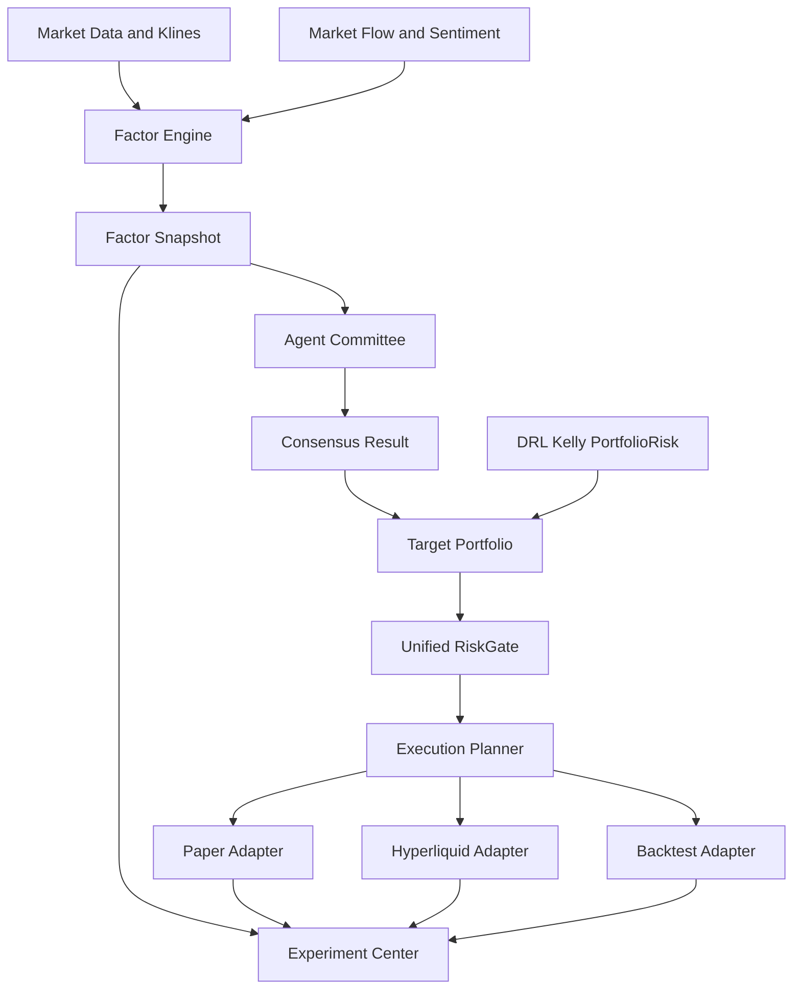
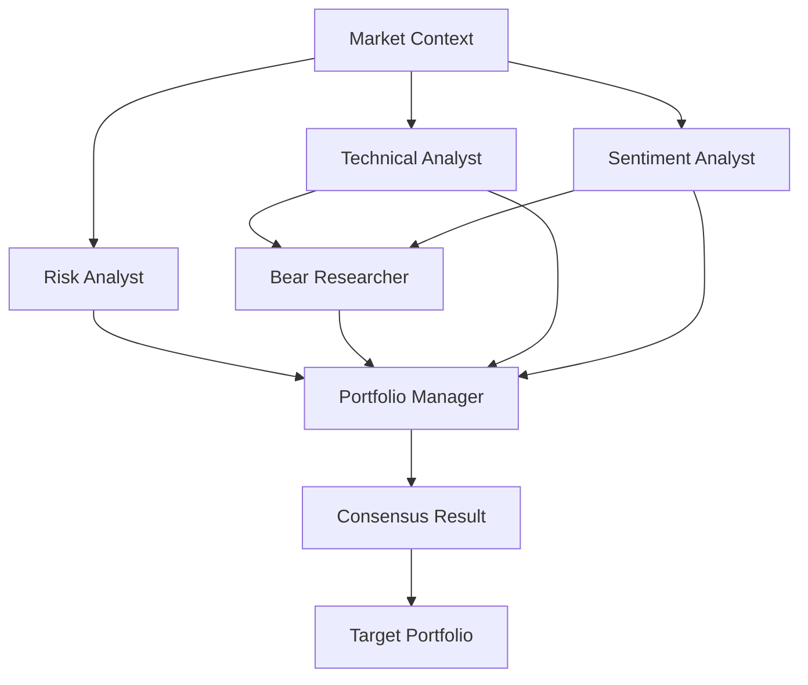

# Hyper-Alpha-Arena 升级设计方案

生成时间：2026-05-08  
依据文档：`docs/industry_quant_agent_comparison_report_2026-05-08.md`、`CODE_WIKI.md`  
设计目标：把当前项目从“AI 加密交易平台雏形”升级为“面向加密永续合约的 AI 多 Agent 量化交易实验室”

---

## 0. 执行摘要

这次升级不是重写系统，而是在现有 `FastAPI + React + Hyperliquid + AI 交易员 + 风控 + 回测/模拟` 的基础上做四个核心增强：

1. **Factor Engine**：把技术指标、市场流、市场状态、信号确认统一成可注册、可计算、可评估、可复盘的多因子体系。
2. **Agent Committee**：把当前“多路规则分析师 + 单个 MasterController LLM”升级成有角色、有投票、有反方辩论、有风控否决、有组合经理裁决的投研委员会。
3. **TargetPortfolio / ExecutionPlanner / UnifiedRiskGate**：把策略输出从“直接下单”改为“目标组合权重”，再由统一执行规划器转成 paper/live/backtest 可复用的订单计划，并强制经过同一个风控门。
4. **Experiment Center**：把因子、策略、Agent、Prompt、回测、模拟盘、实盘影子结果全部记录下来，形成可对比、可回放、可复盘的研究闭环。

最终产品定位：

> 面向加密货币永续合约的 AI 多 Agent 量化交易实验室：集多因子研究、Agent 投研委员会、模拟/实盘一致执行、风险守门和交易员竞技场于一体。

---

## 1. 升级目标与边界

### 1.1 升级目标

本次设计要解决五个问题：

- **多因子不标准**：当前已有 `factor_engine`、`technical_indicators.py`、`market_flow_indicators.py`、`market_regime*.py`、`signal_*` 等能力，但存在双轨并行、重复计算、枚举不统一、评估不成体系的问题。
- **多 Agent 不制度化**：当前 `trading_analysts.py` 已有多路分析师，但核心决策仍主要由 `MasterController.synthesize()` 做一次 LLM 汇总，缺少明确投票、反方辩论、主席裁决、风控否决和可回放记录。
- **回测/模拟/实盘不够一致**：当前 paper 主要走 `full_auto_trading_service.py` → `paper_trading_engine.py`，实盘主要走 `trading_commands.py` → `hyperliquid_trading_client.py`，风控和 sizing 逻辑存在路径差异。
- **实验不可复现**：当前策略、Prompt、因子、模型、回测结果缺少统一版本记录，不方便复盘“为什么当时这样交易”。
- **上线风险难控制**：AI 决策、DRL、全自动交易都需要只读观察、影子模式、paper 验证、小资金灰度，而不是直接进入实盘。

### 1.2 明确不做什么

本设计不建议立刻做以下事情：

- 不重写整个后端架构。
- 不把核心交易内核改成 Rust。
- 不一次性替换 `full_auto_trading_service.py`。
- 不直接改实盘下单路径作为第一阶段。
- 不用 LLM 替代硬风控。
- 不把所有历史策略一次性迁移到新架构。

### 1.3 第一闭环范围

第一阶段只做一个可控闭环：

- 交易品种：`BTC`、`ETH`、`SOL`
- 交易环境：`paper`
- 时间周期：`short`、`mid`、`long` 三 tier 保持现有概念
- 策略输出：先把现有决策转换为 `TargetPortfolio`
- 风控：只读/影子验证后再接入强制拦截
- 实盘：第一阶段只做只读审计，不实盘执行新链路

---

## 2. 当前代码现状诊断

### 2.1 因子体系现状

相关路径：

- `backend/services/factor_engine/`
- `backend/services/factor_engine/base_factors.py`
- `backend/services/factor_engine/factor_base.py`
- `backend/services/factor_engine/factor_registry.py`
- `backend/services/factor_engine/factor_calculator.py`
- `backend/services/technical_indicators.py`
- `backend/services/market_flow_indicators.py`
- `backend/services/market_regime.py`
- `backend/services/market_regime_detector.py`
- `backend/services/market_regime_service.py`
- `backend/services/signal_confirmation_engine.py`
- `backend/services/signal_detection_service.py`

诊断结论：

- 已经存在两套因子体系：`base_factors.py` 的运行时 `FactorEngine` 单例，以及 ATAS V2 风格的 `BaseFactor / FactorRegistry / FactorCalculator`。
- `technical_indicators.py` 仍是按字符串分支计算指标，适合作为兼容层逐步迁移。
- 市场状态有多套语义：`market_regime.py` 的 6 类、`market_regime_detector.py` 的 3 类、`factor_weighting.py` 的另一套枚举。
- `market_flow_indicators.py` 输出偏当前标量，技术指标输出偏序列，统一时必须处理时间对齐。
- `factor_evaluator.py`、`factor_quality_evaluator.py`、`factor_selector.py` 已经存在，适合升级而不是另起炉灶。

### 2.2 AI 决策链路现状

相关路径：

- `backend/services/full_auto_trading_service.py`
- `backend/services/tier_parallel_executor.py`
- `backend/services/trading_analysts.py`
- `backend/services/trading_decision_interface.py`
- `backend/services/rl/system_coordinator.py`
- `backend/services/llm_config_service.py`
- `backend/services/smart_prompt_generator.py`
- `backend/services/experience_retriever.py`
- `backend/services/trade_planner_agent.py`
- `backend/database/models.py`

当前主链路：

```text
FullAutoTradingService
  -> TierParallelExecutor
  -> TradingAnalystSystem.run_full_analysis
  -> PositionAnalyst / MarketAnalyst / IntelAnalyst / RiskAnalyst / StrategyAnalyst / KlineAnalyst
  -> DebateLayer
  -> MasterController.synthesize
  -> TradingDecisionInterface
  -> FullAuto 执行分支
```

诊断结论：

- 当前已经有“多路分析师”，但大多数是规则/确定性分析师，不是完整的多 LLM Agent 委员会。
- `MasterController.synthesize()` 是最重要的升级切入点：它现在是单个首席交易官汇总 prompt，未来可升级为多个 Agent 投票和主席裁决。
- `DebateLayer` 目前更像规则摘要，可升级为专职 `BullResearcher` / `BearResearcher`。
- `TradingDecisionInterface` 已经融合 Kelly / DRL / PortfolioRisk，适合作为非 LLM 风控与 sizing 仲裁层。
- `AIDecisionLog` 已有 prompt/reasoning/decision 快照，可扩展 `committee_snapshot` 或拆出新表。

### 2.3 执行与风控现状

相关路径：

- `backend/services/full_auto_trading_service.py`
- `backend/services/paper_trading_engine.py`
- `backend/services/trading_commands.py`
- `backend/services/hyperliquid_trading_client.py`
- `backend/services/exchange/hyperliquid_adapter.py`
- `backend/services/deterministic_risk_gate.py`
- `backend/services/risk_control_service.py`
- `backend/services/position_sizer.py`
- `backend/services/rl/portfolio_risk_aggregator.py`
- `backend/services/backtest_engine/backtest_engine.py`

当前链路：

```text
paper:
  FullAuto
    -> 多层门控
    -> DeterministicRiskGate
    -> PositionMemoryManager
    -> PaperTradingEngine.place_order

live:
  FullAuto
    -> trading_commands.place_ai_driven_hyperliquid_order
    -> risk_control_service 局部检查
    -> HyperliquidTradingClient.place_order_with_tpsl
```

诊断结论：

- paper 路径的硬风控比 live 路径更靠前，live 没有完全复用 `DeterministicRiskGate`。
- `DeterministicRiskGate` 当前使用预估名义/杠杆，可能和真实 plan 不一致。
- `paper_trading_engine.py` 与 `backtest_engine.py` 共享部分费率/滑点概念，这是好基础。
- `order_executor.py` 更像旧入口，当前不是 FullAuto 主链路。
- 需要抽出 `TargetPortfolio` 和 `ExecutionPlanner`，让 paper/live/backtest 用同一套意图和规划。

---

## 3. 目标架构

### 3.1 分层架构



### 3.2 核心数据流

```text
MarketContext
  -> FactorSnapshot
  -> AgentBallots
  -> ConsensusResult
  -> TargetPortfolio
  -> RiskDecision
  -> ExecutionPlan
  -> OrderIntent
  -> Paper/Live/Backtest Adapter
  -> ExecutionResult
  -> ExperimentRun / DecisionReplay
```

### 3.3 设计原则

- **兼容优先**：旧 API 不立刻删除，先做适配层。
- **只读先行**：新链路先生成影子结果，不影响实际交易。
- **单一契约**：策略、LLM、DRL、规则最终都转成 `TargetPortfolio`。
- **风控不可绕过**：所有执行路径必须经过 `UnifiedRiskGate`。
- **可解释优先**：每次交易和不交易都必须可回放。
- **成本可控**：Agent Committee 必须有 LLM 调用预算。

---

## 4. Factor Engine 设计

### 4.1 目标

把当前分散的技术指标、市场流、市场状态、情绪、链上、衍生品数据统一为一套“因子系统”：

- 所有因子统一注册。
- 所有因子有唯一 ID、版本、参数、依赖。
- 所有因子输出统一结构。
- 所有因子可以做质量评估。
- 所有因子可以进入 Agent prompt、策略回测、实验记录。

### 4.2 推荐目录

在现有 `backend/services/factor_engine/` 上渐进增强：

```text
backend/services/factor_engine/
  ├── contracts.py              # 新增：FactorValue / FactorSnapshot / FactorSpec
  ├── regime.py                 # 新增：统一 MarketRegime 枚举与映射
  ├── factor_registry.py        # 增强：统一注册入口
  ├── factor_calculator.py      # 增强：批量计算与时间对齐
  ├── factor_store.py           # 新增：因子快照落库与查询
  ├── factor_evaluator.py       # 增强：IC、分层、稳定性、样本外
  ├── adapters/
  │   ├── technical_indicator_adapter.py
  │   ├── market_flow_adapter.py
  │   ├── market_regime_adapter.py
  │   └── legacy_base_factor_adapter.py
  └── factors/
      ├── momentum.py
      ├── volatility.py
      ├── liquidity.py
      ├── orderflow.py
      ├── sentiment.py
      └── composite.py
```

### 4.3 核心契约

```python
from dataclasses import dataclass
from datetime import datetime
from typing import Any, Literal

FactorDomain = Literal[
    "technical",
    "momentum",
    "volatility",
    "liquidity",
    "orderflow",
    "sentiment",
    "derivatives",
    "onchain",
    "regime",
    "composite",
]

@dataclass(frozen=True)
class FactorSpec:
    factor_id: str
    name: str
    domain: FactorDomain
    version: str
    params: dict[str, Any]
    lookback_bars: int
    output_type: Literal["scalar", "series", "category"]
    description: str

@dataclass(frozen=True)
class FactorValue:
    factor_id: str
    symbol: str
    timeframe: str
    timestamp: datetime
    value: float | str | None
    normalized_value: float | None
    confidence: float
    metadata: dict[str, Any]

@dataclass(frozen=True)
class FactorSnapshot:
    snapshot_id: str
    symbol: str
    timeframe: str
    timestamp: datetime
    market_regime: str
    values: list[FactorValue]
    quality_score: float
    missing_factor_ids: list[str]
```

### 4.4 统一 MarketRegime

建议统一为 7 类：

```python
class UnifiedMarketRegime(str, Enum):
    TREND_UP = "trend_up"
    TREND_DOWN = "trend_down"
    RANGE = "range"
    HIGH_VOLATILITY = "high_volatility"
    LOW_VOLATILITY = "low_volatility"
    CRASH = "crash"
    UNKNOWN = "unknown"
```

兼容映射：

```text
market_regime_detector.py:
  trending -> trend_up/trend_down，由 EMA/return 二次判断
  ranging -> range
  volatile -> high_volatility

factor_weighting.py:
  breakout/continuation -> trend_up 或 trend_down
  reversal -> range/high_volatility
```

### 4.5 因子注册策略

第一阶段不删除旧因子，而是做桥接：

```text
legacy FactorEngine.compute_all_factors
  -> legacy_base_factor_adapter
  -> FactorSnapshot

technical_indicators.calculate_indicators
  -> technical_indicator_adapter
  -> FactorValue

market_flow_indicators.get_indicator_value
  -> market_flow_adapter
  -> FactorValue
```

### 4.6 因子质量评估指标

`FactorEvaluator` 需要至少支持：

- `coverage`：覆盖率，缺失越少越好。
- `stability`：滚动窗口稳定性。
- `ic`：因子值与未来收益的相关性。
- `icir`：IC 均值 / IC 标准差。
- `turnover_impact`：因子导致的换手成本。
- `regime_performance`：不同市场状态下表现。
- `drawdown_sensitivity`：回撤敏感性。
- `decay_curve`：预测能力随时间衰减。

### 4.7 新增 API 草案

```text
GET  /api/factors/catalog
GET  /api/factors/snapshot?symbol=BTC&timeframe=15m
POST /api/factors/evaluate
GET  /api/factors/evaluations
GET  /api/factors/regime-map
```

### 4.8 实施步骤

P0：

- 新增 `contracts.py`、`regime.py`。
- 不改旧调用，只新增转换器。
- 将 `technical_indicators.py` 输出包装为 `FactorValue`。

P1：

- `MasterController` prompt 引用 `FactorSnapshot` 摘要。
- `SignalConfirmationEngine` 技术面改为消费 `FactorSnapshot`。

P2：

- 因子评估落库。
- 前端新增因子报告页。

---

## 5. Agent Committee 设计

### 5.1 目标

把当前 AI 决策从“单个 MasterController 总控”升级为“可审计的投研委员会”。

原则：

- 每个 Agent 职责固定。
- 每个 Agent 输出 JSON。
- 每个 Agent 有置信度和反对理由。
- 风控 Agent 拥有否决权。
- Portfolio Manager 做最终裁决。
- 所有过程可回放。

### 5.2 推荐角色

第一阶段只做 5 个角色，避免成本爆炸：

| 角色 | 类型 | 作用 | 是否 LLM |
|---|---|---|---|
| `TechnicalAnalyst` | 分析员 | 基于 FactorSnapshot 和 K 线判断技术面 | 可选 |
| `SentimentAnalyst` | 分析员 | 基于新闻、情绪、市场流判断风险偏好 | 可选 |
| `RiskAnalyst` | 风控委员 | 判断是否允许开仓、加仓、减仓 | 可规则优先 |
| `BearResearcher` | 反方委员 | 专门寻找反对交易的理由 | LLM |
| `PortfolioManager` | 主席 | 汇总所有意见，输出最终 TargetPortfolio 建议 | LLM 或规则+LLM |

第二阶段再扩展：

- `FactorAnalyst`
- `OrderFlowAnalyst`
- `MacroAnalyst`
- `BullResearcher`
- `TraderAgent`
- `CostAnalyst`
- `ExecutionAnalyst`

### 5.3 核心契约

```python
class AgentRole(str, Enum):
    TECHNICAL_ANALYST = "technical_analyst"
    SENTIMENT_ANALYST = "sentiment_analyst"
    RISK_ANALYST = "risk_analyst"
    BEAR_RESEARCHER = "bear_researcher"
    PORTFOLIO_MANAGER = "portfolio_manager"

@dataclass
class AgentBallot:
    role: AgentRole
    model_id: str | None
    action: Literal["long", "short", "reduce", "close", "hold", "abstain"]
    confidence: float
    risk_level: Literal["low", "medium", "high", "blocked"]
    suggested_weight: float | None
    suggested_leverage: float | None
    thesis: str
    objections: list[str]
    evidence: dict[str, Any]
    latency_ms: int
    token_usage: dict[str, int] | None

@dataclass
class CommitteeRound:
    round_id: str
    account_id: int
    session_id: str | None
    symbol: str
    tier: Literal["short", "mid", "long"]
    factor_snapshot_id: str
    ballots: list[AgentBallot]
    created_at: datetime

@dataclass
class ConsensusResult:
    round_id: str
    final_action: str
    final_confidence: float
    target_weight: float
    max_leverage: float
    vetoed: bool
    veto_reason: str | None
    consensus_method: Literal["majority", "weighted_vote", "chair_decision", "risk_veto"]
    explanation: str
```

### 5.4 决策流程



### 5.5 和现有代码的集成点

最小改造路径：

```text
trading_analysts.py
  MasterController.synthesize()
    -> 新增 CommitteeOrchestrator.run()
    -> 输出 ConsensusResult
    -> 转换为兼容 MasterDecisionOutput
```

这样下游 `_execute_master_decisions()` 和 `TradingDecisionInterface` 可以先不大改。

### 5.6 LLM 成本预算

新增配置：

```text
COMMITTEE_ENABLED=false
COMMITTEE_MODE=shadow|paper|live
COMMITTEE_MAX_LLM_CALLS_PER_CYCLE=4
COMMITTEE_MAX_TOKENS_PER_CYCLE=12000
COMMITTEE_TIMEOUT_SECONDS=45
COMMITTEE_ENABLE_BEAR_RESEARCHER=true
COMMITTEE_ENABLE_PORTFOLIO_MANAGER=true
```

失败降级：

```text
Agent 超时 -> abstain
关键 Agent 超时 -> fallback to legacy MasterController
RiskAnalyst blocked -> 直接 veto，不再调用主席
LLM 预算超限 -> 只运行规则委员
```

### 5.7 日志与回放

短期可在 `AIDecisionLog` 增加 JSON 字段：

```text
committee_snapshot JSON
consensus_snapshot JSON
factor_snapshot_id VARCHAR
experiment_run_id VARCHAR
```

中期拆新表：

```text
ai_committee_rounds
ai_committee_votes
ai_committee_consensus
```

---

## 6. TargetPortfolio 与执行设计

### 6.1 目标

所有策略、Agent、DRL、规则最终不要直接输出“下单”，而是输出“目标组合”。

原因：

- 统一仓位管理。
- 统一风控。
- 统一回测、paper、live。
- 方便解释“目标应该是多少”和“实际执行了多少”。

### 6.2 核心契约

```python
@dataclass
class TargetPosition:
    symbol: str
    target_weight: float
    side: Literal["long", "short", "flat"]
    max_leverage: float
    confidence: float
    reason: str

@dataclass
class TargetPortfolio:
    portfolio_id: str
    account_id: int
    trading_mode: Literal["paper", "live", "backtest", "shadow"]
    environment: Literal["testnet", "mainnet"]
    quote_asset: str
    total_equity: float
    positions: list[TargetPosition]
    risk_budget: float
    source: Literal["agent_committee", "legacy_master", "drl", "manual", "strategy"]
    created_at: datetime
    metadata: dict[str, Any]
```

示例：

```json
{
  "account_id": 1,
  "trading_mode": "paper",
  "environment": "testnet",
  "quote_asset": "USDC",
  "total_equity": 10000,
  "positions": [
    {
      "symbol": "BTC",
      "target_weight": 0.25,
      "side": "long",
      "max_leverage": 3,
      "confidence": 0.72,
      "reason": "趋势上行，资金费率可接受，风控允许"
    }
  ],
  "risk_budget": 0.02,
  "source": "agent_committee"
}
```

### 6.3 ExecutionPlan 契约

```python
@dataclass
class OrderIntent:
    symbol: str
    side: Literal["buy", "sell"]
    reduce_only: bool
    order_type: Literal["market", "limit"]
    notional_usd: float
    quantity: float | None
    leverage: float
    expected_fee: float
    expected_slippage: float
    reason: str

@dataclass
class ExecutionPlan:
    plan_id: str
    target_portfolio_id: str
    account_id: int
    mode: Literal["paper", "live", "backtest", "shadow"]
    intents: list[OrderIntent]
    estimated_total_fee: float
    estimated_total_slippage: float
    risk_decision_id: str
    created_at: datetime
```

### 6.4 ExecutionPlanner 职责

`ExecutionPlanner` 只做一件事：

```text
当前仓位 + 目标组合 + 账户权益 + 交易规则
  -> 需要买多少 / 卖多少 / 减多少 / 平多少
```

它不直接下单。

### 6.5 Adapter 职责

```text
PaperAdapter
  -> paper_trading_engine.place_order

HyperliquidAdapter
  -> hyperliquid_trading_client.place_order_with_tpsl

BacktestAdapter
  -> backtest_engine 撮合逻辑

ShadowAdapter
  -> 不下单，只记录如果执行会发生什么
```

### 6.6 集成路径

第一阶段：

```text
FullAuto decision dict
  -> LegacyDecisionToTargetPortfolioAdapter
  -> UnifiedRiskGate shadow check
  -> ExecutionPlanner shadow plan
  -> 记录，不影响现有下单
```

第二阶段：

```text
paper mode:
  FullAuto
    -> TargetPortfolio
    -> UnifiedRiskGate
    -> ExecutionPlanner
    -> PaperAdapter
```

第三阶段：

```text
live mode:
  FullAuto
    -> TargetPortfolio
    -> UnifiedRiskGate
    -> ExecutionPlanner
    -> HyperliquidAdapter
```

---

## 7. Unified RiskGate 设计

### 7.1 目标

统一所有路径的风控：

- backtest
- paper
- live
- shadow
- manual
- full-auto
- Agent Committee
- DRL

任何路径都不能绕过 `UnifiedRiskGate`。

### 7.2 风控输入

```python
@dataclass
class RiskCheckRequest:
    account_id: int
    mode: str
    environment: str
    target_portfolio: TargetPortfolio
    current_positions: list[dict]
    current_orders: list[dict]
    account_equity: float
    market_snapshot: dict
    factor_snapshot: FactorSnapshot | None
    committee_result: ConsensusResult | None
```

### 7.3 风控输出

```python
@dataclass
class RiskDecision:
    decision_id: str
    approved: bool
    blocked: bool
    clipped: bool
    block_reason: str | None
    adjusted_target_portfolio: TargetPortfolio | None
    triggered_rules: list[str]
    warnings: list[str]
```

### 7.4 风控规则分层

```text
L0 系统硬规则：
  - 缺价格
  - 缺账户
  - 杠杆超过系统最大值
  - 风控配置异常

L1 账户规则：
  - 日内最大亏损
  - 单账户最大仓位
  - 最大持仓数量
  - 最大保证金占用

L2 交易规则：
  - 最小下单额
  - 手续费/滑点过高
  - 流动性不足
  - 冷却期

L3 组合规则：
  - 单币种暴露
  - 同向相关性暴露
  - 总杠杆暴露
  - 回撤敏感度

L4 AI 专属规则：
  - Agent 置信度过低
  - 风控委员 veto
  - 反方理由过强
  - LLM 输出结构异常
```

### 7.5 现有风控迁移

| 现有模块 | 迁移方式 |
|---|---|
| `deterministic_risk_gate.py` | 保留为核心规则执行器之一 |
| `risk_control_service.py` | 作为账户级熔断和日内亏损检查 |
| `fee_guard.py` | 纳入交易成本规则 |
| `liquidity_filter.py` | 纳入流动性规则 |
| `liquidation_monitor.py` | 纳入组合风险监控 |
| `profit_drawdown_guard.py` | 纳入回撤保护 |
| `master_close_guard.py` | 保留为全局强制平仓守卫 |

---

## 8. Experiment Center 设计

### 8.1 目标

让每次策略、Agent、因子、回测、paper、live 都留下可复盘记录。

用户最终应该能看到：

- 这次交易用了哪些因子？
- 哪些 Agent 支持？
- 哪些 Agent 反对？
- 风控有没有拦截？
- 如果用旧系统会怎样？
- 回测和实盘差异在哪里？

### 8.2 核心对象

```python
@dataclass
class ExperimentRun:
    run_id: str
    name: str
    mode: Literal["backtest", "paper", "live_shadow", "live"]
    symbols: list[str]
    start_at: datetime
    end_at: datetime | None
    strategy_version: str
    factor_set_version: str
    prompt_version: str
    model_version: str
    status: Literal["running", "completed", "failed"]
    metrics: dict[str, Any]
```

```python
@dataclass
class DecisionReplay:
    decision_id: str
    run_id: str
    factor_snapshot_id: str
    committee_round_id: str
    target_portfolio_id: str
    risk_decision_id: str
    execution_plan_id: str
    execution_result_id: str | None
```

### 8.3 指标体系

最小指标集：

- 总收益率
- 年化收益率
- 最大回撤
- Sharpe
- Calmar
- 胜率
- 盈亏比
- 平均手续费
- 平均滑点
- 风控拦截次数
- Agent 分歧率
- 风控 veto 次数
- LLM 成本
- 决策延迟

### 8.4 前端页面

建议新增三页：

```text
实验中心
  - 回测 / paper / shadow / live 运行列表
  - 主要指标对比
  - 策略版本和 Prompt 版本

Agent 决策回放
  - 每个 Agent 的投票
  - 反方理由
  - 主席裁决
  - 风控拦截原因

因子研究页
  - 因子目录
  - 因子评分
  - 不同行情下表现
  - 因子覆盖率和稳定性
```

---

## 9. 数据库设计草案

### 9.1 短期扩展字段

优先在现有表做 JSON 扩展，降低迁移风险。

`AIDecisionLog` 建议新增：

```text
factor_snapshot_id VARCHAR(64)
committee_round_id VARCHAR(64)
target_portfolio_snapshot TEXT
risk_decision_snapshot TEXT
execution_plan_snapshot TEXT
committee_snapshot TEXT
experiment_run_id VARCHAR(64)
```

### 9.2 中期新增表

```text
factor_snapshots
  id
  symbol
  timeframe
  timestamp
  market_regime
  quality_score
  values_json
  created_at

factor_evaluations
  id
  factor_id
  version
  symbol
  timeframe
  start_time
  end_time
  metrics_json
  created_at

ai_committee_rounds
  id
  account_id
  session_id
  symbol
  tier
  factor_snapshot_id
  consensus_json
  created_at

ai_committee_votes
  id
  round_id
  agent_role
  model_id
  action
  confidence
  risk_level
  payload_json
  latency_ms
  token_usage_json
  created_at

target_portfolios
  id
  account_id
  mode
  environment
  source
  payload_json
  created_at

risk_decisions
  id
  target_portfolio_id
  approved
  blocked
  clipped
  triggered_rules_json
  payload_json
  created_at

execution_plans
  id
  target_portfolio_id
  risk_decision_id
  mode
  payload_json
  created_at

experiment_runs
  id
  name
  mode
  symbols_json
  strategy_version
  factor_set_version
  prompt_version
  model_version
  status
  metrics_json
  started_at
  ended_at
```

### 9.3 字段策略

- 第一阶段使用 JSON，避免过早建复杂关系。
- 等指标稳定后，再把高频查询字段结构化。
- 所有快照表必须可按 `account_id`、`symbol`、`created_at` 查询。

---

## 10. API 与前端规划

### 10.1 后端 API

```text
Factor:
  GET  /api/factors/catalog
  GET  /api/factors/snapshot
  POST /api/factors/evaluate
  GET  /api/factors/evaluations

Committee:
  GET  /api/committee/rounds
  GET  /api/committee/rounds/{id}
  POST /api/committee/shadow-run
  GET  /api/committee/config
  PUT  /api/committee/config

Execution:
  POST /api/execution/plan
  POST /api/execution/risk-check
  GET  /api/execution/plans/{id}

Experiment:
  GET  /api/experiments
  GET  /api/experiments/{id}
  POST /api/experiments/start-shadow
  GET  /api/experiments/{id}/decisions
  GET  /api/experiments/{id}/metrics
```

### 10.2 前端组件规划

```text
frontend/app/components/research/
  FactorCatalog.tsx
  FactorEvaluationPanel.tsx
  FactorSnapshotView.tsx

frontend/app/components/committee/
  CommitteeRoundList.tsx
  CommitteeDecisionReplay.tsx
  AgentBallotCard.tsx
  ConsensusResultPanel.tsx

frontend/app/components/experiments/
  ExperimentCenter.tsx
  ExperimentRunDetail.tsx
  MetricsComparison.tsx
  ShadowModeReport.tsx
```

### 10.3 UI 展示原则

给非技术用户看的核心文案：

```text
系统为什么想交易？
谁支持？
谁反对？
风控有没有放行？
如果交易，目标仓位是多少？
如果不交易，是谁拦下来的？
这次决策和历史类似场景相比表现如何？
```

---

## 11. 分阶段实施路线图

### P0：设计落地准备，1 周

目标：不影响任何交易，只补契约和影子能力。

任务：

- 新增 `FactorValue / FactorSnapshot / TargetPortfolio / ExecutionPlan / RiskDecision` 契约。
- 新增 legacy adapter，把现有决策转换为 `TargetPortfolio`。
- 新增 shadow risk check，不拦截，只记录。
- 新增 feature flags。

验收：

- 现有项目启动不受影响。
- paper/live 交易行为不变。
- 每次 FullAuto 决策旁边能生成 shadow `TargetPortfolio` 和 shadow `RiskDecision`。

### P1：Factor Engine 标准化，2 周

目标：把因子统一成可查询、可评估的结构。

任务：

- 统一 MarketRegime。
- 将 `technical_indicators.py` 桥接进 `FactorSnapshot`。
- 将 `market_flow_indicators.py` 桥接进 `FactorSnapshot`。
- 增强 `factor_evaluator.py`，实现覆盖率、稳定性、IC、regime performance。
- 新增 `/api/factors/*`。

验收：

- BTC/ETH/SOL 在 `15m/1h/4h` 能生成 FactorSnapshot。
- 每个 snapshot 有质量分。
- 至少 10 个因子能跑评估报告。

### P2：Agent Committee 影子模式，2-3 周

目标：不影响交易，只生成委员会结果并和旧决策对比。

任务：

- 新增 `CommitteeOrchestrator`。
- 在 `MasterController.synthesize()` 外围接入 shadow committee。
- 实现 `TechnicalAnalyst`、`RiskAnalyst`、`BearResearcher`、`PortfolioManager`。
- 新增 committee snapshot 日志。
- 新增 Agent 决策回放 API。

验收：

- 每轮 FullAuto 决策能看到 Agent 投票。
- committee 结果不影响实际下单。
- 能统计 committee 与旧 MasterController 的一致率。

### P3：paper 模式接入 TargetPortfolio，2-3 周

目标：paper 交易先走新链路。

任务：

- `TargetPortfolio` 接入 FullAuto paper 分支。
- `ExecutionPlanner` 生成 paper order intents。
- `UnifiedRiskGate` 强制拦截 paper。
- `PaperAdapter` 调用 `paper_trading_engine.place_order`。
- 保留 legacy fallback。

验收：

- paper 交易可以使用新链路完成开仓、减仓、平仓。
- 新旧链路在同一输入下差异可解释。
- 风控拦截原因可展示。

### P4：实验中心与实盘影子，1 个月

目标：建立可复现研究闭环。

任务：

- 新增 `ExperimentRun`。
- 新增实验中心页面。
- 新增 live shadow 模式。
- 记录如果实盘执行会生成的订单，但不真实下单。
- 做 backtest/paper/live shadow 对比。

验收：

- 用户能打开一次实验，看到因子、Agent、风控、订单计划和结果。
- live shadow 连续运行 7 天无异常。
- 风控误拦/漏拦可复盘。

### P5：小资金实盘灰度，严格门禁

目标：只有通过评审后才允许新链路进入实盘。

前置条件：

- paper 连续 14 天稳定。
- live shadow 连续 7 天稳定。
- 风控无严重漏拦。
- 最大回撤、手续费、滑点在阈值内。
- 用户确认理解风险。

---

## 12. 测试和验证方案

### 12.1 单元测试

必须覆盖：

- FactorValue 序列化。
- MarketRegime 映射。
- FactorSnapshot 缺失值处理。
- AgentBallot JSON 校验。
- ConsensusResult 合并规则。
- TargetPortfolio 权重合法性。
- ExecutionPlanner 差额计算。
- UnifiedRiskGate 拦截规则。

### 12.2 集成测试

```text
测试1：历史 K 线 -> FactorSnapshot -> AgentCommittee -> TargetPortfolio
测试2：TargetPortfolio -> RiskGate -> ExecutionPlan
测试3：ExecutionPlan -> PaperAdapter -> PaperTradingEngine
测试4：旧 FullAuto 决策 -> LegacyAdapter -> TargetPortfolio
测试5：committee 超时 -> fallback legacy
```

### 12.3 回测一致性测试

同一段历史数据：

```text
legacy backtest
new target-portfolio backtest
```

对比：

- 成交次数
- 平均仓位
- 手续费
- 滑点
- 收益差
- 最大回撤差

允许第一阶段存在差异，但必须解释差异来源。

### 12.4 paper 影子测试

运行方式：

```text
旧链路真实 paper 下单
新链路只生成 shadow plan
```

对比：

- 新旧方向一致率
- 新旧仓位差
- 新旧风控拦截差异
- 新链路建议但旧链路没交易的样本
- 旧链路交易但新链路 veto 的样本

### 12.5 实盘前门禁

必须满足：

- `COMMITTEE_MODE=shadow` 连续 7 天无严重异常。
- `TARGET_PORTFOLIO_MODE=paper` 连续 14 天无严重异常。
- `UnifiedRiskGate` 没有出现高危漏拦。
- 任何实盘交易都能追溯到 `DecisionReplay`。
- 关闭 feature flag 后能回到旧链路。

---

## 13. 多方验证与讨论机制

设计完成后，不能直接进入开发，需要多方讨论。建议按 7 个角色评审。

### 13.1 产品评审

关注问题：

- 用户能否理解 Agent 委员会？
- “为什么交易/为什么不交易”是否清楚？
- 是否增加太多复杂按钮？
- 新功能入口应该放在交易页、实验中心还是设置页？

输出：

- 页面优先级。
- 用户可理解文案。
- MVP 功能边界。

### 13.2 量化评审

关注问题：

- 因子评估指标是否足够？
- 是否有未来函数风险？
- 样本内/样本外如何拆分？
- 不同行情状态下是否单独评估？
- 回测是否包含手续费、滑点、资金费率？

输出：

- 因子评估标准。
- 回测基准。
- 可接受误差范围。

### 13.3 风控评审

关注问题：

- AI 是否能绕过风控？
- DRL/Kelly 是否会过度加杠杆？
- 实盘和 paper 是否使用同一风控输入？
- 风控拦截是否可解释？
- 紧急平仓和全局熔断是否还有效？

输出：

- 硬规则清单。
- 实盘前门禁。
- 风控回滚方案。

### 13.4 后端评审

关注问题：

- 契约是否稳定？
- 数据库迁移是否安全？
- 是否破坏现有 API？
- FullAuto 是否会继续膨胀？
- 新模块和旧模块如何解耦？

输出：

- 模块边界确认。
- 数据表迁移计划。
- feature flag 策略。

### 13.5 前端评审

关注问题：

- Agent 决策回放如何展示？
- 因子报告如何避免吓到普通用户？
- 实验中心是否需要图表？
- 风控拦截如何提示？

输出：

- 页面草图。
- 组件拆分。
- 信息层级。

### 13.6 运维评审

关注问题：

- LLM 调用成本是否可控？
- Agent 超时如何处理？
- 日志量是否会爆炸？
- 监控告警是否覆盖？
- 失败后是否自动降级？

输出：

- 监控指标。
- 成本阈值。
- 超时和降级策略。

### 13.7 用户验收

用非技术语言验证：

- 我知道系统为什么买。
- 我知道系统为什么不买。
- 我知道是谁反对。
- 我知道风控有没有放行。
- 我知道这只是模拟/影子/实盘。
- 我知道如何一键关闭新系统。

---

## 14. 评审会议模板

### 14.1 第一次评审：架构评审

必须回答：

```text
1. 是否同意 Factor Engine / Agent Committee / TargetPortfolio 三主线？
2. 是否同意第一阶段只做 paper + shadow？
3. 是否同意新链路不直接碰实盘？
4. 是否有必须保留的旧功能？
5. 是否有必须新增的合规/审计字段？
```

通过标准：

- 所有角色同意“不重写、先影子、后 paper、再实盘”。
- 风控评审没有阻断意见。

### 14.2 第二次评审：MVP 设计评审

必须回答：

```text
1. 第一批因子选哪些？
2. 第一批 Agent 选哪些？
3. 第一批交易品种选哪些？
4. 第一批页面做哪些？
5. paper 验收指标是什么？
```

建议默认：

- 因子：趋势、动量、波动率、成交量、订单流、资金费率。
- Agent：Technical、Risk、Bear、PortfolioManager。
- 品种：BTC、ETH、SOL。
- 页面：Agent 决策回放、实验中心列表。

### 14.3 第三次评审：paper 上线评审

必须回答：

```text
1. 新链路是否能稳定生成 TargetPortfolio？
2. RiskGate 是否稳定拦截？
3. 新旧链路差异是否可解释？
4. 关闭 feature flag 是否能恢复旧链路？
5. 用户是否能看懂决策回放？
```

### 14.4 第四次评审：实盘影子评审

必须回答：

```text
1. live shadow 是否连续运行 7 天？
2. 是否有异常订单计划？
3. 风控是否漏拦高风险交易？
4. 手续费/滑点估算是否偏离过大？
5. 是否允许进入小资金实盘灰度？
```

---

## 15. 风险与回滚方案

### 15.1 主要风险

| 风险 | 说明 | 缓解 |
|---|---|---|
| LLM 成本暴涨 | 多 Agent 增加调用次数 | 设置每周期预算、超时降级 |
| 决策变慢 | 委员会多轮调用增加延迟 | 并行调用、规则 Agent 优先 |
| 风控误拦 | 新 RiskGate 规则过严 | 先 shadow 统计误拦率 |
| 风控漏拦 | 新旧字段不一致 | paper 验证和实盘影子对比 |
| 回测实盘不一致 | 成本模型不同 | 统一 ExecutionPlan 和成本估算 |
| 数据库膨胀 | 快照和日志量大 | 分层存储、保留策略、压缩 JSON |
| 用户困惑 | 新页面概念太多 | 用“谁支持/谁反对/风控是否放行”解释 |

### 15.2 Feature Flag

必须有：

```text
FACTOR_ENGINE_V2_ENABLED=false
COMMITTEE_ENABLED=false
COMMITTEE_MODE=shadow
TARGET_PORTFOLIO_ENABLED=false
UNIFIED_RISKGATE_MODE=shadow
EXECUTION_PLANNER_ENABLED=false
EXPERIMENT_CENTER_ENABLED=false
```

### 15.3 回滚策略

```text
如果 Agent Committee 异常：
  COMMITTEE_ENABLED=false
  回到 legacy MasterController

如果 TargetPortfolio 异常：
  TARGET_PORTFOLIO_ENABLED=false
  回到 FullAuto 原执行逻辑

如果 UnifiedRiskGate 误拦太多：
  UNIFIED_RISKGATE_MODE=shadow
  只记录不拦截

如果数据库写入异常：
  禁用快照落库，仅保留内存/日志
```

---

## 16. 开发任务拆分

### 16.1 后端任务

P0：

- 新增契约文件。
- 新增 adapter。
- 新增 feature flags。
- 新增 shadow 日志。

P1：

- 因子统一。
- 因子 API。
- 因子评估。

P2：

- CommitteeOrchestrator。
- AgentBallot。
- ConsensusResult。
- committee snapshot。

P3：

- TargetPortfolio。
- ExecutionPlanner。
- UnifiedRiskGate。
- PaperAdapter。

P4：

- ExperimentRun。
- DecisionReplay。
- 实验 API。

### 16.2 前端任务

P1：

- 因子目录页。
- 因子快照页。

P2：

- Agent 决策回放页。
- Agent 投票卡片。

P4：

- 实验中心。
- 指标对比。
- live shadow 报告。

### 16.3 测试任务

- 契约单测。
- 风控单测。
- planner 单测。
- committee 超时测试。
- paper 集成测试。
- shadow 对比测试。

---

## 17. 验收标准

### 17.1 技术验收

- 所有新模块有单元测试。
- 旧链路默认不受影响。
- Feature flag 可关闭所有新能力。
- 任何新链路执行都有 replay ID。
- 所有执行前都有 risk decision。

### 17.2 产品验收

- 用户能看懂一次交易的理由。
- 用户能看懂一次不交易的理由。
- 用户能看到风控拦截原因。
- 用户能切换 shadow/paper/live 状态。

### 17.3 风控验收

- AI 不可绕过风控。
- live 不能绕过 RiskGate。
- 任何 blocked 决策都有规则 ID 和解释。
- 小资金实盘前必须通过 paper 和 live shadow。

---

## 18. 最终建议

建议按以下顺序推进：

```text
先做契约和影子记录
  -> 再做 Factor Engine 标准化
  -> 再做 Agent Committee 影子模式
  -> 再让 paper 走 TargetPortfolio
  -> 再做 Experiment Center
  -> 最后讨论实盘灰度
```

不要一上来就改实盘下单。  
这个项目真正的壁垒不是“多几个指标”或“多几个模型”，而是：

- 每个因子都可验证。
- 每个 Agent 都可审计。
- 每个订单都可追溯。
- 每个风控拦截都可解释。
- 每次实验都可复现。

做到这些后，`Hyper-Alpha-Arena` 才会从“AI 交易软件”升级成真正的“AI 量化交易实验室”。

