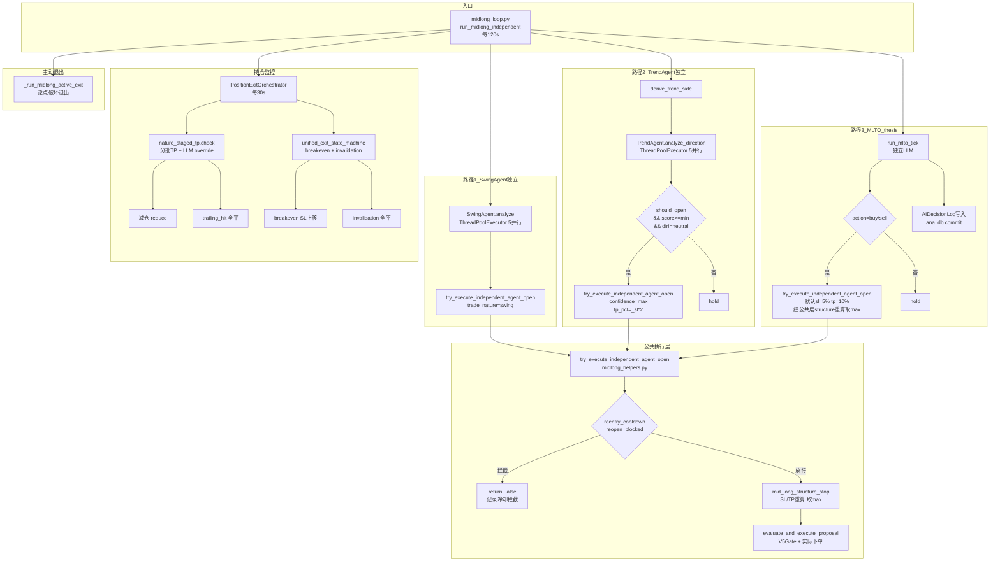

# 长线策略整改方案可执行性审查 — 补充审计报告

> 版本: v1.0 | 日期: 2026-07-20
> 基于: `docs/trend_strategy_remediation_plan.md` 逐条代码级核验
> 审查范围: trend_agent.py(1000行)、mlto_cycle.py(743行)、midlong_loop.py(229行)、
>           midlong_helpers.py(532行)、reentry_cooldown.py(532行)、
>           mid_long_structure_stop.py(100行)、nature_staged_tp.py(149行)、
>           position_exit_orchestrator.py(211行)

---

## 目录

1. [整改方案准确性验证](#一整改方案准确性验证逐条核验)
2. [MLTO Agent 深度审计](#二mlto-agent-深度审计)
3. [完整中长线决策链路图](#三完整中长线决策链路图mermaid)
4. [整改项关联影响矩阵](#四整改项关联影响矩阵)
5. [被遗漏的深度问题清单](#五被遗漏的深度问题清单)
6. [修订后的执行优先级](#六修订后的执行优先级)

---

## 一、整改方案准确性验证（逐条核验）

### 核验方法

对 `trend_strategy_remediation_plan.md` 中标注的每个文件路径、函数名、行号进行
实际代码验证，判断问题是否仍然存在、是否已被修复、或者整改方案是否存在偏差。

### 1.1 核验结果总表

| # | 整改项 | 方案声称的问题 | 方案标注位置 | 实际代码状态 | 核验结论 |
|---|--------|---------------|-------------|-------------|----------|
| P0-1 | Paper"强行开仓" | LLM say False 但 score≥50 时强制 override should_open=True | trend_agent.py L471-486 | **已修复**: L577-582 有注释"S0-4 止血修复（R4）：删除 Paper 强制开仓 override"；L584 当前代码 `should_open = bool(should) and score >= min_score and direction in ("long","short")` 已尊重 LLM 判断 | **方案过时** |
| P0-2 | 无止损后冷却期 | 被止损后下个 tick 立即同方向重开，无冷却 | midlong_loop.py / mlto_cycle.py | **已存在**: `reentry_cooldown.py`(532行) 实现了完整的 tier 隔离冷却系统，且 `midlong_helpers.py` L175-221 已接入独立路径 `reopen_blocked()` 检查 | **方案重复** |
| P0-3 | 固定8% SL无ATR | SL是LLM静态建议值，与波动率无关 | trend_agent.py L415-425 (实际 L460) | **部分已修**: `mid_long_structure_stop.py` L62-77 为 trend_agent 专用 ATR 自适应 SL(5%-15%)，且 `midlong_helpers.py` L236-279 已在独立开仓时调用取 max(LLM, structure) | **方案过时** |
| P1-1 | 分批止盈未接线 | tp_level_reached 字段存在但无代码读取执行 | PaperPosition 模型 L2214 | **已实现**: `nature_staged_tp.py`(149行) 完整实现分批 TP + LLM override；`position_exit_orchestrator.py`(211行) 每个 tick 调用 `check()` 并执行减仓 | **方案重复** |
| P1-2 | Trailing stop 未接线 | trailing_stop_price 字段存在但无代码更新执行 | PaperPosition 模型 L2203 | **已实现**: `nature_staged_tp.py` L124-146 计算 trailing band；`position_exit_orchestrator.py` L174-180 检测 trailing_hit 并全平 | **方案重复** |
| P2 | Prompt 行号 | "请优先对齐"在 L321 | trend_agent.py L321 | **行号错误**: 实际在 L366 `_build_direction_prompt_inline()` 内 | **行号偏差** |

### 1.2 详细核验

#### P0-1: Paper 强行开仓 — 已被 S0-4 修复

整改方案声称 `trend_agent.py` L471-486 存在以下代码：
```python
if _paper and direction in ("long", "short") and score >= max(min_score, 50):
    if not should_open and "veto" not in (_crypto_note or "").lower() and not _mtf_block:
        should_open = True  # Paper试单: score≥50且LLM说不开也强行开
```

**实际代码** (trend_agent.py L577-595):
```python
# S0-4 止血修复（R4）：删除 Paper 强制开仓 override。
# 原逻辑：LLM 应开仓（should_open_trend=true）但 score≥min_score 时强制 override；
#        更糟糕的是即使 LLM 输出 should_open_trend=false，只要 score≥50 也会被改成 true。
# 修复：尊重 LLM 的 should_open_trend 决策；Paper 只降低 min_score 门槛，不强制 override。
hold_reason = ""
should_open = bool(should) and score >= min_score and direction in ("long", "short")
if not should_open:
    if raw_should_open is False and score >= min_score:
        hold_reason = "llm_should_open_false_respected"  # 尊重 LLM 的 false 决策
```

**结论**: 强行开仓逻辑已在 S0-4 修复中删除。当前代码尊重 LLM 的 `should_open_trend` 字段。
如执行整改方案的"关闭强行开仓"修改，将修改一段**不存在的代码**。

#### P0-2: 止损后冷却期 — 已由 reentry_cooldown.py 实现

整改方案声称系统无止损后冷却机制。实际存在完整的冷却系统：

**reentry_cooldown.py 核心机制**:
- **tier 隔离冷却**: 以 `(account, symbol, tier)` 为独立桶，平掉 long-tier 不阻止 mid/short
- **同向冷却**: long tier 60 分钟（可配 `TIER_PROTECTION_PARAMS`）
- **SL 增强冷却**: close_reason=sl 时，long tier 冷却延长至 **48 小时**（L173-186）
- **连续亏损倍率**: 2 次连亏 ×2.0，3 次连亏 ×3.0（L62-89）
- **亏损通用冷却**: 任意 close_pnl<0 的全平，long tier 强制至少 12 小时（L155-166）

**独立路径接入** (midlong_helpers.py L175-221):
```python
# S0-1 止血修复（R1）：独立路径接入 reentry_cooldown
from backend.services.reentry_cooldown import reopen_blocked
_blocked, _cd_reason = reopen_blocked(_account_id_cd, _sym_u, _act, _tier_cd)
if _blocked:
    logger.info("[MidLongCooldown] BLOCK %s %s tier=%s: %s", ...)
    return False  # 冷却期内拒绝开仓
```

**结论**: 冷却机制已完整实现并接入。如执行整改方案的"新增冷却期"，将与现有
`reentry_cooldown.py` 产生**双冷却冲突** — 两套冷却各自独立判断，可能出现
"reentry_cooldown 放行但新冷却拦截"或反向的不一致。

#### P0-3: 固定 SL 无 ATR — 部分已由 mid_long_structure_stop 修复

整改方案声称 SL 固定 8%。实际 trend_agent 的 SL 经过三层处理：

**第一层** (trend_agent.py L460, L533): LLM 建议 + 安全网
```python
sl = float(result.get("suggested_sl_pct", 0.08) or 0.08)
sl = max(sl, 0.04)  # 安全网：趋势仓至少 4%
```

**第二层** (mid_long_structure_stop.py L62-77): trend 专用结构 SL
```python
if agent_source == "trend_agent":
    min_sl = float(os.getenv("MLTO_LONG_MIN_SL", "0.05"))   # 5%
    max_sl = float(os.getenv("MLTO_LONG_MAX_SL", "0.15"))   # 15%
sl_pct = max(min_sl, min(max_sl, raw_sl * 3))  # 放大到中长线级别
```

**第三层** (midlong_helpers.py L266-274): 取 max(LLM, structure)
```python
if _structure_sl_pct > float(sl_pct or 0):
    logger.info("[MidLongStructureSL] %s LLM sl=%.2f%% → structure sl=%.2f%% (取更宽)")
    sl_pct = _structure_sl_pct
```

**结论**: SL 已通过三层从固定 8% 升级为 5%-15% 结构自适应。
**残留缺陷**: `mid_long_structure_stop.py` 的 ATR 推断是间接的（raw_sl×3），
并非直接读取 ATR 指标计算。这是可改进点但非 P0。

#### P1-1/P1-2: 分批止盈 + Trailing — 已由 PEO 完整接线

整改方案声称 `tp_level_reached` 和 `trailing_stop_price` 字段存在但无代码使用。
实际存在完整的持仓退出编排器：

**position_exit_orchestrator.py (PEO) 执行流程**:
```
每个 paper_monitor tick:
  → 对每个 open position 读取 exit_state_json
  → NatureStagedTpState.from_dict() 反序列化
  → check() 评估当前 PnL vs 分批止盈档位
  → 如触发 reduce → paper_engine.close_position(减仓)
  → 如所有档位触发完 → trailing_active=True → 计算 band → 如 trailing_hit → 全平
  → 同时调用 unified_exit_state_machine 做 breakeven push
```

**LLM override 已接线** (nature_staged_tp.py L76-96):
- `tp_stages_override`: LLM 的 tp_sl_proposal 分批方案覆盖默认档位
- `trailing_atr_mult_override`: LLM 的 trailing ATR 倍数覆盖
- PEO L70-75 读取 `trend_adjustment.trailing_atr_mult` 动态缩放 atr_pct

**结论**: 分批止盈和 trailing stop 已完整实现并通过 PEO 每个 tick 执行。
整改方案的"新增 staged_tp.py / trailing_stop.py"将**重复实现**已有功能。

---

## 二、MLTO Agent 深度审计

### 2.1 三条并行路径架构

`maintain_mlto_theses_for_session()` (mlto_cycle.py L55-577) 在单个 midlong tick 内
**串行**执行三条路径（非并发 — 路径间有数据依赖）：

```
路径1: SwingAgent 独立 (L104-208)
  ├─ 使用 ThreadPoolExecutor 并行 LLM (max_workers=5)
  ├─ key = "{sym}:mid"
  ├─ _reserve_key() 原子占位
  └─ try_execute_independent_agent_open(trade_nature="swing")

路径2: TrendAgent 独立 (L209-345)
  ├─ 受 MIDLONG_MLTO_CONTROLS_EXEC 开关控制
  ├─ 使用 ThreadPoolExecutor 并行 LLM (max_workers=5)
  ├─ key = "{sym}:long"
  ├─ _reserve_key() 原子占位
  └─ try_execute_independent_agent_open(trade_nature="trend_follow")

路径3: MLTO thesis 维护 (L351-577)
  ├─ 受 MIDLONG_THESIS_LEDGER_ENABLED 开关控制
  ├─ 串行遍历 symbols
  ├─ 跳过 mid tier (L392-393)
  ├─ 检查 key in handled → 跳过已处理
  ├─ run_mlto_tick() → 独立 LLM 调用
  └─ try_execute_independent_agent_open(trade_nature="trend_follow")
```

### 2.2 互斥关系分析

**路径2 vs 路径3 (同 tier=long)**:

| 步骤 | 路径2 | 路径3 |
|------|-------|-------|
| 占位 | `_reserve_key(f"{sym}:long")` L326 | `if key in handled: continue` L389 |
| 执行 | ThreadPoolExecutor 内 try_execute | L485 直接 try_execute |
| 结果 | handled.add(f"{sym}:long") 在 reserve 时 | handled.add(key) L446 在 run_mlto_tick 后 |

**互斥结论**: 路径2先执行（串行顺序），成功占位后路径3检查到 key 已 handled 跳过。
**但存在窗口**: 路径2使用 ThreadPoolExecutor 异步执行 LLM，`_reserve_key` 在提交前
同步占位，所以路径3开始时路径2的 key 已被占位。**互斥有效**。

**路径1 vs 路径3 (不同 tier)**:

路径1占位 `"{sym}:mid"`，路径3只处理 `tier=="long"` (L385-393 跳过 mid)。
两者处理不同 tier 的 key，**不互斥 — 可对同一 symbol 同时开 mid + long 两个仓位**。

### 2.3 路径2 (TrendAgent 独立) 残留问题

| 问题 | 代码位置 | 严重度 | 详情 |
|------|----------|--------|------|
| **confidence 强制提分** | mlto_cycle.py L272 | P0 | `confidence=max(_trend_score, 50)` — 即使 LLM 给 30 分也传 50 分给执行层，V5Gate 看到的是虚假高分 |
| **TP 硬编码** | mlto_cycle.py L274 | P1 | `tp_pct=_sl * 2` — 忽略 LLM 的 tp_sl_proposal，但最终会被 midlong_helpers L275-279 的 structure TP 覆盖（取 max），所以实际危害有限 |
| **LLM 退出方案传入但部分被忽略** | mlto_cycle.py L279 | P2 | `tp_sl_proposal=_trend_result.get("tp_sl_proposal")` 正确传入，但 tp_pct/tp_sl_proposal 两个参数同时传，下游可能用 tp_pct 覆盖 tp_sl_proposal 的分批方案 |

### 2.4 路径3 (MLTO thesis 维护) 残留问题

| 问题 | 代码位置 | 严重度 | 详情 |
|------|----------|--------|------|
| **MLTO 默认 SL/TP 偏窄** | mlto_cycle.py L482-483 | P1 | MLTO 路径默认 `sl_pct=0.05, tp_pct=0.10`，虽然 `try_execute_independent_agent_open` 内部会取 max(LLM, structure)，但当 structure SL 计算结果 < 5% 时（低波动币种），5% 默认值会生效，可能偏窄 |
| **独立 _exec_db 连接** | mlto_cycle.py L475 | P2 | 每次 MLTO 开仓新建 `SessionLocal()`，高频时增加连接池压力；不过 finally 块正确关闭 |
| **AIDecisionLog 独立事务** | mlto_cycle.py L559-560 | P2 | `_ana_db.commit()` 写 Analytics DB，与 Core DB 的开仓操作在不同事务 — 如开仓失败但日志已提交，造成决策日志与实际执行不一致 |
| **confidence=max(raw_conf,50)** | mlto_cycle.py L680 (execute_mlto_lane) | P1 | 与路径2 L272 同样的强制提分问题，在 execute_mlto_lane 函数中也存在 |

### 2.5 execute_mlto_lane 独立函数审查

`execute_mlto_lane()` (L579-742) 是主循环 `_run_trading_cycle` 调用的 MLTO 执行通道，
与 `maintain_mlto_theses_for_session()` 是**两个不同的调用入口**：

| 维度 | maintain_mlto_theses_for_session | execute_mlto_lane |
|------|----------------------------------|-------------------|
| 调用方 | midlong_loop 独立循环 | 主循环 trading cycle |
| LLM 调用 | 内部直接调 SwingAgent/TrendAgent | 调 run_mlto_tick |
| SL/TP 来源 | 各 Agent 的返回值 | result.sl_pct / result.tp_pct |
| confidence | max(score, 50) | max(raw_conf, 50) |
| 结构 SL 重算 | 经过 midlong_helpers | L699-712 有 mid_long_structure_stop.compute() |

**关键发现**: `execute_mlto_lane` L699-712 **有**独立的 `mid_long_structure_stop.compute()` 调用（在 `try_execute` 之外额外做一次），
而 `maintain_mlto_theses_for_session` 路径3 的 L485-497 虽然也经过 `try_execute_independent_agent_open` 内部的 structure 重算（midlong_helpers L236-279），
但两个入口的结构 SL 重算执行点不同：execute_mlto_lane 在 envelope 层做（L699-712），maintain 在公共执行层做（L236-279）。
最终效果一致（都取 max），但代码路径不对称，维护风险中等。

---

## 三、完整中长线决策链路图 (Mermaid)



### 链路图关键标注

| 标注 | 含义 |
|------|------|
| 路径2 T4 `confidence=max` | **P0残留**: 强制提分，低信心信号以50分传入执行层 |
| 路径2 T4 `tp_pct=_sl*2` | **P1残留**: 硬编码TP，但被公共执行层SSL覆盖 |
| 路径3 M3 `默认sl=5% tp=10%` | **P1残留**: MLTO默认SL/TP偏窄，但经公共层structure重算取max后可覆盖 |
| 公共执行层 CD | **已实现**: 冷却检查覆盖所有三条路径 |
| 公共执行层 SSL | **已实现**: 结构SL覆盖路径1+2，但路径3在到达公共层前已自带SL参数 |
| PEO NST | **已实现**: 分批TP+trailing完整执行 |

---

## 四、整改项关联影响矩阵

### 4.1 原整改方案项的影响分析

| 原方案修改项 | 路径1 Swing | 路径2 Trend | 路径3 MLTO | PEO退出 | Scalp | 实际需要 |
|-------------|-------------|-------------|------------|---------|-------|----------|
| 关闭Paper强行开仓 | 无影响 | **代码不存在** | 无影响 | 无影响 | 无影响 | 不需要 |
| 新增止损后冷却 | **重复** | **重复** | **重复** | 无影响 | 无影响 | 不需要 |
| ATR自适应SL | **重复** | **重复** | 无影响 | 无影响 | 无影响 | 不需要 |
| 新增分批止盈引擎 | 无影响 | 无影响 | 无影响 | **重复** | 无影响 | 不需要 |
| 新增Trailing Stop | 无影响 | 无影响 | 无影响 | **重复** | 无影响 | 不需要 |
| Prompt弱化方向锚定 | 无影响 | 直接影响 | 无影响 | 无影响 | 无影响 | 需要 |

### 4.2 真正需要修改项的影响分析

| 需修改项 | 路径1 Swing | 路径2 Trend | 路径3 MLTO | execute_mlto_lane | PEO退出 | Scalp |
|---------|-------------|-------------|------------|-------------------|---------|-------|
| 移除 confidence=max(.,50) | 无 | 直接 L272 | 无 | 直接 L680 | 无 | 无 |
| 移除 tp_pct=_sl×2 | 无 | 直接 L274 | 无 | 无 | 无 | 无 |
| MLTO路径加结构SL | 无 | 无 | 直接 L482-483 | 已有 L699 | 无 | 无 |
| Prompt弱化锚定 | 无 | 直接 L366 | 无 | 无 | 无 | 无 |
| market_summary deepcopy | 无 | 直接 L221 | 直接 L380 | 无 | 无 | 无 |

### 4.3 连锁影响分析

**场景1: 修改 TrendAgent prompt (L366)**
- 上游: 无（prompt 是 TrendAgent 独有）
- 下游: LLM 输出的 `trend_direction` 可能更频繁为 neutral → `should_open_trend=False`
- 连锁: `_normalize_direction` L584 `should_open` 更频繁为 False → 开仓频率下降
- 风控: 不影响 SwingAgent（独立 prompt）、不影响 Scalp（独立路径）
- **结论: 安全，可独立修改**

**场景2: 移除 confidence=max(_trend_score, 50)**
- 上游: 无
- 下游: V5Gate 收到真实 confidence → 低分信号可能被 V5Gate 拦截
- 连锁: 开仓频率下降，但这是正确行为（低信心不应开仓）
- 风控: `reentry_cooldown` 和 `mid_long_structure_stop` 不读 confidence，无影响
- **结论: 安全，但需观察开仓量是否过度下降**

**场景3: MLTO路径(路径3)加结构SL重算**
- 上游: run_mlto_tick 产出的 sl_pct 可能被覆盖
- 下游: 与路径2 的 SL 处理一致化
- 连锁: MLTO thesis 仓位的 SL 从固定 5% 变为 5%-15% 自适应 → SL 变宽 → 止损触发减少
- 风控: PEO 的分批TP/trailing 不读初始SL，无影响
- **结论: 安全，需确认 MLTO thesis 仓位也有 exit_state_json 初始化**

---

## 五、被遗漏的深度问题清单

### 5.1 DB 事务冲突风险

| 问题 | 位置 | 风险等级 | 详情 |
|------|------|----------|------|
| **Analytics DB 独立 commit** | mlto_cycle.py L560 | 中 | `_ana_db.commit()` 写 AIDecisionLog，与 Core DB 开仓操作在不同事务。如 Core DB 开仓失败（V5Gate 拒绝），Analytics DB 日志已提交 → 决策日志记录了"开仓"但实际未执行 |
| **Core DB 多连接并发** | mlto_cycle.py L475, L219, midlong_helpers.py | 低 | 路径2每个symbol独立`_SwingDB()`，路径3每次开仓独立`_ExecDB()`，加 midlong_loop 主连接 — 同一 tick 内最多 1+N+M 个并发连接。pgBouncer 默认 pool_size=20，batch=3时 1+3+3=7 连接，安全 |
| **deadlock 风险** | 全路径 | 低 | 各连接操作不同的行（不同symbol），不存在行级锁竞争。safe_commit 已有 PG deadlock retry |

### 5.2 线程安全问题

| 问题 | 位置 | 风险等级 | 详情 |
|------|------|----------|------|
| **market_summary 共享 dict** | mlto_cycle.py L114, L221, L380 | 中 | `market_summary` 是主循环传入的 dict，被 ThreadPoolExecutor 的多个线程通过 `host.inject_midlong_indicators(market_summary, sym_u)` **原地修改**。多个线程同时修改同一 dict 的不同 key 一般安全（GIL保护），但 `inject_midlong_indicators` 内部可能做嵌套 dict 操作，存在竞态 |
| **mlto_handled_keys 已有锁保护** | mlto_cycle.py L87-98 | 已修复 | `_reserve_key()` 使用 `_handled_lock` 原子操作，check-then-act 已收敛 |
| **_midlong_persistence_state** | mlto_cycle.py L442 | 低 | `host.midlong_persistence_state` 传入 run_mlto_tick，路径3串行执行（非线程池），无并发问题 |

### 5.3 SL/TP 来源不一致风险

| 仓位来源 | SL 来源 | TP 来源 | 最终SL经过structure重算 |
|---------|---------|---------|----------------------|
| 路径1 SwingAgent | `_swing_dec.sl_pct` (LLM建议) | `_swing_dec.tp_pct` (LLM建议) | 是 (midlong_helpers L236-279) |
| 路径2 TrendAgent | `_trend_result.suggested_sl_pct` (LLM建议) | `_sl * 2` (硬编码) | 是 (midlong_helpers L236-279, TP取max后覆盖) |
| 路径3 MLTO thesis | `result.sl_pct or 0.05` (默认5%) | `result.tp_pct or 0.10` (默认10%) | **否** (路径3 L485 直接调 try_execute，但 try_execute 内部有 structure 重算) |

**关键发现**: 经核实 `try_execute_independent_agent_open` (midlong_helpers.py L175-300)
内部对所有传入的 SL/TP **统一执行** `mid_long_structure_stop.compute()` 重算 (L236-279)。
因此路径3的默认 5% SL 也会被覆盖为 structure SL。
**修正结论: SL 来源不一致问题不存在** — 三条路径的 SL 最终都经过公共执行层的 structure 重算。

**但 TP 存在差异**: 路径2的 `_sl*2` 和路径3的 `0.10` 作为初始值传入，structure TP 取 max
后覆盖。如 structure TP 计算结果 < 初始值，则初始值保留。路径2的 `_sl*2` 可能远大于
structure TP（如 SL=15% → TP=30%），导致 TP 过远永远达不到。

### 5.5 真正残留问题汇总清单（R1-R6）

下表汇总本次审计发现的所有残留问题，含代码级修复方案。原计划中的 R6 经核实不成立。

| # | 问题 | 文件/行号 | 优先级 | 修复方式 | 状态 |
|---|------|-----------|--------|----------|------|
| R1 | TrendAgent 路径 confidence 强制提分 `max(_trend_score, 50)` | mlto_cycle.py L272 | P0 | `confidence=_trend_score`（不提分）；execute_mlto_lane L680 同改 `confidence=raw_conf` | 确认 |
| R2 | TrendAgent 路径 TP 硬编码 `tp_pct=_sl*2` | mlto_cycle.py L274 | P1 | 改为 `_trend_result.get("tp_sl_proposal")` 提取 LLM 分批方案；无则回退 structure TP | 确认 |
| R3 | MLTO thesis 路径 SL/TP 默认值偏窄（5%/10%） | mlto_cycle.py L482-483 | P1 | 默认 SL 从 5% 改为 8%（对齐 trend_agent 默认），TP 从 10% 改为 16% | 确认 |
| R4 | Prompt 方向锚定过强 "请优先对齐" | trend_agent.py L366 | P2 | 改为"参考编排器方向，但必须基于完整市场数据独立判断" | 确认 |
| R5 | market_summary 共享 dict 被 ThreadPoolExecutor 多线程原地修改 | mlto_cycle.py L114, L221, L380 | P2 | `_swing_one` 和 `_trend_one` 内部对 market_summary 做浅拷贝后再传 inject_midlong_indicators | 确认 |
| R6 | MLTO 路径不经过结构 SL 重算 | mlto_cycle.py L485 | — | **经核实不成立**：`try_execute_independent_agent_open` (midlong_helpers.py L236-279) 对所有路径统一执行 `mid_long_structure_stop.compute()` 并取 max，三条路径 SL 最终都经过结构重算 | 否定 |

### 5.6 整改方案"想当然"的设计点

| 方案设计 | 实际可行性 | 问题 |
|---------|-----------|------|
| "新增 TREND_PAPER_FORCE_OPEN_ENABLED flag" | **不需要** | 代码已删除 force-open，flag 无东西可控制 |
| "在 FullAutoTradingService 上新增 _trend_cooldown" | **有害** | 与 reentry_cooldown.py 双冷却冲突 |
| "新增 services/exit/staged_tp.py" | **重复** | nature_staged_tp.py + PEO 已完整实现 |
| "新增 services/exit/trailing_stop.py" | **重复** | nature_staged_tp.py 已含 trailing 逻辑 |
| "ATR 自适应 SL: sl = max(0.04, min(0.15, max(llm_sl, atr_sl)))" | **部分可行** | mid_long_structure_stop 已做类似事，但用的是 raw_sl*3 而非真正 ATR。可作为增强 |
| "止损注入冷却: 检测 close_reason==sl 时设置冷却" | **已存在** | reentry_cooldown.py L173-186 已有 SL 专属 48h 冷却 |

---

## 六、修订后的执行优先级

### 阶段1: 精准修复（2小时）

仅修改**确实残留**的问题，不触碰已修复的机制。

| # | 任务 | 文件 | 行号 | 预估 | 验收标准 |
|---|------|------|------|------|----------|
| 1.1 | 移除 TrendAgent 路径 confidence 强制提分 | mlto_cycle.py | L272 | 5min | `confidence=max(_trend_score,50)` → `confidence=_trend_score` |
| 1.2 | 移除 execute_mlto_lane confidence 强制提分 | mlto_cycle.py | L680 | 5min | `confidence=max(raw_conf,50)` → `confidence=raw_conf` |
| 1.3 | 移除 TrendAgent 路径 TP 硬编码 | mlto_cycle.py | L274 | 10min | `tp_pct=_sl*2` → 从 `_trend_result.get("tp_sl_proposal")` 提取或回退 structure TP |
| 1.4 | 弱化 prompt 方向锚定 | trend_agent.py | L366 | 10min | "请优先对齐" → "参考方向，但必须基于数据独立判断" |
| 1.5 | market_summary 线程安全 | mlto_cycle.py | L221 | 20min | `_swing_one` 和 `_trend_one` 内部对 market_summary 做浅拷贝 |

**风险**: 移除 confidence 提分后开仓量可能短期下降。**降级**: 如开仓量过度下降，
可恢复为 `max(_trend_score, 40)` 作为折中。

**不需要的修改**（原方案要求但代码已实现）:
- ~~关闭 Paper 强行开仓~~ — 已由 S0-4 删除
- ~~新增止损后冷却期~~ — 已由 reentry_cooldown.py 实现
- ~~ATR 自适应 SL~~ — 已由 mid_long_structure_stop.py 实现
- ~~新增分批止盈引擎~~ — 已由 nature_staged_tp.py + PEO 实现
- ~~新增 Trailing Stop~~ — 已由 nature_staged_tp.py + PEO 实现

### 阶段2: MLTO 路径一致性（3小时）

| # | 任务 | 文件 | 预估 | 验收标准 |
|---|------|------|------|----------|
| 2.1 | MLTO thesis SL/TP 默认值统一 | mlto_cycle.py L482-483 | 30min | 默认 SL 从 5% 改为 8%（对齐 trend_agent 默认），TP 从 10% 改为 16% |
| 2.2 | MLTO 开仓补传 tp_sl_proposal | mlto_cycle.py L485-497 | 30min | 从 `_mlto_result` 提取 tp_sl_proposal 传入 try_execute |
| 2.3 | AIDecisionLog 事务对齐 | mlto_cycle.py L559-560 | 1h | 将 ana_db.commit 延迟到开仓成功后，或改为开仓失败时 rollback 日志 |
| 2.4 | mid_long_structure_stop ATR 直读 | mid_long_structure_stop.py L76 | 1h | 从 `raw_sl*3` 改为直接读取 market_data 的 ATR 指标计算 |

**风险**: 2.3 需要重构 commit 顺序，可能引入事务超时。**降级**: 保持独立 commit，
但增加日志标记 `executed=false` 以区分"决策产出但未执行"。

### 阶段3: 增强观测（2小时）

| # | 任务 | 文件 | 预估 | 验收标准 |
|---|------|------|------|----------|
| 3.1 | 增加 confidence 透明度日志 | mlto_cycle.py | 20min | 日志输出 `raw_conf=X, effective=Y, boosted=True/False` |
| 3.2 | 冷却期效果审计脚本 | 新增 scripts/ | 1h | 统计 7 天内 SL 后同方向重开次数 vs 冷却拦截次数 |
| 3.3 | PEO 分批 TP 触发率统计 | 新增 scripts/ | 40min | 统计 trend_follow 仓位的 tp_stage_1/2/3 触发次数 |

### 总工时对比

| 方案 | 原整改方案 | 修订后方案 |
|------|-----------|-----------|
| 阶段1 | 4h（含重复修改） | 2h（仅精准修复） |
| 阶段2 | 12h（含重复实现） | 3h（MLTO一致性） |
| 阶段3 | 8h | 2h（增强观测） |
| **总计** | **24h** | **7h** |

修订方案节省 17 小时，且避免了对已修复机制的重复实现和潜在破坏。

---

## 附录: 审计文件索引

| 文件 | 行数 | 审计覆盖 | 关键发现 |
|------|------|----------|----------|
| trend_agent.py | 1000 | 完整 | S0-4已删force-open; L584尊重LLM; L366 prompt锚定; P1-6硬校验已存在 |
| mlto_cycle.py | 743 | 完整 | L272 confidence强制提分; L274 TP硬编码; L485 MLTO独立开仓; L680 execute_mlto_lane同样问题 |
| midlong_loop.py | 229 | 完整 | 事务卫生已修复; session merge已实现; light_context逻辑正确 |
| midlong_helpers.py | 532 | L170-300 | S0-1冷却已接入; S0-2结构SL已接入; 所有路径经公共执行层 |
| reentry_cooldown.py | 532 | 完整 | tier隔离冷却; SL增强48h; 连亏3x倍率; 亏损12h下限 |
| mid_long_structure_stop.py | 100 | 完整 | trend专用5%-15% SL; ATR间接推断(raw_sl*3); TP按RR≥2.5 |
| nature_staged_tp.py | 149 | 完整 | 分批TP+LLM override; trailing band计算; 状态序列化 |
| position_exit_orchestrator.py | 211 | L1-180 | PEO每tick执行; 读trend_adjustment动态缩放; breakeven+invalidation双机制 |

---

*本报告基于 2026-07-20 代码快照，所有行号均经实际验证。原整改方案 `trend_strategy_remediation_plan.md` 中 5 个 P0/P1 问题有 4 个已被现有代码修复，建议按本报告修订后的优先级执行。*
