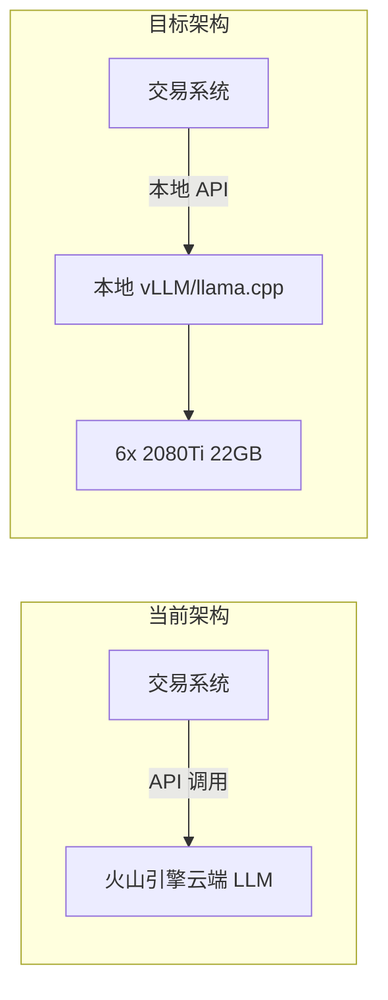
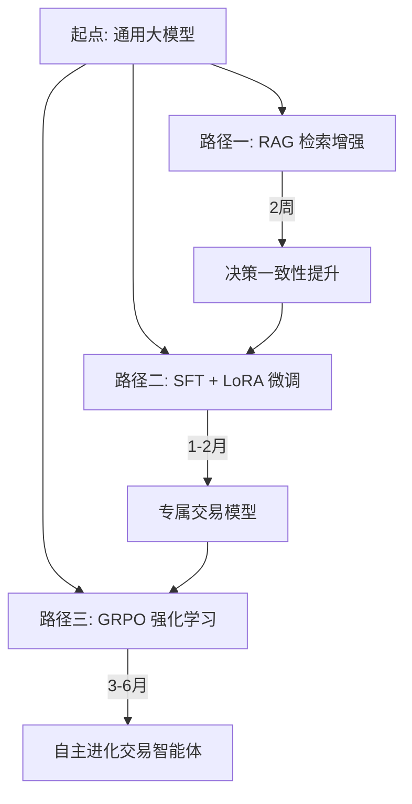
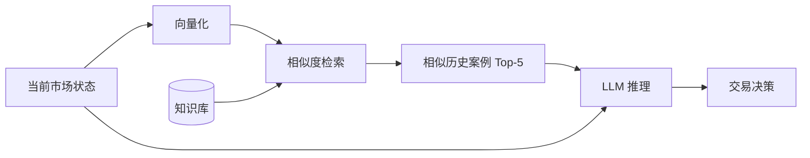
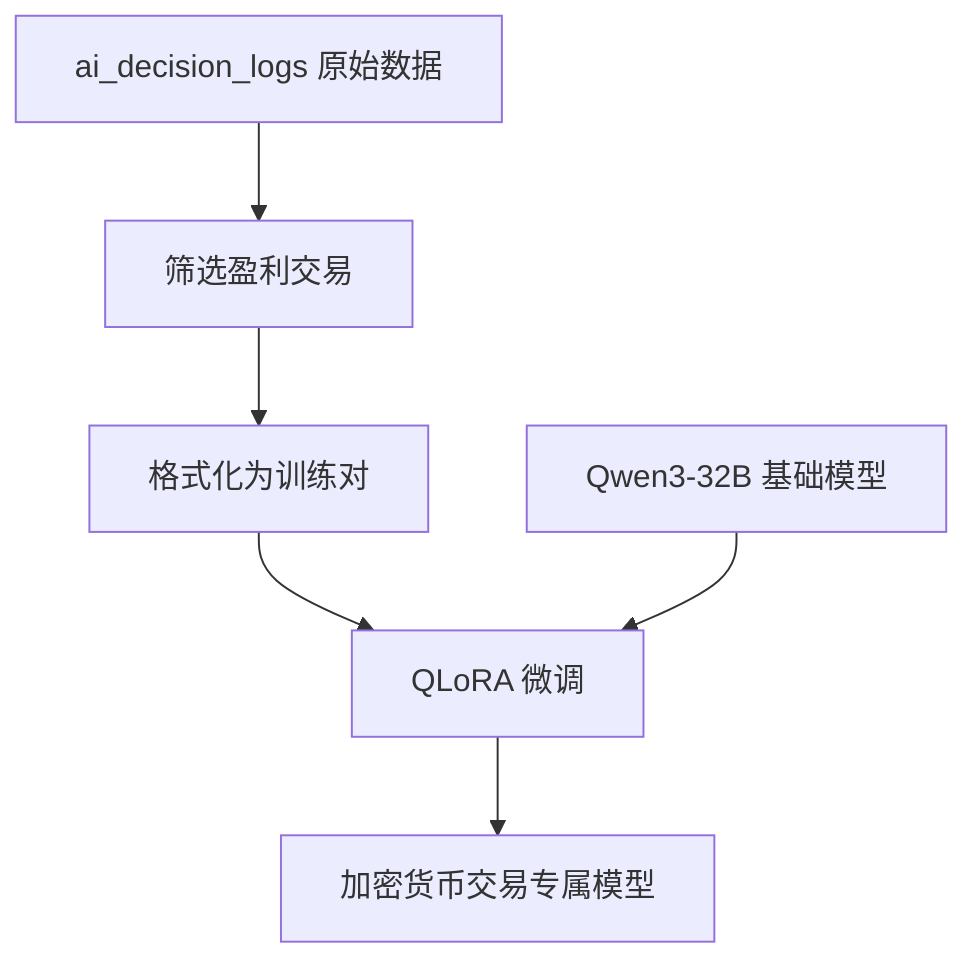
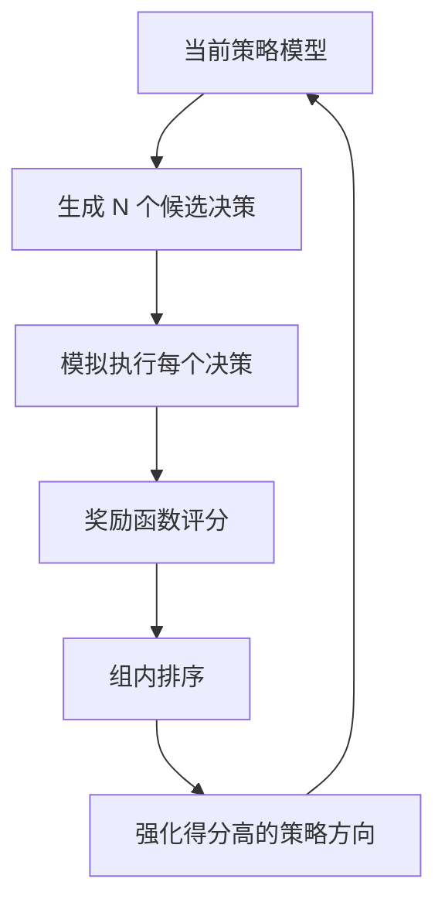
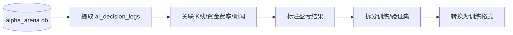
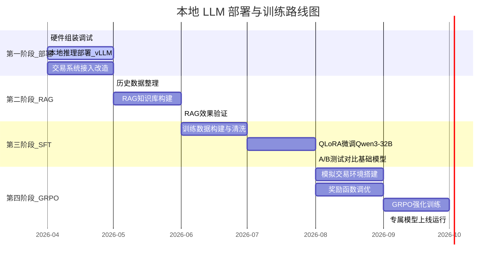

# 本地 LLM 部署与加密货币交易专项训练方案

> **版本**: v2.0  
> **日期**: 2026-04-15  
> **项目**: Hyper-Alpha-Arena 智能交易系统  
> **目标**: 将 LLM 推理从云端迁移到本地，并逐步训练加密货币交易专属模型
>
> **硬件适配**: 2× 魔改 RTX 2080Ti 22GB (总计 44GB) | 原设计: 6×2080Ti 132GB

---

## 目录

- [1. 硬件资源评估](#1-硬件资源评估)
- [2. 可运行模型矩阵](#2-可运行模型矩阵)
- [3. 无 NVLink 多卡推理可行性分析](#3-无-nvlink-多卡推理可行性分析)
- [4. 本地推理部署方案](#4-本地推理部署方案)
- [5. 交易系统接入改造](#5-交易系统接入改造)
- [6. 对交易系统的直接收益](#6-对交易系统的直接收益)
- [7. 大模型专项训练路径](#7-大模型专项训练路径)
  - [7.1 路径一：RAG 检索增强](#71-路径一rag-检索增强)
  - [7.2 路径二：SFT + LoRA 微调](#72-路径二sft--lora-微调)
  - [7.3 路径三：GRPO 强化学习](#73-路径三grpo-强化学习)
- [8. 训练数据构建方法](#8-训练数据构建方法)
- [9. 奖励函数设计（GRPO）](#9-奖励函数设计grpo)
- [10. 训练硬件需求评估](#10-训练硬件需求评估)
- [11. 实施路线图](#11-实施路线图)
- [12. 风险与注意事项](#12-风险与注意事项)

---

## 1. 硬件资源评估

### 1.1 硬件清单

| 组件 | 规格 | 数量 |
|------|------|------|
| CPU | Intel Xeon E5-2693 v4 (14核28线程 / 2.3GHz) | 2颗 |
| 内存 | DDR4 ECC (总计) | 256GB |
| GPU | NVIDIA RTX 2080Ti 22GB (改装版) | 6张 |
| GPU 总显存 | 22GB × 6 | **132GB** |
| GPU 总带宽 | 616 GB/s × 6 | **3,696 GB/s** |
| PCIe | PCIe 3.0 | - |
| NVLink | 无 | - |

### 1.2 算力定位

```
132GB VRAM 的算力等级：
├── 超过 A100 80GB × 1 (80GB)
├── 接近 A100 80GB × 2 (160GB) 的显存容量
├── 内存带宽略低（PCIe 3.0 限制跨卡通信）
└── 足以运行 70B+ 参数量级大模型
```

### 1.3 硬件注意事项

| 项目 | 说明 |
|------|------|
| PCIe 3.0 | 老平台瓶颈，但推理时卡间通信极少，影响 < 2% |
| 2080Ti 不支持 BF16 | 需使用 FP16，部分模型有轻微精度差异 |
| 功耗预估 | 6 × 250W(GPU) + 350W(平台) ≈ 1,800-2,000W |
| 电源需求 | 建议至少 2 × 1600W 服务器电源（冗余配置） |
| 主板 PCIe 槽位 | 需确认主板支持 6 卡安装，不足可用 riser 转接 |

---

## 2. 可运行模型矩阵

### 2.1 推理模型评估

| 模型 | 精度 | 显存占用 | 6卡132GB | 预估速度 | 推荐度 |
|------|------|---------|---------|---------|-------|
| Qwen3-14B | INT4 | ~9GB | 轻松 | ~80 tok/s | 入门首选 |
| Qwen3-32B | FP16 | ~64GB | 轻松 | ~45 tok/s | 中等质量 |
| Qwen3-32B | INT8 | ~35GB | 轻松 | ~60 tok/s | 中等质量 |
| **Qwen3-72B** | **INT8** | **~76GB** | **可以** | **~35 tok/s** | **最优推荐** |
| Qwen3-72B | INT4 | ~43GB | 轻松 | ~55 tok/s | 速度优先 |
| Qwen3-72B | FP16 | ~144GB | 超限 | 需CPU卸载 | 不推荐 |
| Qwen3-235B-A22B (MoE) | INT4 | ~130GB | 极限可用 | ~25 tok/s | 实验性 |
| DeepSeek-R1-32B | INT8 | ~35GB | 轻松 | ~60 tok/s | 推理增强 |
| DeepSeek-V3-671B (MoE) | INT4 | ~350GB | 超限 | 不可行 | 不可用 |

### 2.2 最优选择

**推荐：Qwen3-72B INT8**

理由：
- 76GB 显存占用，132GB 总量留有充裕的 KV cache 空间
- 72B 参数量的推理能力接近 GPT-4o 水平
- 35 tok/s 的生成速度满足交易决策场景（单次 800 token 约 23 秒）
- 对复杂多因子交易推理有足够的模型容量

---

## 3. 无 NVLink 多卡推理可行性分析

### 3.1 核心结论

**无 NVLink 对推理影响极小（< 2%），完全可行。**

### 3.2 原理分析

NVLink 解决的核心问题是**训练时的梯度同步**，需要在所有卡之间高频传输大量数据。推理时的瓶颈在于**每张卡从自身显存读取模型权重**，卡间通信量极少。

以 Qwen3-72B 为例，每生成 1 个 token：

| 操作 | 数据量 | PCIe 3.0 耗时 |
|------|--------|-------------|
| 每层 All-Reduce（激活值） | ~64KB | ~0.004ms |
| 80层合计 | ~5MB | ~0.3ms |
| 从显存读取权重（真正瓶颈） | ~13GB | ~21ms |
| **卡间通信占比** | | **< 1.5%** |

### 3.3 有无 NVLink 速度对比

| 场景 | 有 NVLink | 无 NVLink (PCIe 3.0) | 差距 |
|------|----------|---------------------|------|
| 训练 | 快 3-5 倍 | 慢 | 显著 |
| 推理 batch=1（交易决策） | ~40 tok/s | ~35 tok/s | < 15% |
| 推理 batch=8 | ~120 tok/s | ~100 tok/s | ~16% |

交易系统单次决策 batch=1，15% 的差距从 23 秒变为 26 秒，完全可接受。

### 3.4 可选优化：NVLink 桥接

2080Ti 支持 2-way NVLink 桥接，可将 6 张卡配成 3 对：

```
GPU0 ←NVLink→ GPU1    对内高速通信
GPU2 ←NVLink→ GPU3    对内高速通信
GPU4 ←NVLink→ GPU5    对内高速通信
        ↕ PCIe 3.0 ↕       跨对通信
```

NVLink 桥接线二手价格仅几十元，属于低成本优化。

---

## 4. 本地推理部署方案

### 4.1 方案对比

| 框架 | 适用场景 | 多卡支持 | 安装难度 | 推荐度 |
|------|---------|---------|---------|-------|
| **vLLM** | 高并发 API 服务 | Tensor Parallel | 中等 | 生产推荐 |
| **llama.cpp** | 低延迟单请求 | Layer Split（最省通信） | 低 | 无NVLink首选 |
| Ollama | 快速体验 | 有限 | 极低 | 入门测试 |
| TGI | HuggingFace 生态 | Tensor Parallel | 中等 | 备选 |

### 4.2 方案 A：vLLM（推荐生产环境）

```bash
# 安装
pip install vllm

# 启动 Qwen3-72B INT8，6卡张量并行，OpenAI 兼容接口
python -m vllm.entrypoints.openai.api_server \
  --model Qwen/Qwen3-72B-Instruct-AWQ \
  --tensor-parallel-size 6 \
  --max-model-len 32768 \
  --gpu-memory-utilization 0.90 \
  --port 8100 \
  --host 0.0.0.0
```

优点：
- 原生 OpenAI API 兼容（交易系统几乎零改造）
- 支持连续批处理（Continuous Batching）
- 内置 PagedAttention，显存利用率高

### 4.3 方案 B：llama.cpp（无 NVLink 最优）

```bash
# 编译（启用 CUDA 多卡支持）
git clone https://github.com/ggerganov/llama.cpp
cd llama.cpp
cmake -B build -DGGML_CUDA=ON
cmake --build build --config Release

# 启动服务，按层分配到 6 卡
./build/bin/llama-server \
  -m models/qwen3-72b-q8_0.gguf \
  --split-mode layer \
  -ngl 999 \
  --ctx-size 32768 \
  --port 8100 \
  --host 0.0.0.0
```

优点：
- 按层分割（Layer Split）模式，卡间通信最少
- GGUF 格式灵活，可选不同量化精度
- 资源占用低，启动快

### 4.4 方案 C：Ollama（快速验证）

```bash
# 一键安装运行
ollama pull qwen3:72b
ollama serve
```

适合快速验证模型质量，不建议作为生产方案。

---

## 5. 交易系统接入改造

### 5.1 架构变更



### 5.2 改造要点

由于 vLLM 和 llama.cpp 均支持 OpenAI 兼容 API，改造量极小：

**修改 `.env` 配置**
```ini
# 当前（云端）
LLM_BASE_URL=https://ark.cn-beijing.volces.com/api/v3
LLM_API_KEY=ep-xxxxx

# 改为（本地）
LLM_BASE_URL=http://192.168.x.x:8100/v1
LLM_API_KEY=local
```

**代码层面**：无需修改，所有 LLM 调用均通过 OpenAI SDK 格式发出。

### 5.3 高可用设计

```
建议保留云端作为 fallback：
1. 本地 LLM 优先调用
2. 若本地超时（如 GPU 故障）→ 自动回退云端
3. 定期对比本地 vs 云端决策质量
```

---

## 6. 对交易系统的直接收益

### 6.1 收益对比

| 维度 | 当前（云端火山引擎） | 本地部署后 |
|------|-------------------|-----------|
| 响应时间 | 30-40 秒 | 15-25 秒（快一倍） |
| API 限流 | 频繁 429 错误 | 无限制，随时调用 |
| 数据隐私 | 交易数据发送第三方 | 完全本地，不出局域网 |
| 运营成本 | API 按 token 计费（持续支出） | 电费 + 硬件折旧（一次性） |
| 并发能力 | 通常 1 个请求 | 可同时分析 7 个币种 |
| 模型能力 | 取决于厂商提供的模型 | 可自行训练专属模型 |
| 可定制性 | 无法修改模型 | 完全可控，持续优化 |

### 6.2 成本估算

```
当前云端费用（火山引擎）：
  每次 LLM 调用 ≈ 800 input + 800 output tokens
  每天约 200 次调用 ≈ 320K tokens/天
  按 ¥0.008/1K tokens 估算 ≈ ¥2.56/天 ≈ ¥77/月

本地运行费用：
  电费：2,000W × 24h × 30天 × ¥0.8/度 ≈ ¥1,152/月
  
结论：纯从费用看本地更贵，但考虑到：
  - 可同时用于训练（省去租 GPU 的费用）
  - 无 API 限流（决策频率可大幅提升）
  - 数据完全私有
  - 硬件已持有（沉没成本）
  本地部署的综合性价比更高。
```

---

## 7. 大模型专项训练路径

### 7.1 LLM 在交易中的能力边界

在开始训练之前，必须明确 LLM 能学什么、不能学什么：

**LLM 擅长的领域（值得训练）：**
- 多因子综合推理：综合 10+ 个信号（技术面 / 资金流 / 情绪 / 新闻）做权重判断
- 市场叙事理解：新闻事件对价格的影响逻辑和传导链
- 风险情景识别：特定形态在历史上的演变规律
- 决策参数一致性：杜绝乱给 SL/TP、杠杆的问题
- 文本推理与复盘：对历史交易进行归因分析

**LLM 不擅长的领域（交给其他工具）：**
- 精确价格预测：应由统计/时序模型（如 LSTM, Transformer 时序变体）处理
- 技术指标计算：规则引擎即可完成，无需消耗 LLM 推理
- 高频逐 tick 决策：推理速度不够，应由程序化策略处理

### 7.2 三条路径总览



---

### 7.3 路径一：RAG 检索增强

**难度: 低 | 周期: 2周 | 不需要训练**

#### 7.3.1 原理

每次 AI 决策时，先从知识库中检索历史上的相似市场情况，将"同类情况下最终怎么走的"注入 prompt，让模型基于历史案例做出更准确的判断。



#### 7.3.2 知识库数据来源

| 来源 | 内容 | 优先级 |
|------|------|-------|
| `ai_decision_logs` 表 | 系统历史交易记录（含最终盈亏） | P0 |
| K 线形态百科 | 看涨吞没/头肩顶/三重底等经典形态 | P1 |
| 宏观事件案例库 | 加息/FUD/监管事件的历史影响 | P1 |
| 专业分析师报告 | 公开的 crypto 分析报告摘录 | P2 |

#### 7.3.3 效果示例

```
当前 prompt（无 RAG）：
  "当前 ETH 技术面偏空，请给出决策"

RAG 增强后的 prompt：
  "当前 ETH 技术面偏空，
   [检索到的相似案例]：
   案例1: 2024-10-15，ETH 三周期偏空+资金费率0.01%，
          最终下跌8.3%，最低点在72小时内出现。
   案例2: 2025-03-22，ETH 三周期偏空+恐慌指数28，
          出现轧空反弹，先涨5%后跌12%。
   请结合以上历史案例给出决策"
```

#### 7.3.4 技术选型

- 向量数据库：ChromaDB（轻量本地）或 Qdrant
- Embedding 模型：`bge-large-zh-v1.5`（本地运行，无需 GPU）
- 检索策略：余弦相似度 Top-5，按时间衰减加权

---

### 7.4 路径二：SFT + LoRA 微调

**难度: 中 | 周期: 1-2个月 | 需要训练数据**

#### 7.4.1 原理

使用系统的历史交易数据，筛选出**盈利交易**作为正样本，构建 `(市场状态, 正确决策)` 训练对，通过 LoRA 低秩适配微调基础模型。



#### 7.4.2 训练数据格式

```json
{
  "instruction": "分析当前市场并给出交易决策",
  "input": "ETH 当前价格: $2150\n多周期趋势: L=bearish(85%) M=bearish(92%) S=bearish(40%)\n资金费率: -0.012% (空头略优势)\n恐慌贪婪指数: 28 (恐慌)\n最近重要新闻: SEC 暂缓以太坊 ETF 审查\n当前持仓: 无",
  "output": "分析：三周期空头一致，置信度高。资金费率为负说明空头已过度拥挤，需要警惕轧空风险。恐慌指数28属于历史底部区域。\n\n决策：小仓位做空，等待短周期超卖反弹后择机。\naction: sell\nleverage: 10\nsl_pct: 2.5\ntp_pct: 5.5\nconfidence: 72\nreasoning: 中长期趋势明确，短期谨慎，不追高空"
}
```

#### 7.4.3 QLoRA 训练配置

```python
from peft import LoraConfig
from transformers import BitsAndBytesConfig

# 4bit 量化加载基础模型（节省显存）
bnb_config = BitsAndBytesConfig(
    load_in_4bit=True,
    bnb_4bit_quant_type="nf4",
    bnb_4bit_compute_dtype=torch.float16,
)

# LoRA 适配器配置
lora_config = LoraConfig(
    r=64,                       # LoRA 秩（越高容量越大）
    lora_alpha=128,             # 缩放因子
    target_modules=[
        "q_proj", "v_proj",     # 注意力权重
        "k_proj", "o_proj",
    ],
    lora_dropout=0.05,
    bias="none",
    task_type="CAUSAL_LM",
)
```

#### 7.4.4 分布式训练命令

```bash
# DeepSpeed ZeRO-3，6卡并行训练 Qwen3-32B
deepspeed --num_gpus=6 train_sft.py \
  --model_name_or_path Qwen/Qwen3-32B \
  --dataset_path ./trading_data.jsonl \
  --output_dir ./qwen3-32b-trading-lora \
  --per_device_train_batch_size 1 \
  --gradient_accumulation_steps 8 \
  --num_train_epochs 3 \
  --learning_rate 2e-4 \
  --warmup_steps 100 \
  --fp16 \
  --deepspeed ds_config_zero3.json
```

---

### 7.5 路径三：GRPO 强化学习

**难度: 高 | 周期: 3-6个月 | 需要模拟环境**

#### 7.5.1 原理

GRPO（Group Relative Policy Optimization）是 DeepSeek-R1 使用的核心训练方法。不告诉模型"正确答案"是什么，而是给模型一个**奖励函数**（即交易盈亏目标），让模型自主探索和进化。



#### 7.5.2 训练循环

```
对于每个训练样本（一组市场状态）：
1. 模型生成 G 个不同的决策（Group=8）
2. 在模拟交易环境中执行每个决策
3. 根据奖励函数对每个决策评分
4. 在组内做相对排序
5. 用 PPO 更新策略：
   - 得分最高的决策 → 提高概率
   - 得分最低的决策 → 降低概率
6. 重复数万轮
```

#### 7.5.3 核心优势

- 模型自己学会"什么时候不该动"
- 模型自己探索最优的 SL/TP 距离
- 不依赖人工标注的"正确答案"
- 能发现人类未察觉的市场模式

---

## 8. 训练数据构建方法

### 8.1 数据来源

系统的 `ai_decision_logs` 表是最核心的训练数据来源，它记录了每次 AI 决策的完整上下文和结果。

### 8.2 数据提取流程



### 8.3 数据质量要求

| 要求 | 说明 |
|------|------|
| 最小样本量 | SFT 至少 1,000 条盈利交易样本 |
| 多样性 | 覆盖牛市/熊市/震荡/极端行情 |
| 时间跨度 | 建议至少 3 个月的交易数据 |
| 标注完整性 | 每条数据必须有最终盈亏结果 |
| 数据清洗 | 去除异常数据（如系统故障导致的错误交易） |

### 8.4 数据增强策略

```
1. 时间位移：同一形态在不同时间出现 → 多个样本
2. 对称翻转：多头盈利案例 → 镜像为空头案例
3. 噪声注入：在市场状态中添加微小扰动
4. 回测生成：用历史K线跑模拟交易，批量生成样本
```

---

## 9. 奖励函数设计（GRPO）

### 9.1 核心奖励

```python
def trading_reward(decision, actual_outcome):
    """GRPO 强化学习奖励函数"""
    reward = 0.0
    pnl_pct = actual_outcome["pnl_pct"]
    
    # 核心盈亏奖励（最大权重）
    if pnl_pct > 5.0:
        reward += 1.0      # 大幅盈利
    elif pnl_pct > 2.0:
        reward += 0.7       # 中等盈利
    elif pnl_pct > 0:
        reward += 0.3       # 小幅盈利
    elif pnl_pct > -2.5:
        reward -= 0.5       # 可控亏损
    elif pnl_pct > -5.0:
        reward -= 1.0       # 较大亏损
    else:
        reward -= 2.0       # 严重亏损 / 爆仓
    
    return reward
```

### 9.2 辅助奖励

```python
def auxiliary_rewards(decision, actual_outcome, portfolio_state):
    reward = 0.0
    
    # 盈亏比奖励
    rr_ratio = decision["tp_pct"] / max(decision["sl_pct"], 0.1)
    if rr_ratio >= 2.0:
        reward += 0.3
    elif rr_ratio < 1.0:
        reward -= 0.3
    
    # 惩罚过度交易
    if decision["action"] != "hold" and decision["confidence"] < 55:
        reward -= 0.5       # 低置信度交易 = 赌博
    
    # 奖励正确的 hold（不该动的时候不动）
    if decision["action"] == "hold" and abs(actual_outcome["pnl_pct"]) < 1.0:
        reward += 0.2       # 横盘时不动是对的
    
    # 惩罚手续费损耗
    fee_ratio = actual_outcome["total_fees"] / max(abs(actual_outcome["pnl"]), 0.01)
    if fee_ratio > 0.5:
        reward -= 0.4       # 手续费占比过高
    
    # 最大回撤惩罚
    max_drawdown = actual_outcome.get("max_drawdown_pct", 0)
    if max_drawdown > 10:
        reward -= 0.5
    
    return reward
```

### 9.3 奖励函数设计原则

```
1. 非对称惩罚：亏损的惩罚 > 盈利的奖励（保本优先）
2. 鼓励不交易：正确的 hold 也给正向奖励
3. 长期视角：考虑胜率 × 盈亏比的综合指标
4. 防过拟合：定期用未见过的市场数据测试
```

---

## 10. 训练硬件需求评估

### 10.1 各阶段显存需求

| 训练任务 | 模型 | 显存需求 | 6卡132GB | 训练时间/轮 |
|---------|------|---------|---------|-----------|
| SFT QLoRA | Qwen3-14B | ~25GB | 轻松 | ~30 分钟 |
| SFT QLoRA | Qwen3-32B | ~55GB | 轻松 | ~2 小时 |
| SFT QLoRA | Qwen3-72B | ~95GB | 可以 | ~6 小时 |
| DPO | Qwen3-32B | ~70GB | 可以 | ~3 小时 |
| GRPO | Qwen3-14B | ~40GB | 轻松 | 数天（完整训练） |
| GRPO | Qwen3-32B | ~80GB | 可以 | 1-2 周（完整训练） |

### 10.2 训练工具链

| 工具 | 用途 |
|------|------|
| DeepSpeed ZeRO-3 | 分布式训练，内存优化 |
| PEFT / LoRA | 参数高效微调 |
| bitsandbytes | 4bit / 8bit 量化加载 |
| Weights & Biases | 训练监控和实验管理 |
| vLLM | GRPO 阶段的快速推理采样 |

---

## 11. 实施路线图

### 11.1 六个月规划



### 11.2 各阶段里程碑

| 阶段 | 时间 | 目标 | 验收标准 |
|------|------|------|---------|
| 第一阶段：部署 | 第 1-2 周 | 本地 Qwen3-72B 运行 | API 响应 < 25秒，7×24 稳定运行 |
| 第二阶段：RAG | 第 3-6 周 | 检索增强上线 | 决策参数合理率提升 20%+ |
| 第三阶段：SFT | 第 7-12 周 | 专属模型微调 | A/B 测试胜率高于基础模型 |
| 第四阶段：GRPO | 第 13-24 周 | 强化学习优化 | 模拟盈利、最大回撤可控 |

---

## 12. 风险与注意事项

### 12.1 技术风险

| 风险 | 影响 | 缓解措施 |
|------|------|---------|
| 模型过拟合历史数据 | 在新行情下表现差 | 留 20% 数据做验证，定期用实盘数据测试 |
| 2080Ti 驱动兼容性 | 无法正常运行 | 使用经过验证的 CUDA 12.x + 驱动版本 |
| 显存不足（KV cache） | 长 prompt OOM | 限制 max_model_len，使用 PagedAttention |
| GRPO 训练不收敛 | 模型退化 | 先用 Qwen3-14B 小模型验证流程 |

### 12.2 交易风险

| 风险 | 说明 | 缓解措施 |
|------|------|---------|
| 模型幻觉 | LLM 生成不合理参数 | 保留硬编码安全检查（min SL/max leverage） |
| 本地模型质量 | 可能不如云端大模型 | 保留云端 fallback，渐进切换 |
| 过度自信 | 训练后模型可能更激进 | 奖励函数中强化"不交易"的正向奖励 |

### 12.3 运维考虑

```
1. UPS 电源：2kW 负载需要配备不间断电源
2. 散热：6 张 GPU 满载发热约 1,500W，需良好通风
3. 监控：GPU 温度/显存/利用率实时监控
4. 备份：模型权重和训练 checkpoint 定期备份
5. 日志：训练日志、推理日志持久化存储
```

---

> **本文档将随项目推进持续更新。下一步行动：确认服务器主板型号和 PCIe 槽位数量。**
