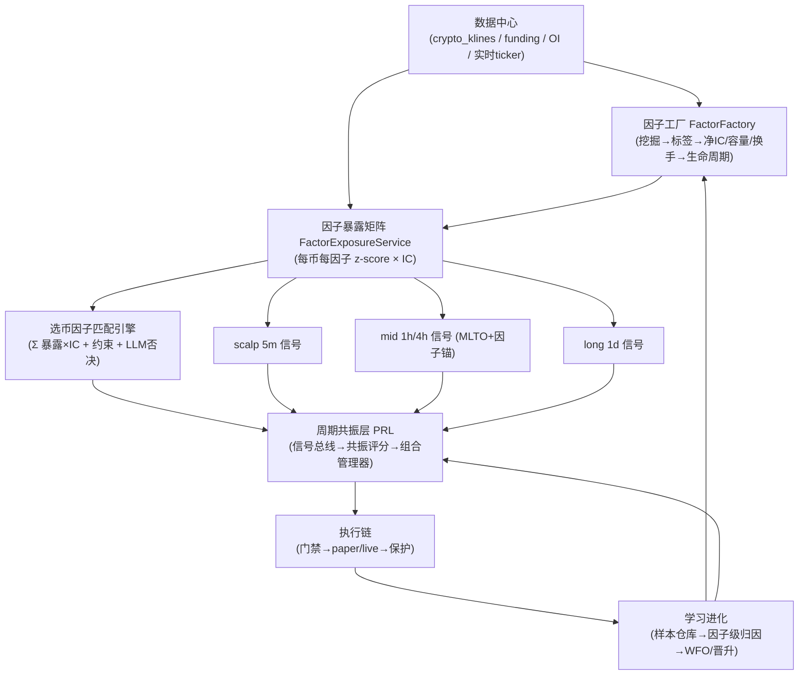
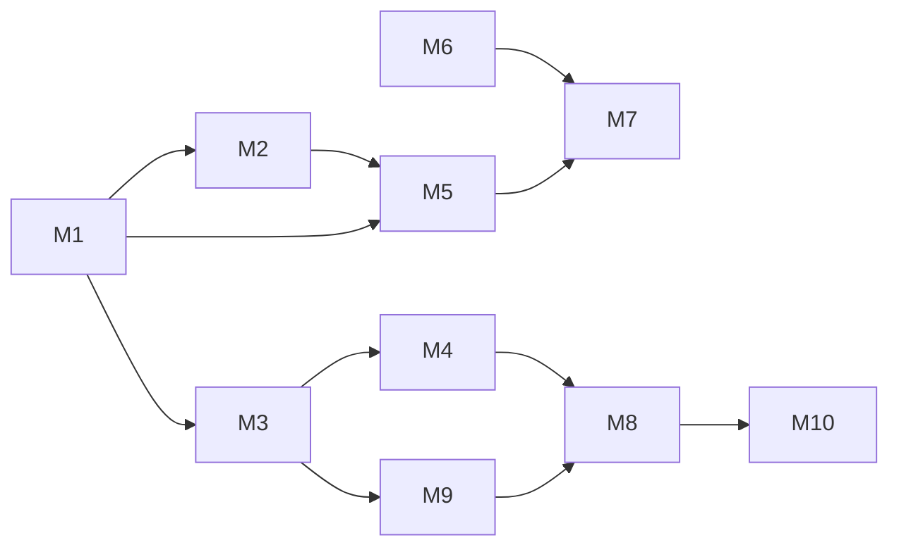

# 短期因子策略全链路升级设计文档（v1）

> 基于《短期因子策略全链路深度审查报告》（2026-08-01）撰写。
> 本文只做设计，不实施；每个模块都给出**可验证的验收标准与验证方法**，
> 便于按模块独立验证、独立回滚。

---

## 0. 设计原则

1. **先数据、后统计、再决策**：所有升级依赖的数据深度/质量前置（M1），
   否则任何新门禁都建立在噪声上。
2. **单一事实源**：因子状态（factor_active_set）、样本标签、回测报告、
   晋升统计都只写一份权威表，其他模块只读。
3. **可验证优先**：每个模块必须有自动化验收命令/查询，能回答
   "改没改、对不对、有没有生效"。
4. **渐进替换**：新增模块默认与旧路径并行（灰度开关），验证通过后切换默认值。
5. **不扩大实盘风险**：本轮设计不改变实盘下单行为；实盘相关改动只加
   统计/对账/门禁，全部默认关闭直到账户具备真实 Key。

---

## 1. 总体目标架构



---

## 2. 模块 M1：数据深度与数据中心收口

### 2.1 目标

- 5m/15m 短线回测与进化有 ≥30 天连续历史；1h/4h ≥180 天；1d ≥2 年。
- 全站 K 线读取统一走 `data_center.get_klines`（API 层已收口，本模块补内部直读点）。
- 数据中心具备"数据深度/新鲜度"可查询仪表。

### 2.2 设计

1. 历史深度提升：
   - `KLINE_P1_DEPTH_DAYS_1M`：1 → 30；新增 `KLINE_P1_DEPTH_DAYS_3M/5M/15M` 默认 30/60/90；
   - 用现有 `KlineHistorySync` 启动一次性回填任务（P2 池），按热币优先；
   - 回填进度写 `kline_sync_heartbeat`（pool=`p2_depth`）。
2. 内部直读点收口：审计 `rg "crypto_klines" backend/services` 中非
   data_center/kline_service 的直读点，改为调 `data_center.get_klines` 或
   `kline_data_service`（保持 kline_service 作为存储层实现，但业务代码不直连 SQL）。
3. 数据质量看板：新增 `GET /api/market/data-depth` 返回每个
   (exchange, period) 的覆盖天数、最新时间戳、缺口百分比。

### 2.3 验收标准

| # | 验收项 | 验证方法 |
|---|---|---|
| M1-1 | 5m 深度 ≥30 天 | `SELECT min(timestamp),max(timestamp),count(*) FROM crypto_klines WHERE period='5m' AND exchange='asterdex' AND symbol='BTC';` 覆盖 ≥30 天 |
| M1-2 | 1h 深度 ≥180 天 | 同上 period='1h' |
| M1-3 | 回填心跳存在 | `SELECT * FROM kline_sync_heartbeat WHERE pool='p2_depth' ORDER BY last_success_at DESC LIMIT 5;` |
| M1-4 | 直读点清零 | `rg "FROM crypto_klines" backend/services -g "*.py"` 仅出现在 data_center / kline_data_service / 历史回填内 |
| M1-5 | data-depth 接口 | `curl http://127.0.0.1:8000/api/market/data-depth` 返回各周期覆盖天数 |

---

## 3. 模块 M2：因子工厂升级

### 3.1 目标

- 因子挖掘从"单币随机搜索"升级为"多币横截面 + 行业级标签 + 成本感知"；
- 因子库治理收口：ACTIVE ≤50、全量复评、净 IC 门槛、容量/换手落库；
- 进化节奏与周期匹配：5m/15m 因子小时级权重，4h/1d 因子日/3日级。

### 3.2 设计

**3.2.1 标签升级**
- 接入已有 `labeling/triple_barrier.py`：
  `apply_triple_barrier(prices, events_index, config)`，upper/lower 用
  `daily_volatility` 归一；5m 因子 horizon 默认 12~24 bar；
- 增加 meta-labeling：先用规则/因子做粗标签，再用结果样本训练"是否值得交易"的二分类
  （复用 `ml/training_pipeline.py`）。

**3.2.2 多币挖掘**
- `_mine_candidates` 改为两阶段：
  1. 横截面初筛：取 N 个代表性币（BTC/ETH/SOL + 3 个高流动性山寨）分别随机搜索，
     候选按"跨币种平均 |IC| 前 K"入选；
  2. 纵向拟合：仅对通过初筛的候选做完整 IC/ICIR/DSR。
- 挖掘目标从单一 target 改为"每币各自 forward return + triple-barrier 标签"双评估。

**3.2.3 净 IC 与容量/换手**
- 评估流水线新增：
  - `net_ic = ic_mean - cost_drag`，cost_drag 由 `cost_model.py` 按换手率 × taker 费估算；
  - `turnover = mean(|factor_t - factor_{t-1}|)`；
  - `capacity_usd`：用该因子多空组合的日成交额占比估算（写入已有的
    `factor_active_set.capacity_usd` 列，目前该列是空的）；
- 晋升门槛（`LifecycleThresholds` 扩展）：
  `net_ic ≥ 0.02 且 DSR 显著 且 PBO ≤ 0.30 且 turnover 可承受（默认 ≤0.8/bar）`。

**3.2.4 治理收口**
- `factor_active_set` 强制约束：ACTIVE ≤50（超出按 last_evaluated_at + icir 淘汰）；
- 每轮进化对**全部 ACTIVE 因子复评**（当前只复评影子期因子），退化自动隔离；
- 新增状态字段：`last_net_ic`、`turnover`、`capacity_usd`、`evaluated_cycles`；
- 5m/15m 因子：`run_online_weight_update` 改为每小时执行（新调度任务）；
  4h/1d 因子保持日/3日。

### 3.3 配置项

```ini
FACTOR_ACTIVE_CAP=50
FACTOR_MIN_NET_IC=0.02
FACTOR_MAX_TURNOVER=0.8
FACTOR_MINER_SYMBOLS=BTC,ETH,SOL,ONDO,ZEC
FACTOR_MINER_MAX_ATTEMPTS=3000
FACTOR_FAST_WEIGHT_INTERVAL_S=3600
```

### 3.4 验收标准

| # | 验收项 | 验证方法 |
|---|---|---|
| M2-1 | ACTIVE ≤50 | `SELECT state,count(*) FROM factor_active_set GROUP BY state;` |
| M2-2 | 每因子有净IC/换手/容量 | `SELECT factor_id,capacity_usd,current_weight FROM factor_active_set WHERE capacity_usd IS NULL LIMIT 1;` 返回 0 行 |
| M2-3 | 每轮复评全部 ACTIVE | `factor_evolution_log` 每轮 EVALUATE 阶段 meta 含 `reviewed_active=全部数量` |
| M2-4 | 快权重小时级 | `SELECT * FROM factor_evolution_log WHERE phase='ONLINE_WEIGHTS' ORDER BY created_at DESC LIMIT 2;` 间隔 ≤2h |
| M2-5 | 标签升级生效 | 挖掘代码引用 `apply_triple_barrier`；单元测试 `test_triple_barrier_label` 通过 |

---

## 4. 模块 M3：因子暴露矩阵服务（FactorExposureService）

### 4.1 目标

为全站提供"任意币 × 活跃因子"的实时暴露快照，作为选币、scalp、mid/long 的共同数据底座。

### 4.2 设计

1. 新服务 `backend/services/factor_engine/exposure_service.py`：
   - 输入：symbol、period、count；
   - 输出：`[{factor_id, expr, z_score(最新), icir, net_ic, weight}]`；
   - 计算：从 `factor_active_set(ACTIVE)` 取表达式 → `expr.evaluate(fields)` →
     滚动 z-score（窗口=因子窗口×3）→ 乘 IC 得 `expected_alpha`；
   - 缓存 30s（暴露变化慢于价格），异常因子自动跳过并计数。
2. 落库 `factor_exposure_snapshots`（每 10 分钟、热币）供事后归因。
3. API：`GET /api/market/factors/exposure?symbol=BTC&period=5m`。

### 4.3 数据模型

```sql
CREATE TABLE factor_exposure_snapshots (
  id BIGSERIAL PRIMARY KEY,
  ts TIMESTAMPTZ NOT NULL DEFAULT now(),
  symbol VARCHAR(32) NOT NULL,
  period VARCHAR(8) NOT NULL,
  factor_id VARCHAR(64) NOT NULL,
  z_score DOUBLE PRECISION,
  expected_alpha DOUBLE PRECISION,
  weight DOUBLE PRECISION
);
CREATE INDEX idx_fexp_sym_time ON factor_exposure_snapshots(symbol, ts DESC);
```

### 4.4 验收标准

| # | 验收项 | 验证方法 |
|---|---|---|
| M3-1 | 接口可用 | `curl "http://127.0.0.1:8000/api/market/factors/exposure?symbol=BTC&period=5m"` 返回 ≥10 个因子 |
| M3-2 | 延迟 | 接口 P95 <200ms（缓存命中） |
| M3-3 | 落库 | `SELECT count(*) FROM factor_exposure_snapshots WHERE ts > now()-interval '15 minutes';` >0 |

---

## 5. 模块 M4：选币 = 因子匹配引擎

### 5.1 目标

把 `auto_coin_selector` 的主评分从"宏观代理变量 + LLM 主审"改为
"因子暴露 × 预期IC + 流动性/相关性约束 + LLM 否决/解释"。

### 5.2 设计

1. 评分公式（新增 `factor_match_score`）：
   `score = w1 * factor_match + w2 * market_score(原五维) + w3 * social`
   其中 `factor_match = Σ_i weight_i × z_score_i × net_ic_i`（来自 M3），
   默认 `w1=0.5, w2=0.4, w3=0.1`。
2. 相关性惩罚：候选池两两因子暴露相关性 >0.8 时，保留预期 alpha 高者。
3. LLM 审核降级：只有 `factor_match_score` 落在
   `[AUTO_COIN_LLM_LOW, AUTO_COIN_LLM_HIGH]` 模糊区间的币才送 LLM；
   高分直接放行、低分直接淘汰——LLM 调用量预计下降 50%+。
4. 盘中更新：暴露矩阵 5~10 分钟重算一次，币池按 `factor_match_score` 动态排序，
   新增 `AUTO_COIN_FACTOR_REFRESH_S=300`。

### 5.3 配置

```ini
AUTO_COIN_FACTOR_MATCH_WEIGHT=0.5
AUTO_COIN_LLM_LOW=0.45
AUTO_COIN_LLM_HIGH=0.75
AUTO_COIN_FACTOR_REFRESH_S=300
```

### 5.4 验收标准

| # | 验收项 | 验证方法 |
|---|---|---|
| M4-1 | 评分公式可解释 | `auto_coin_selections` 审计记录含 `factor_match_score` 与分解明细 |
| M4-2 | LLM 调用下降 | 对比开启前后 `AutoCoinSelector Cycle` 日志 `ai_review` 阶段耗时/币数下降 ≥50% |
| M4-3 | 因子命中率 | 注入币的 3 日 `factor_exposure_snapshots` 中 `expected_alpha>0` 的占比 ≥60% |
| M4-4 | 动态换血 | 日志出现 `AUTO_COIN_FACTOR_REFRESH_S` 周期重排事件 |

---

## 6. 模块 M5：回测 WFO 正式接线

### 6.1 目标

把孤立脚手架 `WalkForwardAnalyzer` 接入真实晋升/进化管线，形成
**"挖掘 → WFO → paper → canary → full"** 唯一验证链。

### 6.2 设计

1. 接线点：
   - `factor_evolution_loop._promote_factors` 晋升前：调用
     `WalkForwardAnalyzer(config).analyze(backtest_fn, param_grid, ...)`，
     `WFO_PURGE_DAYS=5, WFO_EMBARGO_DAYS=3, optimizer=optuna, run_cscv=True`；
   - `strategy_evolver._evolve_template` 的冠军产出后：跑一次 WFO 复核；
   - `backtest_event_trigger` 的事件回测：从简化单因子回放改为
     `pipeline_replay` 完整链（门禁/保护/分批/冷却对齐）。
2. 报告落库：新表 `walk_forward_reports`
   （subject_type/subject_id/periods/pbo/dsr/consistency/overfitting_score/params_json）。
3. 门禁：`pbo ≤ 0.30 且 overfitting_score ≥ 0.5 且 各窗口正收益比例 ≥ 60%` 才允许晋升。

### 6.3 数据模型

```sql
CREATE TABLE walk_forward_reports (
  id BIGSERIAL PRIMARY KEY,
  subject_type VARCHAR(16) NOT NULL,   -- factor/strategy
  subject_id VARCHAR(64) NOT NULL,
  run_at TIMESTAMPTZ NOT NULL DEFAULT now(),
  pbo DOUBLE PRECISION,
  dsr DOUBLE PRECISION,
  consistency DOUBLE PRECISION,
  overfitting_score DOUBLE PRECISION,
  n_periods INT,
  params_json JSONB,
  passed BOOLEAN
);
CREATE INDEX idx_wfr_subject ON walk_forward_reports(subject_type, subject_id, run_at DESC);
```

### 6.4 验收标准

| # | 验收项 | 验证方法 |
|---|---|---|
| M5-1 | 有真实调用点 | `rg "WalkForwardAnalyzer" backend/services -g "*.py"` 出现于 evolution/evolver/trigger |
| M5-2 | 报告落库 | 晋升事件后 `SELECT * FROM walk_forward_reports ORDER BY run_at DESC LIMIT 1;` |
| M5-3 | 门禁生效 | 构造 PBO>0.3 的退化参数，晋升被拒且 `passed=false` |
| M5-4 | 事件回测走完整链 | `backtest_trigger` 的 job meta 含 `chain=pipeline_replay` |

---

## 7. 模块 M6：模拟盘成本真实化

### 7.1 目标

paper 成交价与回测/实盘成本模型对齐，杜绝"模拟盘好、实盘亏"。

### 7.2 设计

1. `paper_exchange_simulator` 成交价接入 `cost_model.CostModel`：
   - 市价开仓：`fill = mark × (1 ± (taker_fee + slippage_rate(notional, nature)))`；
   - 止损：`fill = sl × (1 ± sl_slippage_mult × slippage_rate)`；
   - 挂单（限价）：maker 费率。
2. 由 `PAPER_COST_MODEL_ENABLED=true` 控制，默认开；灰度期可回滚。
3. 信号结算（scalp_signal_log 事后结算）同步使用同一成本口径，保证
   calibrator/meta-model 训练标签真实。

### 7.3 验收标准

| # | 验收项 | 验证方法 |
|---|---|---|
| M6-1 | 滑点生效 | 对比开启前后同一信号的开仓 `fill_price`：开启后 = mark×(1+费率+滑点) |
| M6-2 | 结算口径一致 | `scalp_signal_log` 结算字段与 paper_orders 的 fee+滑点差一致 |
| M6-3 | 可回滚 | `PAPER_COST_MODEL_ENABLED=false` 后成交价恢复原行为 |

---

## 8. 模块 M7：晋升管线与实盘准备

### 8.1 目标

- 晋升统计有最低样本门槛，杜绝 3 天噪声晋升；
- 实盘前置条件清单可一键检查（Key/对账/条件单验证）。

### 8.2 设计

1. `promotion_scan_service` 增加统计门槛：
   - 每因子/策略 `min_paper_trades=50`、`min_paper_days=7`、
     `min_canary_days=5`、`paper_net_sharpe ≥ 1.0`（用净收益口径）；
   - 不足样本一律返回 `insufficient_sample`，不再计算晋升。
2. 新表 `promotion_stats`（按 subject 聚合样本量、净收益、净 Sharpe、胜率、手续费占比）。
3. 实盘就绪检查：`GET /api/live/readiness` 返回
   [Key 配置、账户激活、C7 对账 drift=0、条件单回测通过、晋升样本充足] 五项。

### 8.3 验收标准

| # | 验收项 | 验证方法 |
|---|---|---|
| M7-1 | 样本门槛 | 样本 <50 单时 `promotion_scan_service` 日志 `insufficient_sample`，无晋升决策 |
| M7-2 | 统计落库 | `SELECT * FROM promotion_stats ORDER BY updated_at DESC LIMIT 5;` |
| M7-3 | readiness | `curl http://127.0.0.1:8000/api/live/readiness` 五项全绿才允许实盘开关 |

---

## 9. 模块 M8：周期共振层 PRL（核心）

### 9.1 目标

把三周期从"三个独立循环 + 反向缩仓约束"升级为
"统一信号总线 + 共振评分 + 分层组合管理 + 跨周期学习"。

### 9.2 设计

**9.2.1 周期信号总线**
- 新服务 `backend/services/portfolio/resonance_layer.py`，消费三路信号：
  - scalp：`scalp_loop` 的 `TradeProposal(tier="short")`；
  - mid：MLTO thesis / `MasterController` 的 `tier="mid"` proposal；
  - long：`tier="long"` proposal。
- 总线消息统一为 `PeriodSignal(symbol, tier, direction, confidence, ts, horizon)`，
  写入内存环形缓冲（复用 `market_data_hub._ring` 模式）。

**9.2.2 共振评分**

对每个 symbol 计算：
```
resonance = Σ_tier w_tier × direction_tier × confidence_tier
方向一致时叠加；不一致时相消；|resonance|≥阈值才允许开新仓。
```

- 同向（|resonance| 高）：允许满仓 + 持仓时限 ×1.5；
- 中性：缩仓至 50%；
- 反向：scalp 只允许"顺 mid/long 方向的均值回归对冲"或禁开；
- 保留现有 `scalp_mtf_constraint` 作为 PRL 的快速前置过滤器（双保险）。

**9.2.3 组合管理器**
- 按周期分层分配风险预算（默认）：scalp ≤30%、mid ≤40%、long ≤30%；
- 同一 symbol 的跨周期净敞口 ≤ 账户净敞口上限（复用 `rl/portfolio_risk_aggregator`）；
- 输出仍为 `TradeProposal`（兼容现有执行链，零侵入）。

**9.2.4 联动学习**
- 每笔共振交易落 `resonance_ledger`：`(symbol, resonance_score, 各周期方向/置信, 结果pnl)`；
- 周度归因：某周期组合的胜负按"同向/反向"分组统计，反馈给
  `run_online_weight_update` 的跨周期权重（新权重表 `resonance_weights`）。

### 9.3 配置

```ini
PRL_ENABLED=true
PRL_W_SCALP=0.35
PRL_W_MID=0.40
PRL_W_LONG=0.25
PRL_OPEN_MIN_RESONANCE=0.30
PRL_BUDGET_SCALP=0.30
PRL_BUDGET_MID=0.40
PRL_BUDGET_LONG=0.30
```

### 9.4 验收标准

| # | 验收项 | 验证方法 |
|---|---|---|
| M8-1 | 总线有信号 | `curl /api/portfolio/resonance/status` 返回每 symbol 的共振评分 |
| M8-2 | 同向加成 | 构造 scalp+mid 同向高置信：仓位 = 预算上限，时限×1.5 |
| M8-3 | 反向禁开 | 构造 scalp 与 mid 反向：无新开仓且日志 `PRL reversed block` |
| M8-4 | 预算不超 | 连续开仓后 `Σ 各周期 margin ≤ 预算×权益`（查询 paper/live 持仓聚合） |
| M8-5 | 联动学习 | `resonance_ledger` 有数据；周度任务产出 `resonance_weights` 更新记录 |

---

## 10. 模块 M9：中长线因子锚

### 10.1 目标

MLTO thesis 从"LLM 定性"升级为"量化因子锚 + LLM 解释/证伪"。

### 10.2 设计

1. `mlto/quant_layer.compute` 增加输入：该 symbol 的 1h/4h/1d 因子暴露（M3）；
   输出信号 = 规则信号 × 因子共振修正（同向 +confidence、反向 -confidence）。
2. `ThesisDTO` 增加字段：`factor_anchor = {factor_id, direction, z_score, net_ic, ts}`；
3. 证伪触发器：`factor_anchor.z_score` 反向越过阈值（默认 -1.5σ）
   或 `net_ic` 转负持续 3 次评估 → thesis 自动降级为 `watch`，
   不等止损（`MIDLONG_FACTOR_ANCHOR_ENABLED=true`）。

### 10.3 验收标准

| # | 验收项 | 验证方法 |
|---|---|---|
| M9-1 | thesis 带锚 | `mlto_theses` 行含 `factor_anchor` 非空 |
| M9-2 | 证伪触发 | 模拟因子反转：thesis 状态 `active→watch` 且日志 `factor_anchor_invalidated` |
| M9-3 | 可回滚 | 关闭开关后 thesis 行为与旧版一致 |

---

## 11. 模块 M10：学习进化收口

### 11.1 目标

统一样本仓库、因子级归因、RAG 本地化。

### 11.2 设计

1. 样本仓库 `trade_facts`（统一事实表）：
   每笔交易（paper/live）一行，含 `(ts, symbol, tier, factor_exposures json, gate_path,
   fill_model, fees, slippage, pnl, outcome)`；
   - 由 paper_engine/live_executor 的成交事件写入（事件源复用现有 event_sourcing）。
2. 因子级归因：`factor_pnl_attribution`——每笔盈亏按因子暴露分解
   （一阶：`pnl × z_i / Σ|z|`），周度聚合各因子"贡献 PnL / 命中率"；
   教训沉淀改用该归因结果（替代按币种/方向）。
3. RAG 本地化：`RAG_EMBEDDING_MODE=local`（本地 embedding 或离线向量库），
   启动自检 `GET /api/rag/status` 返回 `mode=local, healthy=true`；
   huggingface 不可用时不再降级 SQL 兜底，而是显式失败并告警。

### 11.3 验收标准

| # | 验收项 | 验证方法 |
|---|---|---|
| M10-1 | 事实表有数据 | `SELECT count(*) FROM trade_facts WHERE ts > now()-interval '1 day';` >0 |
| M10-2 | 归因产出 | 周度任务生成 `factor_pnl_attribution`，按因子 PnL 排序 |
| M10-3 | RAG 本地健康 | `curl /api/rag/status` 返回 `mode=local` 且 healthy |
| M10-4 | 教训来源 | `decision_feedback` 日报告引用因子归因块 |

---

## 12. 新增数据表汇总

| 表 | 归属模块 | 用途 |
|---|---|---|
| factor_exposure_snapshots | M3 | 因子暴露快照/归因 |
| walk_forward_reports | M5 | WFO 报告 |
| promotion_stats | M7 | 晋升统计样本 |
| resonance_ledger / resonance_weights | M8 | 共振交易与跨周期学习 |
| trade_facts / factor_pnl_attribution | M10 | 样本仓库与因子归因 |

`factor_active_set` 扩展列：`last_net_ic, turnover, evaluated_cycles`（已有 `capacity_usd`）。

---

## 13. 实施依赖与顺序（不排期）



- 第一批：M1（数据深度）→ M2（因子工厂）→ M3（暴露矩阵）；
- 第二批：M4（选币匹配）→ M5（WFO 接线）→ M6（成本真实化）；
- 第三批：M8（PRL）→ M9（中长线锚）→ M10（学习收口）→ M7（晋升/实盘就绪）。

每个模块独立灰度开关，验证通过再切默认；M7 的实盘就绪检查未全绿前，
实盘交易功能保持禁用。

---

## 14. 风险与回滚

| 风险 | 缓解 |
|---|---|
| 历史回填拖慢采集 | P2 池限并发（沿用现有 KLINE_P1_CONCURRENCY），回填失败自动重试 |
| 因子治理误杀 | 淘汰前 24h 冻结期 + `deactivated_at` 可查、一键恢复脚本 |
| 选币公式切换引入新币风险 | 灰度期双轨打分（旧/新并行），审计差异 7 天 |
| PRL 误判 | 默认只启用"约束与缩仓"档，共振加成档需 resonance_ledger 样本 ≥200 后自动开放 |
| 成本模型改变模拟盘表现 | `PAPER_COST_MODEL_ENABLED` 一键回滚，结算口径同步切换 |
| 实盘条件单风险 | readiness 未全绿禁止实盘；条件单回测验证通过前保持禁用 |

---

*设计文档 v1 完。每个模块的验收标准均可独立执行，适合按模块逐步验证。*
