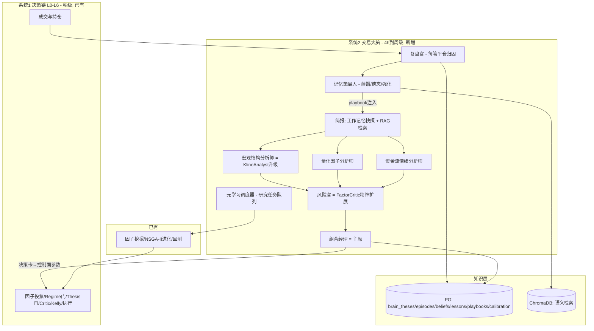

> **归一指针(2026-08-25)**: 本文档已被《统一设计与执行计划_LLM因子融合与交易大脑合并归一_V2.md》归一，执行以该文件为准；中长线 LLM 协同按统一文件 §3.2 的 LLM 2.0 升级引入口径执行（非恢复旧全栈 LLM）。
# 交易大脑：持续学习认知架构设计 V1（最终版）

> **日期**: 2026-08-25
> **状态**: 设计稿（先设计，后实施）
> **定位声明**: 本设计是《_LLM因子混合决策架构设计.md》的**认知/学习层姊妹篇**——那份管"这一仗怎么打"（L0-L7 决策链，Propose×Gate×Critic），这份管"怎么从每一仗里持续学习、谁可信、该学什么、下多大注"（大脑）。两份合起来才是完整系统：**决策架构是打法，大脑是成长**。
> **关联文档**: 《_LLM因子混合决策架构设计.md》《_LLM因子切换亏损根因调研报告.md》《交易学习链路审查与打通报告_20260822深夜.md》《交易AI深度进化方案.md》

---

## 0. 摘要（TL;DR）

1. **诊断**：001Alpha 已有完整的**参数级**学习闭环（因子挖掘/进化/晋升、Kelly、Prompt 进化、复盘库、衰减复检）与一份扎实的**混合决策设计**（LLM×因子七层），但缺少**认知级**能力：每笔交易不绑定"观点（thesis）"、无多智能体研判、无逐笔归因与反事实、无"该学什么"的元学习、无组合级仓位推理、无置信度校准。赚了亏了说不清为什么——这正是"资深交易员"与"规则机器"的差距。
2. **opencode 失败的机理**：上次把 opencode 当"深度分析大脑"，但它本质是**无状态一次性 sidecar**（OPENCODE_ENABLED=false、分析报告 6/28 停更、模型配置 v4-flash/v4-pro 不一致）：无持久信念、无记忆、无闭环、无信用分、且试图改生产代码（其自动收紧后被 withdraw，M0-L2-7）。方向（LLM 深度分析）是对的，形态错了。
3. **方案**：双层脑。**系统1 脊髓（保留）**：因子投票、门禁、Kelly、执行，秒级。**系统2 大脑（新增）**：交易委员会（多智能体研判+红队）、四层记忆（工作/情节/语义/程序）、复盘官（逐笔归因/反事实）、元学习调度器（研究资源分配）、仓位官（组合级下注）。大脑**只写控制面**（信念、软约束、预算、权重、playbook、研究任务），绝不直接改执行代码。
4. **可行性**：**诚实结论——公开领域不存在"自主交易+在线持续学习"的生产级先例**（Man/Two Sigma 只把 LLM 用在研究端）；但闭环的**每个零件**都有成熟先例（TradingAgents 辩论、FinMem 分层记忆、QuantAgent 想法-验证循环、AlphaEvolve 进化式策略发现）。本项目独有优势：已有真实纸面+实盘闭环做"学习操场"。现实目标是 6-12 个月内做成"投研 copilot + 复盘闭环 + 影子盘验证 + 小额实盘"，而非一步到位的全自主大脑。
5. **路线图**：M0 认知数据层 → M1 复盘大脑 → M2 委员会研判 → M3 记忆蒸馏检索 → M4 元学习调度 → M5 仓位大脑 → M6 自我进化整合。M0/M1 与《混合决策架构》P0 止血计划并行、互不阻塞；每步都有可验收标准，全程 shadow-first。

---

## 1. 现状诊断

### 1.1 已有的"脊髓"（✅ 运行中 / ⚠️ 半通 / ❌ 死链）

| 能力 | 现状 | 证据 |
|---|---|---|
| 因子挖掘/进化 | ⚠️ NSGA-II 冠军落库曾长期失败=进化空转真凶（已修 M0-E1）；条件口径评价（M0-C1）；quarantine→paper 晋升（M0-L5） | `factor_backtest_scorer.py`、`strategy_evolver.py` |
| 因子消费 | ⚠️ 仅**中线因子路由**真实生效；短线 scalp 档 0 active、100% 静态硬编码池（死链） | 《链路审查报告》§1.1 |
| LLM 决策链 | ⚠️ 已大面积**去 LLM 化**：长线 long_trend_v2 与中线 FactorRoute 均 0 LLM；`trading_analysts.py` 六分析师仅 KlineAnalyst+MasterController 真调 LLM | 《_LLM因子切换亏损根因调研报告》：**去 LLM 切换致亏损加速 4.6×**，五层根因结论=LLM 与因子互补非替代 |
| 交易复盘 | ✅ 平仓→`DecisionRetrospective`（3000+ 条）→`strategy_trades`→`strategy_memories` | RLS 断点已修 |
| 仓位 | ⚠️ `multi_symbol_kelly` 活跃；但仓位学习（DRL）**下线且无模型** | 下线正确，但"持仓多少"无人负责 |
| Prompt 进化 | ⚠️ 8/23 才端到端首通（`prompt_training_records` 0→1） | M0-L3/L4 |
| 门禁治理 | ✅ `RuntimeGovernor`+`decision_feedback` | 活跃 |
| 智能体底座 | ⚠️ QAA 框架有 7 张 trading AgentCard，**未接真实业务**；qaa_knowledge/qaa_memory 根目录为空 | QAA 文档 |
| 技术债 | ❌ 尺子问题（fill 虚高/PBO 分组错/DSR 口径）、paper 手续费断账（1081 笔只记 0.10）、.env 编码损坏、大量 .bak | 《混合决策架构》L0 全列 |

### 1.2 缺失的"大脑"（认知级，❌ 全缺）

| 缺失 | 后果 |
|---|---|
| 无 thesis 实体（交易不绑定"为什么开"） | 复盘只能看指标，分不清"判断错"还是"运气差" |
| 无多智能体研判（信号=因子机械投票） | 无观点碰撞、无红队，群体盲区无人指出 |
| 无逐笔归因与反事实 | 学习找不到最该改进的节点 |
| 无元学习（研究算力按固定调度，不由损失驱动） | "该学什么"无人负责 |
| 无组合级仓位推理（Kelly 机械聚合，无 regime 预算/相关性惩罚/共识折扣） | 波动率失控时整体不收缩 |
| 无置信度校准（agent/因子置信度从不与结果对账） | 自信但错的部分永不被淘汰 |
| 无持久信念（每次 LLM 分析从零开始） | 认知无法积累 |

### 1.3 opencode 失败复盘

- **证据链**：`opencode.json` 配置 plan/review/build 三 agent → 分析报告 **6/28 停更** → `OPENCODE_ENABLED=false` → 外部 CLI sidecar 依赖 → 模型配置不一致（v4-flash vs v4-pro）→ 其收紧建议被 withdraw（M0-L2-7）。
- **失败机理**：无状态（每次重头分析）、无记忆（教训不进知识库）、无闭环（提案→改代码→再提案，缺"验证我判断对不对"的回环）、无信用分（对错不影响下次权重）、风险形态错（改生产代码，越改越怕，只能收紧门禁——与"前期不怕亏钱"冲突）。
- **纠正**：① 大脑是 first-class 常驻服务（状态在 PG、记忆在 ChromaDB、调度器驱动闭环），不是 CLI sidecar；② 大脑学"信念/知识/预算/权重"而非改代码，代码级改进走 opencode plan→review 白名单提案（opencode 降级为受控执行手）；③ 一切分析输出必须事后验证（校准表+信用分），验证不了的分析自动降权——**这是"持续学习"与"一次性分析"的本质区别**。

### 1.4 与《LLM×因子混合决策架构》的分工（避免重复建设）

| 维度 | 混合决策架构（已有设计） | 本设计（交易大脑） |
|---|---|---|
| 回答的问题 | 这一仗怎么打（谁提案、谁放行、怎么出场、钱怎么分配） | 怎么从每一仗里学习（谁可信、该学什么、下多大注、何时换打法） |
| 时间尺度 | 秒级-4h 决策链 | 4h-周级认知环 |
| 核心产物 | L0-L7 决策链、P0-P4 计划 | 委员会、记忆、归因、元学习、仓位官、M0-M6 计划 |
| 关系 | 大脑的输出（决策卡/信用分/研究任务）**注入**它的 L2 regime、L3 thesis、L4 仲裁、L6 sizing | 它 L7"学习闭环"是大脑的**原料供给方**（双轨归因、trading_wisdom、prompt 进化） |

**结论：两份设计合成一个"会打仗 + 会成长"的系统；实施时先做 P0 止血（决策层）与 M0/M1 认知数据层（学习层），两者互不阻塞。**

---

## 2. 设计哲学

### 2.1 双层脑（System 1 / System 2）

```
┌────────────────────────────────────────────────────────────┐
│ 系统2 大脑（新增，4h~周级）                                  │
│ 委员会研判 → 决策卡 → 复盘归因 → 蒸馏记忆 → 元学习调度         │
│ 输出：信念库、软约束、预算、权重、playbook、研究任务           │
└────────────────────────┬───────────────────────────────────┘
                         │ 只写"控制面"，不动执行代码
┌────────────────────────▼───────────────────────────────────┐
│ 系统1 脊髓（保留，秒级）：LLM×因子混合决策七层 L0-L6           │
│ 因子投票 → Regime/Thesis 门 → Critic → Kelly → 执行          │
└────────────────────────────────────────────────────────────┘
```

**大脑不直接开单，大脑决定"信什么、学什么、下多大注、让谁来下注"；脊髓负责"按规则开单"。** 大脑的任何 bug 只会让系统变笨，不会失控下单。

### 2.2 资深交易员的心智循环（本设计原型）

看市场（regime）→ 形成观点（thesis）→ 按信念下注（sizing）→ 平仓复盘（运气 vs 技能）→ 更新 playbook → 长期知道自己擅长什么（edge map）→ 只打擅长的仗（focus）→ 控制回撤（risk）。

### 2.3 六条铁律（在《混合决策架构》7 铁律之上补充认知层纪律）

1. **控制面隔离**：大脑只写信念/软约束/预算/权重/playbook/研究任务；执行代码只接受 opencode 白名单提案（plan→review→批准）。
2. **影子盘晋升**：任何新知识/参数先进影子盘，成本后统计显著才晋升；晋升后仍受衰减复检兜底。
3. **信念可追溯**：每个决策绑定 thesis_id，可审计"当时为什么这么想"。
4. **学习有预算**：LLM token 分层计费、调用配额、每周参数变更数量与幅度上限。
5. **永远有基线**：frozen baseline 对照，进化版跑输自动回滚。
6. **成本后衡量一切**：学习信号只用真实成交/纸面成交（9-21bp 摩擦建模），回测只用于生成假设——**不用回测幻觉当学习信号**。

---

## 3. 总体架构（叠加在七层决策架构之上）



---

## 4. 多智能体委员会设计

### 4.1 成员（尽量复用现有组件，升级而非新建）

| 成员 | 角色 | 复用/升级现有组件 | 输出 | 信用分维度 |
|---|---|---|---|---|
| 宏观结构分析师 | regime 判断 | **升级 KlineAnalyst**（本地 14B，已在跑）输出结构化"regime 标签+置信度+依据" | regime 状态+持续期预测 | regime 命中率+Brier |
| 量化因子分析师 | 因子健康度 | 新 agent，吃因子健康面板 | 哪些因子可信/衰减、各 regime 有效集 | 推荐因子事后表现 |
| 资金流情绪分析师 | 方向与情绪 | 新 agent，吃 funding/OI/CVD/链上/新闻 | 方向倾向、情绪极端度 | 方向命中率校准 |
| 风险官（红队） | 挑战每个观点 | **FactorCritic 精神扩展**（本地 35B MoE，cite-or-reject 已实现） | 反证、"错了的代价"、否决/折扣 | 警告命中率 |
| 组合经理（主席） | 最终决策卡 | 新 agent（复用 MasterController 的聚合位置） | 风险预算、仓位上限、倾斜/暂停清单 | 组合决策事后回报 |
| 复盘官 | 逐笔归因 | 新 agent，挂 LearningLoopService 平仓批处理之后 | 运气vs技能分解、反事实 | 归因与后续结果一致性 |
| 记忆策展人 | 知识管理 | 扩展 `trading_wisdom`/`strategy_memories` 的上游 | 蒸馏/遗忘/强化、playbook | 检索命中质量 |
| 元学习调度器 | 研究资源分配 | 扩展 `evolution_scheduler` | research_tasks+算力预算 | 学习 ROI |

### 4.2 三档节奏

| 档 | 频率 | 内容 | LLM 用量 |
|---|---|---|---|
| 快 | 秒-分钟 | 执行层照旧，大脑不参与 | 0 |
| 中 | 4h + 事件触发（regime 剧变） | 委员会研判会；每笔平仓触发复盘官 | 每会 ~10-20 次 |
| 慢 | 周/月 | 元学习周会：蒸馏、重算信用分、再分配研究预算、策略晋升/退役、大脑自检 | ~30-50 次 |

### 4.3 研判会流程（防从众）

1. **简报**：记忆策展人给每个 agent 同样的记忆注入（工作记忆快照 + top-k 相关 playbook/历史相似 regime episodes）——保证认知连续性。
2. **独立观点**：三分析师并行、互不可见（防随大流）。
3. **红队挑战**：风险官逐条找反证（prompt：假设该观点是错的，找证据；cite-or-reject 强制引用字段）。
4. **反驳与更新**：分析师可反驳一轮，更新置信度。
5. **决策卡**（组合经理综合"观点 × 信用分 × 分歧度"，落 `brain_theses` 表）：regime 判断、共识度、组合风险预算、每策略/币种仓位上限、倾斜与暂停清单、known_unknowns、bear_case（失效条件）。
6. **下发控制面**：决策卡翻译为门禁参数/权重/Kelly 上限（全部可回滚参数），经既有 decision_feedback/RuntimeGovernor 通道生效——与《混合决策架构》L2/L3/L4 无缝对接。
7. **滞后验证**：下轮会议开场先给上轮决策卡打分 → 更新各成员信用分。

### 4.4 分歧度与信用分（"多 agent 夹持"的量化）

- **分歧度** = 观点向量的离散度。分歧高 → 仓位折扣 + 自动生成"信息缺口"研究任务（分歧 = 我们不知道）。
- **信用分** = 滚动可靠性校准（每档置信度对应实际命中率，Brier score）。指数衰减加权。
- **淘汰**：连续 N 轮校准显著差于随机 → 降权到影子（观点只记录不下发）+ 触发其 prompt 进化（复用现有 prompt 进化链路）——**大脑的每个脑区也被学习系统评估和进化，这就是"持续学习的大脑"**。

---

## 5. 记忆系统（四层）

### 5.1 数据模型（新增 brain_* 表，不回改旧表）

| 表 | 内容 | 生命周期 |
|---|---|---|
| `brain_theses` | 决策卡：regime 信念、预算决策、horizon、状态（active/expired/falsified）、事后评分 | 永久（审计） |
| `brain_episodes` | 逐笔情节：trade_id→thesis_id、决策链快照（各 agent 当时观点）、结果、归因 JSON、反事实 JSON | 永久（学习原料） |
| `brain_beliefs` | 当前活跃信念，带版本与 TTL | 旧版归档 |
| `brain_lessons` | 教训：文本+embedding+来源 episode+确认数/矛盾数 | 蒸馏/遗忘 |
| `brain_playbooks` | 程序记忆：regime→行为准则（结构化，可 prompt 注入） | 版本化 |
| `brain_agent_calibration` | 各 agent 滚动校准表 | 滚动窗口 |
| `brain_research_tasks` | 研究任务：类型/来源/预算/状态/ROI | 任务生命周期 |

唯一侵入点：开单时把 thesis_id 写入 trade 记录（新增可空外键）。`strategy_trades`/`strategy_memories`/`DecisionRetrospective` 原样保留为原料层。

### 5.2 蒸馏 / 遗忘 / 强化（weekly distill，参考 Generative Agents 反思 + MemGPT 整合 + FinMem 衰减）

- **强化**：新 lesson 与旧 lesson 向量相似 → 合并，确认数+1；过阈值 → 晋升 playbook 条目。
- **遗忘**：与最新数据矛盾 → 降权/归档（非平稳市场里旧经验必须可过期）；长期未检索 → 归档。
- **防回音室**：蒸馏强制引入反例证据（该 lesson 失效的 episodes），否则错误认知自我强化。
- 人工可介入：每周产出"认知变化清单"（晋升了什么、遗忘了什么）。

### 5.3 检索注入（RAG）

- 每次研判会前检索与当前 regime 特征最相似的 playbook/历史 episodes（正反例）/lessons，结构化注入各 agent prompt（复用 `get_prompt_injection` 通道扩展）。
- **A/B 验证**：带/不带记忆 paper 对照；无显著增益则默认不注入——记忆不是免费的，噪声记忆伤害决策。

---

## 6. 学习信号：怎么知道"该学什么"

| # | 信号 | 来源 | 驱动的学习动作 |
|---|---|---|---|
| 1 | 亏损归因聚类 | 复盘官逐笔归因（原因标签：regime 误判/执行滑点/因子失效/流动性不足/纪律违反） | 最大亏损源 → 生成研究任务（例：30 笔亏损 60% 归因 regime 误判 → 强化 regime 分类学习） |
| 2 | Edge decay 监测 | 因子/策略滚动 IC/夏普（沿用衰减复检，扩展"衰减归因"：市场变了 vs 因子结构失效） | 衰减→重训/退役；恢复→加权重 |
| 3 | 分歧度 | 委员会观点离散度 | 持续分歧议题=信息不足→数据补齐/研究任务 |
| 4 | 反事实 | 复盘官模拟替代路径（听风险官的/不倾斜/仓位减半） | 量化每决策节点边际贡献→校准信用分+生成仓位 lessons |
| 5 | 校准监测 | agent 置信度 vs 实际结果 | 校准差→降权+prompt 进化；校准好→加信用分 |
| 6 | 探索-利用预算 | 固定比例资本/算力预算 | 新假设探索（影子盘）vs 已验证 edge（如 20/80） |
| 7 | 学习 ROI | 每条 lesson/研究任务落地后影子盘对照其声称的改进 | 兑现→保留强化；未兑现→撤销（学习系统自身问责制） |

**核心洞察**：`brain_research_tasks` 队列把"该学什么"变成一等公民——今天因子挖掘按固定调度跑，明天由亏损归因、分歧度、edge decay 三个信号**竞价**研究算力。这就是"知道自己哪里不懂，去补哪里的课"。

---

## 7. 仓位大脑：持仓多少

**与《混合决策架构》L6 对齐**：L6 已定 EV Governor、fractional Kelly（f=0.25）、vol targeting、回撤调控——**大脑在其上叠加"组合级认知折扣"**：

```
实际仓位 = 基础份额(L6: f·Kelly × vol缩放 × 回撤乘数)
          × 共识度折扣 × 主席信用分因子 × regime适配因子 × 相关性惩罚
```

| 因子 | 含义 |
|---|---|
| 共识度折扣 | 委员会分歧越大下注越小（共识<0.5 减半） |
| 信用分因子 | 决策者历史校准映射 [0.7, 1.0] |
| regime 适配 | 高波动/震荡 regime 收缩总风险预算（波动率目标制度） |
| 相关性惩罚 | 同方向持仓集中 → 整体降杠杆 |

**仓位本身也是学习对象**：复盘官对每笔计算"仓位最优性"（若按最优仓位会怎样），生成 position-sizing lessons 反哺折扣参数（DRL 保持下线，仓位学习走"规则+统计+归因"路径——可解释、可回滚）。凯利/Conformal Kelly 文献的结论：**校准差的信念必须自动缩小仓位**——这就是把 §4.4 信用分与仓位挂钩的理论依据。

---

## 8. 竞品先例与可行性

### 8.1 诚实结论（调研所得）

**公开领域不存在"自主交易 + 在线持续学习"的生产级先例。** 产业界（Man Group、Two Sigma）只把 LLM 用在**研究端**（信号发现/因子研究），执行与学习仍在有统计纪律的传统管线里。开源界的 agentic trading 项目几乎都是"多 agent 一遍式分析 + 回测演示"，没有记忆、没有学习闭环——代表是 [ai-hedge-fund](https://github.com/virattt/ai-hedge-fund)（53k star）：无记忆、无持续学习、存在未来函数污染回测的典型。

### 8.2 闭环的每个零件都有成熟先例

| 零件 | 先例 | 链接/出处 | 借鉴点 |
|---|---|---|---|
| 多智能体辩论 | TradingAgents（ACL 2024） | [arXiv 2412.20138](https://arxiv.org/abs/2412.20138) · [GitHub](https://github.com/TauricResearch/TradingAgents) | 分析师/研究员/交易员/风控辩论+反思，动态调信念；其"bull/bear 辩论"=分歧度量化雏形；教训=LLM 决策不可复现，须影子验证 |
| 分层记忆+遗忘 | FinMem | [arXiv 2311.13743](https://arxiv.org/abs/2311.13743) | 工作/情景/语义三层+记忆衰减，直接对应本设计 §5 |
| 想法-验证内部循环 | QuantAgent（ICLR 2024） | [arXiv 2402.03755](https://arxiv.org/abs/2402.03755) | Writer/Judge 循环自产自评 alpha 思想并写代码验证=元学习调度器原型 |
| 进化式策略发现 | AlphaEvolve / EvoQuant | [AlphaEvolve arXiv 2506.13879](https://arxiv.org/abs/2506.13879) | **LLM 突变 + 客观打分 + 进化**——策略用代码表达，回测做 fitness（比自然语言策略靠谱） |
| 评估纪律 | Qlib / FinRL | [Qlib](https://github.com/microsoft/qlib) · [FinRL](https://github.com/AI4Finance-Foundation/FinRL) | walk-forward、deflated Sharpe、PBO 的工业级标准（对应本项目的尺子修复） |
| 多 agent 分工模板 | ai-hedge-fund | [GitHub](https://github.com/virattt/ai-hedge-fund) | 委员会成员分工与组合经理聚合结构可抄；但其无记忆/未来污染问题必须反着做 |

### 8.3 可行性判断（本项目落地版）

1. **可行，且分层可行**：M1 复盘大脑零风险起步（只加归因记录，不碰执行）；M2 起逐步放大认知自主权。
2. **本项目的独特优势**：已有真实纸面+实盘闭环、真实成交、真实摩擦成本——学术界和开源 demo 普遍没有的"学习操场"。别人的多 agent 系统死在回测幻觉上，本项目可以用真钱（纸面）验证大脑的每一步。
3. **必须证明而非假设**：多智能体研判的增量价值、RAG 记忆的增量价值，必须经影子盘 A/B + 校准曲线证明；证明不了就降级。**让无信息量组件自然出局**——这是"稳定持续学习"的保障。
4. **现实 MVP（6-12 个月）= 投研 copilot + 复盘闭环 + 影子盘验证 + 小额实盘**，而非一步到位的全自主大脑。这与《混合决策架构》P0-P4 的渐进路线完全同构。

---

## 9. 学术论文与设计启示

### 9.1 LLM 多智能体交易/金融

| 论文 | arXiv | 启示 |
|---|---|---|
| TradingAgents (ACL 2024) | 2407.20138 | 委员会辩论结构；LLM 不可复现→影子验证 |
| FinAgent | 2402.18485 | 多模态基础智能体交易 |
| FinMem | 2311.13743 | 分层记忆+衰减（§5 蓝本） |
| FinCon | 2407.06567 | 概念级金融智能体（framework/concept 分层） |
| QuantAgent (ICLR 2024) | 2402.03755 | Writer/Judge 内部 alpha 循环（元学习蓝本） |
| AlphaAgent | 2502.16789 | 自改进金融分析智能体 |
| FinGPT | 2306.06031 | LLM 金融开源生态与数据管线 |
| TradingGPT | 2309.03736 | 多层记忆的交易 LLM 智能体 |
| CogAgen | 2501.10136 | 认知智能体 + 策略库 |
| StockAgent (TIST) | 2407.18957 | 多智能体股市行为模拟 |

### 9.2 反思与自进化（大脑怎么从错误中学习）

| 论文 | arXiv | 启示 |
|---|---|---|
| Reflexion | 2303.11366 | 语言化强化学习：失败经验写成文本注入下次尝试→复盘官教训文本机制 |
| Self-Refine | 2303.17651 | 同一模型自反馈迭代→"观点→红队→反驳"结构 |
| Voyager | 2305.16291 | 技能库+自动课程：成功经验沉淀为可复用 skill→playbook 程序记忆蓝本 |
| ExpeL | 2308.10144 | 经验库跨任务迁移→教训跨币种/跨 regime 迁移 |
| Agent-Pro | 2402.17574 | 按任务动态调整信念与策略→agent 行为随 regime 自适应 |
| LATS | 2310.04406 | 语言智能体 MCTS→研判会多路径推演 |
| Eureka | 2310.12931 | LLM 写奖励函数+进化→LLM 参与学习目标设计（元学习） |
| Self-Evolving Agents 综述 | 2404.14387 | 自进化智能体方法论全景 |

### 9.3 持续学习与非平稳性（"一次分析不行"的理论依据）

| 论文 | arXiv | 启示 |
|---|---|---|
| EWC | 1612.00796 | 渐进更新防灾难性遗忘→知识更新必须渐进+版本化 |
| DoubleAdapt (KDD 2023) | 2306.09862 | 金融序列概念漂移自适应→regime 门控+漂移触发再学习 |
| 概念漂移/变点检测经典（ADWIN/Hamilton 等） | — | 漂移检测触发"该重新学什么" |

### 9.4 记忆机制

| 论文 | arXiv | 启示 |
|---|---|---|
| Generative Agents | 2304.03442 | 记忆流+反思+计划→weekly distill 机制 |
| MemGPT | 2310.08560 | 分层记忆管理→四层记忆结构 |
| A-MEM | 2502.12110 | 智能体记忆建模（Zettelkasten 式）→lesson 关联组织 |
| MemoryBank | 2305.10250 | 记忆库与记忆巩固（Ebbinghaus）→遗忘曲线调度 |

### 9.5 学习信号与资金纪律

| 主题 | 出处 | 启示 |
|---|---|---|
| Deflated Sharpe + PBO（CSCV） | Bailey & López de Prado | 晋升闸门必须用 deflated Sharpe/时间切分 PBO（本项目尺子修复的理论依据） |
| Meta-labeling / purged walk-forward | AFML | 样本外+成本后+多路径的学习信号纪律 |
| 反事实/后悔 | HER、ARCHER | 复盘官反事实分析的理论工具 |
| 凯利/分数 Kelly/Conformal Kelly | 经典 | 校准差的信念自动缩仓（§7 理论依据） |

### 9.6 进化式策略发现

| 论文 | arXiv | 启示 |
|---|---|---|
| Evolution through Large Models | 2206.08896 | LLM 变异+进化（策略基因库的变异方向由 LLM 提供） |
| FunSearch (Nature) | 2312.13643 | LLM 进化发现数学/程序结构→alpha 表达式发现范式 |
| AlphaEvolve | 2506.13879 | 工程级 LLM 进化式发现（code 表达 + 客观 fitness） |

**综合设计启示 Top 10**（翻译成工程机制）：
1. 失败经验写成文本注入（Reflexion）→ 复盘官教训进 prompt 软约束；
2. 成功经验沉淀为技能（Voyager）→ playbook 程序记忆；
3. 分层记忆+遗忘（FinMem/MemGPT/A-MEM）→ 四层记忆 + weekly distill；
4. 多智能体辩论防从众（TradingAgents）→ 独立观点+红队+反驳；
5. 想法-验证内部循环（QuantAgent）→ 元学习调度器闭环；
6. 非平稳要求可证伪知识（EWC/DoubleAdapt）→ lessons 降权/归档 + regime 门控；
7. 样本外+成本后+多路径（PBO/AFML）→ 学习信号只用真实/纸面成交；
8. 校准是下注前提（Kelly/Brier）→ 信用分×仓位折扣；
9. 语言化 RL 优于盲目参数微调（可解释性）→ 初期学知识与信念而非改模型权重；
10. 无信息量组件自然出局（A/B+校准淘汰）→ 每个脑区都有淘汰机制。

---

## 10. 技术落地：与既有计划的衔接

### 10.1 接入方式（不推翻任何现有组件）

| 现有组件 | 大脑怎么接 |
|---|---|
| `LearningLoopService` | 平仓批处理尾部挂"复盘官"钩子 → episode+归因 |
| `trading_analysts.py` / KlineAnalyst | 升级为委员会成员（结构化输出），新增因子/情绪分析师 |
| `mlto` 包（thesis_store/debate_layer，现仅 tests 引用） | thesis 存储与辩论层直接复用为 brain_theses 的底座 |
| `strategy_learning_service` | prompt 进化样本源扩展为 episodes/lessons |
| `evolution_scheduler` | 新增研究任务队列调度源（元学习竞价） |
| `multi_symbol_kelly` + EV Governor | 其上层加"仓位官折扣层"（§7），不改底层 |
| `RuntimeGovernor`/`decision_feedback` | 决策卡翻译为门禁参数走既有通道 |
| QAA 框架（7 张 trading AgentCard 未接业务） | 新增 trading 域真实 handler；EventBus 跑研判流程；durable workflow（PG）保证会不中断 |
| opencode | 降级为受控执行手：白名单补丁提案 |
| `/api/learning/health` | 扩展"大脑健康面板"：校准曲线、学习 ROI、归因覆盖率、信用分排行 |

### 10.2 与《混合决策架构》P0-P4 的排期关系

```
P0 止血(1-3天) ──────────► P1 regime+thesis shadow ──► P2 互证上线 ──► P3 资金纪律+学习闭环 ──► P4 观察收紧
      │                          │                        │
M0 认知数据层(1-2周) ──► M1 复盘大脑 ──► M2 委员会研判 ──► M3 记忆蒸馏 ──► M4 元学习 ──► M5 仓位大脑 ──► M6 自我进化
      └── 并行启动：M0/M1 只加记录与归因，不碰 P0 的任何开关回滚 ──┘
```

**关键纪律**：M0/M1 纯增量（新表+归因钩子），可在 P0 止血的同时开工；M2 起大脑才"说得上话"，且先 shadow 后上线；M5 直接消费 P3 的 fractional Kelly/vol targeting 底座。

### 10.3 模型分层与成本预算

| 任务 | 模型档 |
|---|---|
| 例行复盘、摘要、检索重排、教训分类 | flash/小模型（量大模式化） |
| 委员会研判、元学习周会、重大变故 | 强模型+thinking（量小需深推理） |
| 执行层 | 无 LLM（秒级确定性） |

预算：每日 token 上限、每类调用配额、每周参数变更上限；每月"LLM 成本 vs 影子盘归因边际收益"报告（学习 ROI 问责）。

### 10.4 失败隔离

- 大脑崩溃 → 脊髓照常交易（最后决策卡快照+软约束不变+TTL 到期回默认）；
- 研判会超时 → 沿用上轮决策卡（带 staleness 标记，N 轮未更新→失效回默认）；
- 大脑写入的参数带 TTL+回滚快照（沿用 runtime_tuning 回滚机制）。

---

## 11. 分阶段路线图（M0-M6）

| 阶段 | 内容 | 预计 | 验收标准 |
|---|---|---|---|
| M0 认知数据层 | brain_* 表 + trade 绑定 thesis_id + episode 记录 | 1-2 周 | 每笔平仓产生可 SQL 查询的 episode："这笔为什么开/为什么赢输" |
| M1 复盘大脑 | 复盘官上线：归因+反事实+lessons 入 ChromaDB | 2-3 周 | 30 笔后亏损聚类 top 原因与人工审计一致；每周自动出交易日志摘要 |
| M2 委员会研判 | 3 分析师+风险官+组合经理，4h 研判+决策卡（仅 paper 软约束试点） | 3-4 周 | 各 agent 校准度显著优于随机（否则降级）；决策卡对方向/波动有预测信息 |
| M3 记忆蒸馏检索 | weekly distill + 决策时 RAG 注入 | 2-3 周 | 带/不带记忆 paper A/B 决策质量提升（否则默认关闭注入） |
| M4 元学习调度 | research_tasks 接入因子挖掘/进化算力 + 学习 ROI 仪表盘 | 2-3 周 | 大脑提出的研究任务完成率/晋升率 ≥ 固定调度基线 |
| M5 仓位大脑 | 组合级预算+折扣公式，影子→实盘渐进 | 3-4 周 | 同等收益下 MDD/波动率下降；相关性集中风险事件减少 |
| M6 自我进化整合 | 大脑指挥策略基因库变异方向 + 全自动 A/B 晋升退役 | 持续 | 3 个月滚动系统级 Sharpe/卡玛比高于 M5 基线 |

---

## 12. 风险与护栏清单

| # | 风险 | 护栏 |
|---|---|---|
| 1 | LLM 观点无信息量 | 校准表+信用分淘汰；每脑区 A/B，无增益即降级 |
| 2 | 回测幻觉当学习信号 | 学习信号只用真实/纸面成交；回测只生成假设 |
| 3 | 学习导致参数抖动 | 变更数量/幅度上限；TTL；frozen baseline 自动回滚 |
| 4 | 成本失控 | 模型分层+配额+学习 ROI 问责 |
| 5 | 大脑与执行层耦合停机 | 失败隔离（§10.4），大脑挂=退回纯脊髓 |
| 6 | 记忆回音室 | 蒸馏强制引入反例证据；人工周审认知变化清单 |
| 7 | 数据泄漏（未来函数） | 复盘/训练严格时间切分；episode 只记当时可见信息 |
| 8 | 与"前期不怕亏钱"冲突（又去收紧门禁） | 学习期大脑不得提交收紧类门禁变更（沿用 M0-L2-6 精神），只做预算/权重/研究调度调整 |
| 9 | 与 P0 止血计划互相踩踏 | M0/M1 纯增量并行；大脑参数变更走独立 TTL 通道，与 P0 开关回滚互不覆盖 |

---

## 13. 成功度量（怎么知道大脑有用）

| 指标 | 目标 |
|---|---|
| 归因覆盖率 | 100% 平仓有归因 |
| 校准曲线 | 各 agent 显著优于随机；校准差者自动出局 |
| 学习 ROI | 为正；为负者撤销 |
| 大脑 A/B 增益 | 带大脑 vs 纯脊髓影子盘组合收益差显著为正（M2 后每月测） |
| 交易员化指标 | 卡玛比、MDD、最大连亏、波动率（M5 后改善） |
| 认知覆盖率 | 大脑驱动的研究任务占研究算力 >50%（M4 后） |

**终极判据**：三个月滚动、成本后、样本外——带大脑的组合跑赢 frozen baseline（纯脊髓）。做不到就诚实降级为"复盘仪表盘"继续迭代。**"持续学习"的稳定不靠更聪明的模型，而靠这套能自我纠错、自我淘汰的闭环机制。**

---

## 附录：术语表

| 术语 | 含义 |
|---|---|
| 脊髓（系统1） | 现有 LLM×因子混合决策链 L0-L6（秒级执行+门禁+Kelly） |
| 大脑（系统2） | 新增认知闭环（委员会/记忆/归因/元学习/仓位官，4h-周级） |
| 决策卡 | 组合经理研判会输出的结构化决策（thesis） |
| 控制面 | 大脑可写的参数集合（信念/软约束/预算/权重/playbook/研究任务），不含执行代码 |
| 信用分 | agent 滚动校准分数，决定其观点在聚合中的权重 |
| 学习 ROI | 学习行为（lesson/任务/记忆注入）带来的影子盘边际收益 |
| 影子盘/纸面 | 不碰真实资金的平行验证环境 |
